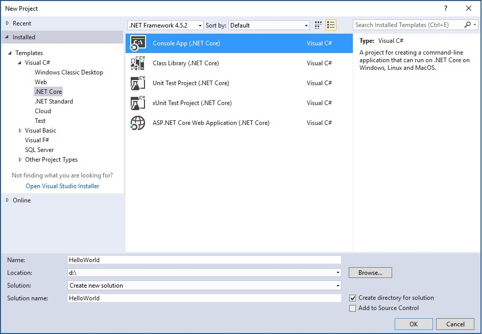
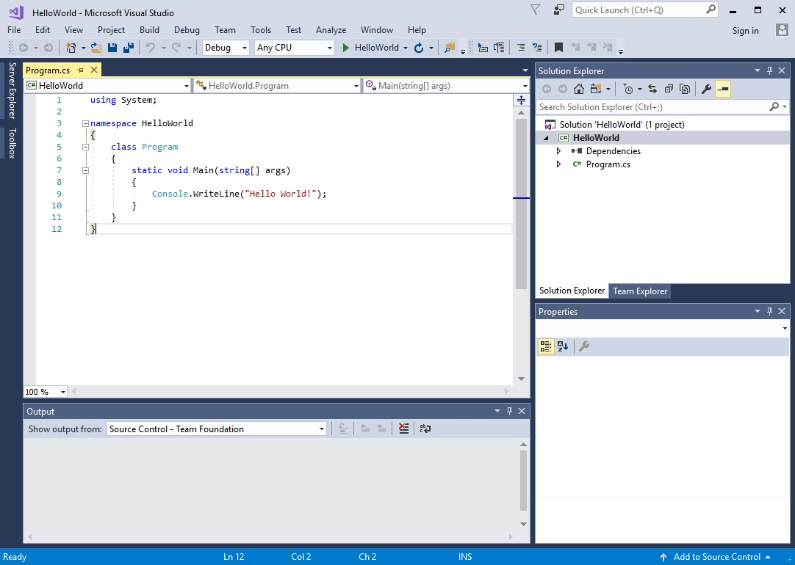
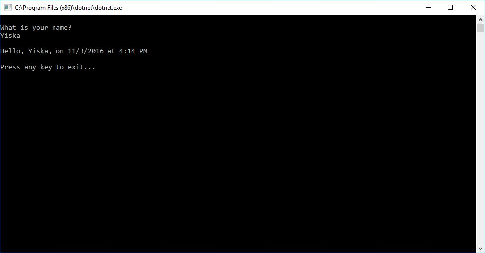

# Building a C# Hello World application with .NET Core in Visual Studio 2017 #

This topic provides a step-by-step introduction to building, debugging, and publishing a simple .NET Core console application using Visual Studio 2017. Visual Studio 2017 provides a full-featured development environment for building .NET Core applications. As long as the application does not have any platform-specific dependencies, the application itself can run on any platform that .NET Core targets and on any system that has .NET Core installed.

## Prerequisites ##

- [Visual Studio 2017](https://www.visualstudio.com/downloads/) with the ".NET Core cross-platform development" workload installed. 

For more information, see the [Visual Studio 2017](../../core/windows-prerequisites.md) section on the Windows prerequisites topic.

## A simple "Hello World" application ##

Let's begin by creating a simple "Hello World" console application. Here are the steps:

1. Launch Visual Studio and, on the **File** menu, choose **New** > **Project**. In the **New Project** dialog, expand the **Visual C#** node in the left-hand pane, then choose the **.NET Core** node.

2. In the right-hand pane, choose **Console App (.NET Core)**. Enter the name of the project, `HelloWorld`, and make sure that the **Create directory for solution** box is checked, as the following figure shows.

   
   
3. Choose the **OK** button. Visual Studio displays its development environment with its code window, as the following figure shows. The C# Console Application template for .NET Core automatically defines a class, `Program`, with a single method, `Main`, that takes a @System.String array as an argument. `Main` is the application entry point, the method that is called automatically by the runtime when it launches the application. Any command-line arguments supplied when the application is launched are available in the *args* array.

   

   The template creates a very simple "Hello world" application -- it calls the @System.Console.WriteLine(System.String) method to display the literal string "Hello World!" to the console window. By selecting the "HelloWorld" button with the green arrow on the toolbar, you can run the program in Debug mode now. If you do, though, the console window is visible for only a very brief time interval before it closes. This occurs because the `Main` terminates and the application ends as soon as the single statement in the `Main` method executes.

4. Let's have our existing application pause before it closes the console window. Add the following code immediately after the call to the @System.Console.WriteLine(System.String) method:

   ```csharp
   Console.Write("Press any key to continue...");
   Console.ReadKey(true);
   ```
   This code prompts the user to press any key and then pauses the program until a key is pressed.

5. On the menu bar, choose **Build**, **Build Solution**. This compiles your program to IL, an intermediate language that is then converted to binary code by a just-in-time (JIT) compiler.

6. Run the program by selecting the "HelloWorld" button with the green arrow on the toolbar. The result is shown in the following figure.

   

7. Press any key to close the window.

## Enhancing the "Hello World" application ##

Let's enhance our application to prompt the user for his or her name and then display it along with the date and time to the console window. To modify and test the program, do the following:

1. Enter the following C# code in the code window immediately after the opening bracket that follows the `public static void Main(string[] args)` line and before the first closing bracket.

   [!code-csharp[GettingStarted#1](../../../samples/snippets/csharp/getting_started/with_visual_studio/helloworld.cs#1)]

   The following figure shows the resulting code window.

   

   This code displays "What is your name?" to the console and waits until the user enters a string followed by the Enter key. It stores this string to a variable named `name`. It also retrieves the value of the @System.DateTime.Now property, which contains the current local time, and assigns it to a variable named `date`. It then uses a [composite format string](../../standard/base-types/composite-format.md) to display these values to the console.

2. Compile the program by choosing **Build** > **Build Solution**. This compiles your program to IL, an intermediate language that is then converted to binary code by a just-in-time (JIT) compiler.

3. Run the program in debug mode in Visual Studio by selecting the green arrow on the toolbar, pressing F5, or choosing the **Debug** > **Start Debugging** menu item. After you respond to the prompts by entering a name and pressing the Enter key, the console window should look something like the following:

   

4. Press any key to close the console window. This ends debug mode.

You've now created and run your simple application. To develop a professional application, there are still some additional steps that you can take to make your application ready for release:

- For information on debugging your application, see [Debugging the Hello World Application](debugging-with-visual-studio.md)

- For information on developing a publishing a distributable version of your application, see [Publishing the Hello World application](publishing-with-visual-studio.md).

## Related topics ##

Instead of a console application, you can also build a class library with .NET Core and Visual Studio 2017. For a step-by-step introduction, see [Building a class library with C# and .NET Core in Visual Studio 2017](library-with-visual-studio.md).

You can also develop a .NET Core console app on Mac, Linux, and Windows by using Visual Studio Code, a freely downloadable code editor. For a step-by-step tutorial, see [Getting Started with Visual Studio Code](with-visual-studio-code.md).
