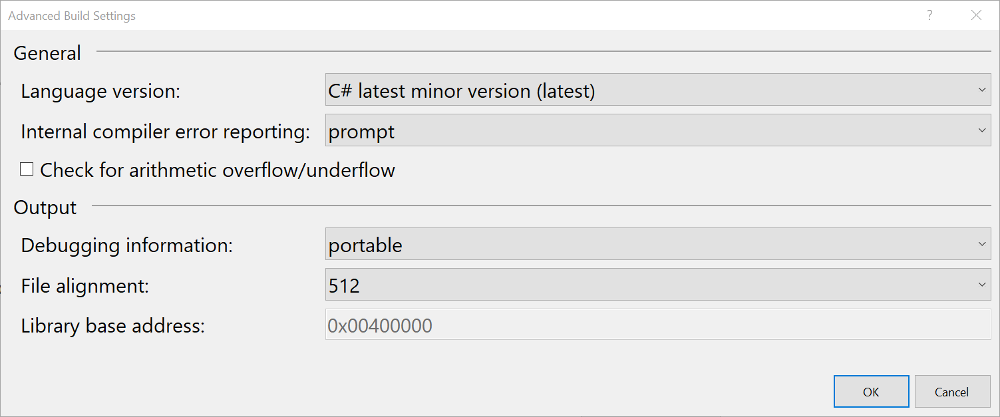

# Select the C# language version

The C# compiler determines a default language version based on your project's target framework or frameworks. When your project targets a preview framework that has a corresponding preview language version, the language version used is the preview language version. When your project doesn't target a preview framework, the language version used is the latest minor version.

For example, during the preview period for .NET Core 3.0, any project that targets `netcoreapp3.0` or `netstandard2.1` (both in preview) will use the C# 8.0 language (also in preview). Projects targeting any released version will use C# 7.3 (the latest released version). This behavior means that any project targeting .NET Framework will use latest (C# 7.3). 

This capability decouples the decision to install new versions of the SDK and tools in your development environment from the decision to incorporate new language features in a project. You can install the latest SDK and tools on your build machine. Each project can be configured to use a specific version of the language for its build. The default behavior means that any language features that rely on new types or new CLR behavior are enabled only when projects target those frameworks.

You can override the default behavior by specifying a language version. There are several ways to set the language version:

- Rely on a [Visual Studio quick action](#visual-studio-quick-action).
- Set the language version in the [Visual Studio UI](#set-the-language-version-in-visual-studio).
- Manually edit your [**.csproj** file](#edit-the-csproj-file).
- Set the language version [for multiple projects in a subdirectory](#configure-multiple-projects).
- Configure the [`-langversion` compiler option](#set-the-langversion-compiler-option).

## Visual Studio quick action

Visual Studio helps you determine the language version you need. If you use a language feature that is not available for the currently configured version, Visual Studio shows a potential fix to update the language version for the project.

## Set the language version in Visual Studio

You can set the version in Visual Studio. Right-click on the project node in Solution Explorer and select **Properties**. Select the **Build** tab and select the **Advanced** button. In the dropdown, select the version. The following image shows the "latest" setting:



> [!NOTE]
> If you use the Visual Studio IDE to update your csproj files, the IDE
> creates separate nodes for each build configuration. You'll typically
> set the value the same in all build configurations, but you need to
> set it explicitly for each build configuration, or select "All Configurations"
> when you modify this setting. You'll see the following in your csproj file:
>
>```xml
> <PropertyGroup Condition="'$(Configuration)|$(Platform)'=='Release|AnyCPU'">
>  <LangVersion>latest</LangVersion>
></PropertyGroup>
>
> <PropertyGroup Condition="'$(Configuration)|$(Platform)'=='Debug|AnyCPU'">
>  <LangVersion>latest</LangVersion>
> </PropertyGroup>
> ```
>

## Edit the csproj file

You can set the language version in your **.csproj** file. Add an element like the following:

```xml
<PropertyGroup>
   <LangVersion>latest</LangVersion>
</PropertyGroup>
```

The value `latest` uses the latest minor version of the C# language. Valid values are:

|Value|Meaning|
|------------|-------------|
|preview|The compiler accepts all valid language syntax from the latest preview version.|
|latest|The compiler accepts syntax from the latest released version of the compiler (including minor version).|
|latestMajor|The compiler accepts syntax from the latest released major version of the compiler.|
|8.0|The compiler accepts only syntax that is included in C# 8.0 or lower.|
|7.3|The compiler accepts only syntax that is included in C# 7.3 or lower.|
|7.2|The compiler accepts only syntax that is included in C# 7.2 or lower.|
|7.1|The compiler accepts only syntax that is included in C# 7.1 or lower.|
|7|The compiler accepts only syntax that is included in C# 7.0 or lower.|
|6|The compiler accepts only syntax that is included in C# 6.0 or lower.|
|5|The compiler accepts only syntax that is included in C# 5.0 or lower.|
|4|The compiler accepts only syntax that is included in C# 4.0 or lower.|
|3|The compiler accepts only syntax that is included in C# 3.0 or lower.|
|ISO-2|The compiler accepts only syntax that is included in ISO/IEC 23270:2006 C# (2.0) |
|ISO-1|The compiler accepts only syntax that is included in ISO/IEC 23270:2003 C# (1.0/1.2) |

## Configure multiple projects

You can create a **Directory.build.props** file that contains the `<LangVersion>` element to configure multiple directories. You typically do that in your solution directory. Add the following to a **Directory.build.props** file in your solution directory:

```xml
<Project>
 <PropertyGroup>
   <LangVersion>7.3</LangVersion>
 </PropertyGroup>
</Project>
```

Now, builds in every subdirectory of the directory containing that file will use C# version 7.3 syntax. For more information, see the article on [Customize your build](/visualstudio/msbuild/customize-your-build).

## Set the langversion compiler option

You can use the `-langversion` command-line option. For more information, see the article on the [-langversion](../language-reference/compiler-options/langversion-compiler-option.md) compiler option. You can see a list of the valid values by typing  `csc -langversion:?`.
