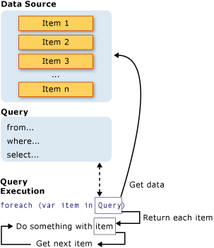

# Introduction to LINQ Queries in C\#

A *query* is an expression that retrieves data from a data source. Different data sources have different native query languages, for example SQL for relational databases and XQuery for XML. Developers must learn a new query language for each type of data source or data format that they must support. LINQ simplifies this situation by offering a consistent C# language model for kinds of data sources and formats. In a LINQ query, you always work with C# objects. You use the same basic coding patterns to query and transform data in XML documents, SQL databases, .NET collections, and any other format when a LINQ provider is available.

## Three Parts of a Query Operation

All LINQ query operations consist of three distinct actions:

1. Obtain the data source.
1. Create the query.
1. Execute the query.

The following example shows how the three parts of a query operation are expressed in source code. The example uses an integer array as a data source for convenience; however, the same concepts apply to other data sources also. This example is referred to throughout the rest of this article.

:::code language="csharp" source="./snippets/SnippetApp/Program.cs" id="PartsOfAQuery":::

The following illustration shows the complete query operation. In LINQ, the execution of the query is distinct from the query itself. In other words, you don't retrieve any data by creating a query variable.



## The Data Source

The data source in the preceding example is an array, which supports the generic <xref:System.Collections.Generic.IEnumerable%601> interface. This fact means it can be queried with LINQ. A query is executed in a `foreach` statement, and `foreach` requires <xref:System.Collections.IEnumerable> or <xref:System.Collections.Generic.IEnumerable%601>. Types that support <xref:System.Collections.Generic.IEnumerable%601> or a derived interface such as the generic <xref:System.Linq.IQueryable%601> are called *queryable types*.

A queryable type requires no modification or special treatment to serve as a LINQ data source. If the source data isn't already in memory as a queryable type, the LINQ provider must represent it as such. For example, LINQ to XML loads an XML document into a queryable <xref:System.Xml.Linq.XElement> type:

:::code language="csharp" source="./snippets/SnippetApp/Program.cs" id="LoadXML":::

With [EntityFramework](/ef/core/), you create an object-relational mapping between C# classes and your database schema. You write your queries against the objects, and at run-time EntityFramework handles the communication with the database. In the following example, `Customers` represents a specific table in the database, and the type of the query result, <xref:System.Linq.IQueryable%601>, derives from <xref:System.Collections.Generic.IEnumerable%601>.

```csharp
Northwnd db = new Northwnd(@"c:\northwnd.mdf");

// Query for customers in London.
IQueryable<Customer> custQuery =
    from cust in db.Customers
    where cust.City == "London"
    select cust;
```

For more information about how to create specific types of data sources, see the documentation for the various LINQ providers. However, the basic rule is simple: a LINQ data source is any object that supports the generic <xref:System.Collections.Generic.IEnumerable%601> interface, or an interface that inherits from it, typically <xref:System.Linq.IQueryable%601>.

> [!NOTE]
> Types such as <xref:System.Collections.ArrayList> that support the non-generic <xref:System.Collections.IEnumerable> interface can also be used as a LINQ data source. For more information, see [How to query an ArrayList with LINQ (C#)](../how-to-query-collections.md).

## The Query

The query specifies what information to retrieve from the data source or sources. Optionally, a query also specifies how that information should be sorted, grouped, and shaped before being returned. A query is stored in a query variable and initialized with a query expression. You use [C# query syntax](../../language-reference/keywords/query-keywords.md) to write queries.

The query in the previous example returns all the even numbers from the integer array. The query expression contains three clauses: `from`, `where`, and `select`. (If you're familiar with SQL, you noticed that the ordering of the clauses is reversed from the order in SQL.) The `from` clause specifies the data source, the `where` clause applies the filter, and the `select` clause specifies the type of the returned elements. All the query clauses are discussed in detail in this section. For now, the important point is that in LINQ, the query variable itself takes no action and returns no data. It just stores the information that is required to produce the results when the query is executed at some later point. For more information about how queries are constructed, see [Standard Query Operators Overview (C#)](../standard-query-operators/index.md).

> [!NOTE]
> Queries can also be expressed by using method syntax. For more information, see [Query Syntax and Method Syntax in LINQ](write-linq-queries.md).

## Classification of standard query operators by manner of execution

The LINQ to Objects implementations of the standard query operator methods execute in one of two main ways: *immediate* or *deferred*. The query operators that use deferred execution can be additionally divided into two categories: *streaming* and *nonstreaming*.

### Immediate

Immediate execution means that the data source is read and the operation is performed once. All the standard query operators that return a scalar result execute immediately. Examples of such queries are `Count`, `Max`, `Average`, and `First`. These methods execute without an explicit `foreach` statement because the query itself must use `foreach` in order to return a result. These queries return a single value, not an `IEnumerable` collection. You can force *any* query to execute immediately using the <xref:System.Linq.Enumerable.ToList%2A?displayProperty=nameWithType> or <xref:System.Linq.Enumerable.ToArray%2A?displayProperty=nameWithType> methods. Immediate execution provides reuse of query results, not query declaration. The results are retrieved once, then stored for future use. The following query returns a count of the even numbers in the source array:

:::code language="csharp" source="./snippets/SnippetApp/Program.cs" id="EagerEvaluation":::

To force immediate execution of any query and cache its results, you can call the <xref:System.Linq.Enumerable.ToList%2A> or <xref:System.Linq.Enumerable.ToArray%2A> methods.

:::code language="csharp" source="./snippets/SnippetApp/Program.cs" id="MoreEagerEvaluation":::

You can also force execution by putting the `foreach` loop immediately after the query expression. However, by calling `ToList` or `ToArray` you also cache all the data in a single collection object.

### Deferred

Deferred execution means that the operation isn't performed at the point in the code where the query is declared. The operation is performed only when the query variable is enumerated, for example by using a `foreach` statement. The results of executing the query depend on the contents of the data source when the query is executed rather than when the query is defined. If the query variable is enumerated multiple times, the results might differ every time. Almost all the standard query operators whose return type is <xref:System.Collections.Generic.IEnumerable%601> or <xref:System.Linq.IOrderedEnumerable%601> execute in a deferred manner. Deferred execution provides the facility of query reuse since the query fetches the updated data from the data source each time query results are iterated. The following code shows an example of deferred execution:

:::code language="csharp" source="./snippets/SnippetApp/Program.cs" id="QueryExecution":::

The `foreach` statement is also where the query results are retrieved. For example, in the previous query, the iteration variable `num` holds each value (one at a time) in the returned sequence.

Because the query variable itself never holds the query results, you can execute it repeatedly to retrieve updated data. For example, a separate application might update a database continually. In *your* application, you could create one query that retrieves the latest data, and you could execute it at intervals to retrieve updated results.

Query operators that use deferred execution can be additionally classified as streaming or nonstreaming.

### Streaming

Streaming operators don't have to read all the source data before they yield elements. At the time of execution, a streaming operator performs its operation on each source element as it is read and yields the element if appropriate. A streaming operator continues to read source elements until a result element can be produced. This means that more than one source element might be read to produce one result element.

### Nonstreaming

Nonstreaming operators must read all the source data before they can yield a result element. Operations such as sorting or grouping fall into this category. At the time of execution, nonstreaming query operators read all the source data, put it into a data structure, perform the operation, and yield the resulting elements.

## Classification table

The following table classifies each standard query operator method according to its method of execution.

> [!NOTE]
> If an operator is marked in two columns, two input sequences are involved in the operation, and each sequence is evaluated differently. In these cases, it is always the first sequence in the parameter list that is evaluated in a deferred, streaming manner.

| Standard query operator                             | Return type | Immediate execution | Deferred streaming execution | Deferred nonstreaming execution |
|-----------------------------------------------------|-------------|---------------------|------------------------------|----------------------------------|
| <xref:System.Linq.Enumerable.Aggregate%2A>          | `TSource`                                         | ✓ |   |   |
| <xref:System.Linq.Enumerable.All%2A>                | <xref:System.Boolean>                             | ✓ |   |   |
| <xref:System.Linq.Enumerable.Any%2A>                | <xref:System.Boolean>                             | ✓ |   |   |
| <xref:System.Linq.Enumerable.AsEnumerable%2A>       | <xref:System.Collections.Generic.IEnumerable%601> |   | ✓ |   |
| <xref:System.Linq.Enumerable.Average%2A>            | Single numeric value                              | ✓ |   |   |
| <xref:System.Linq.Enumerable.Cast%2A>               | <xref:System.Collections.Generic.IEnumerable%601> |   | ✓ |   |
| <xref:System.Linq.Enumerable.Concat%2A>             | <xref:System.Collections.Generic.IEnumerable%601> |   | ✓ |   |
| <xref:System.Linq.Enumerable.Contains%2A>           | <xref:System.Boolean>                             | ✓ |   |   |
| <xref:System.Linq.Enumerable.Count%2A>              | <xref:System.Int32>                               | ✓ |   |   |
| <xref:System.Linq.Enumerable.DefaultIfEmpty%2A>     | <xref:System.Collections.Generic.IEnumerable%601> |   | ✓ |   |
| <xref:System.Linq.Enumerable.Distinct%2A>           | <xref:System.Collections.Generic.IEnumerable%601> |   | ✓ |   |
| <xref:System.Linq.Enumerable.ElementAt%2A>          | `TSource`                                         | ✓ |   |   |
| <xref:System.Linq.Enumerable.ElementAtOrDefault%2A> | `TSource?`                                        | ✓ |   |   |
| <xref:System.Linq.Enumerable.Empty%2A>              | <xref:System.Collections.Generic.IEnumerable%601> | ✓ |   |   |
| <xref:System.Linq.Enumerable.Except%2A>             | <xref:System.Collections.Generic.IEnumerable%601> |   | ✓ | ✓ |
| <xref:System.Linq.Enumerable.First%2A>              | `TSource`                                         | ✓ |   |   |
| <xref:System.Linq.Enumerable.FirstOrDefault%2A>     | `TSource?`                                        | ✓ |   |   |
| <xref:System.Linq.Enumerable.GroupBy%2A>            | <xref:System.Collections.Generic.IEnumerable%601> |   |   | ✓ |
| <xref:System.Linq.Enumerable.GroupJoin%2A>          | <xref:System.Collections.Generic.IEnumerable%601> |   | ✓ | ✓ |
| <xref:System.Linq.Enumerable.Intersect%2A>          | <xref:System.Collections.Generic.IEnumerable%601> |   | ✓ | ✓ |
| <xref:System.Linq.Enumerable.Join%2A>               | <xref:System.Collections.Generic.IEnumerable%601> |   | ✓ | ✓ |
| <xref:System.Linq.Enumerable.Last%2A>               | `TSource`                                         | ✓ |   |   |
| <xref:System.Linq.Enumerable.LastOrDefault%2A>      | `TSource?`                                        | ✓ |   |   |
| <xref:System.Linq.Enumerable.LongCount%2A>          | <xref:System.Int64>                               | ✓ |   |   |
| <xref:System.Linq.Enumerable.Max%2A>                | Single numeric value, `TSource`, or `TResult?`    | ✓ |   |   |
| <xref:System.Linq.Enumerable.Min%2A>                | Single numeric value, `TSource`, or `TResult?`    | ✓ |   |   |
| <xref:System.Linq.Enumerable.OfType%2A>             | <xref:System.Collections.Generic.IEnumerable%601> |   | ✓ |   |
| <xref:System.Linq.Enumerable.OrderBy%2A>            | <xref:System.Linq.IOrderedEnumerable%601>         |   |   | ✓ |
| <xref:System.Linq.Enumerable.OrderByDescending%2A>  | <xref:System.Linq.IOrderedEnumerable%601>         |   |   | ✓ |
| <xref:System.Linq.Enumerable.Range%2A>              | <xref:System.Collections.Generic.IEnumerable%601> |   | ✓ |   |
| <xref:System.Linq.Enumerable.Repeat%2A>             | <xref:System.Collections.Generic.IEnumerable%601> |   | ✓ |   |
| <xref:System.Linq.Enumerable.Reverse%2A>            | <xref:System.Collections.Generic.IEnumerable%601> |   |   | ✓ |
| <xref:System.Linq.Enumerable.Select%2A>             | <xref:System.Collections.Generic.IEnumerable%601> |   | ✓ |   |
| <xref:System.Linq.Enumerable.SelectMany%2A>         | <xref:System.Collections.Generic.IEnumerable%601> |   | ✓ |   |
| <xref:System.Linq.Enumerable.SequenceEqual%2A>      | <xref:System.Boolean>                             | ✓ |   |   |
| <xref:System.Linq.Enumerable.Single%2A>             | `TSource`                                         | ✓ |   |   |
| <xref:System.Linq.Enumerable.SingleOrDefault%2A>    | `TSource?`                                        | ✓ |   |   |
| <xref:System.Linq.Enumerable.Skip%2A>               | <xref:System.Collections.Generic.IEnumerable%601> |   | ✓ |   |
| <xref:System.Linq.Enumerable.SkipWhile%2A>          | <xref:System.Collections.Generic.IEnumerable%601> |   | ✓ |   |
| <xref:System.Linq.Enumerable.Sum%2A>                | Single numeric value                              | ✓ |   |   |
| <xref:System.Linq.Enumerable.Take%2A>               | <xref:System.Collections.Generic.IEnumerable%601> |   | ✓ |   |
| <xref:System.Linq.Enumerable.TakeWhile%2A>          | <xref:System.Collections.Generic.IEnumerable%601> |   | ✓ |   |
| <xref:System.Linq.Enumerable.ThenBy%2A>             | <xref:System.Linq.IOrderedEnumerable%601>         |   |   | ✓ |
| <xref:System.Linq.Enumerable.ThenByDescending%2A>   | <xref:System.Linq.IOrderedEnumerable%601>         |   |   | ✓ |
| <xref:System.Linq.Enumerable.ToArray%2A>            | `TSource[]` array                                 | ✓ |   |   |
| <xref:System.Linq.Enumerable.ToDictionary%2A>       | <xref:System.Collections.Generic.Dictionary%602>  | ✓ |   |   |
| <xref:System.Linq.Enumerable.ToList%2A>             | <xref:System.Collections.Generic.IList%601>       | ✓ |   |   |
| <xref:System.Linq.Enumerable.ToLookup%2A>           | <xref:System.Linq.ILookup%602>                    | ✓ |   |   |
| <xref:System.Linq.Enumerable.Union%2A>              | <xref:System.Collections.Generic.IEnumerable%601> |   | ✓ |   |
| <xref:System.Linq.Enumerable.Where%2A>              | <xref:System.Collections.Generic.IEnumerable%601> |   | ✓ |   |

## LINQ to objects

"LINQ to Objects" refers to the use of LINQ queries with any <xref:System.Collections.IEnumerable> or <xref:System.Collections.Generic.IEnumerable%601> collection directly. You can use LINQ to query any enumerable collections, such as <xref:System.Collections.Generic.List%601>, <xref:System.Array>, or <xref:System.Collections.Generic.Dictionary%602>. The collection can be user-defined or a type returned by a .NET API. In the LINQ approach, you write declarative code that describes what you want to retrieve. LINQ to Objects provides a great introduction to programming with LINQ.

LINQ queries offer three main advantages over traditional `foreach` loops:

- They're more concise and readable, especially when filtering multiple conditions.
- They provide powerful filtering, ordering, and grouping capabilities with a minimum of application code.
- They can be ported to other data sources with little or no modification.

The more complex the operation you want to perform on the data, the more benefit you realize using LINQ instead of traditional iteration techniques.

## Store the results of a query in memory

A query is basically a set of instructions for how to retrieve and organize data. Queries are executed lazily, as each subsequent item in the result is requested. When you use `foreach` to iterate the results, items are returned as accessed. To evaluate a query and store its results without executing a `foreach` loop, just call one of the following methods on the query variable:

- <xref:System.Linq.Enumerable.ToList%2A>
- <xref:System.Linq.Enumerable.ToArray%2A>
- <xref:System.Linq.Enumerable.ToDictionary%2A>
- <xref:System.Linq.Enumerable.ToLookup%2A>

You should assign the returned collection object to a new variable when you store the query results, as shown in the following example:

:::code language="csharp" source="./snippets/SnippetApp/StoreResultsOfQueryInMemory.cs" id="store_results_of_query_in_memory_1":::

## See also

- [Walkthrough: Writing Queries in C#](walkthrough-writing-queries-linq.md)
- [foreach, in](../../language-reference/statements/iteration-statements.md#the-foreach-statement)
- [Query Keywords (LINQ)](../../language-reference/keywords/query-keywords.md)
