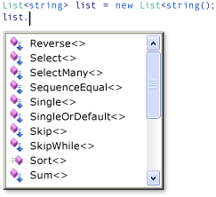

# Write LINQ queries in C\#

Most queries in the introductory Language Integrated Query (LINQ) documentation are written by using the LINQ declarative query syntax. However, the query syntax must be translated into method calls for the .NET common language runtime (CLR) when the code is compiled. These method calls invoke the standard query operators, which have names such as `Where`, `Select`, `GroupBy`, `Join`, `Max`, and `Average`. You can call them directly by using method syntax instead of query syntax.

Query syntax and method syntax are semantically identical, but many people find query syntax simpler and easier to read. Some queries must be expressed as method calls. For example, you must use a method call to express a query that retrieves the number of elements that match a specified condition. You also must use a method call for a query that retrieves the element that has the maximum value in a source sequence. The reference documentation for the standard query operators in the <xref:System.Linq> namespace generally uses method syntax. Therefore, even when getting started writing LINQ queries, it is useful to be familiar with how to use method syntax in queries and in query expressions themselves.

## Standard query operator extension methods

 The following example shows a simple *query expression* and the semantically equivalent query written as a *method-based query*.

 [!code-csharp[csLINQGettingStarted#22](~/samples/snippets/csharp/VS_Snippets_VBCSharp/CsLINQGettingStarted/CS/Class1.cs#22)]

 The output from the two examples is identical. You can see that the type of the query variable is the same in both forms: <xref:System.Collections.Generic.IEnumerable%601>.

 To understand the method-based query, let's examine it more closely. On the right side of the expression, notice that the `where` clause is now expressed as an instance method on the `numbers` object, which as you will recall has a type of `IEnumerable<int>`. If you are familiar with the generic <xref:System.Collections.Generic.IEnumerable%601> interface, you know that it does not have a `Where` method. However, if you invoke the IntelliSense completion list in the Visual Studio IDE, you will see not only a `Where` method, but many other methods such as `Select`, `SelectMany`, `Join`, and `Orderby`. These are all the standard query operators.

 

 Although it looks as if <xref:System.Collections.Generic.IEnumerable%601> has been redefined to include these additional methods, in fact this is not the case. The standard query operators are implemented as a new kind of method called *extension methods*. Extensions methods "extend" an existing type; they can be called as if they were instance methods on the type. The standard query operators extend <xref:System.Collections.Generic.IEnumerable%601> and that is why you can write `numbers.Where(...)`.

 To get started using LINQ, all that you really have to know about extension methods is how to bring them into scope in your application by using the correct `using` directives. From your application's point of view, an extension method and a regular instance method are the same.

 For more information about extension methods, see [Extension Methods](../programming-guide/classes-and-structs/extension-methods.md). For more information about standard query operators, see [Standard Query Operators Overview (C#)](../programming-guide/concepts/linq/standard-query-operators-overview.md). Some LINQ providers, such as [!INCLUDE[vbtecdlinq](~/includes/vbtecdlinq-md.md)] and LINQ to XML, implement their own standard query operators and additional extension methods for other types besides <xref:System.Collections.Generic.IEnumerable%601>.

## Lambda expressions

 In the previous example, notice that the conditional expression (`num % 2 == 0`) is passed as an in-line argument to the `Where` method: `Where(num => num % 2 == 0).` This inline expression is called a lambda expression. It is a convenient way to write code that would otherwise have to be written in more cumbersome form as an anonymous method or a generic delegate or an expression tree. In C# `=>` is the lambda operator, which is read as "goes to". The `num` on the left of the operator is the input variable which corresponds to `num` in the query expression. The compiler can infer the type of `num` because it knows that `numbers` is a generic <xref:System.Collections.Generic.IEnumerable%601> type. The body of the lambda is just the same as the expression in query syntax or in any other C# expression or statement; it can include method calls and other complex logic. The "return value" is just the expression result.

 To get started using LINQ, you do not have to use lambdas extensively. However, certain queries can only be expressed in method syntax and some of those require lambda expressions. After you become more familiar with lambdas, you will find that they are a powerful and flexible tool in your LINQ toolbox. For more information, see [Lambda Expressions](../language-reference/operators/lambda-expressions.md).

## Composability of queries

 In the previous code example, note that the `OrderBy` method is invoked by using the dot operator on the call to `Where`. `Where` produces a filtered sequence, and then `Orderby` operates on that sequence by sorting it. Because queries return an `IEnumerable`, you compose them in method syntax by chaining the method calls together. This is what the compiler does behind the scenes when you write queries by using query syntax. And because a query variable does not store the results of the query, you can modify it or use it as the basis for a new query at any time, even after it has been executed.

The following examples demonstrate some simple LINQ queries by using each approach listed previously. In general, the rule is to use (1) whenever possible, and use (2) and (3) whenever necessary.

> [!NOTE]
> These queries operate on simple in-memory collections; however, the basic syntax is identical to that used in LINQ to Entities and LINQ to XML.

## Example - Query syntax

The recommended way to write most queries is to use *query syntax* to create *query expressions*. The following example shows three query expressions. The first query expression demonstrates how to filter or restrict results by applying conditions with a `where` clause. It returns all elements in the source sequence whose values are greater than 7 or less than 3. The second expression demonstrates how to order the returned results. The third expression demonstrates how to group results according to a key. This query returns two groups based on the first letter of the word.

:::code language="csharp" source="../../../samples/snippets/csharp/concepts/linq/LinqSamples/WriteLinqQueries.cs" id="write_linq_queries_1":::

Note that the type of the queries is <xref:System.Collections.Generic.IEnumerable%601>. All of these queries could be written using `var` as shown in the following example:

`var query = from num in numbers...`

In each previous example, the queries do not actually execute until you iterate over the query variable in a `foreach` statement or other statement. For more information, see [Introduction to LINQ Queries](../programming-guide/concepts/linq/introduction-to-linq-queries.md).

## Example - Method syntax

Some query operations must be expressed as a method call. The most common such methods are those that return singleton numeric values, such as <xref:System.Linq.Enumerable.Sum%2A>, <xref:System.Linq.Enumerable.Max%2A>, <xref:System.Linq.Enumerable.Min%2A>, <xref:System.Linq.Enumerable.Average%2A>, and so on. These methods must always be called last in any query because they represent only a single value and cannot serve as the source for an additional query operation. The following example shows a method call in a query expression:

:::code language="csharp" source="../../../samples/snippets/csharp/concepts/linq/LinqSamples/WriteLinqQueries.cs" id="write_linq_queries_2":::

If the method has Action or Func parameters, these are provided in the form of a [lambda](../language-reference/operators/lambda-expressions.md) expression, as shown in the following example:

:::code language="csharp" source="../../../samples/snippets/csharp/concepts/linq/LinqSamples/WriteLinqQueries.cs" id="write_linq_queries_3":::

In the previous queries, only Query #4 executes immediately. This is because it returns a single value, and not a generic <xref:System.Collections.Generic.IEnumerable%601> collection. The method itself has to use `foreach` in order to compute its value.

Each of the previous queries can be written by using implicit typing with [var](../language-reference/statements/declarations.md#implicitly-typed-local-variables), as shown in the following example:

:::code language="csharp" source="../../../samples/snippets/csharp/concepts/linq/LinqSamples/WriteLinqQueries.cs" id="write_linq_queries_4":::

## Example - Mixed query and method syntax

This example shows how to use method syntax on the results of a query clause. Just enclose the query expression in parentheses, and then apply the dot operator and call the method. In the following example, query #7 returns a count of the numbers whose value is between 3 and 7. In general, however, it is better to use a second variable to store the result of the method call. In this manner, the query is less likely to be confused with the results of the query.

:::code language="csharp" source="../../../samples/snippets/csharp/concepts/linq/LinqSamples/WriteLinqQueries.cs" id="write_linq_queries_5":::

Because Query #7 returns a single value and not a collection, the query executes immediately.

The previous query can be written by using implicit typing with `var`, as follows:

```csharp
var numCount = (from num in numbers...
```

It can be written in method syntax as follows:

:::code language="csharp" source="../../../samples/snippets/csharp/concepts/linq/LinqSamples/WriteLinqQueries.cs" id="write_linq_queries_5a":::

It can be written by using explicit typing, as follows:

:::code language="csharp" source="../../../samples/snippets/csharp/concepts/linq/LinqSamples/WriteLinqQueries.cs" id="write_linq_queries_5b":::

## See also

- [Walkthrough: Writing Queries in C#](../programming-guide/concepts/linq/walkthrough-writing-queries-linq.md)
- [Language Integrated Query (LINQ)](index.md)
- [where clause](../language-reference/keywords/where-clause.md)
