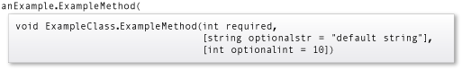
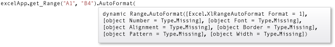

# Named and Optional Arguments (C# Programming Guide)

C# 4 introduces named and optional arguments. *Named arguments* enable you to specify an argument for a parameter by matching the argument with its name rather than with its position in the parameter list. *Optional arguments* enable you to omit arguments for some parameters. Both techniques can be used with methods, indexers, constructors, and delegates.

When you use named and optional arguments, the arguments are evaluated in the order in which they appear in the argument list, not the parameter list.

Named and optional parameters enable you to supply arguments for selected parameters. This capability greatly eases calls to COM interfaces such as the Microsoft Office Automation APIs.

## Named arguments

Named arguments free you from matching the order of parameters in the parameter lists of called methods. The parameter for each argument can be specified by parameter name. For example, a function that prints order details (such as, seller name, order number & product name) can be called by sending arguments by position, in the order defined by the function.

```csharp
PrintOrderDetails("Gift Shop", 31, "Red Mug");
```

If you don't remember the order of the parameters but know their names, you can send the arguments in any order.

```csharp
PrintOrderDetails(orderNum: 31, productName: "Red Mug", sellerName: "Gift Shop");
PrintOrderDetails(productName: "Red Mug", sellerName: "Gift Shop", orderNum: 31);
```

Named arguments also improve the readability of your code by identifying what each argument represents. In the example method below, the `sellerName` can't be null or white space. As both `sellerName` and `productName` are string types, instead of sending arguments by position, it makes sense to use named arguments to disambiguate the two and reduce confusion for anyone reading the code.
  
Named arguments, when used with positional arguments, are valid as long as

- they're not followed by any positional arguments, or

    ```csharp
    PrintOrderDetails("Gift Shop", 31, productName: "Red Mug");
    ```

- _starting with C# 7.2_, they're used in the correct position. In the example below, the parameter `orderNum` is in the correct position but isn't explicitly named.

    ```csharp
    PrintOrderDetails(sellerName: "Gift Shop", 31, productName: "Red Mug");
    ```

Positional arguments that follow any out-of-order named arguments are invalid.

```csharp
// This generates CS1738: Named argument specifications must appear after all fixed arguments have been specified.
PrintOrderDetails(productName: "Red Mug", 31, "Gift Shop");
```

### Example

The following code implements the examples from this section along with some additional ones.  

[!code-csharp[csProgGuideNamedAndOptional#1](~/samples/snippets/csharp/VS_Snippets_VBCSharp/csprogguidenamedandoptional/cs/program.cs#1)]

## Optional arguments

The definition of a method, constructor, indexer, or delegate can specify its parameters are required or optional. Any call must provide arguments for all required parameters, but can omit arguments for optional parameters.

Each optional parameter has a default value as part of its definition. If no argument is sent for that parameter, the default value is used. A default value must be one of the following types of expressions:
  
- a constant expression;  
- an expression of the form `new ValType()`, where `ValType` is a value type, such as an [enum](../../language-reference/builtin-types/enum.md) or a [struct](../../language-reference/builtin-types/struct.md);
- an expression of the form [default(ValType)](../../language-reference/operators/default.md),  where `ValType` is a value type.

Optional parameters are defined at the end of the parameter list, after any required parameters. If the caller provides an argument for any one of a succession of optional parameters, it must provide arguments for all preceding optional parameters. Comma-separated gaps in the argument list aren't supported. For example, in the following code, instance method `ExampleMethod` is defined with one required and two optional parameters.

[!code-csharp[csProgGuideNamedAndOptional#15](~/samples/snippets/csharp/VS_Snippets_VBCSharp/csprogguidenamedandoptional/cs/optional.cs#15)]

The following call to `ExampleMethod` causes a compiler error, because an argument is provided for the third parameter but not for the second.

```csharp
//anExample.ExampleMethod(3, ,4);
```

However, if you know the name of the third parameter, you can use a named argument to accomplish the task.

```csharp
anExample.ExampleMethod(3, optionalint: 4);
```

IntelliSense uses brackets to indicate optional parameters, as shown in the following illustration:



> [!NOTE]
> You can also declare optional parameters by using the .NET <xref:System.Runtime.InteropServices.OptionalAttribute> class. `OptionalAttribute` parameters do not require a default value.

### Example

In the following example, the constructor for `ExampleClass` has one parameter, which is optional. Instance method `ExampleMethod` has one required parameter, `required`, and two optional parameters, `optionalstr` and `optionalint`. The code in `Main` shows the different ways in which the constructor and method can be invoked.

[!code-csharp[csProgGuideNamedAndOptional#2](~/samples/snippets/csharp/VS_Snippets_VBCSharp/csprogguidenamedandoptional/cs/optional.cs#2)]

The preceding code shows a number of examples where optional parameters aren't applied correctly. The first illustrates that an argument must be supplied for the first parameter, which is required.
  
## COM interfaces

Named and optional arguments, along with support for dynamic objects, greatly improve interoperability with COM APIs, such as Office Automation APIs.

For example, the <xref:Microsoft.Office.Interop.Excel.Range.AutoFormat%2A> method in the Microsoft Office Excel <xref:Microsoft.Office.Interop.Excel.Range> interface has seven parameters, all of which are optional. These parameters are shown in the following illustration:



In C# 3.0 and earlier versions, an argument is required for each parameter, as shown in the following example.

[!code-csharp[csProgGuideNamedAndOptional#3](~/samples/snippets/csharp/VS_Snippets_VBCSharp/csprogguidenamedandoptional/cs/namedandoptcom.cs#3)]

However, you can greatly simplify the call to `AutoFormat` by using named and optional arguments, introduced in C# 4.0. Named and optional arguments enable you to omit the argument for an optional parameter if you don't want to change the parameter's default value. In the following call, a value is specified for only one of the seven parameters.

[!code-csharp[csProgGuideNamedAndOptional#13](~/samples/snippets/csharp/VS_Snippets_VBCSharp/csprogguidenamedandoptional/cs/namedandoptcom.cs#13)]

For more information and examples, see [How to use named and optional arguments in Office programming](./how-to-use-named-and-optional-arguments-in-office-programming.md) and [How to access Office interop objects by using C# features](../interop/how-to-access-office-onterop-objects.md).
  
## Overload resolution

Use of named and optional arguments affects overload resolution in the following ways:

- A method, indexer, or constructor is a candidate for execution if each of its parameters either is optional or corresponds, by name or by position, to a single argument in the calling statement, and that argument can be converted to the type of the parameter.  
- If more than one candidate is found, overload resolution rules for preferred conversions are applied to the arguments that are explicitly specified. Omitted arguments for optional parameters are ignored.
- If two candidates are judged to be equally good, preference goes to a candidate that doesn't have optional parameters for which arguments were omitted in the call. Overload resolution generally prefers candidates that have fewer parameters.
  
## C# language specification

[!INCLUDE[CSharplangspec](~/includes/csharplangspec-md.md)]
