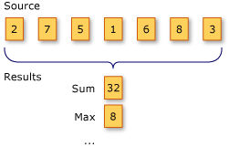

# Aggregation operations (C#)

An aggregation operation computes a single value from a collection of values. An example of an aggregation operation is calculating the average daily temperature from a month's worth of daily temperature values.

The following illustration shows the results of two different aggregation operations on a sequence of numbers. The first operation sums the numbers. The second operation returns the maximum value in the sequence.

The standard query operator methods that perform aggregation operations are listed in the following section.

## Methods

| Method name | description | C# query expression syntax | More information |
|--|--|--|--|
| Aggregate | Performs a custom aggregation operation on the values of a collection. | Not applicable. | <xref:System.Linq.Enumerable.Aggregate%2A?displayProperty=nameWithType>  <xref:System.Linq.Queryable.Aggregate%2A?displayProperty=nameWithType> |
| Average | Calculates the average value of a collection of values. | Not applicable. | <xref:System.Linq.Enumerable.Average%2A?displayProperty=nameWithType>  <xref:System.Linq.Queryable.Average%2A?displayProperty=nameWithType> |
| Count | Counts the elements in a collection, optionally only those elements that satisfy a predicate function. | Not applicable. | <xref:System.Linq.Enumerable.Count%2A?displayProperty=nameWithType>  <xref:System.Linq.Queryable.Count%2A?displayProperty=nameWithType> |
| LongCount | Counts the elements in a large collection, optionally only those elements that satisfy a predicate function. | Not applicable. | <xref:System.Linq.Enumerable.LongCount%2A?displayProperty=nameWithType>  <xref:System.Linq.Queryable.LongCount%2A?displayProperty=nameWithType> |
| Max or MaxBy | Determines the maximum value in a collection. | Not applicable. | <xref:System.Linq.Enumerable.Max%2A?displayProperty=nameWithType> <xref:System.Linq.Enumerable.MaxBy%2A?displayProperty=nameWithType> <xref:System.Linq.Queryable.Max%2A?displayProperty=nameWithType> <xref:System.Linq.Queryable.MaxBy%2A?displayProperty=nameWithType> |
| Min or MinBy | Determines the minimum value in a collection. | Not applicable. | <xref:System.Linq.Enumerable.Min%2A?displayProperty=nameWithType> <xref:System.Linq.Enumerable.MinBy%2A?displayProperty=nameWithType> <xref:System.Linq.Queryable.Min%2A?displayProperty=nameWithType> <xref:System.Linq.Queryable.MinBy%2A?displayProperty=nameWithType> |
| Sum | Calculates the sum of the values in a collection. | Not applicable. | <xref:System.Linq.Enumerable.Sum%2A?displayProperty=nameWithType>  <xref:System.Linq.Queryable.Sum%2A?displayProperty=nameWithType> |

## See also

- <xref:System.Linq>
- [Standard Query Operators Overview (C#)](./standard-query-operators-overview.md)
- [How to compute column values in a CSV text file (LINQ) (C#)](./how-to-compute-column-values-in-a-csv-text-file-linq.md)
- [How to query for the largest file or files in a directory tree (LINQ) (C#)](./how-to-query-for-the-largest-file-or-files-in-a-directory-tree-linq.md)
- [How to query for the total number of bytes in a set of folders (LINQ) (C#)](./how-to-query-for-the-total-number-of-bytes-in-a-set-of-folders-linq.md)
