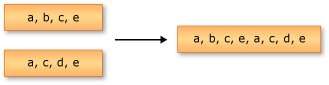

# Concatenation Operations (C#)
Concatenation refers to the operation of appending one sequence to another.  
  
 The following illustration depicts a concatenation operation on two sequences of characters.  
  
   
  
 The standard query operator methods that perform concatenation are listed in the following section.  
  
## Methods  
  
|Method Name|Description|C# Query Expression Syntax|More Information|  
|-----------------|-----------------|---------------------------------|----------------------|  
|Concat|Concatenates two sequences to form one sequence.|Not applicable.|<xref:System.Linq.Enumerable.Concat%2A?displayProperty=nameWithType>   <xref:System.Linq.Queryable.Concat%2A?displayProperty=nameWithType>|  
  
## See also

- <xref:System.Linq>
- [Standard Query Operators Overview (C#)](./standard-query-operators-overview.md)
- [How to combine and compare string collections (LINQ) (C#)](./how-to-combine-and-compare-string-collections-linq.md)
