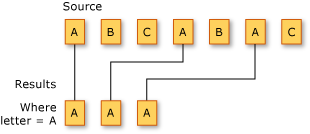

# Filtering Data (C#)
Filtering refers to the operation of restricting the result set to contain only those elements that satisfy a specified condition. It is also known as selection.  
  
 The following illustration shows the results of filtering a sequence of characters. The predicate for the filtering operation specifies that the character must be 'A'.  
  
   
  
 The standard query operator methods that perform selection are listed in the following section.  
  
## Methods  
  
|Method Name|Description|C# Query Expression Syntax|More Information|  
|-----------------|-----------------|---------------------------------|----------------------|  
|OfType|Selects values, depending on their ability to be cast to a specified type.|Not applicable.|<xref:System.Linq.Enumerable.OfType%2A?displayProperty=nameWithType><br /><br /> <xref:System.Linq.Queryable.OfType%2A?displayProperty=nameWithType>|  
|Where|Selects values that are based on a predicate function.|`where`|<xref:System.Linq.Enumerable.Where%2A?displayProperty=nameWithType><br /><br /> <xref:System.Linq.Queryable.Where%2A?displayProperty=nameWithType>|  
  
## Query Expression Syntax Example  
 The following example uses the `where` clause to filter from an array those strings that have a specific length.  
  
```csharp  
string[] words = { "the", "quick", "brown", "fox", "jumps" };  
  
IEnumerable<string> query = from word in words  
                            where word.Length == 3  
                            select word;  
  
foreach (string str in query)  
    Console.WriteLine(str);  
  
/* This code produces the following output:  
  
    the  
    fox  
*/  
```  
  
## See also

- <xref:System.Linq>
- [Standard Query Operators Overview (C#)](./standard-query-operators-overview.md)
- [where clause](../../../language-reference/keywords/where-clause.md)
- [Dynamically specify predicate filters at runtime](../../../linq/dynamically-specify-predicate-filters-at-runtime.md)
- [How to query an assembly's metadata with Reflection (LINQ) (C#)](./how-to-query-an-assembly-s-metadata-with-reflection-linq.md)
- [How to query for files with a specified attribute or name (C#)](./how-to-query-for-files-with-a-specified-attribute-or-name.md)
- [How to sort or filter text data by any word or field (LINQ) (C#)](./how-to-sort-or-filter-text-data-by-any-word-or-field-linq.md)
