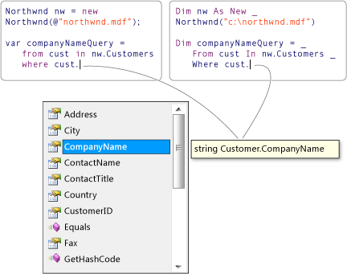

# Language Integrated Query (LINQ) (C#)

Language-Integrated Query (LINQ) is the name for a set of technologies based on the integration of query capabilities directly into the C# language. Traditionally, queries against data are expressed as simple strings without type checking at compile time or IntelliSense support. Furthermore, you have to learn a different query language for each type of data source: SQL databases, XML documents, various Web services, and so on. With LINQ, a query is a first-class language construct, just like classes, methods, events. You write queries against strongly typed collections of objects by using language keywords and familiar operators. The LINQ family of technologies provides a consistent query experience for objects (LINQ to Objects), relational databases (LINQ to SQL), and XML (LINQ to XML).

For a developer who writes queries, the most visible "language-integrated" part of LINQ is the query expression. Query expressions are written in a declarative *query syntax*. By using query syntax, you can perform filtering, ordering, and grouping operations on data sources with a minimum of code. You use the same basic query expression patterns to query and transform data in SQL databases, ADO.NET Datasets, XML documents and streams, and .NET collections.

You can write LINQ queries in C# for SQL Server databases, XML documents, ADO.NET Datasets, and any collection of objects that supports <xref:System.Collections.IEnumerable> or the generic <xref:System.Collections.Generic.IEnumerable%601> interface. LINQ support is also provided by third parties for many Web services and other database implementations.

The following example shows the complete query operation. The complete operation includes creating a data source, defining the query expression, and executing the query in a `foreach` statement.

[!code-csharp[csProgGuideLINQ#11](~/samples/snippets/csharp/concepts/linq/index_1.cs)]

The following illustration from Visual Studio shows a partially-completed LINQ query against a SQL Server database in both C# and Visual Basic with full type checking and IntelliSense support:

## Query expression overview

- Query expressions can be used to query and to transform data from any LINQ-enabled data source. For example, a single query can retrieve data from a SQL database, and produce an XML stream as output.
- Query expressions are easy to grasp because they use many familiar C# language constructs.
- The variables in a query expression are all strongly typed, although in many cases you do not have to provide the type explicitly because the compiler can infer it. For more information, see [Type relationships in LINQ query operations](type-relationships-in-linq-query-operations.md).
- A query is not executed until you iterate over the query variable, for example, in a `foreach` statement. For more information, see [Introduction to LINQ queries](introduction-to-linq-queries.md).
- At compile time, query expressions are converted to Standard Query Operator method calls according to the rules set forth in the C# specification. Any query that can be expressed by using query syntax can also be expressed by using method syntax. However, in most cases query syntax is more readable and concise. For more information, see [C# language specification](~/_csharplang/spec/expressions.md#query-expressions) and [Standard query operators overview](standard-query-operators-overview.md).
- As a rule when you write LINQ queries, we recommend that you use query syntax whenever possible and method syntax whenever necessary. There is no semantic or performance difference between the two different forms. Query expressions are often more readable than equivalent expressions written in method syntax.
- Some query operations, such as <xref:System.Linq.Enumerable.Count%2A> or <xref:System.Linq.Enumerable.Max%2A>, have no equivalent query expression clause and must therefore be expressed as a method call. Method syntax can be combined with query syntax in various ways. For more information, see [Query syntax and method syntax in LINQ](query-syntax-and-method-syntax-in-linq.md).
- Query expressions can be compiled to expression trees or to delegates, depending on the type that the query is applied to. <xref:System.Collections.Generic.IEnumerable%601> queries are compiled to delegates. <xref:System.Linq.IQueryable> and <xref:System.Linq.IQueryable%601> queries are compiled to expression trees. For more information, see [Expression trees](../../../expression-trees.md).

## Next steps

To learn more details about LINQ, start by becoming familiar with some basic concepts in [Query expression basics](../../../linq/query-expression-basics.md), and then read the documentation for the LINQ technology in which you are interested:

- XML documents: [LINQ to XML](../../../../standard/linq/linq-xml-overview.md)  
- ADO.NET Entity Framework: [LINQ to entities](../../../../framework/data/adonet/ef/language-reference/linq-to-entities.md)
- .NET collections, files, strings and so on: [LINQ to objects](linq-to-objects.md)

To gain a deeper understanding of LINQ in general, see [LINQ in C#](../../../linq/linq-in-csharp.md).

To start working with LINQ in C#, see the tutorial [Working with LINQ](../../../tutorials/working-with-linq.md).
