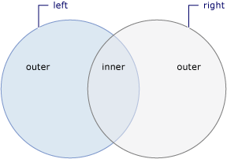

# Join Operations (C#)
A *join* of two data sources is the association of objects in one data source with objects that share a common attribute in another data source.  
  
 Joining is an important operation in queries that target data sources whose relationships to each other cannot be followed directly. In object-oriented programming, this could mean a correlation between objects that is not modeled, such as the backwards direction of a one-way relationship. An example of a one-way relationship is a Customer class that has a property of type City, but the City class does not have a property that is a collection of Customer objects. If you have a list of City objects and you want to find all the customers in each city, you could use a join operation to find them.  
  
 The join methods provided in the LINQ framework are <xref:System.Linq.Enumerable.Join%2A> and <xref:System.Linq.Enumerable.GroupJoin%2A>. These methods perform equijoins, or joins that match two data sources based on equality of their keys. (For comparison, Transact-SQL supports join operators other than 'equals', for example the 'less than' operator.) In relational database terms, <xref:System.Linq.Enumerable.Join%2A> implements an inner join, a type of join in which only those objects that have a match in the other data set are returned. The <xref:System.Linq.Enumerable.GroupJoin%2A> method has no direct equivalent in relational database terms, but it implements a superset of inner joins and left outer joins. A left outer join is a join that returns each element of the first (left) data source, even if it has no correlated elements in the other data source.  
  
 The following illustration shows a conceptual view of two sets and the elements within those sets that are included in either an inner join or a left outer join.  
  
   
  
## Methods  
  
|Method Name|Description|C# Query Expression Syntax|More Information|  
|-----------------|-----------------|---------------------------------|----------------------|  
|Join|Joins two sequences based on key selector functions and extracts pairs of values.|`join … in … on … equals …`|<xref:System.Linq.Enumerable.Join%2A?displayProperty=nameWithType>   <xref:System.Linq.Queryable.Join%2A?displayProperty=nameWithType>|  
|GroupJoin|Joins two sequences based on key selector functions and groups the resulting matches for each element.|`join … in … on … equals … into …`|<xref:System.Linq.Enumerable.GroupJoin%2A?displayProperty=nameWithType>   <xref:System.Linq.Queryable.GroupJoin%2A?displayProperty=nameWithType>|  
  
## See also

- <xref:System.Linq>
- [Standard Query Operators Overview (C#)](./standard-query-operators-overview.md)
- [Anonymous Types](../../classes-and-structs/anonymous-types.md)
- [Formulate Joins and Cross-Product Queries](../../../../framework/data/adonet/sql/linq/formulate-joins-and-cross-product-queries.md)
- [join clause](../../../language-reference/keywords/join-clause.md)
- [Join by using composite keys](../../../linq/join-by-using-composite-keys.md)
- [How to join content from dissimilar files (LINQ) (C#)](./how-to-join-content-from-dissimilar-files-linq.md)
- [Order the results of a join clause](../../../linq/order-the-results-of-a-join-clause.md)
- [Perform custom join operations](../../../linq/perform-custom-join-operations.md)
- [Perform grouped joins](../../../linq/perform-grouped-joins.md)
- [Perform inner joins](../../../linq/perform-inner-joins.md)
- [Perform left outer joins](../../../linq/perform-left-outer-joins.md)
- [How to populate object collections from multiple sources (LINQ) (C#)](./how-to-populate-object-collections-from-multiple-sources-linq.md)
