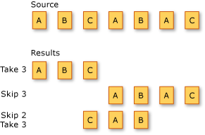

# Partitioning data (C#)

Partitioning in LINQ refers to the operation of dividing an input sequence into two sections, without rearranging the elements, and then returning one of the sections.

The following illustration shows the results of three different partitioning operations on a sequence of characters. The first operation returns the first three elements in the sequence. The second operation skips the first three elements and returns the remaining elements. The third operation skips the first two elements in the sequence and returns the next three elements.

The standard query operator methods that partition sequences are listed in the following section.

## Operators

| Method names | Description | C# query expression syntax | More information |
|--|--|--|--|
| Skip | Skips elements up to a specified position in a sequence. | Not applicable. | <xref:System.Linq.Enumerable.Skip%2A?displayProperty=nameWithType> <xref:System.Linq.Queryable.Skip%2A?displayProperty=nameWithType> |
| SkipWhile | Skips elements based on a predicate function until an element does not satisfy the condition. | Not applicable. | <xref:System.Linq.Enumerable.SkipWhile%2A?displayProperty=nameWithType> <xref:System.Linq.Queryable.SkipWhile%2A?displayProperty=nameWithType> |
| Take | Takes elements up to a specified position in a sequence. | Not applicable. | <xref:System.Linq.Enumerable.Take%2A?displayProperty=nameWithType> <xref:System.Linq.Queryable.Take%2A?displayProperty=nameWithType> |
| TakeWhile | Takes elements based on a predicate function until an element does not satisfy the condition. | Not applicable. | <xref:System.Linq.Enumerable.TakeWhile%2A?displayProperty=nameWithType> <xref:System.Linq.Queryable.TakeWhile%2A?displayProperty=nameWithType> |
| Chunk | Splits the elements of a sequence into chunks of a specified maximum size. | Not applicable. | <xref:System.Linq.Enumerable.Chunk%2A?displayProperty=nameWithType> <xref:System.Linq.Queryable.Chunk%2A?displayProperty=nameWithType> |

## Example

The `Chunk` operator is used to split elements of a sequence based on a given `size`.

:::code source="snippets/partition/Program.cs":::

The preceding C# code:

- Relies on <xref:System.Linq.Enumerable.Range(System.Int32,System.Int32)?displayProperty=nameWithType> to generate a sequence of numbers.
- Applies the `Chunk` operator, splitting the sequence into chunks with a max size of three.

## See also

- <xref:System.Linq>
- [Standard Query Operators Overview (C#)](./standard-query-operators-overview.md)
