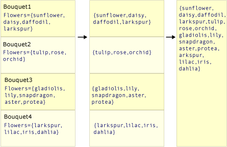

# Projection Operations (C#)
Projection refers to the operation of transforming an object into a new form that often consists only of those properties that will be subsequently used. By using projection, you can construct a new type that is built from each object. You can project a property and perform a mathematical function on it. You can also project the original object without changing it.  
  
 The standard query operator methods that perform projection are listed in the following section.  
  
## Methods  
  
|Method Name|Description|C# Query Expression Syntax|More Information|  
|-----------------|-----------------|---------------------------------|----------------------|  
|Select|Projects values that are based on a transform function.|`select`|<xref:System.Linq.Enumerable.Select%2A?displayProperty=nameWithType><br /><br /> <xref:System.Linq.Queryable.Select%2A?displayProperty=nameWithType>|  
|SelectMany|Projects sequences of values that are based on a transform function and then flattens them into one sequence.|Use multiple `from` clauses|<xref:System.Linq.Enumerable.SelectMany%2A?displayProperty=nameWithType><br /><br /> <xref:System.Linq.Queryable.SelectMany%2A?displayProperty=nameWithType>|  
  
## Query Expression Syntax Examples  
  
### Select  
 The following example uses the `select` clause to project the first letter from each string in a list of strings.  
  
```csharp  
List<string> words = new List<string>() { "an", "apple", "a", "day" };  
  
var query = from word in words  
            select word.Substring(0, 1);  
  
foreach (string s in query)  
    Console.WriteLine(s);  
  
/* This code produces the following output:  
  
    a  
    a  
    a  
    d  
*/  
```  
  
### SelectMany  
 The following example uses multiple `from` clauses  to project each word from each string in a list of strings.  
  
```csharp  
List<string> phrases = new List<string>() { "an apple a day", "the quick brown fox" };  
  
var query = from phrase in phrases  
            from word in phrase.Split(' ')  
            select word;  
  
foreach (string s in query)  
    Console.WriteLine(s);  
  
/* This code produces the following output:  
  
    an  
    apple  
    a  
    day  
    the  
    quick  
    brown  
    fox  
*/  
```  
  
## Select versus SelectMany  
 The work of both `Select()` and `SelectMany()` is to produce a result value (or values) from source values. `Select()` produces one result value for every source value. The overall result is therefore a collection that has the same number of elements as the source collection. In contrast, `SelectMany()` produces a single overall result that contains concatenated sub-collections from each source value. The transform function that is passed as an argument to `SelectMany()` must return an enumerable sequence of values for each source value. These enumerable sequences are then concatenated by `SelectMany()` to create one large sequence.  
  
 The following two illustrations show the conceptual difference between the actions of these two methods. In each case, assume that the selector (transform) function selects the array of flowers from each source value.  
  
 This illustration depicts how `Select()` returns a collection that has the same number of elements as the source collection.  
  
   
  
 This illustration depicts how `SelectMany()` concatenates the intermediate sequence of arrays into one final result value that contains each value from each intermediate array.  
  
   
  
### Code Example  
 The following example compares the behavior of `Select()` and `SelectMany()`. The code creates a "bouquet" of flowers by taking the first two items from each list of flower names in the source collection. In this example, the "single value" that the transform function <xref:System.Linq.Enumerable.Select%60%602%28System.Collections.Generic.IEnumerable%7B%60%600%7D%2CSystem.Func%7B%60%600%2C%60%601%7D%29> uses is itself a collection of values. This requires the extra `foreach` loop in order to enumerate each string in each sub-sequence.  
  
```csharp  
class Bouquet  
{  
    public List<string> Flowers { get; set; }  
}  
  
static void SelectVsSelectMany()  
{  
    List<Bouquet> bouquets = new List<Bouquet>() {  
        new Bouquet { Flowers = new List<string> { "sunflower", "daisy", "daffodil", "larkspur" }},  
        new Bouquet{ Flowers = new List<string> { "tulip", "rose", "orchid" }},  
        new Bouquet{ Flowers = new List<string> { "gladiolis", "lily", "snapdragon", "aster", "protea" }},  
        new Bouquet{ Flowers = new List<string> { "larkspur", "lilac", "iris", "dahlia" }}  
    };  
  
    // *********** Select ***********              
    IEnumerable<List<string>> query1 = bouquets.Select(bq => bq.Flowers);  
  
    // ********* SelectMany *********  
    IEnumerable<string> query2 = bouquets.SelectMany(bq => bq.Flowers);  
  
    Console.WriteLine("Results by using Select():");  
    // Note the extra foreach loop here.  
    foreach (IEnumerable<String> collection in query1)  
        foreach (string item in collection)  
            Console.WriteLine(item);  
  
    Console.WriteLine("\nResults by using SelectMany():");  
    foreach (string item in query2)  
        Console.WriteLine(item);  
  
    /* This code produces the following output:  
  
       Results by using Select():  
        sunflower  
        daisy  
        daffodil  
        larkspur  
        tulip  
        rose  
        orchid  
        gladiolis  
        lily  
        snapdragon  
        aster  
        protea  
        larkspur  
        lilac  
        iris  
        dahlia  
  
       Results by using SelectMany():  
        sunflower  
        daisy  
        daffodil  
        larkspur  
        tulip  
        rose  
        orchid  
        gladiolis  
        lily  
        snapdragon  
        aster  
        protea  
        larkspur  
        lilac  
        iris  
        dahlia  
    */  
  
}  
```  
  
## See Also  
 <xref:System.Linq>  
 [Standard Query Operators Overview (C#)](../../../../csharp/programming-guide/concepts/linq/standard-query-operators-overview.md)  
 [select clause](../../../../csharp/language-reference/keywords/select-clause.md)  
 [How to: Populate Object Collections from Multiple Sources (LINQ) (C#)](../../../../csharp/programming-guide/concepts/linq/how-to-populate-object-collections-from-multiple-sources-linq.md)  
 [How to: Split a File Into Many Files by Using Groups (LINQ) (C#)](../../../../csharp/programming-guide/concepts/linq/how-to-split-a-file-into-many-files-by-using-groups-linq.md)
