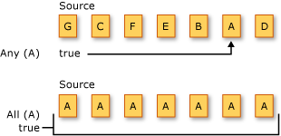

# Quantifier Operations (C#)

Quantifier operations return a <xref:System.Boolean> value that indicates whether some or all of the elements in a sequence satisfy a condition.  
  
 The following illustration depicts two different quantifier operations on two different source sequences. The first operation asks if one or more of the elements are the character 'A', and the result is `true`. The second operation asks if all the elements are the character 'A', and the result is `true`.  
  
   
  
 The standard query operator methods that perform quantifier operations are listed in the following section.  
  
## Methods  
  
|Method Name|Description|C# Query Expression Syntax|More Information|  
|-----------------|-----------------|---------------------------------|----------------------|  
|All|Determines whether all the elements in a sequence satisfy a condition.|Not applicable.|<xref:System.Linq.Enumerable.All%2A?displayProperty=nameWithType>   <xref:System.Linq.Queryable.All%2A?displayProperty=nameWithType>|  
|Any|Determines whether any elements in a sequence satisfy a condition.|Not applicable.|<xref:System.Linq.Enumerable.Any%2A?displayProperty=nameWithType>   <xref:System.Linq.Queryable.Any%2A?displayProperty=nameWithType>|  
|Contains|Determines whether a sequence contains a specified element.|Not applicable.|<xref:System.Linq.Enumerable.Contains%2A?displayProperty=nameWithType>   <xref:System.Linq.Queryable.Contains%2A?displayProperty=nameWithType>|  

## Query Expression Syntax Examples  
  
### All  

The following example uses the `All` to check that all strings are of a specific length.
  
[!code-csharp[All](~/samples/snippets/csharp/VS_Snippets_VBCSharp/CsLINQQuantifier/CS/Quantifier.cs#All)]  
  
### Any  

The following example uses the `Any` to check that any strings are start with 'o'.  
  
[!code-csharp[Any](~/samples/snippets/csharp/VS_Snippets_VBCSharp/CsLINQQuantifier/CS/Quantifier.cs#Any)]  
  
### Contains  

The following example uses the `Contains` to check an array have a specific element.  
  
[!code-csharp[Contains](~/samples/snippets/csharp/VS_Snippets_VBCSharp/CsLINQQuantifier/CS/Quantifier.cs#Contains)]  
  
## See also

- <xref:System.Linq>
- [Standard Query Operators Overview (C#)](./standard-query-operators-overview.md)
- [Dynamically specify predicate filters at run time](../../../linq/dynamically-specify-predicate-filters-at-runtime.md)
- [How to query for sentences that contain a specified set of words (LINQ) (C#)](./how-to-query-for-sentences-that-contain-a-specified-set-of-words-linq.md)
