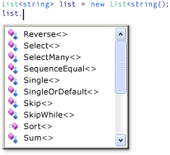

# Query Syntax and Method Syntax in LINQ (C#)
Most queries in the introductory Language Integrated Query ([!INCLUDE[vbteclinq](~/includes/vbteclinq-md.md)]) documentation are written by using the LINQ declarative query syntax. However, the query syntax must be translated into method calls for the .NET common language runtime (CLR) when the code is compiled. These method calls invoke the standard query operators, which have names such as `Where`, `Select`, `GroupBy`, `Join`, `Max`, and `Average`. You can call them directly by using method syntax instead of query syntax.  
  
 Query syntax and method syntax are semantically identical, but many people find query syntax simpler and easier to read. Some queries must be expressed as method calls. For example, you must use a method call to express a query that retrieves the number of elements that match a specified condition. You also must use a method call for a query that retrieves the element that has the maximum value in a source sequence. The reference documentation for the standard query operators in the <xref:System.Linq> namespace generally uses method syntax. Therefore, even when getting started writing [!INCLUDE[vbteclinq](~/includes/vbteclinq-md.md)] queries, it is useful to be familiar with how to use method syntax in queries and in query expressions themselves.  
  
## Standard Query Operator Extension Methods  
 The following example shows a simple *query expression* and the semantically equivalent query written as a *method-based query*.  
  
 [!code-csharp[csLINQGettingStarted#22](../../../../csharp/programming-guide/concepts/linq/codesnippet/CSharp/query-syntax-and-method-syntax-in-linq_1.cs)]  
  
 The output from the two examples is identical. You can see that the type of the query variable is the same in both forms: <xref:System.Collections.Generic.IEnumerable%601>.  
  
 To understand the method-based query, let's examine it more closely. On the right side of the expression, notice that the `where` clause is now expressed as an instance method on the `numbers` object, which as you will recall has a type of `IEnumerable<int>`. If you are familiar with the generic <xref:System.Collections.Generic.IEnumerable%601> interface, you know that it does not have a `Where` method. However, if you invoke the IntelliSense completion list in the Visual Studio IDE, you will see not only a `Where` method, but many other methods such as `Select`, `SelectMany`, `Join`, and `Orderby`. These are all the standard query operators.  
  
   
  
 Although it looks as if <xref:System.Collections.Generic.IEnumerable%601> has been redefined to include these additional methods, in fact this is not the case. The standard query operators are implemented as a new kind of method called *extension methods*. Extensions methods "extend" an existing type; they can be called as if they were instance methods on the type. The standard query operators extend <xref:System.Collections.Generic.IEnumerable%601> and that is why you can write `numbers.Where(...)`.  
  
 To get started using [!INCLUDE[vbteclinq](~/includes/vbteclinq-md.md)], all that you really have to know about extension methods is how to bring them into scope in your application by using the correct `using` directives. From your application's point of view, an extension method and a regular instance method are the same.  
  
 For more information about extension methods, see [Extension Methods](../../../../csharp/programming-guide/classes-and-structs/extension-methods.md). For more information about standard query operators, see [Standard Query Operators Overview (C#)](../../../../csharp/programming-guide/concepts/linq/standard-query-operators-overview.md). Some [!INCLUDE[vbteclinq](~/includes/vbteclinq-md.md)] providers, such as [!INCLUDE[vbtecdlinq](~/includes/vbtecdlinq-md.md)] and [!INCLUDE[sqltecxlinq](~/includes/sqltecxlinq-md.md)], implement their own standard query operators and additional extension methods for other types besides <xref:System.Collections.Generic.IEnumerable%601>.  
  
## Lambda Expressions  
 In the previous example, notice that the conditional expression (`num % 2 == 0`) is passed as an in-line argument to the `Where` method: `Where(num => num % 2 == 0).` This inline expression is called a lambda expression. It is a convenient way to write code that would otherwise have to be written in more cumbersome form as an anonymous method or a generic delegate or an expression tree. In C# `=>` is the lambda operator, which is read as "goes to". The `num` on the left of the operator is the input variable which corresponds to `num` in the query expression. The compiler can infer the type of `num` because it knows that `numbers` is a generic <xref:System.Collections.Generic.IEnumerable%601> type. The body of the lambda is just the same as the expression in query syntax or in any other C# expression or statement; it can include method calls and other complex logic. The "return value" is just the expression result.  
  
 To get started using [!INCLUDE[vbteclinq](~/includes/vbteclinq-md.md)], you do not have to use lambdas extensively. However, certain queries can only be expressed in method syntax and some of those require lambda expressions. After you become more familiar with lambdas, you will find that they are a powerful and flexible tool in your [!INCLUDE[vbteclinq](~/includes/vbteclinq-md.md)] toolbox. For more information, see [Lambda Expressions](../../../../csharp/programming-guide/statements-expressions-operators/lambda-expressions.md).  
  
## Composability of Queries  
 In the previous code example, note that the `OrderBy` method is invoked by using the dot operator on the call to `Where`. `Where` produces a filtered sequence, and then `Orderby` operates on that sequence by sorting it. Because queries return an `IEnumerable`, you compose them in method syntax by chaining the method calls together. This is what the compiler does behind the scenes when you write queries by using query syntax. And because a query variable does not store the results of the query, you can modify it or use it as the basis for a new query at any time, even after it has been executed.  
  
## See Also  
 [Getting Started with LINQ in C#](../../../../csharp/programming-guide/concepts/linq/getting-started-with-linq.md)
