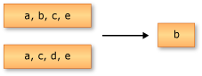
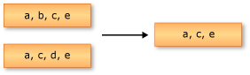
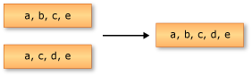

# Set operations (C#)

Set operations in LINQ refer to query operations that produce a result set that is based on the presence or absence of equivalent elements within the same or separate collections (or sets).

The standard query operator methods that perform set operations are listed in the following section.

## Methods

| Method names | Description | C# query expression syntax | More information |
|--|--|--|--|
| Distinct or DistinctBy | Removes duplicate values from a collection. | Not applicable. | <xref:System.Linq.Enumerable.Distinct%2A?displayProperty=nameWithType> <xref:System.Linq.Enumerable.DistinctBy%2A?displayProperty=nameWithType> <xref:System.Linq.Queryable.Distinct%2A?displayProperty=nameWithType> <xref:System.Linq.Queryable.DistinctBy%2A?displayProperty=nameWithType> |
| Except or ExceptBy | Returns the set difference, which means the elements of one collection that do not appear in a second collection. | Not applicable. | <xref:System.Linq.Enumerable.Except%2A?displayProperty=nameWithType> <xref:System.Linq.Enumerable.ExceptBy%2A?displayProperty=nameWithType> <xref:System.Linq.Queryable.Except%2A?displayProperty=nameWithType> <xref:System.Linq.Queryable.ExceptBy%2A?displayProperty=nameWithType> |
| Intersect or IntersectBy | Returns the set intersection, which means elements that appear in each of two collections. | Not applicable. | <xref:System.Linq.Enumerable.Intersect%2A?displayProperty=nameWithType> <xref:System.Linq.Enumerable.IntersectBy%2A?displayProperty=nameWithType> <xref:System.Linq.Queryable.Intersect%2A?displayProperty=nameWithType> <xref:System.Linq.Queryable.IntersectBy%2A?displayProperty=nameWithType> |
| Union or UnionBy | Returns the set union, which means unique elements that appear in either of two collections. | Not applicable. | <xref:System.Linq.Enumerable.Union%2A?displayProperty=nameWithType> <xref:System.Linq.Enumerable.UnionBy%2A?displayProperty=nameWithType> <xref:System.Linq.Queryable.Union%2A?displayProperty=nameWithType> <xref:System.Linq.Queryable.UnionBy%2A?displayProperty=nameWithType> |

## Examples

Some of the following examples rely on a `record` type that represents the planets in our solar system.

:::code source="snippets/set-operators/Planet.cs":::

The `record Planet` is a positional record, which requires a `Name`, `Type`, and `OrderFromSun` arguments to instantiate it. There are several `static readonly` planet instances on the `Planet` type. These are convenience-based definitions for well-known planets. The `Type` member identifies the planet type.

:::code source="snippets/set-operators/PlanetType.cs":::

## `Distinct` and `DistinctBy`

The following example depicts the behavior of the <xref:System.Linq.Enumerable.Distinct%2A?displayProperty=nameWithType> method on a sequence of strings. The returned sequence contains the unique elements from the input sequence.

[!code-csharp-interactive[Distinct](~/samples/snippets/csharp/VS_Snippets_VBCSharp/CsLINQSetOperation/CS/SetOperation.cs#1)]

The [`DistinctBy`](xref:System.Linq.Enumerable.DistinctBy%2A?displayProperty=nameWithType) is an alternative approach to `Distinct`, which takes a `keySelector`. The `keySelector` is used as the comparative discriminator of the source type. Consider the following planet array:

:::code source="snippets/set-operators/Program.DistinctBy.cs" id="Planets":::

To distinct planets are discriminated on their `PlanetType` and the first of their type are displayed:

:::code source="snippets/set-operators/Program.DistinctBy.cs" id="DistinctBy":::

In the preceding C# code:

- The `Planet` array is filtered distinctly to the first occurrence of each unique plane type.
- The resulting `planet` instance is written to the console.

## `Except` and `ExceptBy`

The following example depicts the behavior of <xref:System.Linq.Enumerable.Except%2A?displayProperty=nameWithType>. The returned sequence contains only the elements from the first input sequence that are not in the second input sequence.

[!code-csharp-interactive[Except](~/samples/snippets/csharp/VS_Snippets_VBCSharp/CsLINQSetOperation/CS/SetOperation.cs#2)]

The [`ExceptBy`](xref:System.Linq.Enumerable.ExceptBy%2A?displayProperty=nameWithType) is an alternative approach to `Except`, which takes two sequences of the heterogenous types and a `keySelector`. The `keySelector` is the same type as the second collections type, and it is used as the comparative discriminator of the source type. Consider the following planet arrays:

:::code source="snippets/set-operators/Program.ExceptBy.cs" id="Planets":::

To find planets in the first collection, that are not in the second collection you can project the planet names as the `second` collection and provide the same `keySelector`:

:::code source="snippets/set-operators/Program.ExceptBy.cs" id="ExceptBy":::

In the preceding C# code:

- The `keySelector` is defined as a `static` local function, which discriminates on a planet name.
- The first planet array is filtered to planets that are not found in the second planet array, based on their name.
- The resulting `planet` instance is written to the console.

## `Intersect` and `IntersectBy`

The following example depicts the behavior of <xref:System.Linq.Enumerable.Intersect%2A?displayProperty=nameWithType>. The returned sequence contains the elements that are common to both of the input sequences.

[!code-csharp-interactive[Intersect](~/samples/snippets/csharp/VS_Snippets_VBCSharp/CsLINQSetOperation/CS/SetOperation.cs#3)]

The [`IntersectBy`](xref:System.Linq.Enumerable.IntersectBy%2A?displayProperty=nameWithType) is an alternative approach to `Intersect`, which takes two sequences of the heterogenous types and a `keySelector`. The `keySelector` is used as the comparative discriminator of the second collection's type. Consider the following planet arrays:

:::code source="snippets/set-operators/Program.IntersectBy.cs" id="Planets":::

There are two arrays of planets, one represents the first first planets from the sun and the second represents the last five planets from the sun. Since the `Planet` type is a positional `record` type, you can use its value comparison semantics in the form of the `keySelector`:

:::code source="snippets/set-operators/Program.IntersectBy.cs" id="IntersectBy":::

In the preceding C# code:

- The two `Planet` arrays are intersected by their value comparison semantics.
- Only planets that are found in both arrays are present in the resulting sequence.
- The resulting `planet` instance is written to the console.

## `Union` and `UnionBy`

The following example depicts a union operation on two sequences of strings. The returned sequence contains the unique elements from both input sequences.

[!code-csharp-interactive[Union](~/samples/snippets/csharp/VS_Snippets_VBCSharp/CsLINQSetOperation/CS/SetOperation.cs#4)]

The [`UnionBy`](xref:System.Linq.Enumerable.UnionBy%2A?displayProperty=nameWithType)is an alternative approach to `Union`, which takes two sequences of the same type and a `keySelector`. The `keySelector` is used as the comparative discriminator of the source type. Consider the following planet arrays:

:::code source="snippets/set-operators/Program.UnionBy.cs" id="Planets":::

To union these two collections into a single sequence, you provide the `keySelector`:

:::code source="snippets/set-operators/Program.UnionBy.cs" id="UnionBy":::

In the preceding C# code:

- The two `Planet` arrays are weaved together using their `record` value comparison semantics.
- The resulting `planet` instance is written to the console.

## See also

- <xref:System.Linq>
- [Standard Query Operators Overview (C#)](./standard-query-operators-overview.md)
- [How to combine and compare string collections (LINQ) (C#)](./how-to-combine-and-compare-string-collections-linq.md)
- [How to find the set difference between two lists (LINQ) (C#)](./how-to-find-the-set-difference-between-two-lists-linq.md)
