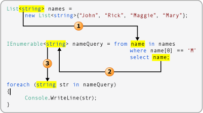
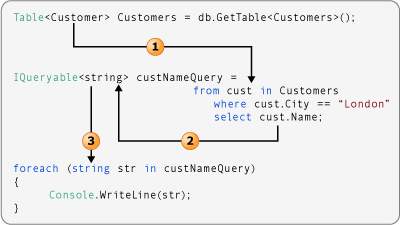
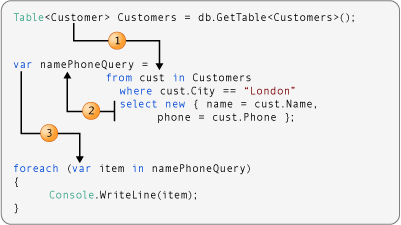
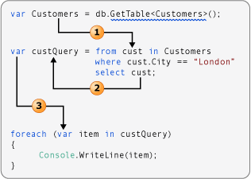

# Type Relationships in LINQ Query Operations (C#)
To write queries effectively, you should understand how types of the variables in a complete query operation all relate to each other. If you understand these relationships you will more easily comprehend the LINQ samples and code examples in the documentation. Furthermore, you will understand what occurs behind the scenes when variables are implicitly typed by using `var`.  
  
 LINQ query operations are strongly typed in the data source, in the query itself, and in the query execution. The type of the variables in the query must be compatible with the type of the elements in the data source and with the type of the iteration variable in the `foreach` statement. This strong typing guarantees that type errors are caught at compile time when they can be corrected before users encounter them.  
  
 In order to demonstrate these type relationships, most of the examples that follow use explicit typing for all variables. The last example shows how the same principles apply even when you use implicit typing by using [var](../../../language-reference/keywords/var.md).  
  
## Queries that do not Transform the Source Data  
 The following illustration shows a LINQ to Objects query operation that performs no transformations on the data. The source contains a sequence of strings and the query output is also a sequence of strings.  
  
   
  
1. The type argument of the data source determines the type of the range variable.  
  
2. The type of the object that is selected determines the type of the query variable. Here `name` is a string. Therefore, the query variable is an `IEnumerable<string>`.  
  
3. The query variable is iterated over in the `foreach` statement. Because the query variable is a sequence of strings, the iteration variable is also a string.  
  
## Queries that Transform the Source Data  
 The following illustration shows a [!INCLUDE[vbtecdlinq](~/includes/vbtecdlinq-md.md)] query operation that performs a simple transformation on the data. The query takes a sequence of `Customer` objects as input, and selects only the `Name` property in the result. Because `Name` is a string, the query produces a sequence of strings as output.  
  
   
  
1. The type argument of the data source determines the type of the range variable.  
  
2. The `select` statement returns the `Name` property instead of the complete `Customer` object. Because `Name` is a string, the type argument of `custNameQuery` is `string`, not `Customer`.  
  
3. Because `custNameQuery` is a sequence of strings, the `foreach` loop's iteration variable must also be a `string`.  
  
 The following illustration shows a slightly more complex transformation. The `select` statement returns an anonymous type that captures just two members of the original `Customer` object.  
  
   
  
1. The type argument of the data source is always the type of the range variable in the query.  
  
2. Because the `select` statement produces an anonymous type, the query variable must be implicitly typed by using `var`.  
  
3. Because the type of the query variable is implicit, the iteration variable in the `foreach` loop must also be implicit.  
  
## Letting the compiler infer type information  
 Although you should understand the type relationships in a query operation, you have the option to let the compiler do all the work for you. The keyword [var](../../../language-reference/keywords/var.md) can be used for any local variable in a query operation. The following illustration is similar to example number 2 that was discussed earlier. However, the compiler supplies the strong type for each variable in the query operation.  
  
   
  
 For more information about `var`, see [Implicitly Typed Local Variables](../../classes-and-structs/implicitly-typed-local-variables.md).  
