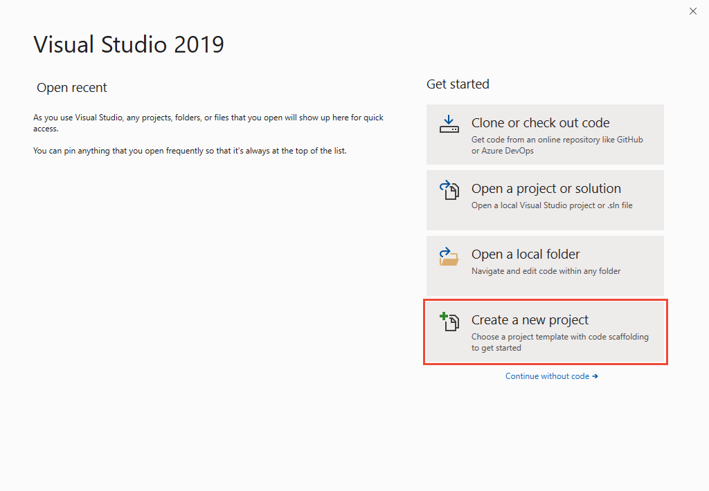
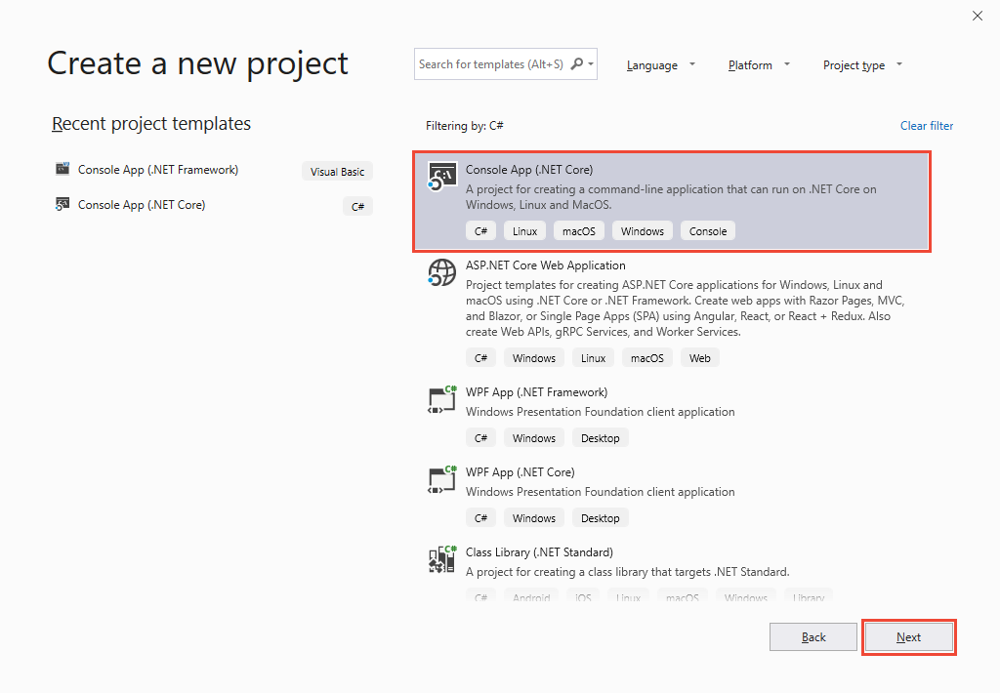
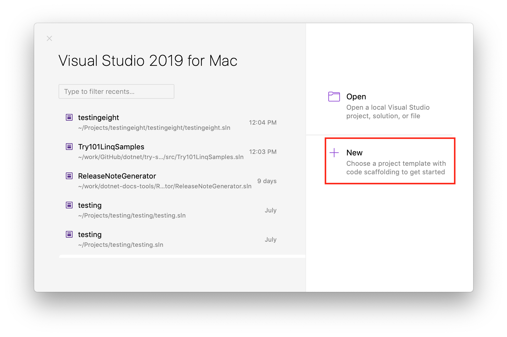
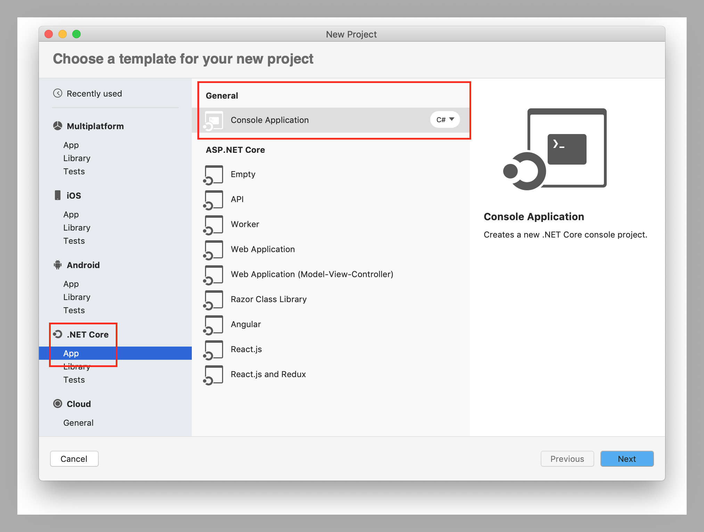

# Hello World -- Your first program

In this article, you'll use Visual Studio to create the traditional "Hello World!" program. Visual Studio is a professional Integrated Development Environment (IDE) with many features designed for .NET development. You'll use only a few of the features in Visual Studio to create this program. To learn more about Visual Studio, see [Getting Started with Visual C# and Visual Basic](/visualstudio/ide/getting-started-with-visual-csharp-and-visual-basic).

[!INCLUDE[note_settings_general](~/includes/note-settings-general-md.md)]

## Create a new application

# [Windows](#tab/windows)

Start Visual Studio. You'll see the following image on Windows:



Select **Create a new project** in the lower right corner of the image. Visual Studio displays the **New Project** dialog:



> [!NOTE]
> If this is the first time you've started Visual Studio, the **Recent project templates** list is empty.

On the new project dialog, choose "Console App (.NET Core)" and then press **Next**. Give your project a name, such as "HelloWorld", then press **Create**.

Visual Studio opens your project. It's already a basic "Hello World!" example. Press `Ctrl` + `F5` to run your project. Visual Studio builds your project, converting the source code into an executable. Then, it launches a command window that runs your new application. You should see the following text in the window:

```console
Hello World!

C:\Program Files\dotnet\dotnet.exe (process 11964) exited with code 0.
Press any key to close this window . . .
```

Press a key to close the window. 

# [macOS](#tab/macos)

Start Visual Studio for Mac. You'll see the following image on Mac:



> [!NOTE]
> If this is the first time you've started Visual Studio for Mac, the **Recent projects** list is empty.

Select **New** in the upper right corner of the image. Visual Studio for Mac displays the **New Project** dialog:



On the new project dialog, choose ".NET Core", and "Console App" and then press **Next**. You'll need to select the target framework. The default is fine, so press next. Give your project a name, such as "HelloWorld", then press **Create**. You can use the default project location. Don't add this project to source control.

Visual Studio for Mac opens your project. It's already a basic "Hello World!" example. Press `Ctrl` + `Fn` + `F5` to run your project. Visual Studio for Mac builds your project, converting the source code into an executable. Then, it launches a command window that runs your new application. You should see the following text in the window:

```console
Hello World!

Press any key to close this window . . .
```

Press a key to end the session. 

## Elements of a C# program

Let's examine the important parts of this program. The first line contains a comment. The characters `//` convert the rest of the line to a comment.

[!code-csharp[csProgGuide#32](~/samples/snippets/csharp/VS_Snippets_VBCSharp/csProgGuide/CS/progGuide.cs#32)]

You can also comment out a block of text by enclosing it between the `/*` and `*/` characters. This is shown in the following example.

[!code-csharp[csProgGuide#33](~/samples/snippets/csharp/VS_Snippets_VBCSharp/csProgGuide/CS/progGuide.cs#33)]

A C# console application must contain a `Main` method, in which control starts and ends. The `Main` method is where you create objects and execute other methods.

The `Main` method is a [static](../../language-reference/keywords/static.md) method that resides inside a class or a struct. In the previous "Hello World!" example, it resides in a class named `Hello`. You can declare the `Main` method in one of the following ways:

- It can return `void`. That means your program doesn't return a value.

[!code-csharp[csProgGuideMain#12](~/samples/snippets/csharp/VS_Snippets_VBCSharp/csProgGuideMain/CS/Class3.cs#12)]

- It can also return an integer. The integer is the **exit code** for your application.

[!code-csharp[csProgGuideMain#13](~/samples/snippets/csharp/VS_Snippets_VBCSharp/csProgGuideMain/CS/Class3.cs#13)]

- With either of the return types, it can take arguments.

[!code-csharp[csProgGuideMain#19](~/samples/snippets/csharp/VS_Snippets_VBCSharp/csProgGuideMain/CS/Class3.cs#19)]

-or-

[!code-csharp[csProgGuideMain#18](~/samples/snippets/csharp/VS_Snippets_VBCSharp/csProgGuideMain/CS/Class3.cs#18)]

The parameter of the `Main` method, `args`, is a `string` array that contains the command-line arguments used to invoke the program. 

For more information about how to use command-line arguments, see the examples in [Main() and Command-Line Arguments](../main-and-command-args/index.md).

## Input and output

C# programs generally use the input/output services provided by the run-time library of the .NET Framework. The statement `System.Console.WriteLine("Hello World!");` uses the <xref:System.Console.WriteLine%2A> method. This is one of the output methods of the <xref:System.Console> class in the run-time library. It displays its string parameter on the standard output stream followed by a new line. Other <xref:System.Console> methods are available for different input and output operations. If you include the `using System;` directive at the beginning of the program, you can directly use the <xref:System> classes and methods without fully qualifying them. For example, you can call `Console.WriteLine` instead of `System.Console.WriteLine`:

 [!code-csharp[csProgGuide#1](~/samples/snippets/csharp/VS_Snippets_VBCSharp/csProgGuide/CS/using.cs#1)]

 [!code-csharp[csProgGuide#23](~/samples/snippets/csharp/VS_Snippets_VBCSharp/csProgGuide/CS/progGuide.cs#23)]

For more information about input/output methods, see <xref:System.IO>.

## See also

- [C# Programming Guide](../index.md)
- [Samples and tutorials](../../../samples-and-tutorials/index.md)
- [Main() and Command-Line Arguments](../main-and-command-args/index.md)
- [Getting Started with Visual C# and Visual Basic](/visualstudio/ide/getting-started-with-visual-csharp-and-visual-basic)
