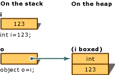
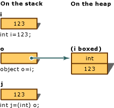

# Boxing and Unboxing (C# Programming Guide)
Boxing is the process of converting a [value type](../../language-reference/keywords/value-types.md) to the type `object` or to any interface type implemented by this value type. When the CLR boxes a value type, it wraps the value inside a <xref:System.Object?displayProperty=nameWithType> instance and stores it on the managed heap. Unboxing extracts the value type from the object. Boxing is implicit; unboxing is explicit. The concept of boxing and unboxing underlies the C# unified view of the type system in which a value of any type can be treated as an object.  
  
 In the following example, the integer variable `i` is *boxed* and assigned to object `o`.  
  
 [!code-csharp[csProgGuideTypes#14](~/samples/snippets/csharp/VS_Snippets_VBCSharp/CsProgGuideTypes/CS/Class1.cs#14)]  
  
 The object `o` can then be unboxed and assigned to integer variable `i`:  
  
 [!code-csharp[csProgGuideTypes#15](~/samples/snippets/csharp/VS_Snippets_VBCSharp/CsProgGuideTypes/CS/Class1.cs#15)]  
  
 The following examples illustrate how boxing is used in C#.  
  
 [!code-csharp[csProgGuideTypes#47](~/samples/snippets/csharp/VS_Snippets_VBCSharp/CsProgGuideTypes/CS/Class1.cs#47)]  
  
## Performance  
 In relation to simple assignments, boxing and unboxing are computationally expensive processes. When a value type is boxed, a new object must be allocated and constructed. To a lesser degree, the cast required for unboxing is also expensive computationally. For more information, see [Performance](../../../framework/performance/performance-tips.md).  
  
## Boxing  
 Boxing is used to store value types in the garbage-collected heap. Boxing is an implicit conversion of a [value type](../../language-reference/keywords/value-types.md) to the type `object` or to any interface type implemented by this value type. Boxing a value type allocates an object instance on the heap and copies the value into the new object.  
  
 Consider the following declaration of a value-type variable:  
  
 [!code-csharp[csProgGuideTypes#17](~/samples/snippets/csharp/VS_Snippets_VBCSharp/CsProgGuideTypes/CS/Class1.cs#17)]  
  
 The following statement implicitly applies the boxing operation on the variable `i`:  
  
 [!code-csharp[csProgGuideTypes#18](~/samples/snippets/csharp/VS_Snippets_VBCSharp/CsProgGuideTypes/CS/Class1.cs#18)]  
  
 The result of this statement is creating an object reference `o`, on the stack, that references a value of the type `int`, on the heap. This value is a copy of the value-type value assigned to the variable `i`. The difference between the two variables, `i` and `o`, is illustrated in the following image of boxing conversion:  
  
     
  
 It is also possible to perform the boxing explicitly as in the following example, but explicit boxing is never required:  
  
 [!code-csharp[csProgGuideTypes#19](~/samples/snippets/csharp/VS_Snippets_VBCSharp/CsProgGuideTypes/CS/Class1.cs#19)]  
  
## Description  
 This example converts an integer variable `i` to an object `o` by using boxing. Then, the value stored in the variable `i` is changed from `123` to `456`. The example shows that the original value type and the boxed object use separate memory locations, and therefore can store different values.  
  
## Example  
 [!code-csharp[csProgGuideTypes#16](~/samples/snippets/csharp/VS_Snippets_VBCSharp/CsProgGuideTypes/CS/Class1.cs#16)]  
  
## Unboxing  
 Unboxing is an explicit conversion from the type `object` to a [value type](../../language-reference/keywords/value-types.md) or from an interface type to a value type that implements the interface. An unboxing operation consists of:  
  
- Checking the object instance to make sure that it is a boxed value of the given value type.  
  
- Copying the value from the instance into the value-type variable.  
  
 The following statements demonstrate both boxing and unboxing operations:  
  
 [!code-csharp[csProgGuideTypes#21](~/samples/snippets/csharp/VS_Snippets_VBCSharp/CsProgGuideTypes/CS/Class1.cs#21)]  
  
 The following figure demonstrates the result of the previous statements: 
  
 
  
 For the unboxing of value types to succeed at run time, the item being unboxed must be a reference to an object that was previously created by boxing an instance of that value type. Attempting to unbox `null` causes a <xref:System.NullReferenceException>. Attempting to unbox a reference to an incompatible value type causes an <xref:System.InvalidCastException>.  
  
## Example  
 The following example demonstrates a case of invalid unboxing and the resulting `InvalidCastException`. Using `try` and `catch`, an error message is displayed when the error occurs.  
  
 [!code-csharp[csProgGuideTypes#20](~/samples/snippets/csharp/VS_Snippets_VBCSharp/CsProgGuideTypes/CS/Class1.cs#20)]  
  
 This program outputs:  
  
 `Specified cast is not valid. Error: Incorrect unboxing.`  
  
 If you change the statement:  
  
```csharp
int j = (short) o;  
```  
  
 to:  
  
```csharp
int j = (int) o;  
```  
  
 the conversion will be performed, and you will get the output:  
  
 `Unboxing OK.`  
  
## C# Language Specification  
 [!INCLUDE[CSharplangspec](~/includes/csharplangspec-md.md)]  
  
## Related Sections  
 For more information:  
  
- [Reference Types](../../language-reference/keywords/reference-types.md)  
  
- [Value Types](../../language-reference/keywords/value-types.md)  
  
## See also

- [C# Programming Guide](../index.md)
