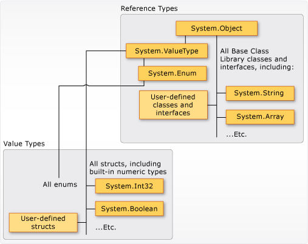

# Types (C# Programming Guide)
## Types, Variables, and Values  
 C# is a strongly-typed language. Every variable and constant has a type, as does every expression that evaluates to a value. Every method signature specifies a type for each input parameter and for the return value. The .NET class library defines a set of built-in numeric types as well as more complex types that represent a wide variety of logical constructs, such as the file system, network connections, collections and arrays of objects, and dates. A typical C# program uses types from the class library as well as user-defined types that model the concepts that are specific to the program's problem domain.  
  
 The information stored in a type can include the following:  
  
-   The storage space that a variable of the type requires.  
  
-   The maximum and minimum values that it can represent.  
  
-   The members (methods, fields, events, and so on) that it contains.  
  
-   The base type it inherits from.  
  
-   The location where the memory for variables will be allocated at run time.  
  
-   The kinds of operations that are permitted.  
  
 The compiler uses type information to make sure that all operations that are performed in your code are *type safe*. For example, if you declare a variable of type [int](../../../csharp/language-reference/keywords/int.md), the compiler allows you to use the variable in addition and subtraction operations. If you try to perform those same operations on a variable of type [bool](../../../csharp/language-reference/keywords/bool.md), the compiler generates an error, as shown in the following example:  
  
 [!code-csharp[csProgGuideTypes#42](../../../csharp/programming-guide/nullable-types/codesnippet/CSharp/index_1.cs)]  
  
> [!NOTE]
>  C and C++ developers, notice that in C#, [bool](../../../csharp/language-reference/keywords/bool.md) is not convertible to [int](../../../csharp/language-reference/keywords/int.md).  
  
 The compiler embeds the type information into the executable file as metadata. The common language runtime (CLR) uses that metadata at run time to further guarantee type safety when it allocates and reclaims memory.  
  
### Specifying Types in Variable Declarations  
 When you declare a variable or constant in a program, you must either specify its type or use the [var](../../../csharp/language-reference/keywords/var.md) keyword to let the compiler infer the type. The following example shows some variable declarations that use both built-in numeric types and complex user-defined types:  
  
 [!code-csharp[csProgGuideTypes#36](../../../csharp/programming-guide/nullable-types/codesnippet/CSharp/index_2.cs)]  
  
 The types of method parameters and return values are specified in the method signature. The following signature shows a method that requires an [int](../../../csharp/language-reference/keywords/int.md) as an input argument and returns a string:  
  
 [!code-csharp[csProgGuideTypes#35](../../../csharp/programming-guide/nullable-types/codesnippet/CSharp/index_3.cs)]  
  
 After a variable is declared, it cannot be re-declared with a new type, and it cannot be assigned a value that is not compatible with its declared type. For example, you cannot declare an [int](../../../csharp/language-reference/keywords/int.md) and then assign it a Boolean value of [true](../../../csharp/language-reference/keywords/true-literal.md). However, values can be converted to other types, for example when they are assigned to new variables or passed as method arguments. A *type conversion* that does not cause data loss is performed automatically by the compiler. A conversion that might cause data loss requires a *cast* in the source code.  
  
 For more information, see [Casting and Type Conversions](../../../csharp/programming-guide/types/casting-and-type-conversions.md).  
  
## Built-in Types  
 C# provides a standard set of built-in numeric types to represent integers, floating point values, Boolean expressions, text characters, decimal values, and other types of data. There are also built-in `string` and `object` types. These are available for you to use in any C# program. For more information about the built-in types, see [Reference Tables for Types](../../../csharp/language-reference/keywords/reference-tables-for-types.md).  
  
## Custom Types  
 You use the [struct](../../../csharp/language-reference/keywords/struct.md), [class](../../../csharp/language-reference/keywords/class.md), [interface](../../../csharp/language-reference/keywords/interface.md), and [enum](../../../csharp/language-reference/keywords/enum.md) constructs to create your own custom types. The .NET class library itself is a collection of custom types provided by Microsoft that you can use in your own applications. By default, the most frequently used types in the class library are available in any C# program. Others become available only when you explicitly add a project reference to the assembly in which they are defined. After the compiler has a reference to the assembly, you can declare variables (and constants) of the types declared in that assembly in source code. For more information, see [.NET Class Library](../../../standard/class-library-overview.md).  
  
## The Common Type System  
 It is important to understand two fundamental points about the type system in .NET:  
  
-   It supports the principle of inheritance. Types can derive from other types, called *base types*. The derived type inherits (with some restrictions) the methods, properties, and other members of the base type. The base type can in turn derive from some other type, in which case the derived type inherits the members of both base types in its inheritance hierarchy. All types, including built-in numeric types such as <xref:System.Int32?displayProperty=nameWithType> (C# keyword: [int](../../../csharp/language-reference/keywords/int.md)), derive ultimately from a single base type, which is <xref:System.Object?displayProperty=nameWithType> (C# keyword: [object](../../../csharp/language-reference/keywords/object.md)). This unified type hierarchy is called the [Common Type System](../../../standard/base-types/common-type-system.md) (CTS). For more information about inheritance in C#, see [Inheritance](../../../csharp/programming-guide/classes-and-structs/inheritance.md).  
  
-   Each type in the CTS is defined as either a *value type* or a *reference type*. This includes all custom types in the .NET class library and also your own user-defined types. Types that you define by using the [struct](../../../csharp/language-reference/keywords/struct.md) keyword are value types; all the built-in numeric types are `structs`. Types that you define by using the [class](../../../csharp/language-reference/keywords/class.md) keyword are reference types. Reference types and value types have different compile-time rules, and different run-time behavior.  
  
 The following illustration shows the relationship between value types and reference types in the CTS.  
  
   
Value types and reference types in the CTS  
  
> [!NOTE]
>  You can see that the most commonly used types are all organized in the <xref:System> namespace. However, the namespace in which a type is contained has no relation to whether it is a value type or reference type.  
  
### Value Types  
 Value types derive from <xref:System.ValueType?displayProperty=nameWithType>, which derives from <xref:System.Object?displayProperty=nameWithType>. Types that derive from <xref:System.ValueType?displayProperty=nameWithType> have special behavior in the CLR. Value type variables directly contain their values, which means that the memory is allocated inline in whatever context the variable is declared. There is no separate heap allocation or garbage collection overhead for value-type variables.  
  
 There are two categories of value types: [struct](../../../csharp/language-reference/keywords/struct.md) and [enum](../../../csharp/language-reference/keywords/enum.md).  
  
 The built-in numeric types are structs, and they have properties and methods that you can access:  
  
```csharp  
// Static method on type Byte.  
byte b = Byte.MaxValue;  
```  
  
 But you declare and assign values to them as if they were simple non-aggregate types:  
  
```csharp  
byte num = 0xA;  
int i = 5;  
char c = 'Z';  
```  
  
 Value types are *sealed*, which means, for example, that you cannot derive a type from <xref:System.Int32?displayProperty=nameWithType>, and you cannot define a struct to inherit from any user-defined class or struct because a struct can only inherit from <xref:System.ValueType?displayProperty=nameWithType>. However, a struct can implement one or more interfaces. You can cast a struct type to an interface type; this causes a *boxing* operation to wrap the struct inside a reference type object on the managed heap. Boxing operations occur when you pass a value type to a method that takes a <xref:System.Object?displayProperty=nameWithType> as an input parameter. For more information, see [Boxing and Unboxing](../../../csharp/programming-guide/types/boxing-and-unboxing.md).  
  
 You use the [struct](../../../csharp/language-reference/keywords/struct.md) keyword to create your own custom value types. Typically, a struct is used as a container for a small set of related variables, as shown in the following example:  
  
 [!code-csharp[csProgGuideObjects#1](../../../csharp/programming-guide/classes-and-structs/codesnippet/CSharp/index_4.cs)]  
  
 For more information about structs, see [Structs](../../../csharp/programming-guide/classes-and-structs/structs.md). For more information about value types in .NET, see [Value Types](../../../csharp/language-reference/keywords/value-types.md).  
  
 The other category of value types is [enum](../../../csharp/language-reference/keywords/enum.md). An enum defines a set of named integral constants. For example, the <xref:System.IO.FileMode?displayProperty=nameWithType> enumeration in the .NET class library contains a set of named constant integers that specify how a file should be opened. It is defined as shown in the following example:  
 
 [!code-csharp[csProgGuideTypes#44](../../../csharp/programming-guide/nullable-types/codesnippet/CSharp/index_5.cs)]  
  
 The `System.IO.FileMode.Create` constant has a value of 2. However, the name is much more meaningful for humans reading the source code, and for that reason it is better to use enumerations instead of constant literal numbers. For more information, see <xref:System.IO.FileMode?displayProperty=nameWithType>.  
  
 All enums inherit from <xref:System.Enum?displayProperty=nameWithType>, which inherits from <xref:System.ValueType?displayProperty=nameWithType>. All the rules that apply to structs also apply to enums. For more information about enums, see [Enumeration Types](../../../csharp/programming-guide/enumeration-types.md).  
  
### Reference Types  
 A type that is defined as a [class](../../../csharp/language-reference/keywords/class.md), [delegate](../../../csharp/language-reference/keywords/delegate.md), array, or [interface](../../../csharp/language-reference/keywords/interface.md) is a *reference type*. At run time, when you declare a variable of a reference type, the variable contains the value [null](../../../csharp/language-reference/keywords/null.md) until you explicitly create an object by using the [new](../../../csharp/language-reference/keywords/new.md) operator, or assign it an object that has been created elsewhere by using `new`, as shown in the following example:
  
```csharp  
MyClass mc = new MyClass();  
MyClass mc2 = mc;  
```  
   An interface must be initialized together with a class object that implements it. If `MyClass` implements `IMyInterface`, you create an instance of `IMyInterface` as shown in the following example:  
  
```csharp  
IMyInterface iface = new MyClass();  
```  
  
 When the object is created, the memory is allocated on the managed heap, and the variable holds only a reference to the location of the object. Types on the managed heap require overhead both when they are allocated and when they are reclaimed by the automatic memory management functionality of the CLR, which is known as *garbage collection*. However, garbage collection is also highly optimized, and in most scenarios it does not create a performance issue. For more information about garbage collection, see [Automatic Memory Management](../../../standard/automatic-memory-management.md).  
  
 All arrays are reference types, even if their elements are value types. Arrays implicitly derive from the <xref:System.Array?displayProperty=nameWithType> class, but you declare and use them with the simplified syntax that is provided by C#, as shown in the following example:  
  
 [!code-csharp[csProgGuideTypes#45](../../../csharp/programming-guide/nullable-types/codesnippet/CSharp/index_6.cs)]  
  
 Reference types fully support inheritance. When you create a class, you can inherit from any other interface or class that is not defined as [sealed](../../../csharp/language-reference/keywords/sealed.md), and other classes can inherit from your class and override your virtual methods. For more information about how to create your own classes, see [Classes and Structs](../../../csharp/programming-guide/classes-and-structs/index.md). For more information about inheritance and virtual methods, see [Inheritance](../../../csharp/programming-guide/classes-and-structs/inheritance.md).  
  
## Types of Literal Values  
 In C#, literal values receive a type from the compiler. You can specify how a numeric literal should be typed by appending a letter to the end of the number. For example, to specify that the value 4.56 should be treated as a float, append an "f" or "F" after the number: `4.56f`. If no letter is appended, the compiler will infer a type for the literal. For more information about which types can be specified with letter suffixes, see the reference pages for individual types in [Value Types](../../../csharp/language-reference/keywords/value-types.md).  
  
 Because literals are typed, and all types derive ultimately from <xref:System.Object?displayProperty=nameWithType>, you can write and compile code such as the following:  
  
 [!code-csharp[csProgGuideTypes#37](../../../csharp/programming-guide/nullable-types/codesnippet/CSharp/index_7.cs)]  
  
## Generic Types  
 A type can be declared with one or more *type parameters* that serve as a placeholder for the actual type (the *concrete type*) that client code will provide when it creates an instance of the type. Such types are called *generic types*. For example, the .NET type <xref:System.Collections.Generic.List%601?displayProperty=nameWithType> has one type parameter that by convention is given the name *T*. When you create an instance of the type, you specify the type of the objects that the list will contain, for example, string:  
 
```csharp
List<string> stringList = new List<string>();
stringList.Add("String example");
// compile time error adding a type other than a string:
stringList.Add(4);
```
 The use of the type parameter makes it possible to reuse the same class to hold any type of element, without having to convert each element to [object](../../../csharp/language-reference/keywords/object.md). Generic collection classes are called *strongly-typed collections* because the compiler knows the specific type of the collection's elements and can raise an error at compile-time if, for example, you try to add an integer to the `stringList` object in the previous example. For more information, see [Generics](../../../csharp/programming-guide/generics/index.md).  
  
## Implicit Types, Anonymous Types, and Nullable Types  
 As stated previously, you can implicitly type a local variable (but not class members) by using the [var](../../../csharp/language-reference/keywords/var.md) keyword. The variable still receives a type at compile time, but the type is provided by the compiler. For more information, see [Implicitly Typed Local Variables](../../../csharp/programming-guide/classes-and-structs/implicitly-typed-local-variables.md).  
  
 In some cases, it is inconvenient to create a named type for simple sets of related values that you do not intend to store or pass outside method boundaries. You can create *anonymous types* for this purpose. For more information, see [Anonymous Types](../../../csharp/programming-guide/classes-and-structs/anonymous-types.md).  
  
 Ordinary value types cannot have a value of [null](../../../csharp/language-reference/keywords/null.md). However, you can create nullable value types by affixing a `?` after the type. For example, `int?` is an `int` type that can also have the value [null](../../../csharp/language-reference/keywords/null.md). In the CTS, nullable types are instances of the generic struct type <xref:System.Nullable%601?displayProperty=nameWithType>. Nullable types are especially useful when you are passing data to and from databases in which numeric values might be null. For more information, see [Nullable Types](../../../csharp/programming-guide/nullable-types/index.md).  
  
## Related Sections  
 For more information, see the following topics:  
  
-   [Casting and Type Conversions](../../../csharp/programming-guide/types/casting-and-type-conversions.md)  
  
-   [Boxing and Unboxing](../../../csharp/programming-guide/types/boxing-and-unboxing.md)  
  
-   [Using Type dynamic](../../../csharp/programming-guide/types/using-type-dynamic.md)  
  
-   [Value Types](../../../csharp/language-reference/keywords/value-types.md)  
  
-   [Reference Types](../../../csharp/language-reference/keywords/reference-types.md)  
  
-   [Classes and Structs](../../../csharp/programming-guide/classes-and-structs/index.md)  
  
-   [Anonymous Types](../../../csharp/programming-guide/classes-and-structs/anonymous-types.md)  
  
-   [Generics](../../../csharp/programming-guide/generics/index.md)  

## C# Language Specification  
 [!INCLUDE[CSharplangspec](~/includes/csharplangspec-md.md)]  
  
## See Also  
 [C# Reference](../../../csharp/language-reference/index.md)  
 [C# Programming Guide](../../../csharp/programming-guide/index.md)  
 [Conversion of XML Data Types](../../../standard/data/xml/conversion-of-xml-data-types.md)  
 [Integral Types Table](../../../csharp/language-reference/keywords/integral-types-table.md)
