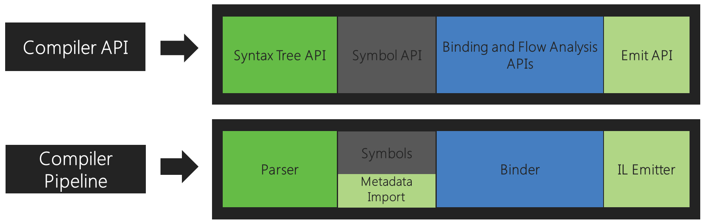
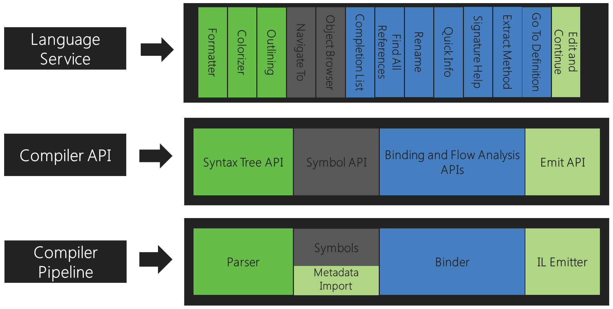

# Understand the .NET Compiler Platform SDK model

Compilers process the code you write following structured rules that often
differ from the way humans read and understand code. A basic understanding
of the model used by compilers is essential to understanding the APIs
you use when building Roslyn-based tools. 

## Compiler pipeline functional areas

The .NET Compiler Platform SDK exposes the C# and Visual Basic compilers' code analysis to you
as a consumer by providing an API layer that mirrors a traditional compiler
pipeline.

Each phase of this pipeline is a separate component. First, the
parse phase tokenizes and parses source text into syntax that follows
the language grammar. Second, the declaration phase analyzes source and
imported metadata to form named symbols. Next, the bind phase matches identifiers
in the code to symbols. Finally, the emit phase emits an assembly with
all the information built up by the compiler.

Corresponding to each of those phases, the .NET Compiler Platform SDK exposes an
object model that allows access to the information at that phase. The parsing
phase exposes a syntax tree, the declaration phase exposes a hierarchical
symbol table, the binding phase exposes the result of the compiler’s semantic
analysis, and the emit phase is an API that produces IL byte codes.

Each compiler combines these components together as a single end-to-end whole.

These APIs are the same ones used by Visual Studio. For instance, the code
outlining and formatting features use the syntax trees, the Object Browser
and navigation features use the symbol table, refactorings
and Go to Definition use the semantic model, and Edit and Continue uses all of
these, including the Emit API. 

## API layers

The .NET compiler SDK consists of two main layers of APIs: compiler
APIs and workspaces APIs.

### Compiler APIs

The compiler layer contains the object models that correspond to
information exposed at each phase of the compiler pipeline, both syntactic
and semantic. The compiler layer also contains an immutable snapshot of a
single invocation of a compiler, including assembly references, compiler
options, and source code files. There are two distinct APIs that represent
the C# language and the Visual Basic language. These two APIs are similar
in shape but tailored for high-fidelity to each individual language. This
layer has no dependencies on Visual Studio components.

### Diagnostic APIs

As part of its analysis the compiler may produce a set of diagnostics
covering everything from syntax, semantic, and definite assignment errors
to various warnings and informational diagnostics. The Compiler API layer
exposes diagnostics through an extensible API that allows user-defined
analyzers to be plugged into the compilation process. It allows user-defined
diagnostics, such as those produced by tools like StyleCop or FxCop, to be
produced alongside compiler-defined diagnostics. Producing diagnostics in this
way has the benefit of integrating naturally with tools such as MSBuild
and Visual Studio which depend on diagnostics for experiences such as
halting a build based on policy and showing live squiggles in the editor
and suggesting code fixes.

### Scripting APIs

Hosting and scripting APIs are part of the compiler layer. You can use them
for executing code snippets and accumulating a runtime execution context.
The C# interactive REPL (Read-Evaluate-Print Loop) uses these APIs. The REPL
enables you to use C# as a scripting language, executing the code interactively
as you write it.

### Workspaces APIs

The Workspaces layer contains the Workspace API, which is the starting
point for doing code analysis and refactoring over entire solutions. It
assists you in organizing all the information about the projects in a
solution into single object model, offering you direct access to the compiler
layer object models without needing to parse files, configure options, or
manage project-to-project dependencies.

In addition, the Workspaces layer surfaces a set of APIs used
when implementing code analysis and refactoring tools that function within
a host environment like the Visual Studio IDE. Examples include the Find All References,
Formatting, and Code Generation APIs.

This layer has no dependencies on Visual Studio components.
