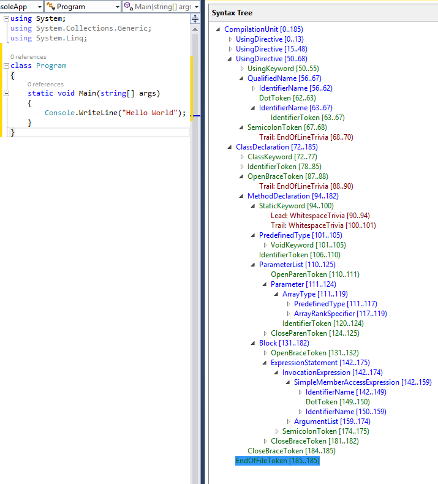

# Get started with syntax analysis

In this tutorial, you'll explore the **Syntax API**. The Syntax API provides access to the data structures that describe a C# or Visual Basic program. These data structures have enough detail that they can fully represent any program of any size. These structures can describe complete programs that compile and run correctly. They can also describe incomplete programs, as you write them, in the editor.

To enable this rich expression, the data structures and APIs that make up the Syntax API are necessarily complex. Let's start with what the data structure looks like for the typical "Hello World" program:

```csharp
using System;
using System.Collections.Generic;
using System.Linq;

namespace HelloWorld
{
    class Program
    {
        static void Main(string[] args)
        {
            Console.WriteLine("Hello World!");
        }
    }
}
```

Look at the text of the previous program. You recognize familiar elements. The entire text represents a single source file, or a **compilation unit**. The first three lines of that source file are **using directives**. The remaining source is contained in a **namespace declaration**. The namespace declaration contains a child **class declaration**. The class declaration contains one **method declaration**.

The Syntax API creates a tree structure with the root representing the compilation unit. Nodes in the tree represent the using directives, namespace declaration and all the other elements of the program. The tree structure continues down to the lowest levels: the string "Hello World!" is a **string literal token** that is a descendent of an **argument**. The Syntax API provides access to the structure of the program. You can query for specific code practices, walk the entire tree to understand the code, and create new trees by modifying the existing tree.

That brief description provides an overview of the kind of information accessible using the Syntax API. The Syntax API is nothing more than a formal API that describes the familiar code constructs you know from C#. The full capabilities include information about how the code is formatted including line breaks, white space, and indenting. Using this information, you can fully represent the code as written and read by human programmers or the compiler. Using this structure enables you to interact with the source code on a deeply meaningful level. It's no longer text strings, but data that represents the structure of a C# program.

To get started, you'll need to install the **.NET Compiler Platform SDK**:

[!INCLUDE[interactive-note](~/includes/roslyn-installation.md)]

## Understanding syntax trees

You use the Syntax API for any analysis of the structure of C# code. The **Syntax API** exposes the parsers, the syntax trees, and utilities for analyzing and constructing syntax trees. It's how you search code for specific syntax elements or read the code for a program.

A syntax tree is a data structure used by the C# and Visual Basic compilers to understand C# and Visual Basic programs. Syntax trees are produced by the same parser that runs when a project is built or a developer hits F5. The syntax trees have full-fidelity with the language; every bit of information in a code file is represented in the tree. Writing a syntax tree to text reproduces the exact original text that was parsed. The syntax trees are also **immutable**; once created a syntax tree can never be changed. Consumers of the trees can analyze the trees on multiple threads, without locks or other concurrency measures, knowing the data never changes. You can use APIs to create new trees that are the result of modifying an existing tree.

The four primary building blocks of syntax trees are:

* The <xref:Microsoft.CodeAnalysis.SyntaxTree?displayProperty=nameWithType> class, an instance of which represents an entire parse tree. <xref:Microsoft.CodeAnalysis.SyntaxTree> is an abstract class that has language-specific derivatives. You use the parse methods of the <xref:Microsoft.CodeAnalysis.CSharp.CSharpSyntaxTree?displayProperty=nameWithType> (or <xref:Microsoft.CodeAnalysis.VisualBasic.VisualBasicSyntaxTree?displayProperty=nameWithType>) class to parse text in C# or VB.
* The <xref:Microsoft.CodeAnalysis.SyntaxNode?displayProperty=nameWithType> class, instances of which represent syntactic constructs such as declarations, statements, clauses, and expressions.
* The <xref:Microsoft.CodeAnalysis.SyntaxToken?displayProperty=nameWithType> structure, which represents an individual keyword, identifier, operator, or punctuation.
* And lastly the <xref:Microsoft.CodeAnalysis.SyntaxTrivia?displayProperty=nameWithType> structure, which represents syntactically insignificant bits of information such as the white space between tokens, preprocessing directives, and comments.

Trivia, tokens, and nodes are composed hierarchically to form a tree that completely represents everything in a fragment of Visual Basic or C# code. You can see this structure using the **Syntax Visualizer** window. In Visual Studio, choose **View** > **Other Windows** > **Syntax Visualizer**. For example, the preceding C# source file examined using the **Syntax Visualizer** looks like the following figure:

**SyntaxNode**: Blue | **SyntaxToken**: Green | **SyntaxTrivia**: Red


By navigating this tree structure, you can find any statement, expression, token, or bit of white space in a code file.

While you can find anything in a code file using the Syntax APIs, most scenarios involve examining small snippets of code, or searching for particular statements or fragments. The two examples that follow show typical uses to browse the structure of code, or search for single statements.

## Traversing trees

You can examine the nodes in a syntax tree in two ways. You can traverse the tree to examine each node, or you can query for specific elements or nodes.

### Manual traversal

You can see the finished code for this sample in [our GitHub repository](https://github.com/dotnet/samples/tree/master/csharp/roslyn-sdk/SyntaxQuickStart).

> [!NOTE]
> The Syntax Tree types use inheritance to describe the different syntax elements that are valid at different locations in the program. Using these APIs often means casting properties or collection members to specific derived types. In the following examples, the assignment and the casts are separate statements, using explicitly typed variables. You can read the code to see the return types of the API and the runtime type of the objects returned. In practice, it's more common to use implicitly typed variables and rely on API names to describe the type of objects being examined.

Create a new C# **Stand-Alone Code Analysis Tool** project:

* In Visual Studio, choose **File** > **New** > **Project** to display the New Project dialog.
* Under **Visual C#** > **Extensibility**, choose **Stand-Alone Code Analysis Tool**.
* Name your project "**SyntaxTreeManualTraversal**" and click OK.

You're going to analyze the basic "Hello World!" program shown earlier.
Add the text for the Hello World program as a constant in your `Program` class:

[!code-csharp[Declare the program text](../../../../samples/csharp/roslyn-sdk/SyntaxQuickStart/HelloSyntaxTree/Program.cs#1 "Declare a constant string for the program text to analyze")]

Next, add the following code to build the **syntax tree** for the code text in the `programText` constant.  Add the following line to your `Main` method:

[!code-csharp[Create the tree](../../../../samples/csharp/roslyn-sdk/SyntaxQuickStart/HelloSyntaxTree/Program.cs#2 "Create the syntax tree")]

Those two lines create the tree and retrieve the root node of that tree. You can now examine the nodes in the tree. Add these lines to your `Main` method to display some of the properties of the root node in the tree:

[!code-csharp[Examine the root node](../../../../samples/csharp/roslyn-sdk/SyntaxQuickStart/HelloSyntaxTree/Program.cs#3 "Examine the root node")]

Run the application to see what your code has discovered about the root node in this tree.

Typically, you'd traverse the tree to learn about the code. In this example, you're analyzing code you know to explore the APIs. Add the following code to examine the first member of the `root` node:

[!code-csharp[Find the first member](../../../../samples/csharp/roslyn-sdk/SyntaxQuickStart/HelloSyntaxTree/Program.cs#4 "Find the first member")]

That member is a <xref:Microsoft.CodeAnalysis.CSharp.Syntax.NamespaceDeclarationSyntax?displayProperty=nameWithType>. It represents everything in the scope of the `namespace HelloWorld` declaration. Add the following code to examine what nodes are declared inside the `HelloWorld` namespace:

[!code-csharp[Find the class declaration](../../../../samples/csharp/roslyn-sdk/SyntaxQuickStart/HelloSyntaxTree/Program.cs#5 "Find the class declaration")]

Run the program to see what you've learned.

Now that you know the declaration is a <xref:Microsoft.CodeAnalysis.CSharp.Syntax.ClassDeclarationSyntax?displayProperty=nameWithType>, declare a new variable of that type to examine the class declaration. This class only contains one member: the `Main` method. Add the following code to find the `Main` method, and cast it to a <xref:Microsoft.CodeAnalysis.CSharp.Syntax.MethodDeclarationSyntax?displayProperty=nameWithType>.

[!code-csharp[Find the main declaration](../../../../samples/csharp/roslyn-sdk/SyntaxQuickStart/HelloSyntaxTree/Program.cs#6 "Find the main declaration")]

The method declaration node contains all the syntactic information about the method. Let's display the return type of the `Main` method, the number and types of the arguments, and the body text of the method. Add the following code:

[!code-csharp[Examine the syntax of the main method](../../../../samples/csharp/roslyn-sdk/SyntaxQuickStart/HelloSyntaxTree/Program.cs#7 "Display information about the main method")]

Run the program to see all the information you've discovered about this program:

```text
The tree is a CompilationUnit node.
The tree has 1 elements in it.
The tree has 4 using statements. They are:
        System
        System.Collections
        System.Linq
        System.Text
The first member is a NamespaceDeclaration.
There are 1 members declared in this namespace.
The first member is a ClassDeclaration.
There are 1 members declared in the Program class.
The first member is a MethodDeclaration.
The return type of the Main method is void.
The method has 1 parameters.
The type of the args parameter is string[].
The body text of the Main method follows:
        {
            Console.WriteLine("Hello, World!");
        }
```

### Query methods

In addition to traversing trees, you can also explore the syntax tree using the query methods defined on <xref:Microsoft.CodeAnalysis.SyntaxNode?displayProperty=nameWithType>. These methods should be immediately familiar to anyone familiar with XPath. You can use these methods with LINQ to quickly find things in a tree. The <xref:Microsoft.CodeAnalysis.SyntaxNode> has query methods such as <xref:Microsoft.CodeAnalysis.SyntaxNode.DescendantNodes%2A>, <xref:Microsoft.CodeAnalysis.SyntaxNode.AncestorsAndSelf%2A> and <xref:Microsoft.CodeAnalysis.SyntaxNode.ChildNodes%2A>.

You can use these query methods to find the argument to the `Main` method as an alternative to navigating the tree. Add the following code to the bottom of your `Main` method:

[!code-csharp[Query the tree for the arguments to Main](../../../../samples/csharp/roslyn-sdk/SyntaxQuickStart/HelloSyntaxTree/Program.cs#8 "Query the tree for the arguments to Main")]

The first statement uses a LINQ expression and the <xref:Microsoft.CodeAnalysis.SyntaxNode.DescendantNodes%2A> method to locate the same parameter as in the previous example.

Run the program, and you can see that the LINQ expression found the same parameter as manually navigating the tree.

The sample uses `WriteLine` statements to display information about the syntax trees as they are traversed. You can also learn much more by running the finished program under the debugger. You can examine more of the properties and methods that are part of the syntax tree created for the hello world program.

## Syntax walkers

Often you want to find all nodes of a specific type in a syntax tree, for example, every property declaration in a file. By extending the <xref:Microsoft.CodeAnalysis.CSharp.CSharpSyntaxWalker?displayProperty=nameWithType> class and overriding the <xref:Microsoft.CodeAnalysis.CSharp.CSharpSyntaxVisitor.VisitPropertyDeclaration(Microsoft.CodeAnalysis.CSharp.Syntax.PropertyDeclarationSyntax)> method, you process every property declaration in a syntax tree without knowing its structure beforehand. <xref:Microsoft.CodeAnalysis.CSharp.CSharpSyntaxWalker> is a specific kind of <xref:Microsoft.CodeAnalysis.CSharp.CSharpSyntaxVisitor> that recursively visits a node and each of its children.

This example implements a <xref:Microsoft.CodeAnalysis.CSharp.CSharpSyntaxWalker> that examines a syntax tree. It collects `using` directives it finds that aren't importing a `System` namespace.

Create a new C# **Stand-Alone Code Analysis Tool** project; name it "**SyntaxWalker**."

You can see the finished code for this sample in [our GitHub repository](https://github.com/dotnet/samples/tree/master/csharp/roslyn-sdk/SyntaxQuickStart). The sample on GitHub contains both projects described in this tutorial.

As in the previous sample, you can define a string constant to hold the text of the program you're going to analyze:

[!code-csharp[Define the code text to analyzer](../../../../samples/csharp/roslyn-sdk/SyntaxQuickStart/SyntaxWalker/Program.cs#1 "Define the program text to analyze")]

This source text contains `using` directives scattered across four different locations: the file-level, in the top-level namespace, and in the two nested namespaces. This example highlights a core scenario for using the <xref:Microsoft.CodeAnalysis.CSharp.CSharpSyntaxWalker> class to query code. It would be cumbersome to visit every node in the root syntax tree to find using declarations. Instead, you create a derived class and override the method that gets called only when the current node in the tree is a using directive. Your visitor does not do any work on any other node types. This single method examines each of the `using` statements and builds a collection of the namespaces that aren't in the `System` namespace. You build a <xref:Microsoft.CodeAnalysis.CSharp.CSharpSyntaxWalker> that examines all the `using` statements, but only the `using` statements.

Now that you've defined the program text, you need to create a `SyntaxTree` and get the root of that tree:

[!code-csharp[Create the Syntax tree and access the root](../../../../samples/csharp/roslyn-sdk/SyntaxQuickStart/SyntaxWalker/Program.cs#2 "Create the Syntax tree and access the root node.")]

Next, create a new class. In Visual Studio, choose **Project** > **Add New Item**. In the **Add New Item** dialog type *UsingCollector.cs* as the filename.

You implement the `using` visitor functionality in the `UsingCollector` class. Start by making the `UsingCollector` class derive from <xref:Microsoft.CodeAnalysis.CSharp.CSharpSyntaxWalker>.

[!code-csharp[Declare the base class for the using collector](../../../../samples/csharp/roslyn-sdk/SyntaxQuickStart/SyntaxWalker/UsingCollector.cs#3 "Declare the base class for the UsingCollector")]

You need storage to hold the namespace nodes that you're collecting.  Declare a public read-only property in the `UsingCollector` class; you use this variable to store the <xref:Microsoft.CodeAnalysis.CSharp.Syntax.UsingDirectiveSyntax> nodes you find:

[!code-csharp[Declare storage for the using syntax nodes](../../../../samples/csharp/roslyn-sdk/SyntaxQuickStart/SyntaxWalker/UsingCollector.cs#4 "Declare storage for the using syntax nodes")]

The base class, <xref:Microsoft.CodeAnalysis.CSharp.CSharpSyntaxWalker> implements the logic to visit each node in the syntax tree. The derived class overrides the methods called for the specific nodes you're interested in. In this case, you're interested in any `using` directive. That means you must override the <xref:Microsoft.CodeAnalysis.CSharp.CSharpSyntaxVisitor.VisitUsingDirective(Microsoft.CodeAnalysis.CSharp.Syntax.UsingDirectiveSyntax)> method. The one argument to this method is a <xref:Microsoft.CodeAnalysis.CSharp.Syntax.UsingDirectiveSyntax?displayProperty=nameWithType> object. That's an important advantage to using the visitors: they call the overridden methods with arguments already cast to the specific node type. The <xref:Microsoft.CodeAnalysis.CSharp.Syntax.UsingDirectiveSyntax?displayProperty=nameWithType> class has a <xref:Microsoft.CodeAnalysis.CSharp.Syntax.UsingDirectiveSyntax.Name> property that stores the name of the namespace being imported. It is a <xref:Microsoft.CodeAnalysis.CSharp.Syntax.NameSyntax?displayProperty=nameWithType>. Add the following code in the <xref:Microsoft.CodeAnalysis.CSharp.CSharpSyntaxVisitor.VisitUsingDirective(Microsoft.CodeAnalysis.CSharp.Syntax.UsingDirectiveSyntax)> override:

[!code-csharp[Examine using nodes for the System namespace](../../../../samples/csharp/roslyn-sdk/SyntaxQuickStart/SyntaxWalker/UsingCollector.cs#5 "Examine all using nodes for the System namespace.")]

As with the earlier example, you've added a variety of `WriteLine` statements to aid in understanding of this method. You can see when it's called, and what arguments are passed to it each time.

Finally, you need to add two lines of code to create the `UsingCollector` and have it visit the root node, collecting all the `using` statements. Then, add a `foreach` loop to display all the `using` statements your collector found:

[!code-csharp[Create the UsingCollector and visit the root node.](../../../../samples/csharp/roslyn-sdk/SyntaxQuickStart/SyntaxWalker/Program.cs#6 "Create the UsingCollector and visit the root node.")]

Compile and run the program. You should see the following output:

```console
        VisitUsingDirective called with System.
        VisitUsingDirective called with System.Collections.Generic.
        VisitUsingDirective called with System.Linq.
        VisitUsingDirective called with System.Text.
        VisitUsingDirective called with Microsoft.CodeAnalysis.
                Success. Adding Microsoft.CodeAnalysis.
        VisitUsingDirective called with Microsoft.CodeAnalysis.CSharp.
                Success. Adding Microsoft.CodeAnalysis.CSharp.
        VisitUsingDirective called with Microsoft.
                Success. Adding Microsoft.
        VisitUsingDirective called with System.ComponentModel.
        VisitUsingDirective called with Microsoft.Win32.
                Success. Adding Microsoft.Win32.
        VisitUsingDirective called with System.Runtime.InteropServices.
        VisitUsingDirective called with System.CodeDom.
        VisitUsingDirective called with Microsoft.CSharp.
                Success. Adding Microsoft.CSharp.
Microsoft.CodeAnalysis
Microsoft.CodeAnalysis.CSharp
Microsoft
Microsoft.Win32
Microsoft.CSharp
Press any key to continue . . .
```

Congratulations! You've used the **Syntax API** to locate specific kinds of C# statements and declarations in C# source code.
