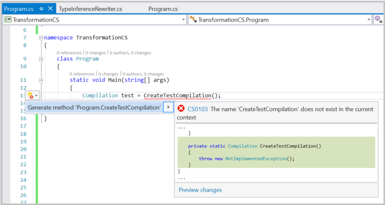

# Get started with syntax transformation

This tutorial builds on concepts and techniques explored in the [Get started with syntax analysis](syntax-analysis.md) and [Get started with semantic analysis](semantic-analysis.md) quickstarts. If you haven't already, you should complete those quickstarts before beginning this one.

In this quickstart, you explore techniques for creating and transforming syntax trees. In combination with the techniques you learned in previous quickstarts, you create your first command-line refactoring!

[!INCLUDE[interactive-note](~/includes/roslyn-installation.md)]

## Immutability and the .NET compiler platform

**Immutability** is a fundamental tenet of the .NET compiler platform. Immutable data structures can't be changed after they're created. Immutable data structures can be safely shared and analyzed by multiple consumers simultaneously. There's no danger that one consumer affects another in unpredictable ways. Your analyzer doesn't need locks or other concurrency measures. This rule applies to syntax trees, compilations, symbols, semantic models, and every other data structure you encounter. Instead of modifying existing structures, APIs create new objects based on specified differences to the old ones. You apply this concept to syntax trees to create new trees using transformations.

## Create and transform trees

You choose one of two strategies for syntax transformations. **Factory methods** are best used when you're searching for specific nodes to replace, or specific locations where you want to insert new code. **Rewriters** are best when you want to scan an entire project for code patterns that you want to replace.

### Create nodes with factory methods

The first syntax transformation demonstrates the factory methods. You're going to replace a `using System.Collections;` statement with a `using System.Collections.Generic;` statement. This example demonstrates how you create <xref:Microsoft.CodeAnalysis.CSharp.CSharpSyntaxNode?displayProperty=nameWithType> objects using the <xref:Microsoft.CodeAnalysis.CSharp.SyntaxFactory?displayProperty=nameWithType> factory methods. For each kind of **node**, **token**, or **trivia** there's a factory method that creates an instance of that type. You create syntax trees by composing nodes hierarchically in a bottom-up fashion. Then, you'll transform the existing program be replacing existing nodes with the new tree you've created.

Start Visual Studio, and create a new C# **Stand-Alone Code Analysis Tool** project. In Visual Studio, choose **File** > **New** > **Project** to display the New Project dialog. Under **Visual C#** > **Extensibility** choose a **Stand-Alone Code Analysis Tool**. This quickstart has two example projects, so name the solution **SyntaxTransformationQuickStart**, and name the project **ConstructionCS**. Click **OK**.

This project uses the <xref:Microsoft.CodeAnalysis.CSharp.SyntaxFactory?displayProperty=nameWithType> class methods to construct a <xref:Microsoft.CodeAnalysis.CSharp.Syntax.NameSyntax?displayProperty=nameWithType> representing the `System.Collections.Generic` namespace.

Add the following using directive to the top of the `Program.cs` file to import the factory methods of the <xref:Microsoft.CodeAnalysis.CSharp.SyntaxFactory> class and the methods of <xref:System.Console> so that you can use them later without qualifying them:

[!code-csharp[import the SyntaxFactory class](../../../../samples/csharp/roslyn-sdk/SyntaxTransformationQuickStart/ConstructionCS/Program.cs#StaticUsings "import the Syntax Factory class and the System.Console class")]

You'll create **name syntax nodes** to build the tree that represents the `using System.Collections.Generic;` statement. <xref:Microsoft.CodeAnalysis.CSharp.Syntax.NameSyntax> is the base class for four types of names that appear in C#. You compose these four types of names together to create any name that can appear in the C# language:

* <xref:Microsoft.CodeAnalysis.CSharp.Syntax.NameSyntax?displayProperty=nameWithType>, which represents simple single identifier names like `System` and `Microsoft`.
* <xref:Microsoft.CodeAnalysis.CSharp.Syntax.GenericNameSyntax?displayProperty=nameWithType>, which represents a generic type or method name such as `List<int>`.
* <xref:Microsoft.CodeAnalysis.CSharp.Syntax.QualifiedNameSyntax?displayProperty=nameWithType>, which represents a qualified name of the form `<left-name>.<right-identifier-or-generic-name>` such as `System.IO`.
* <xref:Microsoft.CodeAnalysis.CSharp.Syntax.AliasQualifiedNameSyntax?displayProperty=nameWithType>, which represents a name using an assembly extern alias such a `LibraryV2::Foo`.

You use the <xref:Microsoft.CodeAnalysis.CSharp.SyntaxFactory.IdentifierName(System.String)> method to create a <xref:Microsoft.CodeAnalysis.CSharp.Syntax.NameSyntax> node. Add the following code in your `Main` method in `Program.cs`:

[!code-csharp[create the system identifier](../../../../samples/csharp/roslyn-sdk/SyntaxTransformationQuickStart/ConstructionCS/Program.cs#CreateIdentifierName "Create and display the system name identifier")]

The preceding code creates an <xref:Microsoft.CodeAnalysis.CSharp.Syntax.IdentifierNameSyntax> object and assigns it to the variable `name`. Many of the Roslyn APIs return base classes to make it easier to work with related types. The variable `name`, an <xref:Microsoft.CodeAnalysis.CSharp.Syntax.NameSyntax>, can be reused as you build the <xref:Microsoft.CodeAnalysis.CSharp.Syntax.QualifiedNameSyntax>. Don't use type inference as you build the sample. You'll automate that step in this project.

You've created the name. Now, it's time to build more nodes into the tree by building a <xref:Microsoft.CodeAnalysis.CSharp.Syntax.QualifiedNameSyntax>. The new tree uses `name` as the left of the name, and a new <xref:Microsoft.CodeAnalysis.CSharp.Syntax.IdentifierNameSyntax> for the `Collections` namespace as the right side of the <xref:Microsoft.CodeAnalysis.CSharp.Syntax.QualifiedNameSyntax>. Add the following code to `program.cs`:

[!code-csharp[create the collections identifier](../../../../samples/csharp/roslyn-sdk/SyntaxTransformationQuickStart/ConstructionCS/Program.cs#CreateQualifiedIdentifierName "Build the System.Collections identifier")]

Run the code again, and see the results. You're building a tree of nodes that represents code. You'll continue this pattern to build the <xref:Microsoft.CodeAnalysis.CSharp.Syntax.QualifiedNameSyntax> for the namespace `System.Collections.Generic`. Add the following code to `Program.cs`:

[!code-csharp[create the full identifier](../../../../samples/csharp/roslyn-sdk/SyntaxTransformationQuickStart/ConstructionCS/Program.cs#CreateFullNamespace "Build the System.Collections.Generic identifier")]

Run the program again to see that you've build the tree for the code to add.

### Create a modified tree

You've built a small syntax tree that contains one statement. The APIs to create new nodes are the right choice to create single statements or other small code blocks. However, to build larger blocks of code, you should use methods that replace nodes or insert nodes into an existing tree. Remember that syntax trees are immutable. The **Syntax API** doesn't provide any mechanism for modifying an existing syntax tree after construction. Instead, it provides methods that produce new trees based on changes to existing ones. `With*` methods are defined in concrete classes that derive from <xref:Microsoft.CodeAnalysis.SyntaxNode> or in extension methods declared in the <xref:Microsoft.CodeAnalysis.SyntaxNodeExtensions> class. These methods create a new node by applying changes to an existing node's child properties. Additionally, the <xref:Microsoft.CodeAnalysis.SyntaxNodeExtensions.ReplaceNode%2A> extension method can be used to replace a descendent node in a subtree. This method also updates the parent to point to the newly created child and repeats this process up the entire tree - a process known as _re-spining_ the tree.

The next step is to create a tree that represents an entire (small) program and then modify it. Add the following code to the beginning of the `Program` class:

[!code-csharp[create a parse tree](../../../../samples/csharp/roslyn-sdk/SyntaxTransformationQuickStart/ConstructionCS/Program.cs#DeclareSampleCode "Create a tree that represents a small program")]

> [!NOTE]
> The example code uses the `System.Collections` namespace and not the `System.Collections.Generic` namespace.

Next, add the following code to the bottom of the `Main` method to parse the text and create a tree:

[!code-csharp[create a parse tree](../../../../samples/csharp/roslyn-sdk/SyntaxTransformationQuickStart/ConstructionCS/Program.cs#CreateParseTree "Create a tree that represents a small program")]

This example uses the <xref:Microsoft.CodeAnalysis.CSharp.Syntax.UsingDirectiveSyntax.WithName(Microsoft.CodeAnalysis.CSharp.Syntax.NameSyntax)?displayProperty=NameWithType> method to replace the name in a <xref:Microsoft.CodeAnalysis.CSharp.Syntax.UsingDirectiveSyntax> node with the one constructed in the preceding code.

Create a new <xref:Microsoft.CodeAnalysis.CSharp.Syntax.UsingDirectiveSyntax> node using the <xref:Microsoft.CodeAnalysis.CSharp.Syntax.UsingDirectiveSyntax.WithName(Microsoft.CodeAnalysis.CSharp.Syntax.NameSyntax)> method to update the `System.Collections` name with the name you created in the preceding code. Add the following code to the bottom of the `Main` method:

[!code-csharp[create a new subtree](../../../../samples/csharp/roslyn-sdk/SyntaxTransformationQuickStart/ConstructionCS/Program.cs#BuildNewUsing "Create the subtree with the replaced namespace")]

Run the program and look carefully at the output. The `newusing` hasn't been placed in the root tree. The original tree hasn't been changed.

Add the following code using the <xref:Microsoft.CodeAnalysis.SyntaxNodeExtensions.ReplaceNode%2A> extension method to create a new tree. The new tree is the result of replacing the existing import with the updated `newUsing` node. You assign this new tree to the existing `root` variable:

[!code-csharp[create a new root tree](../../../../samples/csharp/roslyn-sdk/SyntaxTransformationQuickStart/ConstructionCS/Program.cs#TransformTree "Create the transformed root tree with the replaced namespace")]

Run the program again. This time the tree now correctly imports the `System.Collections.Generic` namespace.

### Transform trees using `SyntaxRewriters`

The `With*` and <xref:Microsoft.CodeAnalysis.SyntaxNodeExtensions.ReplaceNode%2A> methods provide convenient means to transform individual branches of a syntax tree. The <xref:Microsoft.CodeAnalysis.CSharp.CSharpSyntaxRewriter?displayProperty=nameWithType> class performs multiple transformations on a syntax tree. The <xref:Microsoft.CodeAnalysis.CSharp.CSharpSyntaxRewriter?displayProperty=nameWithType> class is a subclass of <xref:Microsoft.CodeAnalysis.CSharp.CSharpSyntaxVisitor%601?displayProperty=nameWithType>. The <xref:Microsoft.CodeAnalysis.CSharp.CSharpSyntaxRewriter> applies a transformation to a specific type of <xref:Microsoft.CodeAnalysis.SyntaxNode>. You can apply transformations to multiple types of <xref:Microsoft.CodeAnalysis.SyntaxNode> objects wherever they appear in a syntax tree. The second project in this quickstart creates a command-line refactoring that removes explicit types in local variable declarations anywhere that type inference could be used.

Create a new C# **Stand-Alone Code Analysis Tool** project. In Visual Studio, right-click the `SyntaxTransformationQuickStart` solution node. Choose **Add** > **New Project** to display the **New Project dialog**. Under **Visual C#** > **Extensibility**, choose **Stand-Alone Code Analysis Tool**. Name your project `TransformationCS` and click OK.

The first step is to create a class that derives from <xref:Microsoft.CodeAnalysis.CSharp.CSharpSyntaxRewriter> to perform your transformations. Add a new class file to the project. In Visual Studio, choose **Project** > **Add Class...**. In the **Add New Item** dialog type `TypeInferenceRewriter.cs` as the filename.

Add the following using directives to the `TypeInferenceRewriter.cs` file:

[!code-csharp[add necessary usings](../../../../samples/csharp/roslyn-sdk/SyntaxTransformationQuickStart/TransformationCS/TypeInferenceRewriter.cs#AddUsings "Add required usings")]

Next, make the `TypeInferenceRewriter` class extend the <xref:Microsoft.CodeAnalysis.CSharp.CSharpSyntaxRewriter> class:

[!code-csharp[add base class](../../../../samples/csharp/roslyn-sdk/SyntaxTransformationQuickStart/TransformationCS/TypeInferenceRewriter.cs#BaseClass "Add base class")]

Add the following code to declare a private read-only field to hold a <xref:Microsoft.CodeAnalysis.SemanticModel> and initialize it in the constructor. You will need this field later on to determine where type inference can be used:

[!code-csharp[initialize members](../../../../samples/csharp/roslyn-sdk/SyntaxTransformationQuickStart/TransformationCS/TypeInferenceRewriter.cs#Construction "Declare and initialize member variables")]

Override the <xref:Microsoft.CodeAnalysis.CSharp.CSharpSyntaxRewriter.VisitLocalDeclarationStatement(Microsoft.CodeAnalysis.CSharp.Syntax.LocalDeclarationStatementSyntax)> method:

```C#
public override SyntaxNode VisitLocalDeclarationStatement(LocalDeclarationStatementSyntax node)
{

}
```

> [!NOTE]
> Many of the Roslyn APIs declare return types that are base classes of the actual runtime types returned. In many scenarios, one kind of node may be replaced by another kind of node entirely - or even removed. In this example, the <xref:Microsoft.CodeAnalysis.CSharp.CSharpSyntaxRewriter.VisitLocalDeclarationStatement(Microsoft.CodeAnalysis.CSharp.Syntax.LocalDeclarationStatementSyntax)> method returns a <xref:Microsoft.CodeAnalysis.SyntaxNode>, instead of the derived type of   <xref:Microsoft.CodeAnalysis.CSharp.Syntax.LocalDeclarationStatementSyntax>. This rewriter returns a new <xref:Microsoft.CodeAnalysis.CSharp.Syntax.LocalDeclarationStatementSyntax> node based on the existing one.

This quickstart handles local variable declarations. You could extend it to other declarations such as `foreach` loops, `for` loops, LINQ expressions, and lambda expressions. Furthermore this rewriter will only transform declarations of the simplest form:

```csharp
Type variable = expression;
```

If you want to explore on your own, consider extending the finished sample for these types of variable declarations:

```csharp
// Multiple variables in a single declaration.
Type variable1 = expression1,
     variable2 = expression2;
// No initializer.
Type variable;
```

Add the following code to the body of the `VisitLocalDeclarationStatement` method to skip rewriting these forms of declarations:

[!code-csharp[exclude other declarations](../../../../samples/csharp/roslyn-sdk/SyntaxTransformationQuickStart/TransformationCS/TypeInferenceRewriter.cs#Exclusions "Exclude variables declarations not processed by this sample")]

The method indicates that no rewriting takes place by returning the `node` parameter unmodified. If neither of those `if` expressions are true, the node represents a possible declaration with initialization. Add these statements to extract the type name specified in the declaration and bind it using the <xref:Microsoft.CodeAnalysis.SemanticModel> field to obtain a type symbol:

[!code-csharp[extract type name](../../../../samples/csharp/roslyn-sdk/SyntaxTransformationQuickStart/TransformationCS/TypeInferenceRewriter.cs#ExtractTypeSymbol "Extract the type name specified by the declaration")]

Now, add this statement to bind the initializer expression:

[!code-csharp[bind initializer](../../../../samples/csharp/roslyn-sdk/SyntaxTransformationQuickStart/TransformationCS/TypeInferenceRewriter.cs#BindInitializer "Bind the initializer expressions")]

Finally, add the following `if` statement to replace the existing type name with the `var` keyword if the type of the initializer expression matches the type specified:

[!code-csharp[ReplaceNode](../../../../samples/csharp/roslyn-sdk/SyntaxTransformationQuickStart/TransformationCS/TypeInferenceRewriter.cs#BindInitializer "Replace the initializer node")]

The conditional is required because the declaration may cast the initializer expression to a base class or interface. If that's desired, the types on the left and right-hand side of the assignment don't match. Removing the explicit type in these cases would change the semantics of a program. `var` is specified as an identifier rather than a keyword because `var` is a contextual keyword. The leading and trailing trivia (white space) are transferred from the old type name to the `var` keyword to maintain vertical white space and indentation. It's simpler to use `ReplaceNode` rather than `With*` to transform the <xref:Microsoft.CodeAnalysis.CSharp.Syntax.LocalDeclarationStatementSyntax> because the type name is actually the grandchild of the declaration statement.

You've finished the `TypeInferenceRewriter`. Now return to your `Program.cs` file to finish the example. Create a test <xref:Microsoft.CodeAnalysis.Compilation> and obtain the <xref:Microsoft.CodeAnalysis.SemanticModel> from it. Use that <xref:Microsoft.CodeAnalysis.SemanticModel> to try your `TypeInferenceRewriter`. You'll do this step last. In the meantime declare a placeholder variable representing your test compilation:

[!code-csharp[DeclareCompilation](../../../../samples/csharp/roslyn-sdk/SyntaxTransformationQuickStart/TransformationCS/Program.cs#DeclareTestCompilation "Declare the test compilation")]

After pausing a moment, you should see an error squiggle appear reporting that no `CreateTestCompilation` method exists. Press **Ctrl+Period** to open the light-bulb and then press Enter to invoke the **Generate Method Stub** command. This command will generate a method stub for the `CreateTestCompilation` method in the `Program` class. You'll come back to fill in this method later:



Write the following code to iterate over each <xref:Microsoft.CodeAnalysis.SyntaxTree> in the test <xref:Microsoft.CodeAnalysis.Compilation>. For each one, initialize a new `TypeInferenceRewriter` with the <xref:Microsoft.CodeAnalysis.SemanticModel> for that tree:

[!code-csharp[IterateTrees](../../../../samples/csharp/roslyn-sdk/SyntaxTransformationQuickStart/TransformationCS/Program.cs#IterateTrees "Iterate all the source trees in the test compilation")]

Inside the `foreach` statement you created, add the following code to perform the transformation on each source tree. This code conditionally writes out the new transformed tree if any edits were made. Your rewriter should only modify a tree if it encounters one or more local variable declarations that could be simplified using type inference:

[!code-csharp[TransformTrees](../../../../samples/csharp/roslyn-sdk/SyntaxTransformationQuickStart/TransformationCS/Program.cs#TransformTrees "Transform and save any trees that are modified by the rewriter")]

You should see squiggles under the `File.WriteAllText` code. Select the light bulb, and add the necessary `using System.IO;` statement.

You're almost done! There's once step left: creating a test <xref:Microsoft.CodeAnalysis.Compilation>. Since you haven't been using type inference at all during this quickstart, it would have made a perfect test case. Unfortunately, creating a Compilation from a C# project file is beyond the scope of this walkthrough. But fortunately, if you've been following instructions carefully, there's hope. Replace the contents of the `CreateTestCompilation` method with the following code. It creates a test compilation that coincidentally matches the project described in this quickstart:

[!code-csharp[CreateTestCompilation](../../../../samples/csharp/roslyn-sdk/SyntaxTransformationQuickStart/TransformationCS/Program.cs#CreateTestCompilation "Create a test compilation using the code written for this quickstart.")]

Cross your fingers and run the project. In Visual Studio, choose **Debug** > **Start Debugging**. You should be prompted by Visual Studio that the files in your project have changed. Click "**Yes to All**" to reload the modified files. Examine them to observe your awesomeness. Note how much cleaner the code looks without all those explicit and redundant type specifiers.

Congratulations! You've used the **Compiler APIs** to write your own refactoring that searches all files in a C# project for certain syntactic patterns, analyzes the semantics of source code that matches those patterns, and transforms it. You're now officially refactoring author!
