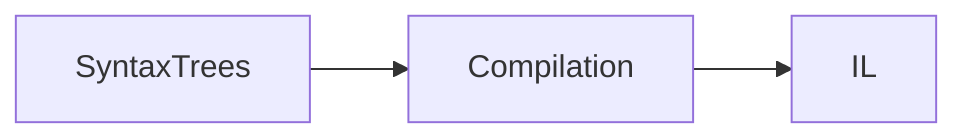
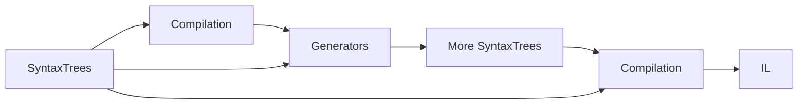
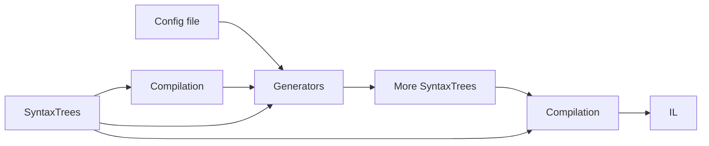
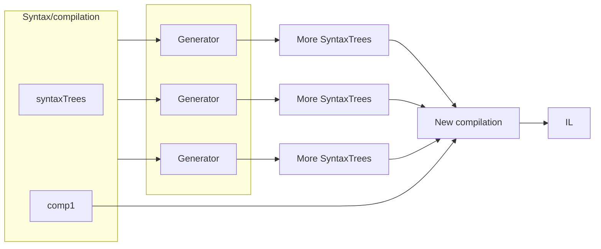
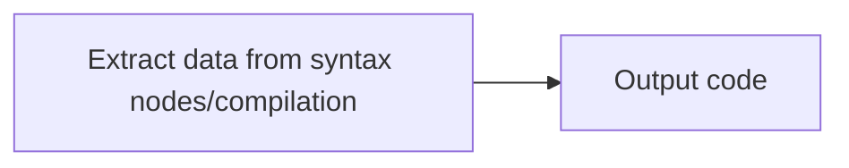
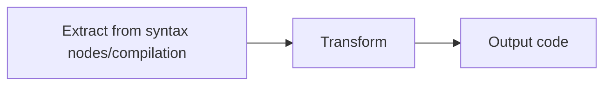
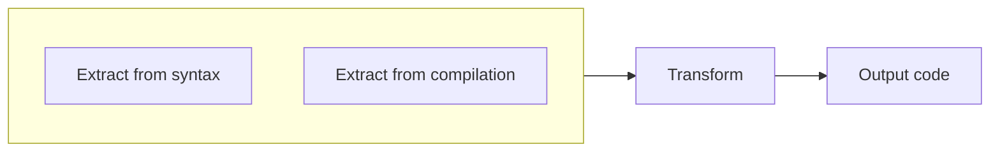

# Roslyn Incremental Source Generators Overview

Source generators are run by the compiler to add C# or VB code to the compilation. Roslyn *incremental source generators* are defined as a series of steps called by the compiler which allows the compiler to shortcut if the results of any step in its cache is unchanged. Incremental generators are also granular and manage the cache independently for each item in a collection. The compiler can also cancel after each step. These features allow incremental generators to minimize the work performed and provide a pattern that is maintainable and testable.

Source generators run during both design time builds and [[full]] builds. This allows them to extend user code with new code that adds classes, methods and properties that immediately affect the users experience via features like IntelliSense. It also means that generators run very often, possibly on every keystroke.

Most programmers will not need to write source generators, but will take advantage of those written by others. If you do write a generator, follow the [Performance Guidelines]() and be [tested for performance]() because your generator can adversely affect the design time performance of editors such as Visual Studio. Source generators are new and we are evolving guidance on banned APIs, so feel free to reach out at [[@Jaredpa and @chsienki where?]] if you want to check the impact of a technique.

> [!CAUTION]
> We will disable generators during the design time build if they are slow or we analysis indicates that they do not follow guidelines.

This article assumes that you understand the basics of the [Roslyn compiler](), [syntax trees](), [compilations](), [compilation](), [cancellation tokens]() and the [difference between value and reference equality](). It will also help to have an understanding of functional techniques using delegates such as lambda expressions.

## How Roslyn generators work

When the Roslyn compiler runs without generation, it reads user code and builds a set of syntax trees, generally one syntax tree per file. Based on this, the compiler builds a compilation and emits [IL]() based on the compilation:

When generators are present, the Roslyn compiler inserts an extra step between creating the compilation and emitting the IL which runs the generators and adds any syntax trees they create. It then rebuilds the compilation before emitting the IL:

Syntax trees are a full representation of the code the user wrote. The compilation includes several things that may be interersting to your generator, including the semantic model.

In some cases additional information is needed, perhaps from a configuration file:

In some cases, such as creating a strongly typed wrapper for a comma delimited file (`.csv`), the initial compilation might not be used by the generator, but it is always available to it.

Each generator uses the same set of syntax trees and compilation, so generators are independent and do not know what was produced by other generators.

Both V1 Roslyn source generators and Roslyn incremental source generators follow these pattern.

### V1 Roslyn source generators

There are two kinds of Roslyn generators: V1 generators and incremental generators. The design of V1 generators does not allow important optimizations, particular in retrieving input data from SyntaxTrees or external data sources, caching and cancellation. Due to shortcomings in V1 generators, Roslyn incremental generators were created as a second generation of Roslyn source generators was created with these goals:

* Allow for a finer grained approach to defining a generator.
* Scale source generators to support 'Roslyn/CoreCLR' scale projects in Visual Studio.
* Exploit caching between fine grained steps to reduce duplicate work.
* Support generating more items that just source texts (not yet included).
* Exist alongside ISourceGenerator based implementations.

All new generators should be incremental source generators.

> [!CAUTION]
> Because generators run in the editor, we plan to allow disabling slow generators and we may add rules that ensure best practices. In the future, V1 generators may fail these metrics or be deprecated and run only on full builds.

[Transitioning V1 generators](transitioning-v1-generators.md) contains tips for transitioning.

### Incremental generators

Incremental generators are built with a series of steps that collect data, transform the data if necessary and output code. These steps are defined via delegates (such as lambda expressions) to create a pipeline.

This design allows the results of each step to be cached by the generation infrastructure. When generation is rerun, the previous results of each step can be compared and further generation steps skipped. If there are no changes, the compiler can simply reuse the cached output of the each step.

This design also allows cancellation at each step. During editing, your generator may be canceled more often than it runs to completion, because each keystroke invalidates the previous compilation.

In addition to these benefits to how your generator runs, this design isolates evaluation of input from the creation of code. Once you understand this approach, this isolation makes your generator easier to design and testable for non-trivial generators.

The incremental generators design is based on a pipeline. As a simple example, you might extract the syntax nodes that have a specific attribute applied and evaluate those nodes to extract some data. Then, you might use that data to create source code:

In the pipeline, the extraction step is a delegate and the step to output code is a separate delegate:

The most common case is to extract data, transform it, and then output code, each as a separate delegate passed to one of the pipeline methods:

The majority of time that your generator runs, the code it depends on will be unchanged because the user is editing some other part of their solution. In fact, much of the time the user will be editing code that does not affect any generator and the previous compilation itself can be used!

Even if the syntax nodes you are extracting are not changed, the compilation will have changed if your generator runs. That's because something else in the model may have changed and may affect your generation. So these steps are performed together:

Stepwise generation allows for complex generators when they are needed. For example, you may need to gather data from orthogonal syntax nodes, external files or other sources. Your transformation may involve multiple steps combining and summarizing individual sources. And you may output multiple files. Treating each of these as an independent step allows you to understand each step and test and debug it independently. It may take a bit to shift into the functional mindset of delegates in a pipeline, but the payoff of an logical, efficient, and testable generator makes it worth the effort.

## Limitations of generators

Source generators are designed to protect user code and user's expectation about their code, as well as minimizing the impact on performance. As a result, both the V1 Roslyn source generators and Roslyn incremental source generators have limitations.

### Generators cannot change user code

Programmers expect that the code they write will run. Roslyn source generators support this assumption by never changing user code. You can add new syntax trees to the compilation, but you cannot change the existing syntax trees.

### Generated code cannot be altered by the user

Once code is generated, the user cannot change it. This is enforced by Visual Studio, but more importantly the next compilation would ignore and overwrite any user changes.

To create code the user can edit and build on, use [.NET templating]().

### Generators cannot be ordered or dependent

Each generator is independent and does not rely on any other generator. Any mechanism for ordering or dependency will eventually result in a conflict with no realistic route to resolution by the user of conflicting generators.

Also, generators depending on other generators would require the compilation to be recreated many more times, and we do not believe we could do this and preserve design time performance.

We are aware that some small loosening of this restriction would be useful, and are working on designs in this space.

### Generators only create C# and Visual Basic code

While generators can read files for additional input, such as configuration information, they can only add to a compilation, and cannot output files directly. We would like feedback about your scenario if you need to output files that are not VB or C# code.
