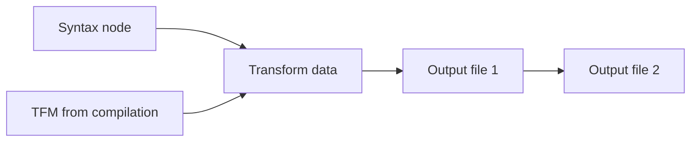
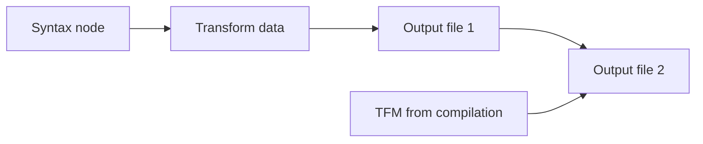

@chsienki Do immutable arrays use ref equality, or do they use the ImmutableArrayValueComparer in SyntaxValueProvider by default

# Performance Guidelines

Your generator is run your user's design time compiler and you partner with us to maintain good design time performance for editors like Visual Studio users. The most important things to maintain performance are:

* Do not do slow or unusual things.
* Use cancellation tokens.
* Use APIs where available.
* Access the compilation early and rarely.
* Ensure value equality, including collections.
* Build a model early and do further work on this model.
* Do not attempt to cache yourself or to save partially generated work.


You should understand [Roslyn incremental generator design](generator-design.md) and how the incremental generator pipeline works before reading this section.

## Do not do slow things

Do not do tricky stuff. Don't emit code, don't write files, etc. If there is something you need to do, chat with us. We reserve the right to mark or remove badly behaving generators from design time compilation and to ban certain APIs. If you aren't sure, [ask us about impact on incremental generator performance](@Jaredpa and @chsienki where?).

## Use cancellation tokens

Generators will run often, as often as on every keystroke. The are kicked off asynchronously and another generation is often started before the first complete. During parts of the inner loop, your generator will be cancelled much more often than it runs to completion. It is essential to use cancellation tokens to avoid wasting system resources in three cases:

* You are calling any operation that takes a cancellation token.
* You are executing an unbounded loop, even if your believe the iteration count will never be large.
* Before any operation that may be slow.

The delegates passed to `IncrementalValueProvider` and `IncrementalValuesProvider` extension methods accept a cancellation token that you pass on to the operations that accept it, or your own methods.

The SourceProductionContext manages the cancellation token for you when you are outputting code.

## Use APIs where available

We will add APIs for operations that are difficult to do correctly, and those difficult to do without hurting performance. As these APIs become available, it is important to use them for new generators and convert old generators to use them. An example of an upcoming API (17.3) is an API to get the syntax nodes a specified attribute is placed on.

One set of available APIs is the `IOperation` APIs. These APIs are easier to use than directly accessing the semantic model, they are fast, and they allow VB/C# language neutral source code access for the semantic elements they support.

### `ForAttributeWithMetadataName<T>`

Starting in the .NET SDK 6.0.400 and Visual Studio 17.3, Roslyn provides a new API `ForAttributeWithMetadataName<T>`. The signature is;

```csharp
public IncrementalValuesProvider<T> ForAttributeWithMetadataName<T>(
        string fullyQualifiedMetadataName,
        Func<SyntaxNode, CancellationToken, bool> predicate,
        Func<GeneratorAttributeSyntaxContext, CancellationToken, T> transform)
```

Provide feedback if you need simple name.

[[ can't really use until 17.4 ]]

## Access the compilation early and rarely

The compilation will change on every invocation of your generator and it cannot be cached. Because of this all operations before you use the compilation will always run. Consider these two generation designs where `file2` depends on the TFM, but the transform and `file1` does not:

[[Reviewers, please check this point.]]




In the first case, if the result of the transform that uses the syntax node and the TFM is unchanged, no further work is done. In the second case, `file2` is output unnecessarily.

This guideline also refers to the semantic model and elements of the semantic model.

## Ensure value equality

Incremental generators compare the results of each step with previous results and uses the cached value and uses the cached value if unchanged. If you use reference equality the cache will always fail. Use records or define your own equality and `GetHashCode()` method.

If your model includes a collection, you will have to do additional work to supply value equality since Lists and arrays have reference equality by default. You must explicitly request `SequenceEqual` by replacing the `Equals` and `GetHashCode()` methods.

## Build a model early in the pipeline

Value equality works best with simple data, and carrying syntax nodes, semantic model elements, file handles, or other input artifacts through the generation process can be problematic for performance and makes it more difficult to [test incremental generators](testing-generators.md). Making it easy to extract data from these inputs early and use any cached results is one of the most significant benefits of incremental generators.

Your model does not need to be complicated, and may be as simple as a single value. 

Your model may be complicated and require [transforming data from multiple sources](complex-transformations.md). Ensure each step captures the data you need and accesses the syntax nodes early in the compilation and do not access compilation more than necessary.

Using a model not only makes it easier for your generator to perform well, you can also create models in unit tests for later parts of your generator like creating code.

[[ Review: Are any or all of these important. Sections not yet written.]]
* Use resources carefully and close as early as possible [[Should we say to only use external files with APIs. What are the key issues here.]].
* Avoid closures. [[Thinking of ensuring the context is only accessed via the lambda parameter by using the same name.]]
* Do not throw exceptions. [[This seems to also be a usability issue.]]
* Does RegisterSourceOutput cache the source. Would it be helpful to create in transformations? Would a code model be helpful there?
* Should I switch everything in my generator to structs or with value equality are classes fine?

Also, please review the sample for perf issues. Currently at https://github.com/KathleenDollard/incremental-samples