# Explore code with the syntax visualizer

This article provides an overview of the Syntax Visualizer tool that ships as part of the .NET Compiler Platform ("Roslyn") SDK. The Syntax Visualizer is a tool window that helps you inspect and explore syntax trees. It is an essential tool to understand the models for code you want to analyze. It is also a debugging aid when you develop your own applications using the .NET Compiler Platform (“Roslyn”) SDK. You should keep this tool open as you create your first analyzers. It will help you understand the models used by the APIs.

[!INCLUDE[interactive-note](~/includes/roslyn-installation.md)]

You should familiarize yourself with the concepts used in the .NET Compiler Platform SDK by reading the [overview](compiler-api-model.md) article. It provides an introduction to syntax trees, nodes, tokens, and trivia.

## Syntax Visualizer

The **Syntax Visualizer** enables inspection of the syntax tree for the C# or VB code file in the current active editor window inside the Visual Studio IDE. The visualizer can be launched by clicking on **View** –> **Other Windows** –> **Syntax Visualizer**.  You can also use the **Quick Launch** toolbar in the upper right corner. Type "syntax" and the command to open the **Syntax Visualizer** should appear.

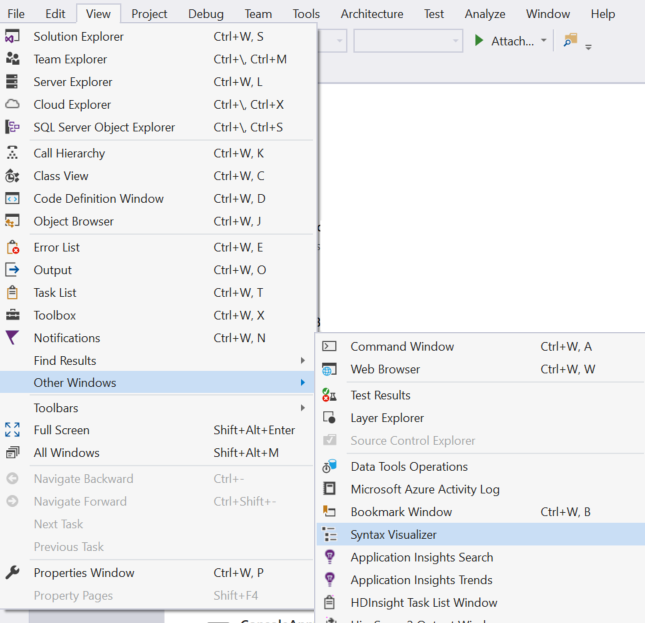

This command opens the Syntax Visualizer as a floating tool window, shown in the following figure. Dock this tool window at a convenient location inside Visual Studio, such as the left side.

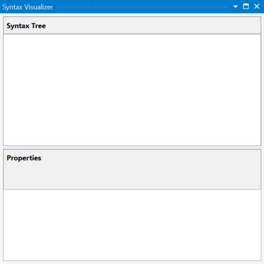

Now, let’s create a new project using the **File** –> **New Project** commnd. You can create either a VB or C# project. As soon as Visual Studio opens the main code file for this project, you see the syntax tree for this file in the visualizer tool window as shown in the following images. You can open any existing C# / VB file in this Visual Studio instance, and the syntax tree for the opened file will be displayed in the visualizer tool window. If you have multiple code files open inside Visual Studio, the visualizer will always display the syntax tree for the currently active code file (i.e., the code file that has keyboard focus).

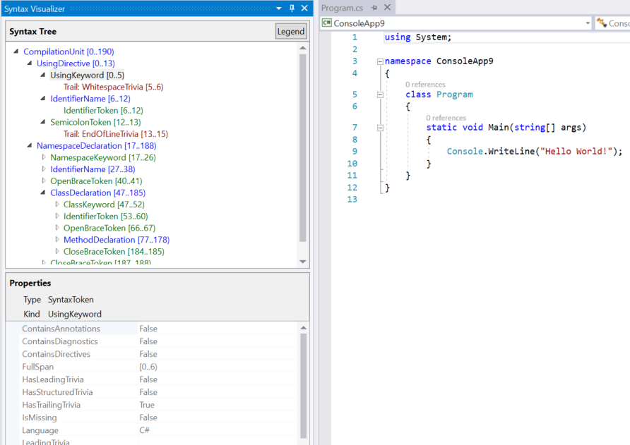

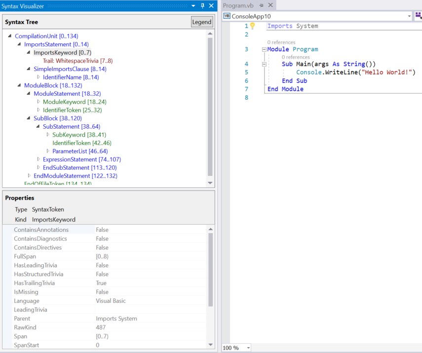

As shown in the preceding images, the visualizer tool window displays the syntax tree at the top and a property grid at the bottom. The property grid displays the properties of the item that is currently selected in the tree, including the .NET *Type* and the *Kind* (SyntaxKind) of the item.

Syntax trees comprise three types of items – *nodes*, *tokens*, and *trivia*. You can read more about these types in the [.NET Compiler Platform SDK Overview document](compiler-api-model.md). Items of each type are represented using a different color. Click on the button titled ‘Legend’ for an overview of the colors used.

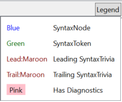

Each item in the tree also displays its own **span**. The **span** is the indices of that node in the text file.  In the preceding C# example the selected “UsingKeyword [0..5)” token has a **Span** that is 5 characters wide, [0..5). The "[..)" notation means that the starting index is part of the span, but the ending index is not.

There are two ways two navigate the tree:
* Expand or click on items in the tree. The visualizer automatically selects the text corresponding to this item’s Span in the code editor.
* Clicking or Select text in the code editor. In the preceding VB example, if you select the line containing "Module Module1" in the code editor, the visualizer automatically navigates to the corresponding ModuleStatement node in the tree. 

The visualizer highlights the item in the tree whose span best matches the span of the text selected in the editor.

The visualizer refreshes the tree to match modifications in the active code file. Add a call to `Console.WriteLine()` inside `Main()`. As you type, the visualizer refreshes the tree.

Pause typing once you have typed `Console.`. The tree has some items colored in pink. At this point, there are errors (also referred to as ‘Diagnostics’) in the typed code. These errors are attached to nodes, tokens and trivia in the syntax tree. The visualizer shows you which items have errors attached to them highlighting the background in pink. You can inspect the errors on any item colored pink by hovering over the item. The visualizer will only display syntactic errors (i.e. errors related to the syntax of the typed code) – it will not display any semantic errors.
 
## Syntax Graphs

Right click on any item in the tree and click on **View Directed Syntax Grap**. The visualizer displays a graphical representation of the sub-tree rooted at the selected item. Try this for the **MethodDeclaration** node corresponding to the `Main()` method in the C# example. This displays a syntax graph that looks as follows:

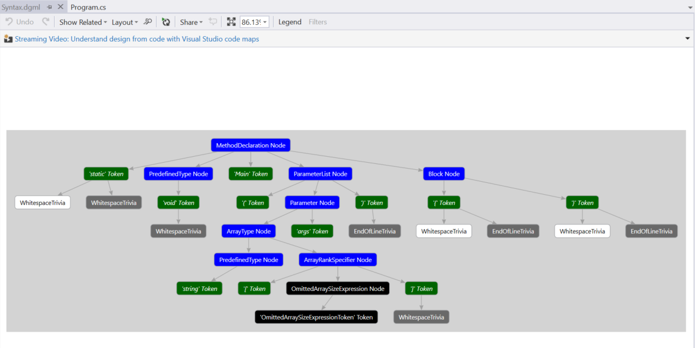

Try the same for the **SubBlock** node corresponding to the `Main()` method in the preceding VB example. This displays a syntax graph that looks as follows:

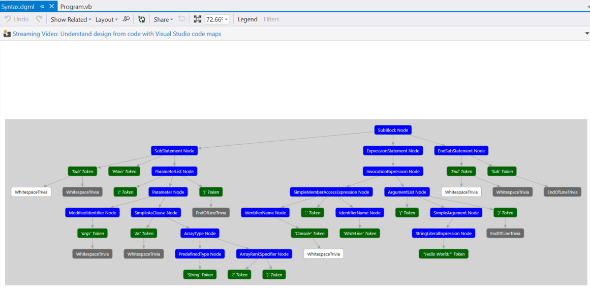

The syntax graph viewer has an option to display a legend its coloring scheme. You can also hover over individual items in the syntax graph with the mouse to view the properties corresponding to that item.

You can view syntax graphs for different items in the tree repeatedly and the graphs will always be displayed in the same window inside Visual Studio. You can dock this window at a convenient location inside Visual Studio so that you don’t have to switch between tabs to view a new syntax graph. The bottom, below code editor windows, is often convenient.

Here is the docking layout to use with the visualizer tool window and the syntax graph window:

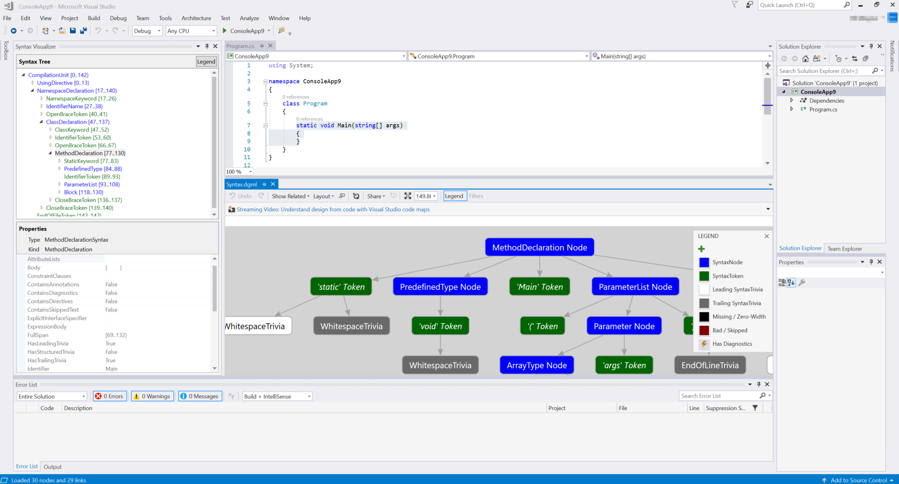

Another option is to put the syntax graph window on a second monitor, in a dual monitor setup.

# Inspecting semantics

The Syntax Visualizer enables rudimentary inspection of symbols and semantic information. Type `double x = 1 + 1;` inside Main() in the C# example. Then, select the expression `1 + 1` in the code editor window. This highlights the **AddExpression** node in the visualizer. Right click on this **AddExpression** and click on **View Symbol (if any)**. Notice that most of the menu items have the "if any" qualifier. The Syntax Visualizer inspects properties of a Node, including those that may not be present for all nodes. 

The property grid in the visualizer should now be updated as shown in the following figure. You can see that the symbol for the expression is a **SynthesizedIntrinsicOperatorSymbol** with **Kind = Method**.

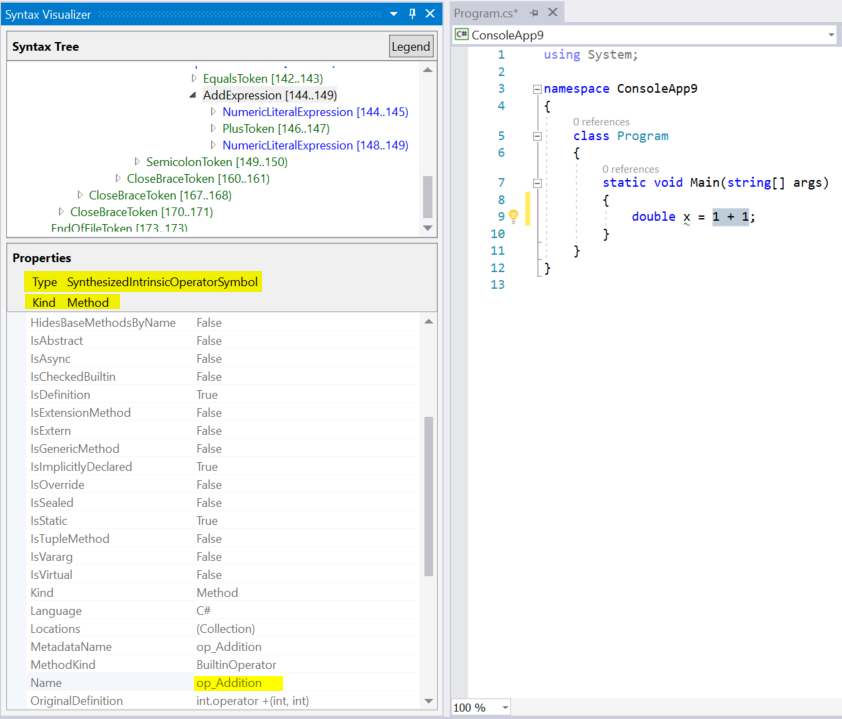

Try View **TypeSymbol (if any)** for the same **AddExpression** node. The property grid in the visualizer updates as shown in the following figure indicating that the type of the selected expression is `Int32`.


Next let’s try View **Converted TypeSymbol (if any)** for the same **AddExpression** node. The property grid is updated indicating that although the type of the expression is `Int32`, the converted type of the expression is `Double` as shown in the following figure. The converted type symbol information is present because the `Int32` expression is used in a context where it has to be converted to a `Double`. This conversion satisfies the `Double` type specified for the variable `x` on the left hand side of the assignment operator.

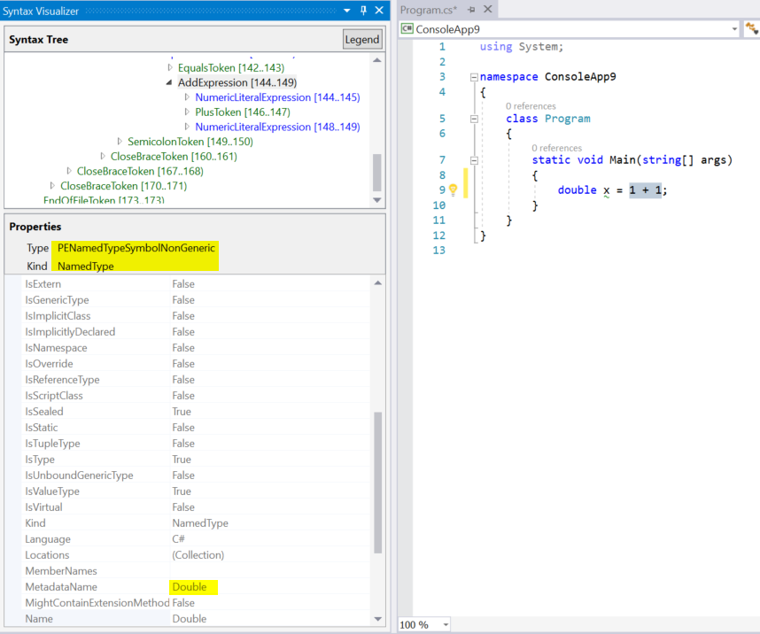

Finally, try **View Constant Value (if any)** for the same **AddExpression** node. The property grid tells you that the value of the expression is a compile time constant with value `2`.

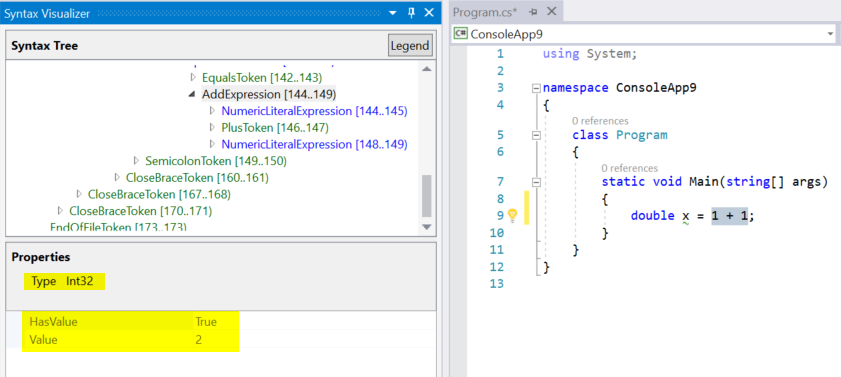

The preceding example can also be replicated in VB. Type `Dim x As Double = 1 + 1` in a VB file. Select the expression `1 + 1` in the code editor window. This highlights the corresponding **AddExpression** node in the visualizer. Repeat the preceding steps for this **AddExpression** and you should see identical results.

Next, you can examine more code in VB. Update your main VB file to match the following:

```vb
Imports C = System.Console

Module Program
    Sub Main(args As String())
        C.WriteLine()
    End Sub
End Module
```

This code introduces an alias named `C` that maps to the type `System.Console` at the top of the file and uses this alias inside `Main()`. Select the use of this alias, the `C` in `C.WriteLine()`, inside the method. This should select the corresponding **IdentifierName** node in the visualizer. Right click this node and click on **View Symbol (if any)**. The property grid tells us that this identifier is bound to the type `System.Console` as shown in the following figure.

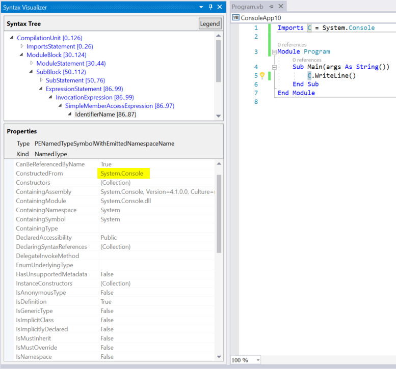

Try **View AliasSymbol (if any)** for the same **IdentifierName** node. The property grid tells you the identifier is an alias with name `C` that is bound to the `System.Console` target. In other words, the property grid provides information regarding the **AliasSymbol** corresponding to the identifier `C`.

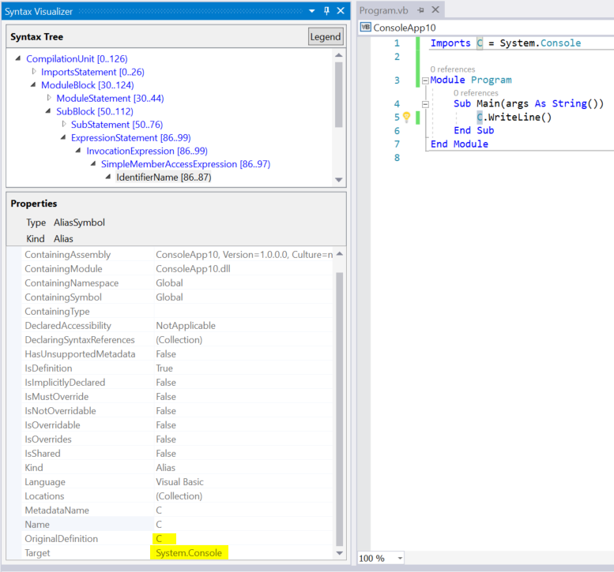

You can also inspect the symbol corresponding to any declared type, method, property and more by selecting the corresponding node in the visualizer and clicking on **View Symbol (if any)**. Select the method `Sub Main()`, including the body of the method, in the example and click on **View Symbol (if any)** for the corresponding **SubBlock** node in the visualizer, the property grid will tell us that the **MethodSymbol** for this **SubBlock** has name `Main` with return type `Void`.

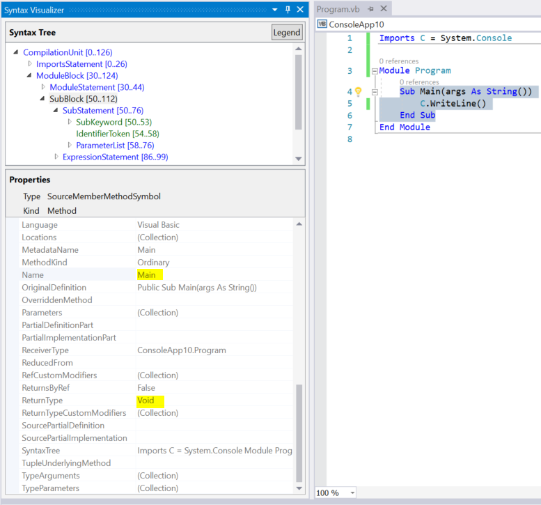

The above VB examples can be easily replicated in C#. Type `using C = System.Console;` in place of `Imports C = System.Console` for the alias. The preceding steps in C# should yield identical results in the visualizer window.

The semantic inspection operations described above are only available on nodes and not on tokens or trivia. Not all nodes have interesting semantic information to inspect. When a ode doesn't have interesting semantic information, clicking on **View * Symbol (if any)** shows a blank property grid.

You can read more about APIs for performing semantic analysis in the [Work with semantics](work-with-semantics.md) overview documents.

## Closing and disabling syntax visualizer

You can close the visualizer window when you are not using it to examine source code.
