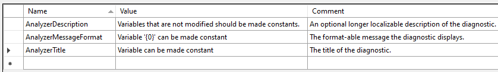

# Tutorial: Write your first analyzer and code fix

The .NET Compiler Platform SDK provides the tools you need to create custom warnings that target C# or Visual Basic code. Your **analyzer** contains code that recognizes violations of your rule. Your **code fix** contains the code that fixes the violation. The rules you implement can be anything from code structure to coding style to naming conventions and more. The .NET Compiler Platform provides the framework for running analysis as developers are writing code, and all the Visual Studio UI features for fixing code: showing squiggles in the editor, populating the Visual Studio Error List, creating the "light bulb" suggestions and showing the rich preview of the suggested fixes.

In this tutorial, you'll explore the creation of an **analyzer** and an accompanying **code fix** using the Roslyn APIs. An analyzer is a way to perform source code analysis and report a problem to the user. Optionally, an analyzer can also provide a code fix that represents a modification to the user's source code. This tutorial creates an analyzer that finds local variable declarations that could be declared using the `const` modifier but are not. The accompanying code fix modifies those declarations to add the `const` modifier.

## Prerequisites

* [Visual Studio 2017](https://visualstudio.microsoft.com/vs/older-downloads/#visual-studio-2017-and-other-products)
* [Visual Studio 2019](https://www.visualstudio.com/downloads)

You'll need to install the **.NET Compiler Platform SDK** via the Visual Studio Intaller:

[!INCLUDE[interactive-note](~/includes/roslyn-installation.md)]

There are several steps to creating and validating your analyzer:

1. Create the solution.
1. Register the analyzer name and description.
1. Report analyzer warnings and recommendations.
1. Implement the code fix to accept recommendations.
1. Improve the analysis through unit tests.

## Explore the analyzer template

Your analyzer reports to the user any local variable declarations that can be converted to local constants. For example, consider the following code:

```csharp
int x = 0;
Console.WriteLine(x);
```

In the code above, `x` is assigned a constant value and is never modified. It can be declared using the `const` modifier:

```csharp
const int x = 0;
Console.WriteLine(x);
```

The analysis to determine whether a variable can be made constant is involved, requiring syntactic analysis, constant analysis of the initializer expression and dataflow analysis to ensure that the variable is never written to. The .NET Compiler Platform provides APIs that make it easier to perform this analysis. The first step is to create a new C# **Analyzer with code fix** project.

* In Visual Studio, choose **File > New > Project...** to display the New Project dialog.
* Under **Visual C# > Extensibility**, choose **Analyzer with code fix (.NET Standard)**.
* Name your project "**MakeConst**" and click OK.

The analyzer with code fix template creates three projects: one contains the analyzer and code fix, the second is a unit test project, and the third is the VSIX project. The default startup project is the VSIX project. Press **F5** to start the VSIX project. This starts a second instance of Visual Studio that has loaded your new analyzer.

> [!TIP]
> When you run your analyzer, you start a second copy of Visual Studio. This second copy uses a different registry hive to store settings. That enables you to differentiate the visual settings in the two copies of Visual Studio. You can pick a different theme for the experimental run of Visual Studio. In addition, don't roam your settings or login to your Visual Studio account using the experimental run of Visual Studio. That keeps the settings different.

In the second Visual Studio instance that you just started, create a new C# Console Application project (either .NET Core or .NET Framework project will work -- analyzers work at the source level.) Hover over the token with a wavy underline, and the warning text provided by an analyzer appears.

The template creates an analyzer that reports a warning on each type declaration where the type name contains lowercase letters, as shown in the following figure:


The template also provides a code fix that changes any type name containing lower case characters to all upper case. You can click on the light bulb displayed with the warning to see the suggested changes. Accepting the suggested changes updates the type name and all references to that type in the solution. Now that you've seen the initial analyzer in action, close the second Visual Studio instance and return to your analyzer project.

You don't have to start a second copy of Visual Studio and create new code to test every change in your analyzer. The template also creates a unit test project for you. That project contains two tests. `TestMethod1` shows the typical format of a test that analyzes code without triggering a diagnostic. `TestMethod2` shows the format of a test that triggers a diagnostic, and then applies a suggested code fix. As you build your analyzer and code fix, you'll write tests for different code structures to verify your work. Unit tests for analyzers are much quicker than testing them interactively with Visual Studio.

> [!TIP]
> Analyzer unit tests are a great tool when you know what code constructs should and shouldn't trigger your analyzer. Loading your analyzer in another copy of Visual Studio is a great tool to explore and find constructs you may not have thought about yet.

## Create analyzer registrations

The template creates the initial `DiagnosticAnalyzer` class, in the **MakeConstAnalyzer.cs** file. This initial analyzer shows two important properties of every analyzer.

* Every diagnostic analyzer must provide a `[DiagnosticAnalyzer]` attribute that describes the language it operates on.
* Every diagnostic analyzer must derive from the <xref:Microsoft.CodeAnalysis.Diagnostics.DiagnosticAnalyzer> class.

The template also shows the basic features that are part of any analyzer:

1. Register actions. The actions represent code changes that should trigger your analyzer to examine code for violations. When Visual Studio detects code edits that match a registered action, it calls your analyzer's registered method.
1. Create diagnostics. When your analyzer detects a violation, it creates a diagnostic object that Visual Studio uses to notify the user of the violation.

You register actions in your override of <xref:Microsoft.CodeAnalysis.Diagnostics.DiagnosticAnalyzer.Initialize(Microsoft.CodeAnalysis.Diagnostics.AnalysisContext)?displayProperty=nameWithType> method. In this tutorial, you'll visit **syntax nodes** looking for local declarations, and see which of those have constant values. If a declaration could be constant, your analyzer will create and report a diagnostic.

The first step is to update the registration constants and `Initialize` method so these constants indicate your "Make Const" analyzer. Most of the string constants are defined in the string resource file. You should follow that practice for easier localization. Open the **Resources.resx** file for the **MakeConst** analyzer project. This displays the resource editor. Update the string resources as follows:

* Change `AnalyzerTitle` to "Variable can be made constant".
* Change `AnalyzerMessageFormat` to "Can be made constant".
* Change `AnalyzerDescription` to "Make Constant".

Also, change the **Access Modifier** drop-down to `public`. That makes it easier to use these constants in unit tests. When you have finished, the resource editor should appear as follow figure shows:



The remaining changes are in the analyzer file. Open **MakeConstAnalyzer.cs** in Visual Studio. Change the registered action from one that acts on symbols to one that acts on syntax. In the `MakeConstAnalyzerAnalyzer.Initialize` method, find the line that registers the action on symbols:

```csharp
context.RegisterSymbolAction(AnalyzeSymbol, SymbolKind.NamedType);
```

Replace it with the following line:

[!code-csharp[Register the node action](~/samples/csharp/roslyn-sdk/Tutorials/MakeConst/MakeConst/MakeConstAnalyzer.cs#RegisterNodeAction "Register a node action")]

After that change, you can delete the `AnalyzeSymbol` method. This analyzer examines <xref:Microsoft.CodeAnalysis.CSharp.SyntaxKind.LocalDeclarationStatement?displayProperty=nameWithType>, not <xref:Microsoft.CodeAnalysis.SymbolKind.NamedType?displayProperty=nameWithType> statements. Notice that `AnalyzeNode` has red squiggles under it. The code you just added references an `AnalyzeNode` method that hasn't been declared. Declare that method using the following code:

```csharp
private void AnalyzeNode(SyntaxNodeAnalysisContext context)
{
}
```

Change the `Category` to "Usage" in **MakeConstAnalyzer.cs** as shown in the following code:

```csharp
private const string Category = "Usage";
```

## Find local declarations that could be const

It's time to write the first version of the `AnalyzeNode` method. It should look for a single local declaration that could be `const` but is not, like the following code:

```csharp
int x = 0;
Console.WriteLine(x);
```

The first step is to find local declarations. Add the following code to `AnalyzeNode` in **MakeConstAnalyzer.cs**:

```csharp
var localDeclaration = (LocalDeclarationStatementSyntax)context.Node;
```

This cast always succeeds because your analyzer registered for changes to local declarations, and only local declarations. No other node type triggers a call to your `AnalyzeNode` method. Next, check the declaration for any `const` modifiers. If you find them, return immediately. The following code looks for any `const` modifiers on the local declaration:

```csharp
// make sure the declaration isn't already const:
if (localDeclaration.Modifiers.Any(SyntaxKind.ConstKeyword))
{
    return;
}
```

Finally, you need to check that the variable could be `const`. That means making sure it is never assigned after it is initialized.

You'll perform some semantic analysis using the <xref:Microsoft.CodeAnalysis.Diagnostics.SyntaxNodeAnalysisContext>. You use the `context` argument to determine whether the local variable declaration can be made `const`. A <xref:Microsoft.CodeAnalysis.SemanticModel?displayProperty=nameWithType> represents of all semantic information in a single source file. You can learn more in the article that covers [semantic models](../work-with-semantics.md). You'll use the <xref:Microsoft.CodeAnalysis.SemanticModel?displayProperty=nameWithType> to perform data flow analysis on the local declaration statement. Then, you use the results of this data flow analysis to ensure that the local variable isn't written with a new value anywhere else. Call the <xref:Microsoft.CodeAnalysis.ModelExtensions.GetDeclaredSymbol%2A> extension method to retrieve the <xref:Microsoft.CodeAnalysis.ILocalSymbol> for the variable and check that it isn't contained with the <xref:Microsoft.CodeAnalysis.DataFlowAnalysis.WrittenOutside%2A?displayProperty=nameWithType> collection of the data flow analysis. Add the following code to the end of the `AnalyzeNode` method:

```csharp
// Perform data flow analysis on the local declaration.
var dataFlowAnalysis = context.SemanticModel.AnalyzeDataFlow(localDeclaration);

// Retrieve the local symbol for each variable in the local declaration
// and ensure that it is not written outside of the data flow analysis region.
var variable = localDeclaration.Declaration.Variables.Single();
var variableSymbol = context.SemanticModel.GetDeclaredSymbol(variable);
if (dataFlowAnalysis.WrittenOutside.Contains(variableSymbol))
{
    return;
}
```

The code just added ensures that the variable isn't modified, and can therefore be made `const`. It's time to raise the diagnostic. Add the following code as the last line in `AnalyzeNode`:

```csharp
context.ReportDiagnostic(Diagnostic.Create(Rule, context.Node.GetLocation()));
```

You can check your progress by pressing **F5** to run your analyzer. You can load the console application you created earlier and then add the following test code:

```csharp
int x = 0;
Console.WriteLine(x);
```

The light bulb should appear, and your analyzer should report a diagnostic. However, the light bulb still uses the template generated code fix, and tells you it can be made upper case. The next section explains how to write the code fix.

## Write the code fix

An analyzer can provide one or more code fixes. A code fix defines an edit that addresses the reported issue. For the analyzer that you created, you can provide a code fix that inserts the const keyword:

```csharp
const int x = 0;
Console.WriteLine(x);
```

The user chooses it from the light bulb UI in the editor and Visual Studio changes the code.

Open the **MakeConstCodeFixProvider.cs** file added by the template.  This code fix is already wired up to the Diagnostic ID produced by your diagnostic analyzer, but it doesn't yet implement the right code transform. First you should remove some of the template code. Change the title string to "Make constant":

[!code-csharp[Update the CodeFix title](~/samples/csharp/roslyn-sdk/Tutorials/MakeConst/MakeConst/MakeConstCodeFixProvider.cs#CodeFixTitle "Update the CodeFix title")]

Next, delete the `MakeUppercaseAsync` method. It no longer applies.

All code fix providers derive from <xref:Microsoft.CodeAnalysis.CodeFixes.CodeFixProvider>. They all override <xref:Microsoft.CodeAnalysis.CodeFixes.CodeFixProvider.RegisterCodeFixesAsync(Microsoft.CodeAnalysis.CodeFixes.CodeFixContext)?displayProperty=nameWithType> to report available code fixes. In `RegisterCodeFixesAsync`, change the ancestor node type you're searching for to a <xref:Microsoft.CodeAnalysis.CSharp.Syntax.LocalDeclarationStatementSyntax> to match the diagnostic:

[!code-csharp[Find local declaration node](~/samples/csharp/roslyn-sdk/Tutorials/MakeConst/MakeConst/MakeConstCodeFixProvider.cs#FindDeclarationNode  "Find the local declaration node that raised the diagnostic")]

Next, change the last line to register a code fix. Your fix will create a new document that results from adding the `const` modifier to an existing declaration:

[!code-csharp[Register the new code fix](~/samples/csharp/roslyn-sdk/Tutorials/MakeConst/MakeConst/MakeConstCodeFixProvider.cs#RegisterCodeFix  "Register the new code fix")]

You'll notice red squiggles in the code you just added on the symbol `MakeConstAsync`. Add a declaration for `MakeConstAsync` like the following code:

```csharp
private async Task<Document> MakeConstAsync(Document document,
   LocalDeclarationStatementSyntax localDeclaration,
   CancellationToken cancellationToken)
{
}
```

Your new `MakeConstAsync` method will transform the <xref:Microsoft.CodeAnalysis.Document> representing the user's source file into a new <xref:Microsoft.CodeAnalysis.Document> that now contains a `const` declaration.

You create a new `const` keyword token to insert at the front of the declaration statement. Be careful to first remove any leading trivia from the first token of the declaration statement and attach it to the `const` token. Add the following code to the `MakeConstAsync` method:

[!code-csharp[Create a new const keyword token](~/samples/csharp/roslyn-sdk/Tutorials/MakeConst/MakeConst/MakeConstCodeFixProvider.cs#CreateConstToken  "Create the new const keyword token")]

Next, add the `const` token to the declaration using the following code:

```csharp
// Insert the const token into the modifiers list, creating a new modifiers list.
var newModifiers = trimmedLocal.Modifiers.Insert(0, constToken);
// Produce the new local declaration.
var newLocal = trimmedLocal
    .WithModifiers(newModifiers)
    .WithDeclaration(localDeclaration.Declaration);
```

Next, format the new declaration to match C# formatting rules. Formatting your changes to match existing code creates a better experience. Add the following statement immediately after the existing code:

[!code-csharp[Format the new declaration](~/samples/csharp/roslyn-sdk/Tutorials/MakeConst/MakeConst/MakeConstCodeFixProvider.cs#FormatLocal  "Format the new declaration")]

A new namespace is required for this code. Add the following `using` statement to the top of the file:

```csharp
using Microsoft.CodeAnalysis.Formatting;
```

The final step is to make your edit. There are three steps to this process:

1. Get a handle to the existing document.
1. Create a new document by replacing the existing declaration with the new declaration.
1. Return the new document.

Add the following code to the end of the `MakeConstAsync` method:

[!code-csharp[replace the declaration](~/samples/csharp/roslyn-sdk/Tutorials/MakeConst/MakeConst/MakeConstCodeFixProvider.cs#ReplaceDocument  "Generate a new document by replacing the declaration")]

Your code fix is ready to try.  Press F5 to run the analyzer project in a second instance of Visual Studio. In the second Visual Studio instance, create a new C# Console Application project and add a few local variable declarations initialized with constant values to the Main method. You'll see that they are reported as warnings as below.


You've made a lot of progress. There are squiggles under the declarations that can be made `const`. But there is still work to do. This works fine if you add `const` to the declarations starting with `i`, then `j` and finally `k`. But, if you add the `const` modifier in a different order, starting with `k`, your analyzer creates errors: `k` can't be declared `const`, unless `i` and `j` are both already `const`. You've got to do more analysis to ensure you handle the different ways variables can be declared and initialized.

## Build data driven tests

Your analyzer and code fix work on a simple case of a single declaration that can be made const. There are numerous possible declaration statements where this implementation makes mistakes. You'll address these cases by working with the unit test library written by the template. It's much faster than repeatedly opening a second copy of Visual Studio.

Open the **MakeConstUnitTests.cs** file in the unit test project. The template created two tests that follow the two common patterns for an analyzer and code fix unit test. `TestMethod1` shows the pattern for a test that ensures the analyzer doesn't report a diagnostic when it shouldn't. `TestMethod2` shows the pattern for reporting a diagnostic and running the code fix.

The code for almost every test for your analyzer follows one of these two patterns. For the first step, you can rework these tests as data driven tests. Then, it will be easy to create new tests by adding new string constants to represent different test inputs.

For efficiency, the first step is to refactor the two tests into data driven tests. Then, you only need to define a couple string constants for each new test. While your refactoring, rename both methods to better names. Replace `TestMethod1` with this test that ensures no diagnostic is raised:

```csharp
[DataTestMethod]
[DataRow("")]
public void WhenTestCodeIsValidNoDiagnosticIsTriggered(string testCode)
{
    VerifyCSharpDiagnostic(testCode);
}
```

You can create a new data row for this test by defining any code fragment that should not cause your diagnostic to trigger a warning. This overload of `VerifyCSharpDiagnostic` passes when there are no diagnostics triggered for the source code fragment.

Next, replace `TestMethod2` with this test that ensures a diagnostic is raised and a code fix applied for the source code fragment:

```csharp
[DataTestMethod]
[DataRow(LocalIntCouldBeConstant, LocalIntCouldBeConstantFixed, 10, 13)]
public void WhenDiagnosticIsRaisedFixUpdatesCode(
    string test,
    string fixTest,
    int line,
    int column)
{
    var expected = new DiagnosticResult
    {
        Id = MakeConstAnalyzer.DiagnosticId,
        Message = new LocalizableResourceString(nameof(MakeConst.Resources.AnalyzerMessageFormat), MakeConst.Resources.ResourceManager, typeof(MakeConst.Resources)).ToString(),
        Severity = DiagnosticSeverity.Warning,
        Locations =
            new[] {
                    new DiagnosticResultLocation("Test0.cs", line, column)
                }
    };

    VerifyCSharpDiagnostic(test, expected);

    VerifyCSharpFix(test, fixTest);
}
```

The preceding code also made a couple changes to the code that builds the expected diagnostic result. It uses the public constants registered in the `MakeConst` analyzer. In addition, it uses two string constants for the input and fixed source. Add the following string constants to the `UnitTest` class:

[!code-csharp[string constants for fix test](~/samples/csharp/roslyn-sdk/Tutorials/MakeConst/MakeConst.Test/MakeConstUnitTests.cs#FirstFixTest "string constants for fix test")]

Run these two tests to make sure they pass. In Visual Studio, open the **Test Explorer** by selecting **Test** > **Windows** > **Test Explorer**.  The press the **Run All** link.

## Create tests for valid declarations

As a general rule, analyzers should exit as quickly as possible, doing minimal work. Visual Studio calls registered analyzers as the user edits code. Responsiveness is a key requirement. There are several test cases for code that should not raise your diagnostic. Your analyzer already handles one of those tests, the case where a variable is assigned after being initialized. Add the following string constant to your tests to represent that case:

[!code-csharp[variable assigned](~/samples/csharp/roslyn-sdk/Tutorials/MakeConst/MakeConst.Test/MakeConstUnitTests.cs#VariableAssigned "a variable that is assigned after being initialized won't raise the diagnostic")]

Then, add a data row for this test as shown in the snippet below:

```csharp
[DataTestMethod]
[DataRow(""),
 DataRow(VariableAssigned)]
public void WhenTestCodeIsValidNoDiagnosticIsTriggered(string testCode)
```

This test passes as well. Next, add constants for conditions you haven't handled yet:

* Declarations that are already `const`, because they are already const:

   [!code-csharp[already const declaration](~/samples/csharp/roslyn-sdk/Tutorials/MakeConst/MakeConst.Test/MakeConstUnitTests.cs#AlreadyConst "a declaration that is already const should not raise the diagnostic")]

* Declarations that have no initializer, because there is no value to use:

   [!code-csharp[declarations that have no initializer](~/samples/csharp/roslyn-sdk/Tutorials/MakeConst/MakeConst.Test/MakeConstUnitTests.cs#NoInitializer "a declaration that has no initializer should not raise the diagnostic")]

* Declarations where the initializer is not a constant, because they can't be compile-time constants:

   [!code-csharp[declarations where the initializer isn't const](~/samples/csharp/roslyn-sdk/Tutorials/MakeConst/MakeConst.Test/MakeConstUnitTests.cs#InitializerNotConstant "a declaration where the initializer is not a compile-time constant should not raise the diagnostic")]

It can be even more complicated because C# allows multiple declarations as one statement. Consider the following test case string constant:

[!code-csharp[multiple initializers](~/samples/csharp/roslyn-sdk/Tutorials/MakeConst/MakeConst.Test/MakeConstUnitTests.cs#MultipleInitializers "A declaration can be made constant only if all variables in that statement can be made constant")]

The variable `i` can be made constant, but the variable `j` cannot. Therefore, this statement cannot be made a const declaration. Add the `DataRow` declarations for all these tests:

```csharp
[DataTestMethod]
[DataRow(""),
    DataRow(VariableAssigned),
    DataRow(AlreadyConst),
    DataRow(NoInitializer),
    DataRow(InitializerNotConstant),
    DataRow(MultipleInitializers)]
public void WhenTestCodeIsValidNoDiagnosticIsTriggered(string testCode)
```

Run your tests again, and you'll see these new test cases fail.

## Update your analyzer to ignore correct declarations

You need some enhancements to your analyzer's `AnalyzeNode` method to filter out code that matches these conditions. They are all related conditions, so similar changes will fix all these conditions. Make the following changes to `AnalyzeNode`:

* Your semantic analysis examined a single variable declaration. This code needs to be in a `foreach` loop that examines all the variables declared in the same statement.
* Each declared variable needs to have an initializer.
* Each declared variable's initializer must be a compile-time constant.

In your `AnalyzeNode` method, replace the original semantic analysis:

```csharp
// Perform data flow analysis on the local declaration.
var dataFlowAnalysis = context.SemanticModel.AnalyzeDataFlow(localDeclaration);

// Retrieve the local symbol for each variable in the local declaration
// and ensure that it is not written outside of the data flow analysis region.
var variable = localDeclaration.Declaration.Variables.Single();
var variableSymbol = context.SemanticModel.GetDeclaredSymbol(variable);
if (dataFlowAnalysis.WrittenOutside.Contains(variableSymbol))
{
    return;
}
```

with the following code snippet:

```csharp
// Ensure that all variables in the local declaration have initializers that
// are assigned with constant values.
foreach (var variable in localDeclaration.Declaration.Variables)
{
    var initializer = variable.Initializer;
    if (initializer == null)
    {
        return;
    }

    var constantValue = context.SemanticModel.GetConstantValue(initializer.Value);
    if (!constantValue.HasValue)
    {
        return;
    }
}

// Perform data flow analysis on the local declaration.
var dataFlowAnalysis = context.SemanticModel.AnalyzeDataFlow(localDeclaration);

foreach (var variable in localDeclaration.Declaration.Variables)
{
    // Retrieve the local symbol for each variable in the local declaration
    // and ensure that it is not written outside of the data flow analysis region.
    var variableSymbol = context.SemanticModel.GetDeclaredSymbol(variable);
    if (dataFlowAnalysis.WrittenOutside.Contains(variableSymbol))
    {
        return;
    }
}
```

The first `foreach` loop examines each variable declaration using syntactic analysis. The first check guarantees that the variable has an initializer. The second check guarantees that the initializer is a constant. The second loop has the original semantic analysis. The semantic checks are in a separate loop because it has a greater impact on performance. Run your tests again, and you should see them all pass.

## Add the final polish

You're almost done. There are a few more conditions for your analyzer to handle. Visual Studio calls analyzers while the user is writing code. It's often the case that your analyzer will be called for code that doesn't compile. The diagnostic analyzer's `AnalyzeNode` method does not check to see if the constant value is convertible to the variable type. So, the current implementation will happily convert an incorrect declaration such as int i = "abc"' to a local constant. Add a source string constant for that condition:

[!code-csharp[Mismatched types don't raise diagnostics](~/samples/csharp/roslyn-sdk/Tutorials/MakeConst/MakeConst.Test/MakeConstUnitTests.cs#DeclarationIsInvalid "When the variable type and the constant type don't match, there's no diagnostic")]

In addition, reference types are not handled properly. The only constant value allowed for a reference type is `null`, except in this case of <xref:System.String?displayProperty=nameWIthType>, which allows string literals. In other words, `const string s = "abc"` is legal, but `const object s = "abc"` is not. This code snippet verifies that condition:

[!code-csharp[Reference types don't raise diagnostics](~/samples/csharp/roslyn-sdk/Tutorials/MakeConst/MakeConst.Test/MakeConstUnitTests.cs#DeclarationIsntString "When the variable type is a reference type other than string, there's no diagnostic")]

To be thorough, you need to add another test to make sure that you can create a constant declaration for a string. The following snippet defines both the code that raises the diagnostic, and the code after the fix has been applied:

[!code-csharp[string reference types raise diagnostics](~/samples/csharp/roslyn-sdk/Tutorials/MakeConst/MakeConst.Test/MakeConstUnitTests.cs#ConstantIsString "When the variable type is string, it can be constant")]

Finally, if a variable is declared with the `var` keyword, the code fix does the wrong thing and generates a `const var` declaration, which is not supported by the C# language. To fix this bug, the code fix must replace the `var` keyword with the inferred type's name:

[!code-csharp[var references need to use the inferred types](~/samples/csharp/roslyn-sdk/Tutorials/MakeConst/MakeConst.Test/MakeConstUnitTests.cs#VarDeclarations "Declarations made using var must have the type replaced with the inferred type")]

These changes update the data row declarations for both tests. The following code shows these tests with all data row attributes:

[!code-csharp[The finished tests](~/samples/csharp/roslyn-sdk/Tutorials/MakeConst/MakeConst.Test/MakeConstUnitTests.cs#FinishedTests "The finished tests for the make const analyzer")]

Fortunately, all of the above bugs can be addressed using the same techniques that you just learned.

To fix the first bug, first open **DiagnosticAnalyzer.cs** and locate the foreach loop where each of the local declaration's initializers are checked to ensure that they're assigned with constant values. Immediately _before_ the first foreach loop, call `context.SemanticModel.GetTypeInfo()` to retrieve detailed information about the declared type of the local declaration:

```csharp
var variableTypeName = localDeclaration.Declaration.Type;
var variableType = context.SemanticModel.GetTypeInfo(variableTypeName).ConvertedType;
```

Then, inside your `foreach` loop, check each initializer to make sure it's convertible to the variable type. Add the following check after ensuring that the initializer is a constant:

```csharp
// Ensure that the initializer value can be converted to the type of the
// local declaration without a user-defined conversion.
var conversion = context.SemanticModel.ClassifyConversion(initializer.Value, variableType);
if (!conversion.Exists || conversion.IsUserDefined)
{
    return;
}
```

The next change builds upon the last one. Before the closing curly brace of the first foreach loop, add the following code to check the type of the local declaration when the constant is a string or null.

```csharp
// Special cases:
//  * If the constant value is a string, the type of the local declaration
//    must be System.String.
//  * If the constant value is null, the type of the local declaration must
//    be a reference type.
if (constantValue.Value is string)
{
    if (variableType.SpecialType != SpecialType.System_String)
    {
        return;
    }
}
else if (variableType.IsReferenceType && constantValue.Value != null)
{
    return;
}
```

You must write a bit more code in your code fix provider to replace the var' keyword with the correct type name. Return to **CodeFixProvider.cs**. The code you'll add does the following steps:

* Check if the declaration is a `var` declaration, and if it is:
* Create a new type for the inferred type.
* Make sure the type declaration is not an alias. If so, it is legal to declare `const var`.
* Make sure that `var` isn't a type name in this program. (If so, `const var` is legal).
* Simplify the full type name

That sounds like a lot of code. It's not. Replace the line that declares and initializes `newLocal` with the following code. It goes immediately after the initialization of `newModifiers`:

[!code-csharp[Replace Var designations](~/samples/csharp/roslyn-sdk/Tutorials/MakeConst/MakeConst/MakeConstCodeFixProvider.cs#ReplaceVar "Replace a var designation with the explicit type")]

You'll need to add one `using` statement to use the <xref:Microsoft.CodeAnalysis.Simplification.Simplifier> type:

```csharp
using Microsoft.CodeAnalysis.Simplification;
```

Run your tests, and they should all pass. Congratulate yourself by running your finished analyzer. Press Ctrl+F5 to run the analyzer project in a second instance of Visual Studio with the Roslyn Preview extension loaded.

* In the second Visual Studio instance, create a new C# Console Application project and add `int x = "abc";` to the Main method. Thanks to the first bug fix, no warning should be reported for this local variable declaration (though there's a compiler error as expected).
* Next, add `object s = "abc";` to the Main method. Because of the second bug fix, no warning should be reported.
* Finally, add another local variable that uses the `var` keyword. You'll see that a warning is reported and a suggestion appears beneath to the left.
* Move the editor caret over the squiggly underline and press Ctrl+. to display the suggested code fix. Upon selecting your code fix, note that the var' keyword is now handled correctly.

Finally, add the following code:

```csharp
int i = 2;
int j = 32;
int k = i + j;
```

After these changes, you get red squiggles only on the first two variables. Add `const` to both `i` and `j`, and you get a new warning on `k` because it can now be `const`.

Congratulations! You've created your first .NET Compiler Platform extension that performs on-the-fly code analysis to detect an issue and provides a quick fix to correct it. Along the way, you've learned many of the code APIs that are part of the .NET Compiler Platform SDK (Roslyn APIs). You can check your work against the [completed sample](https://github.com/dotnet/samples/tree/master/csharp/roslyn-sdk/Tutorials/MakeConst) in our samples GitHub repository. Or you can download [zip file of the completed project](https://github.com/dotnet/samples/blob/master/csharp/roslyn-sdk/Tutorials/MakeConst.zip)

## Other resources

- [Get started with syntax analysis](../get-started/syntax-analysis.md)
- [Get started with semantic analysis](../get-started/semantic-analysis.md)
