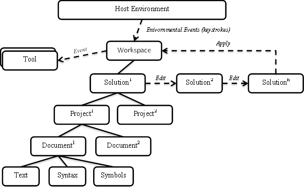

# Work with a workspace

The **Workspaces** layer is the starting point for doing code analysis and refactoring over entire solutions. Within this layer, the Workspace API assists you in organizing all the information about the projects in a solution into a single object model, offering you direct access to compiler layer object models like source text, syntax trees, semantic models, and compilations without needing to parse files, configure options, or manage inter-project dependencies. 

Host environments, like an IDE, provide a workspace for you corresponding to the open solution. It is also possible to use this model outside of an IDE by simply loading a solution file.

## Workspace

A workspace is an active representation of your solution as a collection of projects, each with a collection of documents. A workspace is typically tied to a host environment that is constantly changing as a user types or manipulates properties. 

The <xref:Microsoft.CodeAnalysis.Workspace> provides access to the current model of the solution. When a change in the host environment occurs, the workspace fires corresponding events, and the <xref:Microsoft.CodeAnalysis.Workspace.CurrentSolution?displayProperty=nameWithType> property is updated. For example, when the user types in a text editor corresponding to one of the source documents, the workspace uses an event to signal that the overall model of the solution has changed and which document was modified. You can then react to those changes by analyzing the new model for correctness, highlighting areas of significance, or making a suggestion for a code change. 

You can also create stand-alone workspaces that are disconnected from the host environment or used in an application that has no host environment.

## Solutions, projects, documents

Although a workspace may change every time a key is pressed, you can work with the model of the solution in isolation. 

A solution is an immutable model of the projects and documents. This means that the model can be shared without locking or duplication. After you obtain a solution instance from the <xref:Microsoft.CodeAnalysis.Workspace.CurrentSolution?displayProperty=nameWithType> property, that instance will never change. However, like with syntax trees and compilations, you can modify solutions by constructing new instances based on existing solutions and specific changes. To get the workspace to reflect your changes, you must explicitly apply the changed solution back to the workspace.

A project is a part of the overall immutable solution model. It represents all the source code documents, parse and compilation options, and both assembly and project-to-project references. From a project, you can access the corresponding compilation without needing to determine project dependencies or parse any source files.

A document is also a part of the overall immutable solution model. A document represents a single source file from which you can access the text of the file, the syntax tree, and the semantic model.

The following diagram is a representation of how the Workspace relates to the host environment, tools, and how edits are made.

## Summary

Roslyn exposes a set of compiler APIs and Workspaces APIs that provides rich information about your source code and that has full fidelity with the C# and Visual Basic languages.  The .NET Compiler Platform SDK dramatically lowers the barrier to entry for creating code-focused tools and applications. It creates many opportunities for innovation in areas such as meta-programming, code generation and transformation, interactive use of the C# and VB languages, and embedding of C# and VB in domain specific languages.  
