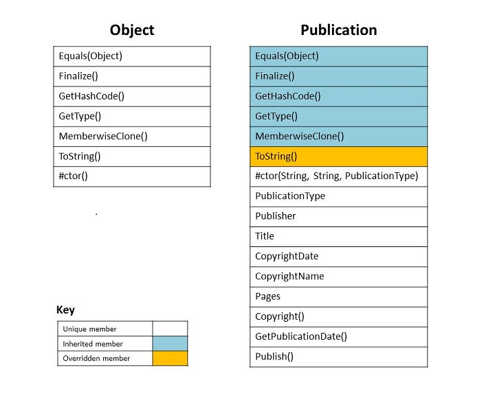
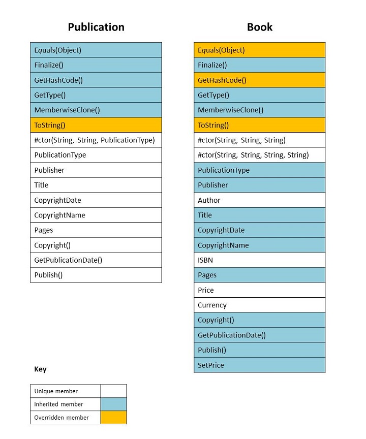

# Inheritance in C# and .NET

This tutorial introduces you to inheritance in C#. Inheritance is a feature of object-oriented programming languages that allows you to define a base class that provides specific functionality (data and behavior) and to define derived classes that either inherit or override that functionality.

## Prerequisites

This tutorial assumes that you've installed .NET Core. For installation instructions, see [.NET Core installation guide](https://www.microsoft.com/net/core). You also need a code editor. This tutorial uses [Visual Studio Code](https://code.visualstudio.com), although you can use any code editor of your choice.

## Running the examples

To create and run the examples in this tutorial, you use the [dotnet](../../core/tools/dotnet.md) utility from the command line. Follow these steps for each example:

1. Create a directory to store the example.
1. Enter the [dotnet new console](../../core/tools/dotnet-new.md) command at a command prompt to create a new .NET Core project.
1. Copy and paste the code from the example into your code editor.
1. Enter the [dotnet restore](../../core/tools/dotnet-restore.md) command from the command line to load or restore the project's dependencies.

  [!INCLUDE[DotNet Restore Note](~/includes/dotnet-restore-note.md)]

1. Enter the [dotnet run](../../core/tools/dotnet-run.md) command to compile and execute the example.


## Background: What is inheritance?

*Inheritance* is one of the fundamental attributes of object-oriented programming. It allows you to define a child class that reuses (inherits), extends, or modifies the behavior of a parent class. The class whose members are inherited is called the *base class*. The class that inherits the members of the base class is called the *derived class*.

C# and .NET support *single inheritance* only. That is, a class can only inherit from a single class. However, inheritance is transitive, which allows you to define an inheritance hierarchy for a set of types. In other words, type `D` can inherit from type `C`, which inherits from type `B`, which inherits from the base class type `A`. Because inheritance is transitive, the members of type `A` are available to type `D`.

Not all members of a base class are inherited by derived classes. The following members are not inherited:

- [Static constructors](../programming-guide/classes-and-structs/static-constructors.md), which initialize the static data of a class.

- [Instance constructors](../programming-guide/classes-and-structs/constructors.md), which you call to create a new instance of the class. Each class must define its own constructors.

- [Finalizers](../programming-guide/classes-and-structs/destructors.md), which are called by the runtime's garbage collector to destroy instances of a class.

While all other members of a base class are inherited by derived classes, whether they are visible or not depends on their accessibility. A member's accessibility affects its visibility for derived classes as follows:

- [Private](../language-reference/keywords/private.md) members are visible only in derived classes that are nested in their base class. Otherwise, they are not visible in derived classes. In the following example, `A.B` is a nested class that derives from `A`, and `C` derives from `A`. The private `A.value` field is visible in A.B. However, if you remove the comments from the `C.GetValue` method and attempt to compile the example, it produces compiler error CS0122: "'A.value' is inaccessible due to its protection level."

  [!code-csharp[Inheritance](../../../samples/snippets/csharp/tutorials/inheritance/private.cs#1)]

- [Protected](../language-reference/keywords/protected.md) members are visible only in derived classes.

- [Internal](../language-reference/keywords/internal.md) members are visible only in derived classes that are located in the same assembly as the base class. They are not visible in derived classes located in a different assembly from the base class.

- [Public](../language-reference/keywords/public.md) members are visible in derived classes and are part of the derived class' public interface. Public inherited members can be called just as if they were defined in the derived class. In the following example, class `A` defines a method named `Method1`, and class `B` inherits from class `A`. The example then calls `Method1` as if it were an instance method on `B`.

[!code-csharp[Inheritance](../../../samples/snippets/csharp/tutorials/inheritance/basics.cs#1)]

Derived classes can also *override* inherited members by providing an alternate implementation. In order to be able to override a member, the member in the base class must be marked with the [virtual](../language-reference/keywords/virtual.md) keyword. By default, base class members are not marked as `virtual` and cannot be overridden. Attempting to override a non-virtual member, as the following example does, generates compiler error CS0506: "<member> cannot override inherited member <member> because it is not marked virtual, abstract, or override.

```csharp
public class A
{
    public void Method1()
    {
        // Do something.
    }
}

public class B : A
{
    public override void Method1() // Generates CS0506.
    {
        // Do something else.
    }
}
```

In some cases, a derived class *must* override the base class implementation. Base class members marked with the [abstract](../language-reference/keywords/abstract.md) keyword require that derived classes override them. Attempting to compile the following example generates compiler error CS0534, "<class> does not implement inherited abstract member <member>', because class `B` provides no implementation for `A.Method1`.

```csharp
public abstract class A
{
    public abstract void Method1();
}

public class B : A // Generates CS0534.
{
    public void Method3()
    {
        // Do something.
    }
}
```

Inheritance applies only to classes and interfaces. Other type categories (structs, delegates, and enums) do not support inheritance. Because of this, attempting to compile code like the following produces compiler error CS0527: "Type 'ValueType' in interface list is not an interface." The error message indicates that, although you can define the interfaces that a struct implements, inheritance is not supported.

```csharp
using System;

public struct ValueStructure : ValueType // Generates CS0527.
{
}
```

## Implicit inheritance

Besides any types that they may inherit from through single inheritance, all types in the .NET type system implicitly inherit from <xref:System.Object> or a type derived from it. This ensures that common functionality is available to any type.

To see what implicit inheritance means, let's define a new class, `SimpleClass`, that is simply an empty class definition:

[!code-csharp[Inheritance](../../../samples/snippets/csharp/tutorials/inheritance/simpleclass.cs#1)]

We can then use reflection (which lets us inspect a type's metadata to get information about that type) to get a list of the members that belong to the `SimpleClass` type. Although we haven't defined any members in our `SimpleClass` class, output from the example indicates that it actually has nine members. One of these is a parameterless (or default) constructor that is automatically supplied for the `SimpleClass` type by the C# compiler. The remaining eight are members of <xref:System.Object>, the type from which all classes and interfaces in the .NET type system ultimately implicitly inherit.

[!code-csharp[Inheritance](../../../samples/snippets/csharp/tutorials/inheritance/simpleclass.cs#2)]

Implicit inheritance from the <xref:System.Object> class makes these methods available to the `SimpleClass` class:

- The public `ToString` method, which converts a `SimpleClass` object to its string representation, returns the fully qualified type name. In this case, the `ToString` method returns the string "SimpleClass".

- Three methods that test for equality of two objects: the public instance `Equals(Object)` method, the public static `Equals(Object, Object)` method, and the public static `ReferenceEquals(Object, Object)` method. By default, these methods test for reference equality; that is, to be equal, two object variables must refer to the same object.

- The public `GetHashCode` method, which computes a value that allows an instance of the type to be used in hashed collections.

- The public `GetType` method, which returns a <xref:System.Type> object that represents the `SimpleClass` type.

- The protected <xref:System.Object.Finalize%2A> method, which is designed to release unmanaged resources before an object's memory is reclaimed by the garbage collector.

- The protected <xref:System.Object.MemberwiseClone%2A> method, which creates a shallow clone of the current object.

Because of implicit inheritance, we can call any inherited member from a `SimpleClass` object just as if it was actually a member defined in the `SimpleClass` class. For instance, the following example calls the `SimpleClass.ToString` method, which `SimpleClass` inherits from <xref:System.Object>.

[!code-csharp[Inheritance](../../../samples/snippets/csharp/tutorials/inheritance/simpleclass2.cs#1)]

The following table lists the categories of types that you can create in C# and the types from which they implicitly inherit. Each base type makes a different set of members available through inheritance to implicitly derived types.

| Type category | Implicitly inherits from                                                      |
| ------------- | ----------------------------------------------------------------------------- |
| class         | <xref:System.Object>                                                          |
| struct        | <xref:System.ValueType>, <xref:System.Object>                                 |
| enum          | <xref:System.Enum>, <xref:System.ValueType>, <xref:System.Object>             |
| delegate      | <xref:System.MulticastDelegate>, <xref:System.Delegate>, <xref:System.Object> |

## Inheritance and an "is a" relationship

Ordinarily, inheritance is used to express an "is a" relationship between a base class and one or more derived classes, where the derived classes are specialized versions of the base class; the derived class is a type of the base class. For example, the `Publication` class represents a publication of any kind, and the `Book` and `Magazine` classes represent specific types of publications.

> [!NOTE]
> A class or struct can implement one more interfaces. While interface implementation is often presented as a workaround for single inheritance or as a way of using inheritance with structs, it is intended to express a different relationship (a "can do" relationship) between an interface and its implementing type than inheritance. An interface defines a subset of functionality (such as the ability to test for equality, to compare or sort objects, or to support culture-sensitive parsing and formatting) that the interface makes available to its implementing types.

Note that "is a" also expresses the relationship between a type and a specific instantiation of that type. In the following example, `Automobile` is a class that has three unique read-only properties: `Make`, the manufacturer of the automobile; `Model`, the kind of automobile; and `Year`, its year of manufacture. Our `Automobile` class also has a constructor whose arguments are assigned to the property values, and it overrides the <xref:System.Object.ToString%2A?displayProperty=nameWithType> method to produce a string that uniquely identifies the `Automobile` instance rather than the `Automobile` class.

[!code-csharp[Inheritance](../../../samples/snippets/csharp/tutorials/inheritance/is-a.cs#1)]

In this case, we should not rely on inheritance to represent specific car makes and models. For example, we do not need to define a `Packard` type to represent automobiles manufactured by the Packard Motor Car Company. Instead, we can represent them by creating an `Automobile` object with the appropriate values passed to its class constructor, as the following example does.

[!code-csharp[Inheritance](../../../samples/snippets/csharp/tutorials/inheritance/is-a.cs#2)]

An is-a relationship based on inheritance is best applied to a base class and to derived classes that add additional members to the base class or that require additional functionality not present in the base class.

## Designing the base class and derived classes

Let's look at the process of designing a base class and its derived classes. In this section, we'll define a base class, `Publication`, which represents a publication of any kind, such as a book, a magazine, a newspaper, a journal, an article, etc. We'll also define a `Book` class that derives from `Publication`. We could easily extend the example to define other derived classes, such as `Magazine`, `Journal`, `Newspaper`, and `Article`.

### The base Publication class

In designing our `Publication` class, we need to make several design decisions:

- What members to include in our base `Publication` class, and whether the `Publication` members provide method implementations, or whether `Publication` is an abstract base class that serves as a template for its derived classes.

  In this case, the `Publication` class will provide method implementations. The [Designing abstract base classes and their derived classes](#abstract) section contains an example that uses an abstract base class to define the methods that derived classes must override. Derived classes are free to provide any implementation that is suitable for the derived type.

  The ability to reuse code (that is, multiple derived classes share the declaration and implementation of base class methods and do not need to override them) is an advantage of non-abstract base classes. Therefore, we should add members to `Publication` if their code is likely to be shared by some or most specialized `Publication` types. If we fail to do this efficiently, we'll end up having to provide largely identical member implementations in derived classes rather a single implementation in the base class. The need to maintain duplicated code in multiple locations is a potential source of bugs.

  Both to maximize code reuse and to create a logical and intuitive inheritance hierarchy, we want to be sure that we include in the `Publication` class only the data and functionality that is common to all or to most publications. Derived classes then implement members that are unique to the particular kinds of publication that they represent.

- How far to extend our class hierarchy. Do we want to develop a hierarchy of three or more classes, rather than simply a base class and one or more derived classes? For example, `Publication` could be a base class of `Periodical`, which in turn is a base class of `Magazine`, `Journal` and `Newspaper`.

  For our example, we'll use the simple hierarchy of a `Publication` class and a single derived classes, `Book`. We could easily extend the example to create a number of additional   classes that derive from `Publication`, such as `Magazine` and `Article`.

- Whether it makes sense to instantiate the base class. If it does not, we should apply the [abstract](../language-reference/keywords/abstract.md) keyword to the class. If an attempt is made to instantiate a class marked with the `abstract` keyword by a direct call to its class constructor, the C# compiler generates error CS0144, "Cannot create an instance of the abstract class or interface." If an attempt is made to instantiate the class by using reflection, the reflection method throws a <xref:System.MemberAccessException>. Otherwise, our `Publication` class can be instantiated by calling its class constructor.

  By default, a base class can be instantiated by calling its class constructor. Note that we do not have to explicitly define a class constructor. If one is not present in the base class' source code, the C# compiler automatically provides a default (parameterless) constructor.

  For our example, we'll mark the `Publication` class as [abstract](../language-reference/keywords/abstract.md) so that it cannot be instantiated.

- Whether derived classes must inherit the base class implementation of a particular members, or whether they have the option to override the base class implementation. We have to use the [virtual](../language-reference/keywords/virtual.md) keyword to allow derived classes to override a base class method. By default, methods defined in the base class are *not* overridable.

- Whether a derived class represents the final class in the inheritance hierarchy and cannot itself be used as a base class for additional derived classes. By default, any class can serve as a base class. We can apply the [sealed](../language-reference/keywords/sealed.md) keyword to indicate that a class cannot serve as a base class for any additional classes. Attempting to derive from a sealed class generated compiler error CS0509, "cannot derive from sealed type <typeName>".

  For our example, we'll mark our derived class as `sealed`.

The following example shows the source code for the `Publication` class, as well as a `PublicationType` enumeration that is returned by the `Publication.PublicationType` property. In addition to the members that it inherits from <xref:System.Object>, the `Publication` class defines the following unique members and member overrides:

[!code-csharp[Inheritance](../../../samples/snippets/csharp/tutorials/inheritance/base-and-derived.cs#1)]

- A constructor

  Because the `Publication` class is `abstract`, it cannot be instantiated directly from code like the following:

  ```csharp
  var publication = new Publication("Tiddlywinks for Experts", "Fun and Games",
                                    PublicationType.Book);
  ```

  However, its instance constructor can be called directly from derived class constructors, as the source code for the `Book` class shows.

- Two publication-related properties

  `Title` is a read-only <xref:System.String> property whose value is supplied by calling the `Publication` constructor.

  `Pages` is a read-write <xref:System.Int32> property that indicates how many total pages the publication has. The value is stored in a private field named `totalPages`. It must be a positive number or an <xref:System.ArgumentOutOfRangeException> is thrown.

- Publisher-related members

  Two read-only properties, `Publisher` and `Type`. The values are originally supplied by the call to the `Publication` class constructor.

- Publishing-related members

  Two methods, `Publish` and `GetPublicationDate`, set and return the publication date. The `Publish` method sets a private  `published` flag to `true` when it is called and assigns the date passed to it as an argument to the private `datePublished` field. The `GetPublicationDate` method returns the string "NYP" if the `published` flag is `false`, and the value of the `datePublished` field if it is `true`.

- Copyright-related members

  The `Copyright` method takes the name of the copyright holder and the year of the copyright as arguments and assigns them to the `CopyrightName` and `CopyrightDate` properties.

- An override of the `ToString` method

  If a type does not override the <xref:System.Object.ToString%2A?displayProperty=nameWithType> method, it returns the fully qualified name of the type, which is of little use in differentiating one instance from another. The `Publication` class overrides <xref:System.Object.ToString%2A?displayProperty=nameWithType> to return the value of the `Title` property.

The following figure illustrates the relationship between our base `Publication` class and its implicitly inherited <xref:System.Object> class.



### The `Book` class

The `Book` class represents a book as a specialized type of publication. The following example shows the source code for the `Book` class.

[!code-csharp[Inheritance](../../../samples/snippets/csharp/tutorials/inheritance/base-and-derived.cs#2)]

In addition to the members that it inherits from `Publication`, the `Book` class defines the following unique members and member overrides:

- Two constructors

  The two `Book` constructors share three common parameters. Two, *title* and *publisher*, correspond to parameters of the `Publication` constructor. The third is *author*, which is stored to a private `authorName` field. One constructor includes an *isbn* parameter, which is stored in the `ISBN` auto-property.

  The first constructor uses the [this](../language-reference/keywords/this.md) keyword to call the other constructor. This is a common pattern in defining constructors. Constructors with fewer parameters provide default values when calling the constructor with the greatest number of parameters.

  The second constructor uses the [base](../language-reference/keywords/base.md) keyword to pass the title and publisher name to the base class constructor. If you don't make an explicit call to a base class constructor in your source code, the C# compiler automatically supplies a call to the base class' default or parameterless constructor.

- A read-only `ISBN` property, which returns the `Book` object's International Standard Book Number, a unique 10- or 13-digit number. The ISBN is supplied as an argument to one of the `Book` constructors. The ISBN is stored in a private backing field, which is auto-generated by the compiler.

- A read-only `Author` property. The author name is supplied as an argument to both `Book` constructors and is stored in the private `authorName` field.

- Two read-only price-related properties, `Price` and `Currency`. Their values are provided as arguments in a `SetPrice` method call. The price is stored in a private field, `bookPrice`. The `Currency` property is the three-digit ISO currency symbol (for example, USD for the U.S. dollar) and is stored in the private `ISOCurrencySymbol` field. ISO currency symbols can be retrieved from the <xref:System.Globalization.RegionInfo.ISOCurrencySymbol%2A> property.

- A `SetPrice` method, which sets the values of the `bookPrice` and `ISOCurrencySymbol` fields. These are the values returned by the `Price` and `Currency` properties.

- Overrides to the `ToString` method (inherited from `Publication`) and the <xref:System.Object.Equals%28System.Object%29?displayProperty=nameWithType> and <xref:System.Object.GetHashCode%2A> methods (inherited from <xref:System.Object>).

  Unless it is overridden, the <xref:System.Object.Equals%28System.Object%29?displayProperty=nameWithType> method tests for reference equality. That is, two object variables are considered to be equal if they refer to the same object. In the case of the `Book` class, on the other hand, two `Book` objects should be equal if they have the same ISBN.

  When you override the <xref:System.Object.Equals%28System.Object%29?displayProperty=nameWithType> method, you must also override the <xref:System.Object.GetHashCode%2A> method, which returns a value that the runtime uses to store items in hashed collections for efficient retrieval. The hash code should return a value that's consistent with the test for equality. Since we've overridden <xref:System.Object.Equals%28System.Object%29?displayProperty=nameWithType> to return `true` if the ISBN properties of two `Book` objects are equal, we return the hash code computed by calling the <xref:System.String.GetHashCode%2A> method of the string returned by the `ISBN` property.

The following figure illustrates the relationship between the `Book` class and `Publication`, its base class.



We can now instantiate a `Book` object, invoke both its unique and inherited members, and pass it as an argument to a method that expects a parameter of type `Publication` or of type `Book`, as the following example shows.

[!code-csharp[Inheritance](../../../samples/snippets/csharp/tutorials/inheritance/use-publication.cs#1)]

## Designing abstract base classes and their derived classes
<a name="abstract"></a>

In the previous example, we defined a base class that provided an implementation for a number of methods to allow derived classes to share code. In many cases, however, the base class is not expected to provide an implementation. Instead, the base class is an *abstract class*; it serves as a template that defines the members that each derived class must implement. Typically in the case of an abstract base class, the implementation of each derived type is unique to that type.

For example, each closed two-dimensional geometric shape includes two properties: area, the inner extent of the shape; and perimeter, or the distance along the edges of the shape. The way in which these properties are calculated, however, depends completely on the specific shape. The formula for calculating the perimeter (or circumference) of a circle, for example, is very different from that of a triangle.

The following example defines an abstract base class named `Shape` that defines two properties: `Area` and `Perimeter`. Note that, in addition to marking the class with the [abstract](../language-reference/keywords/abstract.md) keyword, each instance member is also marked with the [abstract](../language-reference/keywords/abstract.md) keyword. In this case, `Shape` also overrides the <xref:System.Object.ToString%2A?displayProperty=nameWithType> method to return the name of the type, rather than its fully qualified name. And it defines two static members, `GetArea` and `GetPerimeter`, that allow callers to easily retrieve the area and perimeter of an instance of any derived class. When we pass an instance of a derived class to either of these methods, the runtime calls the method override of the derived class.

[!code-csharp[Inheritance](../../../samples/snippets/csharp/tutorials/inheritance/shape.cs#1)]

We can then derive some classes from `Shape` that represent specific shapes. The following example defines three classes, `Triangle`, `Rectangle`, and `Circle`. Each uses a formula unique for that particular shape to compute the area and perimeter. Some of the derived classes also define properties, such as `Rectangle.Diagonal` and `Circle.Diameter`, that are unique to the shape that they represent.

[!code-csharp[Inheritance](../../../samples/snippets/csharp/tutorials/inheritance/shape.cs#2)]

The following example uses objects derived from `Shape`. It instantiates an array of objects derived from `Shape` and calls the static methods of the `Shape` class, which wraps return `Shape` property values. Note that the runtime retrieves values from the overridden properties of the derived types. The example also casts each `Shape` object in the array to its derived type and, if the cast succeeds, retrieves properties of that particular subclass of `Shape`. 

[!code-csharp[Inheritance](../../../samples/snippets/csharp/tutorials/inheritance/shape.cs#3)]

## See also

[Classes and objects](../tour-of-csharp/classes-and-objects.md)   
[Inheritance (C# Programming Guide)](../programming-guide/classes-and-structs/inheritance.md)
