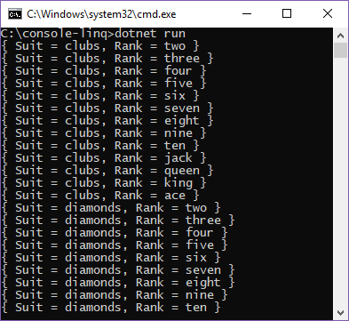

# Working with LINQ

## Introduction

This tutorial teaches you features in .NET Core and the C# language. You’ll learn:

- How to generate sequences with LINQ.
- How to write methods that can be easily used in LINQ queries.
- How to distinguish between eager and lazy evaluation.

You'll learn these techniques by building an application that demonstrates one of the basic skills of any magician: the [faro shuffle](https://en.wikipedia.org/wiki/Faro_shuffle). Briefly, a faro shuffle is a technique where you split a card deck exactly in half, then the shuffle interleaves each one card from each half to rebuild the original deck.

Magicians use this technique because every card is in a known location after each shuffle, and the order is a repeating pattern.

For your purposes, it is a light hearted look at manipulating sequences of data. The application you'll build will construct a card deck, and then perform a sequence of shuffles, writing the sequence out each time. You'll also compare the updated order to the original order.

This tutorial has multiple steps. After each step, you can run the application and see the progress. You can also see the [completed sample](https://github.com/dotnet/samples/blob/master/csharp/getting-started/console-linq) in the dotnet/samples GitHub repository. For download instructions, see [Samples and Tutorials](../../samples-and-tutorials/index.md#viewing-and-downloading-samples).

## Prerequisites

You’ll need to setup your machine to run .NET core. You can find the installation instructions on the [.NET Core Download](https://dotnet.microsoft.com/download) page. You can run this application on Windows, Ubuntu Linux, OS X or in a Docker container. You’ll need to install your favorite code editor. The descriptions below use [Visual Studio Code](https://code.visualstudio.com/) which is an open source, cross platform editor. However, you can use whatever tools you are comfortable with.

## Create the Application

The first step is to create a new application. Open a command prompt and create a new directory for your application. Make that the current directory. Type the command `dotnet new console` at the command prompt. This creates the starter files for a basic "Hello World" application.

If you've never used C# before, [this tutorial](console-teleprompter.md) explains the structure of a C# program. You can read that and then return here to learn more about LINQ.

## Creating the Data Set

Before you begin, make sure that the following lines are at the top of the `Program.cs` file generated by `dotnet new console`:

```csharp
// Program.cs
using System;
using System.Collections.Generic;
using System.Linq;
```

If these three lines (`using` statements) aren't at the top of the file, our program will not compile.

Now that you have all of the references that you'll need, consider what constitutes a deck of cards. Commonly, a deck of playing cards has four suits, and each suit has thirteen values. Normally, you might consider creating a `Card` class right off the bat and populating a collection of `Card` objects by hand. With LINQ, you can be more concise than the usual way of dealing with creating a deck of cards. Instead of creating a `Card` class, you can create two sequences to represent suits and ranks, respectively. You'll create a really simple pair of [*iterator methods*](../iterators.md#enumeration-sources-with-iterator-methods) that will generate the ranks and suits as <xref:System.Collections.Generic.IEnumerable%601>s of strings:

```csharp
// Program.cs
// The Main() method

static IEnumerable<string> Suits()
{
    yield return "clubs";
    yield return "diamonds";
    yield return "hearts";
    yield return "spades";
}

static IEnumerable<string> Ranks()
{
    yield return "two";
    yield return "three";
    yield return "four";
    yield return "five";
    yield return "six";
    yield return "seven";
    yield return "eight";
    yield return "nine";
    yield return "ten";
    yield return "jack";
    yield return "queen";
    yield return "king";
    yield return "ace";
}
```

Place these underneath the `Main` method in your `Program.cs` file. These two methods both utilize the `yield return` syntax to produce a sequence as they run. The compiler builds an object that implements <xref:System.Collections.Generic.IEnumerable%601> and generates the sequence of strings as they are requested.

Now, use these iterator methods to create the deck of cards. You'll place the LINQ query in our `Main` method. Here's a look at it:

```csharp
// Program.cs
static void Main(string[] args)
{
    var startingDeck = from s in Suits()
                       from r in Ranks()
                       select new { Suit = s, Rank = r };

    // Display each card that we've generated and placed in startingDeck in the console
    foreach (var card in startingDeck)
    {
        Console.WriteLine(card);
    }
}
```

The multiple `from` clauses produce a <xref:System.Linq.Enumerable.SelectMany%2A>, which creates a single sequence from combining each element in the first sequence with each element in the second sequence. The order is important for our purposes. The first element in the first source sequence (Suits) is combined with every element in the second sequence (Ranks). This produces all thirteen cards of first suit. That process is repeated with each element in the first sequence (Suits). The end result is a deck of cards ordered by suits, followed by values.

It's important to keep in mind that whether you choose to write your LINQ in the query syntax used above or use method syntax instead, it's always possible to go from one form of syntax to the other. The above query written in query syntax can be written in method syntax as:

```csharp
var startingDeck = Suits().SelectMany(suit => Ranks().Select(rank => new { Suit = suit, Rank = rank }));
```

The compiler translates LINQ statements written with query syntax into the equivalent method call syntax. Therefore, regardless of your syntax choice, the two versions of the query produce the same result. Choose which syntax works best for your situation: for instance, if you're working in a team where some of the members have difficulty with method syntax, try to prefer using query syntax.

Go ahead and run the sample you've built at this point. It will display all 52 cards in the deck. You may find it very helpful to run this sample under a debugger to observe how the `Suits()` and `Ranks()` methods execute. You can clearly see that each string in each sequence is generated only as it is needed.



## Manipulating the Order

Next, focus on how you're going to shuffle the cards in the deck. The first step in any good shuffle is to split the deck in two. The <xref:System.Linq.Enumerable.Take%2A> and <xref:System.Linq.Enumerable.Skip%2A> methods that are part of the LINQ APIs provide that feature for you. Place them underneath the `foreach` loop:

```csharp
// Program.cs
public static void Main(string[] args)
{
    var startingDeck = from s in Suits()
                       from r in Ranks()
                       select new { Suit = s, Rank = r };

    foreach (var c in startingDeck)
    {
        Console.WriteLine(c);
    }

    // 52 cards in a deck, so 52 / 2 = 26
    var top = startingDeck.Take(26);
    var bottom = startingDeck.Skip(26);
}
```

However, there's no shuffle method to take advantage of in the standard library, so you'll have to write your own. The shuffle method you'll be creating illustrates several techniques that you'll use with LINQ-based programs, so each part of this process will be explained in steps.

In order to add some functionality to how you interact with the <xref:System.Collections.Generic.IEnumerable%601> you'll get back from LINQ queries, you'll need to write some special kinds of methods called [extension methods](../programming-guide/classes-and-structs/extension-methods.md). Briefly, an extension method is a special purpose *static method* that adds new functionality to an already-existing type without having to modify the original type you want to add functionality to.

Give your extension methods a new home by adding a new *static* class file to your program called `Extensions.cs`, and then start building out the first extension method:

```csharp
// Extensions.cs
using System;
using System.Collections.Generic;
using System.Linq;

namespace LinqFaroShuffle
{
    public static class Extensions
    {
        public static IEnumerable<T> InterleaveSequenceWith<T>(this IEnumerable<T> first, IEnumerable<T> second)
        {
            // Your implementation will go here soon enough
        }
    }
}
```

Look at the method signature for a moment, specifically the parameters:

```csharp
public static IEnumerable<T> InterleaveSequenceWith<T> (this IEnumerable<T> first, IEnumerable<T> second)
```

You can see the addition of the `this` modifier on the first argument to the method. That means you call the method as though it were a member method of the type of the first argument. This method declaration also follows a standard idiom where the input and output types are `IEnumerable<T>`. That practice enables LINQ methods to be chained together to perform more complex queries.

Naturally, since you split the deck into halves, you'll need to join those halves together. In code, this means you'll be enumerating both of the sequences you acquired through <xref:System.Linq.Enumerable.Take%2A> and <xref:System.Linq.Enumerable.Skip%2A> at once, *`interleaving`* the elements, and creating one sequence: your now-shuffled deck of cards. Writing a LINQ method that works with two sequences requires that you understand how <xref:System.Collections.Generic.IEnumerable%601> works.

The <xref:System.Collections.Generic.IEnumerable%601> interface has one method: <xref:System.Collections.Generic.IEnumerable%601.GetEnumerator%2A>. The object returned by <xref:System.Collections.Generic.IEnumerable%601.GetEnumerator%2A> has a method to move to the next element, and a property that retrieves the current element in the sequence. You will use those two members to enumerate the collection and return the elements. This Interleave method will be an iterator method, so instead of building a collection and returning the collection, you'll use the `yield return` syntax shown above.

Here's the implementation of that method:

[!CODE-csharp[InterleaveSequenceWith](../../../samples/csharp/getting-started/console-linq/extensions.cs?name=snippet1)]

Now that you've written this method, go back to the `Main` method and shuffle the deck once:

```csharp
// Program.cs
public static void Main(string[] args)
{
    var startingDeck = from s in Suits()
                       from r in Ranks()
                       select new { Suit = s, Rank = r };

    foreach (var c in startingDeck)
    {
        Console.WriteLine(c);
    }

    var top = startingDeck.Take(26);
    var bottom = startingDeck.Skip(26);
    var shuffle = top.InterleaveSequenceWith(bottom);

    foreach (var c in shuffle)
    {
        Console.WriteLine(c);
    }
}
```

## Comparisons

How many shuffles it takes to set the deck back to its original order? To find out, you'll need to write a method that determines if two sequences are equal. After you have that method, you'll need to place the code that shuffles the deck in a loop, and check to see when the deck is back in order.

Writing a method to determine if the two sequences are equal should be straightforward. It's a similar structure to the method you wrote to shuffle the deck. Only this time, instead of `yield return`ing each element, you'll compare the matching elements of each sequence. When the entire sequence has been enumerated, if every element matches, the sequences are the same:

[!CODE-csharp[SequenceEquals](../../../samples/csharp/getting-started/console-linq/extensions.cs?name=snippet2)]

This shows a second LINQ idiom: terminal methods. They take a sequence as input (or in this case, two sequences), and return a single scalar value. When using terminal methods, they are always the final method in a chain of methods for a LINQ query, hence the name "terminal".

You can see this in action when you use it to determine when the deck is back in its original order. Put the shuffle code inside a loop, and stop when the sequence is back in its original order by applying the `SequenceEquals()` method. You can see it would always be the final method in any query, because it returns a single value instead of a sequence:

```csharp
// Program.cs
static void Main(string[] args)
{
    // Query for building the deck

    // Shuffling using InterleaveSequenceWith<T>();

    var times = 0;
    // We can re-use the shuffle variable from earlier, or you can make a new one
    shuffle = startingDeck;
    do
    {
        shuffle = shuffle.Take(26).InterleaveSequenceWith(shuffle.Skip(26));

        foreach (var card in shuffle)
        {
            Console.WriteLine(card);
        }
        Console.WriteLine();
        times++;

    } while (!startingDeck.SequenceEquals(shuffle));

    Console.WriteLine(times);
}
```

Run the code you've got so far and take note of how the deck rearranges on each shuffle. After 8 shuffles (iterations of the do-while loop), the deck returns to the original configuration it was in when you first created it from the starting LINQ query.

## Optimizations

The sample you've built so far executes an *out shuffle*, where the top and bottom cards stay the same on each run. Let's make one change: we'll use an *in shuffle* instead, where all 52 cards change position. For an in shuffle, you interleave the deck so that the first card in the bottom half becomes the first card in the deck. That means the last card in the top half becomes the bottom card. This is a simple change to a singular line of code. Update the current shuffle query by switching the positions of <xref:System.Linq.Enumerable.Take%2A> and <xref:System.Linq.Enumerable.Skip%2A>. This will change the order of the top and bottom halves of the deck:

```csharp
shuffle = shuffle.Skip(26).InterleaveSequenceWith(shuffle.Take(26));
```

Run the program again, and you'll see that it takes 52 iterations for the deck to reorder itself. You'll also start to notice some serious performance degradations as the program continues to run.

There are a number of reasons for this. You can tackle one of the major causes of this performance drop: inefficient use of [*lazy evaluation*](../programming-guide/concepts/linq/deferred-execution-and-lazy-evaluation-in-linq-to-xml.md).

Briefly, lazy evaluation states that the evaluation of a statement is not performed until its value is needed. LINQ queries are statements that are evaluated lazily. The sequences are generated only as the elements are requested. Usually, that's a major benefit of LINQ. However, in a use such as this program, this causes exponential growth in execution time.

Remember that we generated the original deck using a LINQ query. Each shuffle is generated by performing three LINQ queries on the previous deck. All these are performed lazily. That also means they are performed again each time the sequence is requested. By the time you get to the 52nd iteration, you're regenerating the original deck many, many times. Let's write a log to demonstrate this behavior. Then, you'll fix it.

In your `Extensions.cs` file, type in or copy the method below. This extension method creates a new file called `debug.log` within your project directory and records what query is currently being executed to the log file. This extension method can be appended to any query to mark that the query executed.

[!CODE-csharp[LogQuery](../../../samples/csharp/getting-started/console-linq/extensions.cs?name=snippet3)]

You will see a red squiggle under `File`, meaning it doesn't exist. It won't compile, since the compiler doesn't know what `File` is. To solve this problem, make sure to add the following line of code under the very first line in `Extensions.cs`:

```csharp
using System.IO;
```

This should solve the issue and the red error disappears.

Next, instrument the definition of each query with a log message:

```csharp
// Program.cs
public static void Main(string[] args)
{
    var startingDeck = (from s in Suits().LogQuery("Suit Generation")
                        from r in Ranks().LogQuery("Rank Generation")
                        select new { Suit = s, Rank = r }).LogQuery("Starting Deck");

    foreach (var c in startingDeck)
    {
        Console.WriteLine(c);
    }

    Console.WriteLine();
    var times = 0;
    var shuffle = startingDeck;

    do
    {
        // Out shuffle
        /*
        shuffle = shuffle.Take(26)
            .LogQuery("Top Half")
            .InterleaveSequenceWith(shuffle.Skip(26)
            .LogQuery("Bottom Half"))
            .LogQuery("Shuffle");
        */

        // In shuffle
        shuffle = shuffle.Skip(26).LogQuery("Bottom Half")
                .InterleaveSequenceWith(shuffle.Take(26).LogQuery("Top Half"))
                .LogQuery("Shuffle");

        foreach (var c in shuffle)
        {
            Console.WriteLine(c);
        }

        times++;
        Console.WriteLine(times);
    } while (!startingDeck.SequenceEquals(shuffle));

    Console.WriteLine(times);
}
```

Notice that you don't log every time you access a query. You log only when you create the original query. The program still takes a long time to run, but now you can see why. If you run out of patience running the in shuffle with logging turned on, switch back to the out shuffle. You'll still see the lazy evaluation effects. In one run, it executes 2592 queries, including all the value and suit generation.

You can improve the performance of the code here to reduce the number of executions you make. A simple fix you can make is to *cache* the results of the original LINQ query that constructs the deck of cards. Currently, you're executing the queries again and again every time the do-while loop goes through an iteration, re-constructing the deck of cards and reshuffling it every time. To cache the deck of cards, you can leverage the LINQ methods <xref:System.Linq.Enumerable.ToArray%2A> and <xref:System.Linq.Enumerable.ToList%2A>; when you append them to the queries, they'll perform the same actions you've told them to, but now they'll store the results in an array or a list, depending on which method you choose to call. Append the LINQ method <xref:System.Linq.Enumerable.ToArray%2A> to both queries and run the program again:

[!CODE-csharp[Main](../../../samples/csharp/getting-started/console-linq/Program.cs?name=snippet1)]

Now the out shuffle is down to 30 queries. Run again with the in shuffle and you'll see similar improvements: it now executes 162 queries.

Please note that this example is **designed** to highlight the use cases where lazy evaluation can cause performance difficulties. While it's important to see where lazy evaluation can impact code performance, it's equally important to understand that not all queries should run eagerly. The performance hit you incur without using <xref:System.Linq.Enumerable.ToArray%2A> is because each new arrangement of the deck of cards is built from the previous arrangement. Using lazy evaluation means each new deck configuration is built from the original deck, even executing the code that built the `startingDeck`. That causes a large amount of extra work.

In practice, some algorithms run well using eager evaluation, and others run well using lazy evaluation. For daily usage, lazy evaluation is usually a better choice when the data source is a separate process, like a database engine. For databases, lazy evaluation allows more complex queries to execute only one round trip to the database process and back to the rest of your code. LINQ is flexible whether you choose to utilize lazy or eager evaluation, so measure your processes and pick whichever kind of evaluation gives you the best performance.

## Conclusion

In this project, you covered:
- using LINQ queries to aggregate data into a meaningful sequence
- writing Extension methods to add our own custom functionality to LINQ queries
- locating areas in our code where our LINQ queries might run into performance issues like degraded speed
- lazy and eager evaluation in regards to LINQ queries and the implications they might have on query performance

Aside from LINQ, you learned a bit about a technique magicians use for card tricks. Magicians use the Faro shuffle because they can control where every card moves in the deck. Now that you know, don't spoil it for everyone else!

For more information on LINQ, see:
- [Language Integrated Query (LINQ)](../programming-guide/concepts/linq/index.md)
  - [Introduction to LINQ](../programming-guide/concepts/linq/index.md)
  - [Basic LINQ Query Operations (C#)](../programming-guide/concepts/linq/basic-linq-query-operations.md)
  - [Data Transformations With LINQ (C#)](../programming-guide/concepts/linq/data-transformations-with-linq.md)
  - [Query Syntax and Method Syntax in LINQ (C#)](../programming-guide/concepts/linq/query-syntax-and-method-syntax-in-linq.md)
  - [C# Features That Support LINQ](../programming-guide/concepts/linq/features-that-support-linq.md)
