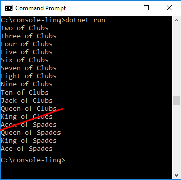

# Working with LINQ

## Introduction

This tutorial teaches you a number of features in .NET Core and the C# language. You’ll learn:

*	How to generate sequences with LINQ
*   How to write methods that can be easily used in LINQ queries.
*   How to distinguish between eager and lazy evaluation.

You'll learn these techniques by building an application that demonstrates one of the basic skills of any magician: the [faro shuffle](https://en.wikipedia.org/wiki/Faro_shuffle). Briefly, a faro shuffle is a technique where you split a card deck exactly in half, then the shuffle interleaves each one card from each half to rebuild the original deck.

Magicians use this technique because every card is in a known location after each shuffle, and the order is a repeating pattern. 

For our purposes, it is a light hearted look at manipulating sequences of data. The application you'll build will construct a card deck, and then perform a sequence of shuffles, writing the sequence out each time. You'll also compare the updated order to the original order.

This tutorial has multiple steps. After each step, you can run the application and see the progress. You can also see the [completed sample](https://github.com/dotnet/samples/blob/master/csharp/getting-started/console-linq) in the dotnet/samples GitHub repository. For download instructions, see [Samples and Tutorials](../../samples-and-tutorials/index.md#viewing-and-downloading-samples).

## Prerequisites

You’ll need to setup your machine to run .NET core. You can find the installation instructions on the [.NET Core](https://www.microsoft.com/net/core) page. You can run this application on Windows, Ubuntu Linux, OS X or in a Docker container. You’ll need to install your favorite code editor. The descriptions below use [Visual Studio Code](https://code.visualstudio.com/) which is an open source, cross platform editor. However, you can use whatever tools you are comfortable with.

## Create the Application

The first step is to create a new application. Open a command prompt and create a new directory for your application. Make that the current directory. Type the command `dotnet new console` at the command prompt. This creates the starter files for a basic "Hello World" application.

If you've never used C# before, [this tutorial](console-teleprompter.md) explains the structure of a C# program. You can read that and then return here to learn more about LINQ. 

## Creating the Data Set

Let's start by creating a deck of cards. You'll do this using a LINQ query that has two sources (one for the four suits, one for the thirteen values). You'll combine those sources into a 52 card deck. A `Console.WriteLine` statement inside a `foreach` loop displays the cards.

Here's the query:

```csharp
var startingDeck = from s in Suits()
                   from r in Ranks()
                   select new { Suit = s, Rank = r };

foreach (var c in startingDeck)
{
    Console.WriteLine(c);
}
```

The multiple `from` clauses produce a `SelectMany`, which creates a single sequence from combining each element in the first sequence with each element in the second sequence. The order is important for our purposes. The first element in the first source sequence (Suits) is combined with every element in the second sequence (Values). This produces all thirteen cards of first suit. That process is repeated with each element in the first sequence (Suits). The end result is a deck of cards ordered by suits, followed by values.

Next, you'll need to build the Suits() and Ranks() methods. Let's start with a really simple set of *iterator methods* that generate the sequence as an enumerable of strings:

```csharp
static IEnumerable<string> Suits()
{
    yield return "clubs";
    yield return "diamonds";
    yield return "hearts";
    yield return "spades";
}

static IEnumerable<string> Ranks()
{
    yield return "two";
    yield return "three";
    yield return "four";
    yield return "five";
    yield return "six";
    yield return "seven";
    yield return "eight";
    yield return "nine";
    yield return "ten";
    yield return "jack";
    yield return "queen";
    yield return "king";
    yield return "ace";
}
```

These two methods both utilize the `yield return` syntax to produce a sequence as they run. The compiler builds an object that implements `IEnumerable<T>` and generates the sequence of strings as they are requested.

Go ahead and run the sample you've built at this point. It will display all 52 cards in the deck. You may find it very helpful to run this sample under a debugger to observe how the `Suits()` and `Values()` methods execute. You can clearly see that each string in each sequence is generated only as it is needed.



## Manipulating the Order

Next, let's build a utility method that can perform the shuffle. The first step is to split the deck in two. The `Take()` and `Skip()` methods that are part of the LINQ APIs provide that feature for us:

```csharp
var top = startingDeck.Take(26);
var bottom = startingDeck.Skip(26);
```

The shuffle method doesn't exist in the standard library, so you'll have to write your own. This new method illustrates several techniques that you'll use with LINQ-based programs, so let's explain each part of the method in steps.

The signature for the method creates an *extension method*:

```csharp
public static IEnumerable<T> InterleaveSequenceWith<T>
    (this IEnumerable<T> first, IEnumerable<T> second)
```

An extension method is a special purpose *static method.* You can see the addition of the `this` modifier on the first argument to the method. That means you call the method as though it were a member method of the type of the first argument.

Extension methods can be declared only inside `static` classes, so let's create a new static class called `extensions` for this functionality. You'll add more extension methods as you continue this tutorial, and those will be placed in the same class.

This method declaration also follows a standard idiom where the input and output types are `IEnumerable<T>`. That practice enables LINQ methods to be chained together to perform more complex queries.

```csharp
using System.Collections.Generic;

namespace LinqFaroShuffle
{
    public static class Extensions
    {
        public static IEnumerable<T> InterleaveSequenceWith<T>
            (this IEnumerable<T> first, IEnumerable<T> second)
        {
            // implementation coming.
        }
    }
}
```

You will be enumerating both sequences at once, interleaving the elements, and creating one object.  Writing a LINQ method that works with two sequences requires that you understand how `IEnumerable` works.

The `IEnumerable` interface has one method: `GetEnumerator()`. The object returned by `GetEnumerator()` has a method to move to the next element, and a property that retrieves the current element in the sequence. You will use those two members to enumerate the collection and return the elements. This Interleave method will be an iterator method, so instead of building a collection and returning the collection, you'll use the `yield return` syntax shown above. 

Here's the implementation of that method:

[!CODE-csharp[InterleaveSequenceWith](../../../samples/csharp/getting-started/console-linq/extensions.cs?name=snippet1)]

Now that you've written this method, go back to the `Main` method and shuffle the deck once:

```csharp
public static void Main(string[] args)
{
    var startingDeck = from s in Suits()
                       from r in Ranks()
                       select new { Suit = s, Rank = r };

    foreach (var c in startingDeck)
    {
        Console.WriteLine(c);
    }
        
    var top = startingDeck.Take(26);
    var bottom = startingDeck.Skip(26);
    var shuffle = top.InterleaveSequenceWith(bottom);

    foreach (var c in shuffle)
    {
        Console.WriteLine(c);
    }
}
```

## Comparisons

Let's see how many shuffles it takes to set the deck back to its original order. You'll need to write a method that determines if two sequences are equal. After you have that method, you'll need to place the code that shuffles the deck in a loop, and check to see when the deck is back in order.

Writing a method to determine if the two sequences are equal should be straightforward. It's a similar structure to the method you wrote to shuffle the deck. Only this time, instead of yield returning each element, you'll compare the matching elements of each sequence. When the entire sequence has been enumerated, if every element matches, the sequences are the same:

[!CODE-csharp[SequenceEquals](../../../samples/csharp/getting-started/console-linq/extensions.cs?name=snippet2)]

This shows a second Linq idiom: terminal methods. They take a sequence as input (or in this case, two sequences), and return a single scalar value. These methods, when they are used, are always the final method of a query. (Hence the name). 

You can see this in action when you use it to determine when the deck is back in its original order. Put the shuffle code inside a loop, and stop when the sequence is back in its original order by applying the `SequenceEquals()` method. You can see it would always be the final method in any query, because it returns a single value instead of a sequence:

```csharp
var times = 0;
var shuffle = startingDeck;

do
{
    shuffle = shuffle.Take(26).InterleaveSequenceWith(shuffle.Skip(26));

    foreach (var c in shuffle)
    {
        Console.WriteLine(c);
    }

    Console.WriteLine();
    times++;
} while (!startingDeck.SequenceEquals(shuffle));

Console.WriteLine(times);
```

Run the sample, and see how the deck rearranges on each shuffle, until it returns to its original configuration after 8 iterations.

## Optimizations

The sample you've built so far executes an *in shuffle*, where the top and bottom cards stay the same on each run. Let's make one change, and run an *out shuffle*, where all 52 cards change position. For an out shuffle, you interleave the deck so that the first card in the bottom half becomes the first card in the deck. That means the last card in the top half becomes the bottom card. That's just a one line change. Update the call to shuffle to change the order of the top and bottom halves of the deck:

```csharp
shuffle = shuffle.Skip(26).InterleaveSequenceWith(shuffle.Take(26));
```

Run the program again, and you'll see that it takes 52 iterations for the deck to reorder itself. You'll also start to notice some serious performance degradations as the program continues to run.

There are a number of reasons for this. Let's tackle one of the major causes: inefficient use of *lazy evaluation*.

LINQ queries are evaluated lazily. The sequences are generated only as the elements are requested. Usually, that's a major benefit of LINQ. However, in a use such as this program, this causes exponential growth in execution time.

The original deck was generated using a LINQ query. Each shuffle is generated by performing three LINQ queries on the previous deck. All these are performed lazily. That also means they are performed again each time the sequence is requested. By the time you get to the 52nd iteration, you're regenerating the original deck many, many times. Let's write a log to demonstrate this behavior. Then, you'll fix it.

Here's a log method that can be appended to any query to mark that the query executed.

[!CODE-csharp[LogQuery](../../../samples/csharp/getting-started/console-linq/extensions.cs?name=snippet3)]

Next, instrument the definition of each query with a log message:

```csharp
public static void Main(string[] args)
{
    var startingDeck = (from s in Suits().LogQuery("Suit Generation")
                        from r in Ranks().LogQuery("Rank Generation")
                        select new { Suit = s, Rank = r }).LogQuery("Starting Deck");

    foreach (var c in startingDeck)
    {
        Console.WriteLine(c);
    }
        
    Console.WriteLine();
    var times = 0;
    var shuffle = startingDeck;

    do
    {
        /*
        shuffle = shuffle.Take(26)
            .LogQuery("Top Half")
            .InterleaveSequenceWith(shuffle.Skip(26)
            .LogQuery("Bottom Half"))
            .LogQuery("Shuffle");
        */

        shuffle = shuffle.Skip(26)
            .LogQuery("Bottom Half")
            .InterleaveSequenceWith(shuffle.Take(26).LogQuery("Top Half"))
            .LogQuery("Shuffle");

        foreach (var c in shuffle)
        {
            Console.WriteLine(c);
        }

        times++;
        Console.WriteLine(times);
    } while (!startingDeck.SequenceEquals(shuffle));

    Console.WriteLine(times);
}
```

Notice that you don't log every time you access a query. You log only when you create the original query. The program still takes a long time to run, but now you can see why. If you run out of patience running the outer shuffle with logging turned on, switch back to the inner shuffle. You'll still see the lazy evaluation effects. In one run, it executes 2592 queries, including all the value and suit generation.

There is an easy way to update this program to avoid all those executions. There are LINQ methods `ToArray()` and `ToList()` that cause the query to run, and store the results in an array or a list, respectively. You use these methods to cache the data results of a query rather than execute the source query again.  Append the queries that generate the card decks with a call to `ToArray()` and run the query again:

[!CODE-csharp[Main](../../../samples/csharp/getting-started/console-linq/Program.cs?name=snippet1)]

Run again, and the inner shuffle is down to 30 queries. Run again with the outer shuffle and you'll see similar improvements. (It now executes 162 queries).

Don't misinterpret this example by thinking that all queries should run eagerly. This example is designed to highlight the use cases where lazy evaluation can cause performance difficulties. That's because each new arrangement of the deck of cards is built from the previous arrangement. Using lazy evaluation means each new deck configuration is built from the original deck, even executing the code that built the `startingDeck`. That causes a large amount of extra work. 

In practice, some algorithms run much better using eager evaluation, and others run much better using lazy evaluation. (In general, lazy evaluation is a much better choice when the data source is a separate process, like a database engine. In those cases, lazy evaluation enables more complex queries to execute only one round trip to the database process.) LINQ enables both lazy and eager evaluation. Measure, and pick the best choice.

## Preparing for New Features

The code you've written for this sample is an example of creating a simple prototype that does the job. This is a great way to explore a problem space, and for many features, it may be the best permanent solution. You've leveraged *anonymous types* for the cards, and each card is represented by strings.

*Anonymous Types* have many productivity advantages. You don't need to define a class yourself to represent the storage. The compiler generates the type for you. The compiler generated type utilizes many of the best practices for simple data objects. It's *immutable*, meaning that none of its properties can be changed after it has been constructed. Anonymous types are internal to an assembly, so they aren't seen as part of the public API for that assembly. Anonymous types also contain an override of the `ToString()` method that returns a formatted string with each of the values.

Anonymous types also have disadvantages. They don't have accessible names, so you can't use them as return values or arguments. You'll notice that any methods above that used these anonymous types are generic methods. The override of `ToString()` may not be what you want as the application grows more features. 

The sample also uses strings for the suit and the rank of each card. That's quite open ended. The C# type system can help us make better code, by leveraging `enum` types for those values.

Start with the suits. This is a perfect time to use an `enum`:

[!CODE-csharp[Suit enum](../../../samples/csharp/getting-started/console-linq/Program.cs?name=snippet2)]

The `Suits()` method also changes type and implementation:

[!CODE-csharp[Suit IEnumerable](../../../samples/csharp/getting-started/console-linq/Program.cs?name=snippet4)]

Next, do the same change with the Rank of the cards:

[!CODE-csharp[Rank enum](../../../samples/csharp/getting-started/console-linq/Program.cs?name=snippet3)]

And the method that generates them:

[!CODE-csharp[Rank IEnumerable](../../../samples/csharp/getting-started/console-linq/Program.cs?name=snippet5)]

As one final cleanup, let's make a type to represent the card, instead of relying on an anonymous type. Anonymous types are great for lightweight, local types, but in this example, the playing card is one of the main concepts. It should be a concrete type.

[!CODE-csharp[PlayingCard](../../../samples/csharp/getting-started/console-linq/playingcard.cs?name=snippet1)]

This type uses *auto-implemented read-only properties* which are set in the constructor, and then cannot be modified. It also makes use of the [string interpolation](../language-reference/tokens/interpolated.md) feature that makes it easier to format string output.

Update the query that generates the starting deck to use the new type:

```csharp
var startingDeck = (from s in Suits().LogQuery("Suit Generation")
                    from r in Ranks().LogQuery("Value Generation")
                    select new PlayingCard(s, r))
                    .LogQuery("Starting Deck")
                    .ToArray();
```

Compile and run again. The output is a little cleaner, and the code is a bit more clear and can be extended more easily.

## Conclusion

This sample showed you some of the methods used in LINQ, how to create your own methods that will be easily used with LINQ enabled code. It also showed you the differences between lazy and eager evaluation, and the effect that decision can have on performance.

You learned a bit about one magician's technique. Magicians use the faro shuffle because they can control where every card moves in the deck. In some tricks, the magician has an audience member place a card on top of the deck, and shuffles a few times, knowing where that card goes. Other illusions require the deck set a certain way. A magician will set the deck prior to performing the trick. Then she will shuffle the deck 5 times using an inner shuffle. On stage, she can show what looks like a random deck, shuffle it 3 more times, and have the deck set exactly how she wants.
