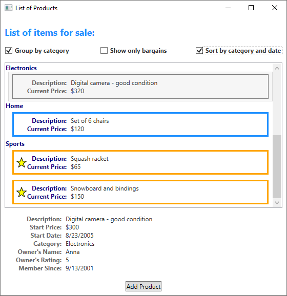
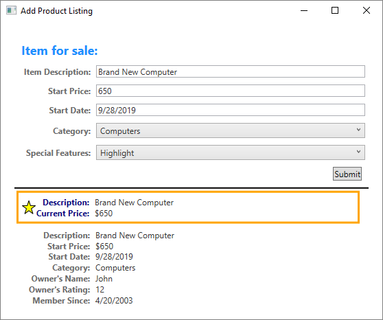
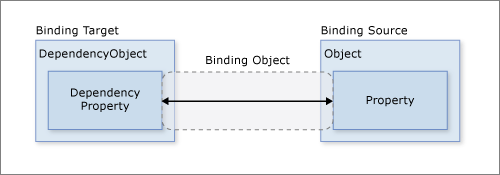
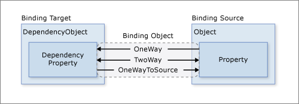
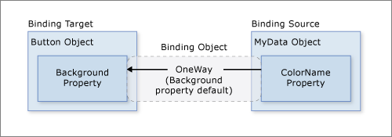
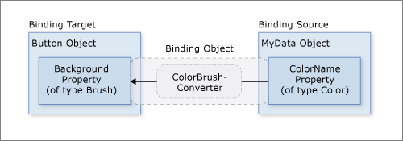
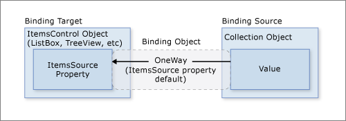
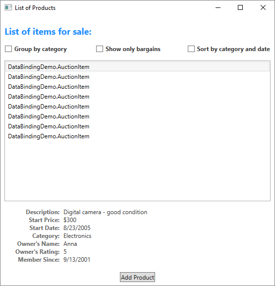

# Data Binding Overview

Windows Presentation Foundation (WPF) data binding provides a simple and consistent way for applications to present and interact with data. Elements can be bound to data from a variety of data sources in the form of common language runtime (CLR) objects and XML. Any <xref:System.Windows.Controls.ContentControl> such as <xref:System.Windows.Controls.Button> and any <xref:System.Windows.Controls.ItemsControl> such as <xref:System.Windows.Controls.ListBox> and <xref:System.Windows.Controls.ListView>, have built-in functionality to enable flexible styling of single data items or collections of data items. Sort, filter, and group views can be generated on top of the data.

The data binding functionality in WPF has several advantages over traditional models, including a broad range of properties that inherently support data binding, flexible UI representation of data, and clean separation of business logic from UI.

This article first discusses concepts fundamental to WPF data binding and then goes into the usage of the <xref:System.Windows.Data.Binding> class and other features of data binding.

## What is data binding

Data binding is the process that establishes a connection between the application UI and business logic. If the binding has the correct settings and the data provides the proper notifications, then, when the data changes its value, the elements that are bound to the data reflect changes automatically. Data binding can also mean that if an outer representation of the data in an element changes, then the underlying data can be automatically updated to reflect the change. For example, if the user edits the value in a `TextBox` element, the underlying data value is automatically updated to reflect that change.

A typical use of data binding is to place server or local configuration data into forms or other UI controls. In WPF, this concept is expanded to include the binding of a broad range of properties to a variety of data sources. In WPF, dependency properties of elements can be bound to CLR objects (including ADO.NET objects or objects associated with Web Services and Web properties) and XML data.

For an example of data binding, take a look at the following application UI from the [Data Binding Demo][data-binding-demo]:



The above is the UI of an application that displays a list of auction items. The application demonstrates the following features of data binding:

- The content of the ListBox is bound to a collection of *AuctionItem* objects. An *AuctionItem* object has properties such as *Description*, *StartPrice*, *StartDate*, *Category*, *SpecialFeatures*, etc.

- The data (*AuctionItem* objects) displayed in the `ListBox` is templated so that the description and the current price are shown for each item. The template is created by using a <xref:System.Windows.DataTemplate>. In addition, the appearance of each item depends on the *SpecialFeatures* value of the *AuctionItem* being displayed. If the *SpecialFeatures* value of the *AuctionItem* is *Color*, the item has a blue border. If the value is *Highlight*, the item has an orange border and a star. The [Data Templating](#data-templating) section provides information about data templating.

- The user can group, filter, or sort the data using the `CheckBoxes` provided. In the image above, the "Group by category" and "Sort by category and date" `CheckBoxes` are selected. You may have noticed that the data is grouped based on the category of the product, and the category name is in alphabetical order. It is difficult to notice from the image but the items are also sorted by the start date within each category. Sorting is done using a *collection view*. The [Binding to Collections](#binding-to-collections) section discusses collection views.

- When the user selects an item, the <xref:System.Windows.Controls.ContentControl> displays the details of the selected item. This experience is called the *Master-Detail scenario*. The [Master-Detail Scenario](#master-detail-binding-scenario) section provides information about this type of binding scenario.

- The type of the *StartDate* property is <xref:System.DateTime>, which returns a date that includes the time to the millisecond. In this application, a custom converter has been used so that a shorter date string is displayed. The [Data Conversion](#data-conversion) section provides information about converters.

When the user clicks the *Add Product* button, the following form comes up:



The user can edit the fields in the form, preview the product listing using the short preview and the more detailed preview panes, and then click *submit* to add the new product listing. Any existing grouping, filtering and sorting functionalities will apply to the new entry. In this particular case, the item entered in the above image will be displayed as the second item within the *Computer* category.

Not shown in this image is the validation logic provided in the *Start Date* <xref:System.Windows.Controls.TextBox>. If the user enters an invalid date (invalid formatting or a past date), the user will be notified with a <xref:System.Windows.Controls.ToolTip> and a red exclamation point next to the <xref:System.Windows.Controls.TextBox>. The [Data Validation](#data-validation) section discusses how to create validation logic.

Before going into the different features of data binding outlined above, we will first discuss in the next section the fundamental concepts that are critical to understanding WPF data binding.

## Basic data binding concepts

Regardless of what element you are binding and the nature of your data source, each binding always follows the model illustrated by the following figure:



As illustrated by the above figure, data binding is essentially the bridge between your binding target and your binding source. The figure demonstrates the following fundamental WPF data binding concepts:

- Typically, each binding has these four components: a binding target object, a target property, a binding source, and a path to the value in the binding source to use. For example, if you want to bind the content of a `TextBox` to the *Name* property of an *Employee* object, your target object is the `TextBox`, the target property is the <xref:System.Windows.Controls.TextBox.Text%2A> property, the value to use is *Name*, and the source object is the *Employee* object.

- The target property must be a dependency property. Most <xref:System.Windows.UIElement> properties are dependency properties and most dependency properties, except read-only ones, support data binding by default. (Only <xref:System.Windows.DependencyObject> types can define dependency properties and all `UIElements` derive from `DependencyObject`.)

- Although not specified in the figure, it should be noted that the binding source object is not restricted to being a custom CLR object. WPF data binding supports data in the form of CLR objects and XML. To provide some examples, your binding source may be a <xref:System.Windows.UIElement>, any list object, a CLR object that is associated with ADO.NET data or Web Services, or an XmlNode that contains your XML data. For more information, see [Binding Sources Overview](../../framework/wpf/data/binding-sources-overview.md).

As you read through other SDK articles, it is important to remember that when you are establishing a binding, you are binding a binding target *to* a binding source. For example, if you are displaying some underlying XML data in a <xref:System.Windows.Controls.ListBox> using data binding, you are binding your `ListBox` to the XML data.

To establish a binding, you use the <xref:System.Windows.Data.Binding> object. The rest of this article discusses many of the concepts associated with and some of the properties and usage of the `Binding` object.

### Direction of the data flow

As mentioned previously and as indicated by the arrow in the figure above, the data flow of a binding can go from the binding target to the binding source (for example, the source value changes when a user edits the value of a `TextBox`) and/or from the binding source to the binding target (for example, your `TextBox` content gets updated with changes in the binding source) if the binding source provides the proper notifications.

You may want your application to enable users to change the data and propagate it back to the source object. Or you may not want to enable users to update the source data. You can control the flow of data by setting the <xref:System.Windows.Data.Binding.Mode%2A> property of your <xref:System.Windows.Data.Binding> object. The following figure illustrates the different types of data flow:



- <xref:System.Windows.Data.BindingMode.OneWay> binding causes changes to the source property to automatically update the target property, but changes to the target property are not propagated back to the source property. This type of binding is appropriate if the control being bound is implicitly read-only. For instance, you may bind to a source such as a stock ticker or perhaps your target property has no control interface provided for making changes, such as a data-bound background color of a table. If there is no need to monitor the changes of the target property, using the <xref:System.Windows.Data.BindingMode.OneWay> binding mode avoids the overhead of the <xref:System.Windows.Data.BindingMode.TwoWay> binding mode.

- <xref:System.Windows.Data.BindingMode.TwoWay> binding causes changes to either the source property or the target property to automatically update the other. This type of binding is appropriate for editable forms or other fully interactive UI scenarios. Most properties default to <xref:System.Windows.Data.BindingMode.OneWay> binding, but some dependency properties (typically properties of user-editable controls such as the `TextBox.Text` property and the `CheckBox.IsChecked`) default to <xref:System.Windows.Data.BindingMode.TwoWay> binding. A programmatic way to determine whether a dependency property binds one-way or two-way by default is to get the property metadata with <xref:System.Windows.DependencyProperty.GetMetadata%2A> and then check the Boolean value of the <xref:System.Windows.FrameworkPropertyMetadata.BindsTwoWayByDefault%2A> property.

- <xref:System.Windows.Data.BindingMode.OneWayToSource> is the reverse of <xref:System.Windows.Data.BindingMode.OneWay> binding; it updates the source property when the target property changes. One example scenario is if you only need to reevaluate the source value from the UI.

- Not illustrated in the figure is <xref:System.Windows.Data.BindingMode.OneTime> binding, which causes the source property to initialize the target property, but subsequent changes do not propagate. This mode means that if the data context undergoes a change or the object in the data context changes, then the change is not reflected in the target property. This type of binding is appropriate if you are using data where either a snapshot of the current state is appropriate to use or the data is truly static. This type of binding is also useful if you want to initialize your target property with some value from a source property and the data context is not known in advance. This mode is essentially a simpler form of <xref:System.Windows.Data.BindingMode.OneWay> binding that provides better performance in cases where the source value does not change.

To detect source changes (applicable to <xref:System.Windows.Data.BindingMode.OneWay> and <xref:System.Windows.Data.BindingMode.TwoWay> bindings), the source must implement a suitable property change notification mechanism such as <xref:System.ComponentModel.INotifyPropertyChanged>. See [Implement Property Change Notification](../../framework/wpf/data/how-to-implement-property-change-notification.md) for an example of an <xref:System.ComponentModel.INotifyPropertyChanged> implementation.

The <xref:System.Windows.Data.Binding.Mode%2A> property page provides more information about binding modes and an example of how to specify the direction of a binding.

### What triggers source updates

Bindings that are <xref:System.Windows.Data.BindingMode.TwoWay> or <xref:System.Windows.Data.BindingMode.OneWayToSource> listen for changes in the target property and propagate them back to the source, known as updating the source. For example, you may edit the text of a TextBox to change the underlying source value. As described in the last section, the direction of the data flow is determined by the value of the <xref:System.Windows.Data.Binding.Mode%2A> property of the binding.

However, does your source value get updated while you are editing the text or after you finish editing the text and point your mouse away from the TextBox? The <xref:System.Windows.Data.Binding.UpdateSourceTrigger%2A> property of the binding determines what triggers the update of the source. The dots of the right arrows in the following figure illustrate the role of the <xref:System.Windows.Data.Binding.UpdateSourceTrigger%2A> property:


If the `UpdateSourceTrigger` value is <xref:System.Windows.Data.UpdateSourceTrigger.PropertyChanged>, then the value pointed to by the right arrow of <xref:System.Windows.Data.BindingMode.TwoWay> or the <xref:System.Windows.Data.BindingMode.OneWayToSource> bindings gets updated as soon as the target property changes. However, if the `UpdateSourceTrigger` value is <xref:System.Windows.Data.UpdateSourceTrigger.LostFocus>, then that value only gets updated with the new value when the target property loses focus.

Similar to the <xref:System.Windows.Data.Binding.Mode%2A> property, different dependency properties have different default <xref:System.Windows.Data.Binding.UpdateSourceTrigger%2A> values. The default value for most dependency properties is <xref:System.Windows.Data.UpdateSourceTrigger.PropertyChanged>, while the `TextBox.Text` property has a default value of <xref:System.Windows.Data.UpdateSourceTrigger.LostFocus>. `PropertyChanged` means the source updates usually happen whenever the target property changes. Instant changes are fine for CheckBoxes and other simple controls. However, for text fields, updating after every keystroke can diminish performance and it denies the user the usual opportunity to backspace and fix typing errors before committing to the new value. Which is why the <xref:System.Windows.Controls.TextBox.Text%2A> property has a default value of `LostFocus` instead of <xref:System.Windows.Data.UpdateSourceTrigger.PropertyChanged>.

See the <xref:System.Windows.Data.Binding.UpdateSourceTrigger%2A> property page for information about how to find the default value of a dependency property.

The following table provides an example scenario for each <xref:System.Windows.Data.Binding.UpdateSourceTrigger%2A> value using the <xref:System.Windows.Controls.TextBox> as an example:

| UpdateSourceTrigger value | When the Source Value Gets Updated | Example Scenario for TextBox |
| ------------------------- | ---------------------------------- | ---------------------------- |
| `LostFocus` (default for <xref:System.Windows.Controls.TextBox.Text%2A?displayProperty=nameWithType>) | When the TextBox control loses focus. | A TextBox that is associated with validation logic (see [Data Validation](#data-validation) below). |
| `PropertyChanged` | As you type into the <xref:System.Windows.Controls.TextBox>. | TextBox controls in a chat room window. |
| `Explicit` | When the application calls <xref:System.Windows.Data.BindingExpression.UpdateSource%2A>. | TextBox controls in an editable form (updates the source values only when the user clicks the submit button). |

For an example, see [Control When the TextBox Text Updates the Source](../../framework/wpf/data/how-to-control-when-the-textbox-text-updates-the-source.md).

## Creating a binding

To restate some of the concepts discussed in the previous sections, you establish a binding using the <xref:System.Windows.Data.Binding> object, and each binding usually has four components: binding target, target property, binding source, and a path to the source value to use. This section discusses how to set up a binding.

Consider the following example, in which the binding source object is a class named *MyData* that is defined in the *SDKSample* namespace. For demonstration purposes, *MyData* class has a string property named *ColorName*, of which the value is set to "Red". Thus, this example generates a button with a red background.

[!code-xaml[BindNonTextProperty](../../../samples/snippets/desktop-guide/wpf/data-binding-overview/csharp/AutoConvertPropertyToColor.xaml#BindAutoConvertColor)]

For more information on the binding declaration syntax and examples of how to set up a binding in code, see [Binding Declarations Overview](../../framework/wpf/data/binding-declarations-overview.md).

If we apply this example to our basic diagram, the resulting figure looks like the following. This figure describes a <xref:System.Windows.Data.BindingMode.OneWay> binding because the Background property supports <xref:System.Windows.Data.BindingMode.OneWay> binding by default.



You may wonder why this binding works even though the *ColorName* property is of type string while the <xref:System.Windows.Controls.Control.Background%2A> property is of type <xref:System.Windows.Media.Brush>. This binding uses default type conversion and is discussed in the [Data Conversion](#data-conversion) section.

### Specifying the binding source

Notice that in the previous example, the binding source is specified by setting the <xref:System.Windows.FrameworkElement.DataContext%2A> property on the <xref:System.Windows.Controls.DockPanel> element. The <xref:System.Windows.Controls.Button> then inherits the <xref:System.Windows.FrameworkElement.DataContext%2A> value from the <xref:System.Windows.Controls.DockPanel>, which is its parent element. To reiterate, the binding source object is one of the four necessary components of a binding. Therefore, without the binding source object being specified, the binding would do nothing.

There are several ways to specify the binding source object. Using the <xref:System.Windows.FrameworkElement.DataContext%2A> property on a parent element is useful when you are binding multiple properties to the same source. However, sometimes it may be more appropriate to specify the binding source on individual binding declarations. For the previous example, instead of using the <xref:System.Windows.FrameworkElement.DataContext%2A> property, you can specify the binding source by setting the <xref:System.Windows.Data.Binding.Source%2A?displayProperty=nameWithType> property directly on the binding declaration of the button, as in the following example:

[!code-xaml[BindNonTextPropertyCompactBinding](../../../samples/snippets/desktop-guide/wpf/data-binding-overview/csharp/AutoConvertPropertyToColor.xaml#BindAutoConvertColorCompactBinding)]

Other than setting the <xref:System.Windows.FrameworkElement.DataContext%2A> property on an element directly, inheriting the <xref:System.Windows.FrameworkElement.DataContext%2A> value from an ancestor (such as the button in the first example), and explicitly specifying the binding source by setting the <xref:System.Windows.Data.Binding.Source%2A?displayProperty=nameWithType> property on the binding (such as the button the last example), you can also use the <xref:System.Windows.Data.Binding.ElementName%2A> property or the <xref:System.Windows.Data.Binding.RelativeSource%2A> property to specify the binding source. The <xref:System.Windows.Data.Binding.ElementName%2A> property is useful when you are binding to other elements in your application, such as when you are using a slider to adjust the width of a button. The <xref:System.Windows.Data.Binding.RelativeSource%2A> property is useful when the binding is specified in a <xref:System.Windows.Controls.ControlTemplate> or a <xref:System.Windows.Style>. For more information, see [Specify the Binding Source](../../framework/wpf/data/how-to-specify-the-binding-source.md).

### Specifying the path to the value

If your binding source is an object, you use the <xref:System.Windows.Data.Binding.Path%2A> property to specify the value to use for your binding. If you are binding to XML data, you use the <xref:System.Windows.Data.Binding.XPath%2A> property to specify the value. In some cases, it may be applicable to use the <xref:System.Windows.Data.Binding.Path%2A> property even when your data is XML. For example, if you want to access the Name property of a returned XmlNode (as a result of an XPath query), you should use the <xref:System.Windows.Data.Binding.Path%2A> property in addition to the <xref:System.Windows.Data.Binding.XPath%2A> property.

For syntax information and examples, see the <xref:System.Windows.Data.Binding.Path%2A> and <xref:System.Windows.Data.Binding.XPath%2A> property pages.

Although we have emphasized that the <xref:System.Windows.Data.Binding.Path%2A> to the value to use is one of the four necessary components of a binding, in the scenarios that you want to bind to an entire object, the value to use would be the same as the binding source object. In those cases, it is applicable to not specify a <xref:System.Windows.Data.Binding.Path%2A>. Consider the following example:

[!code-xaml[EmptyBinding](../../../samples/snippets/desktop-guide/wpf/data-binding-overview/csharp/EmptyBinding.xaml#EmptyBinding)]

The above example uses the empty binding syntax: {Binding}. In this case, the <xref:System.Windows.Controls.ListBox> inherits the DataContext from a parent DockPanel element (not shown in this example). When the path is not specified, the default is to bind to the entire object. In other words, in this example, the path has been left out because we are binding the <xref:System.Windows.Controls.ItemsControl.ItemsSource%2A> property to the entire object. (See the [Binding to Collections](#binding-to-collections) section for an in-depth discussion.)

Other than binding to a collection, this scenario is also useful when you want to bind to an entire object instead of just a single property of an object. For example, if your source object is of type string and you simply want to bind to the string itself. Another common scenario is when you want to bind an element to an object with several properties.

You may need to apply custom logic so that the data is meaningful to your bound target property. The custom logic may be in the form of a custom converter (if default type conversion does not exist). See [Data Conversion](#data-conversion) for information about converters.

### Binding and BindingExpression

Before getting into other features and usages of data binding, it would be useful to introduce the <xref:System.Windows.Data.BindingExpression> class. As you have seen in previous sections, the <xref:System.Windows.Data.Binding> class is the high-level class for the declaration of a binding; the <xref:System.Windows.Data.Binding> class provides many properties that allow you to specify the characteristics of a binding. A related class, <xref:System.Windows.Data.BindingExpression>, is the underlying object that maintains the connection between the source and the target. A binding contains all the information that can be shared across several binding expressions. A <xref:System.Windows.Data.BindingExpression> is an instance expression that cannot be shared and contains all the instance information of the <xref:System.Windows.Data.Binding>.

Consider the following example where `myDataObject` is an instance of `MyData` class, `myBinding` is the source <xref:System.Windows.Data.Binding> object, and `MyData` class is a defined class that contains a string property named `MyDataProperty`. This example binds the text content of `mytext`, an instance of <xref:System.Windows.Controls.TextBlock>, to `MyDataProperty`.

[!code-csharp[CodeOnlyBinding](../../../samples/snippets/desktop-guide/wpf/data-binding-overview/csharp/ManualBinding.cs#CodeOnlyBinding)]
[!code-vb[CodeOnlyBinding](../../../samples/snippets/desktop-guide/wpf/data-binding-overview/vb/ManualBinding.vb#CodeOnlyBinding)]

You can use the same *myBinding* object to create other bindings. For example, you may use *myBinding* object to bind the text content of a check box to *MyDataProperty*. In that scenario, there will be two instances of <xref:System.Windows.Data.BindingExpression> sharing the *myBinding* object.

A <xref:System.Windows.Data.BindingExpression> object can be obtained through the return value of calling <xref:System.Windows.Data.BindingOperations.GetBindingExpression%2A> on a data-bound object. The following articles demonstrate some of the usages of the <xref:System.Windows.Data.BindingExpression> class:

- [Get the Binding Object from a Bound Target Property](../../framework/wpf/data/how-to-get-the-binding-object-from-a-bound-target-property.md)

- [Control When the TextBox Text Updates the Source](../../framework/wpf/data/how-to-control-when-the-textbox-text-updates-the-source.md)

## Data conversion

In the previous example, the button is red because its <xref:System.Windows.Controls.Control.Background%2A> property is bound to a string property with the value "Red". This string value works because a type converter is present on the <xref:System.Windows.Media.Brush> type to convert the string value to a <xref:System.Windows.Media.Brush>.

Adding this information to the figure the [Creating a Binding](#creating-a-binding) section looks like this:


However, what if instead of having a property of type string your binding source object has a *Color* property of type <xref:System.Windows.Media.Color>? In that case, in order for the binding to work you would need to first turn the *Color* property value into something that the <xref:System.Windows.Controls.Control.Background%2A> property accepts. You would need to create a custom converter by implementing the <xref:System.Windows.Data.IValueConverter> interface, as in the following example:

[!code-csharp[CodeOnlyBinding](../../../samples/snippets/desktop-guide/wpf/data-binding-overview/csharp/ColorBrushConverter.cs#ColorBrushConverter)]
[!code-vb[CodeOnlyBinding](../../../samples/snippets/desktop-guide/wpf/data-binding-overview/vb/ColorBrushConverter.vb#ColorBrushConverter)]

The <xref:System.Windows.Data.IValueConverter> reference page provides more information.

Now the custom converter is used instead of default conversion, and our diagram looks like this:



To reiterate, default conversions may be available because of type converters that are present in the type being bound to. This behavior will depend on which type converters are available in the target. If in doubt, create your own converter.

Following are some typical scenarios where it makes sense to implement a data converter:

- Your data should be displayed differently, depending on culture. For instance, you might want to implement a currency converter or a calendar date/time converter based on the values or standards used in a particular culture.

- The data being used is not necessarily intended to change the text value of a property, but is instead intended to change some other value, such as the source for an image, or the color or style of the display text. Converters can be used in this instance by converting the binding of a property that might not seem to be appropriate, such as binding a text field to the Background property of a table cell.

- More than one control or to multiple properties of controls are bound to the same data. In this case, the primary binding might just display the text, whereas other bindings handle specific display issues but still use the same binding as source information.

- So far we have not yet discussed <xref:System.Windows.Data.MultiBinding>, where a target property has a collection of bindings. For <xref:System.Windows.Data.MultiBinding>, you use a custom <xref:System.Windows.Data.IMultiValueConverter> to produce a final value from the values of the bindings. For example, color may be computed from red, blue, and green values, which can be values from the same or different binding source objects. See the <xref:System.Windows.Data.MultiBinding> class page for examples and information.

## Binding to collections

A binding source object can be treated either as a single object of which the properties contain data or as a data collection of polymorphic objects that are often grouped together (such as the result of a query to a database). So far we've only discussed binding to single objects, however, binding to a data collection is a common scenario. For example, a common scenario is to use an <xref:System.Windows.Controls.ItemsControl> such as a <xref:System.Windows.Controls.ListBox>, <xref:System.Windows.Controls.ListView>, or <xref:System.Windows.Controls.TreeView> to display a data collection, such as in the application shown in the [What Is Data Binding](#what-is-data-binding) section.

Fortunately, our basic diagram still applies. If you are binding an <xref:System.Windows.Controls.ItemsControl> to a collection, the diagram looks like this:



As shown in this diagram, to bind an <xref:System.Windows.Controls.ItemsControl> to a collection object, <xref:System.Windows.Controls.ItemsControl.ItemsSource%2A?displayProperty=nameWithType> property is the property to use. You can think of `ItemsSource` as the content of the <xref:System.Windows.Controls.ItemsControl>. The binding is <xref:System.Windows.Data.BindingMode.OneWay> because the `ItemsSource` property supports `OneWay` binding by default.

### How to implement collections

You can enumerate over any collection that implements the <xref:System.Collections.IEnumerable> interface. However, to set up dynamic bindings so that insertions or deletions in the collection update the UI automatically, the collection must implement the <xref:System.Collections.Specialized.INotifyCollectionChanged> interface. This interface exposes an event that should be raised whenever the underlying collection changes.

WPF provides the <xref:System.Collections.ObjectModel.ObservableCollection%601> class, which is a built-in implementation of a data collection that exposes the <xref:System.Collections.Specialized.INotifyCollectionChanged> interface. To fully support transferring data values from source objects to targets, each object in your collection that supports bindable properties must also implement the <xref:System.ComponentModel.INotifyPropertyChanged> interface. For more information, see [Binding Sources Overview](../../framework/wpf/data/binding-sources-overview.md).

Before implementing your own collection, consider using <xref:System.Collections.ObjectModel.ObservableCollection%601> or one of the existing collection classes, such as <xref:System.Collections.Generic.List%601>, <xref:System.Collections.ObjectModel.Collection%601>, and <xref:System.ComponentModel.BindingList%601>, among many others. If you have an advanced scenario and want to implement your own collection, consider using <xref:System.Collections.IList>, which provides a non-generic collection of objects that can be individually accessed by index and thus the best performance.

### Collection views

Once your <xref:System.Windows.Controls.ItemsControl> is bound to a data collection, you may want to sort, filter, or group the data. To do that, you use collection views, which are classes that implement the <xref:System.ComponentModel.ICollectionView> interface.

#### What Are collection views

A collection view is a layer on top of a binding source collection that allows you to navigate and display the source collection based on sort, filter, and group queries, without having to change the underlying source collection itself. A collection view also maintains a pointer to the current item in the collection. If the source collection implements the <xref:System.Collections.Specialized.INotifyCollectionChanged> interface, the changes raised by the <xref:System.Collections.Specialized.INotifyCollectionChanged.CollectionChanged> event are propagated to the views.

Because views do not change the underlying source collections, each source collection can have multiple views associated with it. For example, you may have a collection of *Task* objects. With the use of views, you can display that same data in different ways. For example, on the left side of your page you may want to show tasks sorted by priority, and on the right side, grouped by area.

#### How to create a view

One way to create and use a view is to instantiate the view object directly and then use it as the binding source. For example, consider the [Data Binding Demo][data-binding-demo] application shown in the [What Is Data Binding](#what-is-data-binding) section. The application is implemented such that the <xref:System.Windows.Controls.ListBox> binds to a view over the data collection instead of the data collection directly. The following example is extracted from the [Data Binding Demo][data-binding-demo] application. The <xref:System.Windows.Data.CollectionViewSource> class is the XAML proxy of a class that inherits from <xref:System.Windows.Data.CollectionView>. In this particular example, the <xref:System.Windows.Data.CollectionViewSource.Source%2A> of the view is bound to the *AuctionItems* collection (of type <xref:System.Collections.ObjectModel.ObservableCollection%601>) of the current application object.

[!code-xaml[CollectionView](../../../samples/snippets/desktop-guide/wpf/data-binding-overview/csharp/CollectionView.xaml#CollectionView)]

The resource *listingDataView* then serves as the binding source for elements in the application, such as the <xref:System.Windows.Controls.ListBox>:

[!code-xaml[ListBoxCollectionView](../../../samples/snippets/desktop-guide/wpf/data-binding-overview/csharp/CollectionView.xaml#ListBoxCollectionView)]

To create another view for the same collection, you can create another <xref:System.Windows.Data.CollectionViewSource> instance and give it a different `x:Key` name.

The following table shows what view data types are created as the default collection view or by <xref:System.Windows.Data.CollectionViewSource> based on the source collection type.

| Source collection type                    | Collection view type | Notes |
| ----------------------------------------- | -------------------- | ----- |
| <xref:System.Collections.IEnumerable>     | An internal type based on <xref:System.Windows.Data.CollectionView> | Cannot group items. |
| <xref:System.Collections.IList>           | <xref:System.Windows.Data.ListCollectionView> | Fastest. |
| <xref:System.ComponentModel.IBindingList> | <xref:System.Windows.Data.BindingListCollectionView> | |

#### Using a default view

Specifying a collection view as a binding source is one way to create and use a collection view. WPF also creates a default collection view for every collection used as a binding source. If you bind directly to a collection, WPF binds to its default view. This default view is shared by all bindings to the same collection, so a change made to a default view by one bound control or code (such as sorting or a change to the current item pointer, discussed later) is reflected in all other bindings to the same collection.

To get the default view, you use the <xref:System.Windows.Data.CollectionViewSource.GetDefaultView%2A> method. For an example, see [Get the Default View of a Data Collection](../../framework/wpf/data/how-to-get-the-default-view-of-a-data-collection.md).

#### Collection views with ADO.NET DataTables

To improve performance, collection views for ADO.NET <xref:System.Data.DataTable> or <xref:System.Data.DataView> objects delegate sorting and filtering to the <xref:System.Data.DataView>. Which causes sorting and filtering to be shared across all collection views of the data source. To enable each collection view to sort and filter independently, initialize each collection view with its own <xref:System.Data.DataView> object.

#### Sorting

As mentioned before, views can apply a sort order to a collection. As it exists in the underlying collection, your data may or may not have a relevant, inherent order. The view over the collection allows you to impose an order, or change the default order, based on comparison criteria that you supply. Because it is a client-based view of the data, a common scenario is that the user might want to sort columns of tabular data per the value that the column corresponds to. Using views, this user-driven sort can be applied, again without making any changes to the underlying collection or even having to requery for the collection content. For an example, see [Sort a GridView Column When a Header Is Clicked](../../framework/wpf/controls/how-to-sort-a-gridview-column-when-a-header-is-clicked.md).

The following example shows the sorting logic of the "Sort by category and date" <xref:System.Windows.Controls.CheckBox> of the application UI in the [What Is Data Binding](#what-is-data-binding) section:

[!code-csharp[AddSortChecked](../../../samples/snippets/desktop-guide/wpf/data-binding-overview/csharp/CollectionView.xaml.cs#AddSortChecked)]
[!code-vb[AddSortChecked](../../../samples/snippets/desktop-guide/wpf/data-binding-overview/vb/CollectionView.xaml.vb#AddSortChecked)]

#### Filtering

Views can also apply a filter to a collection. Meaning, that although an item might exist in the collection, this particular view is intended to show only a certain subset of the full collection. You might filter on a condition in the data. For instance, as is done by the application in the [What Is Data Binding](#what-is-data-binding) section, the "Show only bargains" <xref:System.Windows.Controls.CheckBox> contains logic to filter out items that cost $25 or more. The following code is executed to set *ShowOnlyBargainsFilter* as the <xref:System.Windows.Data.CollectionViewSource.Filter> event handler when that <xref:System.Windows.Controls.CheckBox> is selected:

[!code-csharp[ListingViewFilter](../../../samples/snippets/desktop-guide/wpf/data-binding-overview/csharp/CollectionView.xaml.cs#ListingViewFilter)]
[!code-vb[ListingViewFilter](../../../samples/snippets/desktop-guide/wpf/data-binding-overview/vb/CollectionView.xaml.vb#ListingViewFilter)]

The *ShowOnlyBargainsFilter* event handler has the following implementation:

[!code-csharp[FilterEvent](../../../samples/snippets/desktop-guide/wpf/data-binding-overview/csharp/CollectionView.xaml.cs#FilterEvent)]
[!code-vb[FilterEvent](../../../samples/snippets/desktop-guide/wpf/data-binding-overview/vb/CollectionView.xaml.vb#FilterEvent)]

If you are using one of the <xref:System.Windows.Data.CollectionView> classes directly instead of <xref:System.Windows.Data.CollectionViewSource>, you would use the <xref:System.Windows.Data.CollectionView.Filter%2A> property to specify a callback. For an example, see [Filter Data in a View](../../framework/wpf/data/how-to-filter-data-in-a-view.md).

#### Grouping

Except for the internal class that views an <xref:System.Collections.IEnumerable> collection, all collection views support the functionality of grouping, which allows the user to partition the collection in the collection view into logical groups. The groups can be explicit, where the user supplies a list of groups, or implicit, where the groups are generated dynamically depending on the data.

The following example shows the logic of the "Group by category" <xref:System.Windows.Controls.CheckBox>:

[!code-csharp[ListingGroupCheck](../../../samples/snippets/desktop-guide/wpf/data-binding-overview/csharp/CollectionView.xaml.cs#ListingGroupCheck)]
[!code-vb[ListingGroupCheck](../../../samples/snippets/desktop-guide/wpf/data-binding-overview/vb/CollectionView.xaml.vb#ListingGroupCheck)]

For another grouping example, see [Group Items in a ListView That Implements a GridView](../../framework/wpf/controls/how-to-group-items-in-a-listview-that-implements-a-gridview.md).

#### Current item pointers

Views also support the notion of a current item. You can navigate through the objects in a collection view. As you navigate, you are moving an item pointer that allows you to retrieve the object that exists at that particular location in the collection. For an example, see [Navigate Through the Objects in a Data CollectionView](../../framework/wpf/data/how-to-navigate-through-the-objects-in-a-data-collectionview.md).

Because WPF binds to a collection only by using a view (either a view you specify, or the collection's default view), all bindings to collections have a current item pointer. When binding to a view, the slash ("/") character in a `Path` value designates the current item of the view. In the following example, the data context is a collection view. The first line binds to the collection. The second line binds to the current item in the collection. The third line binds to the `Description` property of the current item in the collection.

```xaml
<Button Content="{Binding }" />
<Button Content="{Binding Path=/}" />
<Button Content="{Binding Path=/Description}" />
```

The slash and property syntax can also be stacked to traverse a hierarchy of collections. The following example binds to the current item of a collection named `Offices`, which is a property of the current item of the source collection.

```xaml
<Button Content="{Binding /Offices/}" />
```

The current item pointer can be affected by any sorting or filtering that is applied to the collection. Sorting preserves the current item pointer on the last item selected, but the collection view is now restructured around it. (Perhaps the selected item was at the beginning of the list before, but now the selected item might be somewhere in the middle.) Filtering preserves the selected item if that selection remains in view after the filtering. Otherwise, the current item pointer is set to the first item of the filtered collection view.

#### Master-Detail binding scenario

The notion of a current item is useful not only for navigation of items in a collection, but also for the master-detail binding scenario. Consider the application UI in the [What Is Data Binding](#what-is-data-binding) section again. In that application, the selection within the <xref:System.Windows.Controls.ListBox> determines the content shown in the <xref:System.Windows.Controls.ContentControl>. To put it in another way, when a <xref:System.Windows.Controls.ListBox> item is selected, the <xref:System.Windows.Controls.ContentControl> shows the details of the selected item.

You can implement the master-detail scenario simply by having two or more controls bound to the same view. The following example from the [Data Binding Demo][data-binding-demo] shows the markup of the <xref:System.Windows.Controls.ListBox> and the <xref:System.Windows.Controls.ContentControl> you see on the application UI in the [What Is Data Binding](#what-is-data-binding) section:

[!code-xaml[ListBoxContentControl](../../../samples/snippets/desktop-guide/wpf/data-binding-overview/csharp/CollectionView.xaml#ListBoxContentControl)]

Notice that both of the controls are bound to the same source, the *listingDataView* static resource (see the definition of this resource in the [How to Create a View section](#how-to-create-a-view)). This binding works because when a singleton object (the <xref:System.Windows.Controls.ContentControl> in this case) is bound to a collection view, it automatically binds to the <xref:System.Windows.Data.CollectionView.CurrentItem%2A> of the view. The <xref:System.Windows.Data.CollectionViewSource> objects automatically synchronize currency and selection. If your list control is not bound to a <xref:System.Windows.Data.CollectionViewSource> object as in this example, then you would need to set its <xref:System.Windows.Controls.Primitives.Selector.IsSynchronizedWithCurrentItem%2A> property to `true` for this to work.

For other examples, see [Bind to a Collection and Display Information Based on Selection](../../framework/wpf/data/how-to-bind-to-a-collection-and-display-information-based-on-selection.md) and [Use the Master-Detail Pattern with Hierarchical Data](../../framework/wpf/data/how-to-use-the-master-detail-pattern-with-hierarchical-data.md).

You may have noticed that the above example uses a template. In fact, the data would not be displayed the way we wish without the use of templates (the one explicitly used by the <xref:System.Windows.Controls.ContentControl> and the one implicitly used by the <xref:System.Windows.Controls.ListBox>). We now turn to data templating in the next section.

## Data templating

Without the use of data templates, our application UI in the [What Is Data Binding](#what-is-data-binding) section would look like the following image:



As shown in the example in the previous section, both the <xref:System.Windows.Controls.ListBox> control and the <xref:System.Windows.Controls.ContentControl> are bound to the entire collection object (or more specifically, the view over the collection object) of *AuctionItem*s. Without specific instructions of how to display the data collection, the <xref:System.Windows.Controls.ListBox> is displaying a string representation of each object in the underlying collection and the <xref:System.Windows.Controls.ContentControl> is displaying a string representation of the object it is bound to.

| Reference | Output |
| --------- | ------ |
| `@"System.Windows.DataTemplate?text=DataTemplates"` | @"System.Windows.DataTemplate?text=DataTemplates" |
| `<xref:System.Windows.DataTemplate?title=DataTemplates>`                | <xref:System.Windows.DataTemplate?title=DataTemplates> |
| `<xref:System.Windows.DataTemplate?text=DataTemplates>`                | <xref:System.Windows.DataTemplate?text=DataTemplates> |
| `[](xref:System.Windows.DataTemplate?title=Datatemplates)`             | [](xref:System.Windows.DataTemplate?title=Datatemplates) |

To solve that problem, the application defines @"System.Windows.DataTemplate?text=DataTemplates". As shown in the example in the previous section, the <xref:System.Windows.Controls.ContentControl> explicitly uses the *detailsProductListingTemplate* <xref:System.Windows.DataTemplate>. The <xref:System.Windows.Controls.ListBox> control implicitly uses the following <xref:System.Windows.DataTemplate> when displaying the *AuctionItem* objects in the collection:

[!code-xaml[AuctionItemDataTemplate](../../../samples/snippets/desktop-guide/wpf/data-binding-overview/csharp/CollectionView.xaml#AuctionItemDataTemplate)]

With the use of those two DataTemplates, the resulting UI is the one shown in the [What Is Data Binding](#what-is-data-binding) section. As you can see from that screenshot, in addition to letting you place data in your controls, DataTemplates allow you to define compelling visuals for your data. For example, <xref:System.Windows.DataTrigger>s are used in the above <xref:System.Windows.DataTemplate> so that *AuctionItem*s with *SpecialFeatures* value of *HighLight* would be displayed with an orange border and a star.

For more information about data templates, see the [Data Templating Overview](../../framework/wpf/data/data-templating-overview.md).

## Data validation

Most applications that take user input need to have validation logic to ensure that the user has entered the expected information. The validation checks can be based on type, range, format, or other application-specific requirements. This section discusses how data validation works in the WPF.

### Associating validation rules with a binding

The WPF data binding model allows you to associate <xref:System.Windows.Data.Binding.ValidationRules%2A> with your <xref:System.Windows.Data.Binding> object. For example, the following example binds a <xref:System.Windows.Controls.TextBox> to a property named `StartPrice` and adds a <xref:System.Windows.Controls.ExceptionValidationRule> object to the <xref:System.Windows.Data.Binding.ValidationRules%2A?displayProperty=nameWithType> property.

[!code-xaml[DataBindingLab#DefaultValidation](~/samples/snippets/csharp/VS_Snippets_Wpf/DataBindingLab/CSharp/AddProductWindow.xaml#defaultvalidation)]

A <xref:System.Windows.Controls.ValidationRule> object checks whether the value of a property is valid. WPF has the following two types of built-in <xref:System.Windows.Controls.ValidationRule> objects:

- A <xref:System.Windows.Controls.ExceptionValidationRule> checks for exceptions thrown during the update of the binding source property. In the previous example, `StartPrice` is of type integer. When the user enters a value that cannot be converted to an integer, an exception is thrown, causing the binding to be marked as invalid. An alternative syntax to setting the <xref:System.Windows.Controls.ExceptionValidationRule> explicitly is to set the <xref:System.Windows.Data.Binding.ValidatesOnExceptions%2A> property to `true` on your <xref:System.Windows.Data.Binding> or <xref:System.Windows.Data.MultiBinding> object.

- A <xref:System.Windows.Controls.DataErrorValidationRule> object checks for errors that are raised by objects that implement the <xref:System.ComponentModel.IDataErrorInfo> interface. For an example of using this validation rule, see <xref:System.Windows.Controls.DataErrorValidationRule>. An alternative syntax to setting the <xref:System.Windows.Controls.DataErrorValidationRule> explicitly is to set the <xref:System.Windows.Data.Binding.ValidatesOnDataErrors%2A> property to `true` on your <xref:System.Windows.Data.Binding> or <xref:System.Windows.Data.MultiBinding> object.

You can also create your own validation rule by deriving from the <xref:System.Windows.Controls.ValidationRule> class and implementing the <xref:System.Windows.Controls.ValidationRule.Validate%2A> method. The following example shows the rule used by the *Add Product Listing* "Start Date" <xref:System.Windows.Controls.TextBox> from the [What Is Data Binding](#what-is-data-binding) section:

[!code-csharp[DataBindingLab#2](~/samples/snippets/csharp/VS_Snippets_Wpf/DataBindingLab/CSharp/FutureDateRule.cs#2)]
[!code-vb[DataBindingLab#2](~/samples/snippets/visualbasic/VS_Snippets_Wpf/DataBindingLab/VisualBasic/FutureDateRule.vb#2)]

The *StartDateEntryForm* <xref:System.Windows.Controls.TextBox> uses this *FutureDateRule*, as shown in the following example:

[!code-xaml[DataBindingLab#CustomValidation](~/samples/snippets/csharp/VS_Snippets_Wpf/DataBindingLab/CSharp/AddProductWindow.xaml#customvalidation)]

Because the <xref:System.Windows.Data.Binding.UpdateSourceTrigger%2A> value is <xref:System.Windows.Data.UpdateSourceTrigger.PropertyChanged>, the binding engine updates the source value on every keystroke, which means it also checks every rule in the <xref:System.Windows.Data.Binding.ValidationRules%2A> collection on every keystroke. We discuss this further in the Validation Process section.

### Providing visual feedback

If the user enters an invalid value, you may want to provide some feedback about the error on the application UI. One way to provide such feedback is to set the <xref:System.Windows.Controls.Validation.ErrorTemplate%2A?displayProperty=nameWithType> attached property to a custom <xref:System.Windows.Controls.ControlTemplate>. As shown in the previous subsection, the *StartDateEntryForm* <xref:System.Windows.Controls.TextBox> uses an <xref:System.Windows.Controls.Validation.ErrorTemplate%2A> called *validationTemplate*. The following example shows the definition of *validationTemplate*:

[!code-xaml[DataBindingLab#1](~/samples/snippets/csharp/VS_Snippets_Wpf/DataBindingLab/CSharp/AddProductWindow.xaml#1)]

The <xref:System.Windows.Controls.AdornedElementPlaceholder> element specifies where the control being adorned should be placed.

In addition, you may also use a <xref:System.Windows.Controls.ToolTip> to display the error message. Both the *StartDateEntryForm* and the *StartPriceEntryForm*<xref:System.Windows.Controls.TextBox>es use the style *textStyleTextBox*, which creates a <xref:System.Windows.Controls.ToolTip> that displays the error message. The following example shows the definition of *textStyleTextBox*. The attached property <xref:System.Windows.Controls.Validation.HasError%2A?displayProperty=nameWithType> is `true` when one or more of the bindings on the properties of the bound element are in error.

[!code-xaml[DataBindingLab#14](~/samples/snippets/csharp/VS_Snippets_Wpf/DataBindingLab/CSharp/DataBindingLabApp.xaml#14)]

With the custom <xref:System.Windows.Controls.Validation.ErrorTemplate%2A> and the <xref:System.Windows.Controls.ToolTip>, the *StartDateEntryForm* <xref:System.Windows.Controls.TextBox> looks like the following when there is a validation error:


If your <xref:System.Windows.Data.Binding> has associated validation rules but you do not specify an <xref:System.Windows.Controls.Validation.ErrorTemplate%2A> on the bound control, a default <xref:System.Windows.Controls.Validation.ErrorTemplate%2A> will be used to notify users when there is a validation error. The default <xref:System.Windows.Controls.Validation.ErrorTemplate%2A> is a control template that defines a red border in the adorner layer. With the default <xref:System.Windows.Controls.Validation.ErrorTemplate%2A> and the <xref:System.Windows.Controls.ToolTip>, the UI of the *StartPriceEntryForm* <xref:System.Windows.Controls.TextBox> looks like the following when there is a validation error:


For an example of how to provide logic to validate all controls in a dialog box, see the Custom Dialog Boxes section in the [Dialog Boxes Overview](../../framework/wpf/app-development/dialog-boxes-overview.md).

### Validation process

Validation usually occurs when the value of a target is transferred to the binding source property. This transfer occurs on <xref:System.Windows.Data.BindingMode.TwoWay> and <xref:System.Windows.Data.BindingMode.OneWayToSource> bindings. To reiterate, what causes a source update depends on the value of the <xref:System.Windows.Data.Binding.UpdateSourceTrigger%2A> property, as described in the [What Triggers Source Updates](#what-triggers-source-updates) section.

The following items describe the *validation* process. If a validation error or other type of error occurs at any time during this process, the process is halted.

1. The binding engine checks if there are any custom <xref:System.Windows.Controls.ValidationRule> objects defined whose <xref:System.Windows.Controls.ValidationRule.ValidationStep%2A> is set to <xref:System.Windows.Controls.ValidationStep.RawProposedValue> for that <xref:System.Windows.Data.Binding>, in which case it calls the <xref:System.Windows.Controls.ValidationRule.Validate%2A> method on each <xref:System.Windows.Controls.ValidationRule> until one of them runs into an error or until all of them pass.

2. The binding engine then calls the converter, if one exists.

3. If the converter succeeds, the binding engine checks if there are any custom <xref:System.Windows.Controls.ValidationRule> objects defined whose <xref:System.Windows.Controls.ValidationRule.ValidationStep%2A> is set to <xref:System.Windows.Controls.ValidationStep.ConvertedProposedValue> for that <xref:System.Windows.Data.Binding>, in which case it calls the <xref:System.Windows.Controls.ValidationRule.Validate%2A> method on each <xref:System.Windows.Controls.ValidationRule> that has <xref:System.Windows.Controls.ValidationRule.ValidationStep%2A> set to <xref:System.Windows.Controls.ValidationStep.ConvertedProposedValue> until one of them runs into an error or until all of them pass.

4. The binding engine sets the source property.

5. The binding engine checks if there are any custom <xref:System.Windows.Controls.ValidationRule> objects defined whose <xref:System.Windows.Controls.ValidationRule.ValidationStep%2A> is set to <xref:System.Windows.Controls.ValidationStep.UpdatedValue> for that <xref:System.Windows.Data.Binding>, in which case it calls the <xref:System.Windows.Controls.ValidationRule.Validate%2A> method on each <xref:System.Windows.Controls.ValidationRule> that has <xref:System.Windows.Controls.ValidationRule.ValidationStep%2A> set to <xref:System.Windows.Controls.ValidationStep.UpdatedValue> until one of them runs into an error or until all of them pass. If a <xref:System.Windows.Controls.DataErrorValidationRule> is associated with a binding and its <xref:System.Windows.Controls.ValidationRule.ValidationStep%2A> is set to the default, <xref:System.Windows.Controls.ValidationStep.UpdatedValue>, the <xref:System.Windows.Controls.DataErrorValidationRule> is checked at this point. At this point any binding that has the <xref:System.Windows.Data.Binding.ValidatesOnDataErrors%2A> set to `true` is checked.

6. The binding engine checks if there are any custom <xref:System.Windows.Controls.ValidationRule> objects defined whose <xref:System.Windows.Controls.ValidationRule.ValidationStep%2A> is set to <xref:System.Windows.Controls.ValidationStep.CommittedValue> for that <xref:System.Windows.Data.Binding>, in which case it calls the <xref:System.Windows.Controls.ValidationRule.Validate%2A> method on each <xref:System.Windows.Controls.ValidationRule> that has <xref:System.Windows.Controls.ValidationRule.ValidationStep%2A> set to <xref:System.Windows.Controls.ValidationStep.CommittedValue> until one of them runs into an error or until all of them pass.

If a <xref:System.Windows.Controls.ValidationRule> does not pass at any time throughout this process, the binding engine creates a <xref:System.Windows.Controls.ValidationError> object and adds it to the <xref:System.Windows.Controls.Validation.Errors%2A?displayProperty=nameWithType> collection of the bound element. Before the binding engine runs the <xref:System.Windows.Controls.ValidationRule> objects at any given step, it removes any <xref:System.Windows.Controls.ValidationError> that was added to the <xref:System.Windows.Controls.Validation.Errors%2A?displayProperty=nameWithType> attached property of the bound element during that step. For example, if a <xref:System.Windows.Controls.ValidationRule> whose <xref:System.Windows.Controls.ValidationRule.ValidationStep%2A> is set to <xref:System.Windows.Controls.ValidationStep.UpdatedValue> failed, the next time the validation process occurs, the binding engine removes that <xref:System.Windows.Controls.ValidationError> immediately before it calls any <xref:System.Windows.Controls.ValidationRule> that has <xref:System.Windows.Controls.ValidationRule.ValidationStep%2A> set to <xref:System.Windows.Controls.ValidationStep.UpdatedValue>.

When <xref:System.Windows.Controls.Validation.Errors%2A?displayProperty=nameWithType> is not empty, the <xref:System.Windows.Controls.Validation.HasError%2A?displayProperty=nameWithType> attached property of the element is set to `true`. Also, if the <xref:System.Windows.Data.Binding.NotifyOnValidationError%2A> property of the <xref:System.Windows.Data.Binding> is set to `true`, then the binding engine raises the <xref:System.Windows.Controls.Validation.Error?displayProperty=nameWithType> attached event on the element.

Also note that a valid value transfer in either direction (target to source or source to target) clears the <xref:System.Windows.Controls.Validation.Errors%2A?displayProperty=nameWithType> attached property.

If the binding either has an <xref:System.Windows.Controls.ExceptionValidationRule> associated with it, or had the <xref:System.Windows.Data.Binding.ValidatesOnExceptions%2A> property is set to `true` and an exception is thrown when the binding engine sets the source, the binding engine checks to see if there is a <xref:System.Windows.Data.Binding.UpdateSourceExceptionFilter%2A>. You have the option to use the <xref:System.Windows.Data.Binding.UpdateSourceExceptionFilter%2A> callback to provide a custom handler for handling exceptions. If an <xref:System.Windows.Data.Binding.UpdateSourceExceptionFilter%2A> is not specified on the <xref:System.Windows.Data.Binding>, the binding engine creates a <xref:System.Windows.Controls.ValidationError> with the exception and adds it to the <xref:System.Windows.Controls.Validation.Errors%2A?displayProperty=nameWithType> collection of the bound element.

## Debugging mechanism

You can set the attached property <xref:System.Diagnostics.PresentationTraceSources.TraceLevel%2A?displayProperty=nameWithType> on a binding-related object to receive information about the status of a specific binding.

## See also

- <xref:System.Windows.Controls.DataErrorValidationRule>
- [Bind to the Results of a LINQ Query](../../framework/wpf/data/how-to-bind-to-the-results-of-a-linq-query.md)
- [Data Binding](../../framework/wpf/advanced/optimizing-performance-data-binding.md)
- [Data Binding Demo][data-binding-demo]
- [How-to articles](../../framework/wpf/data/data-binding-how-to-topics.md)
- [Bind to an ADO.NET Data Source](../../framework/wpf/data/how-to-bind-to-an-ado-net-data-source.md)

[data-binding-demo]: https://github.com/microsoft/WPF-Samples/tree/master/Sample%20Applications/DataBindingDemo "data binding demo app"
