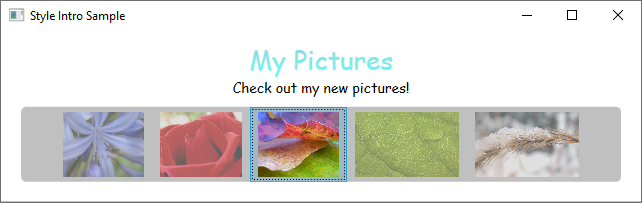
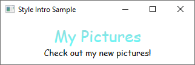
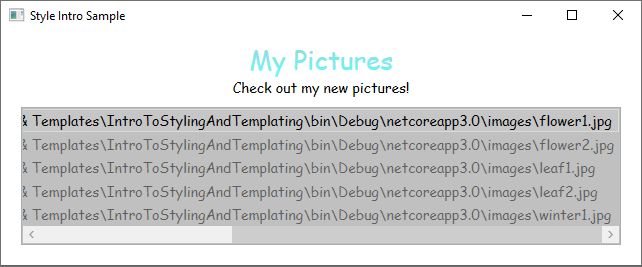
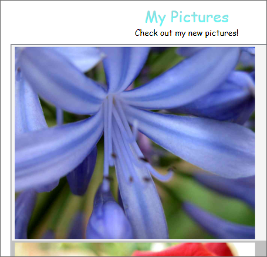
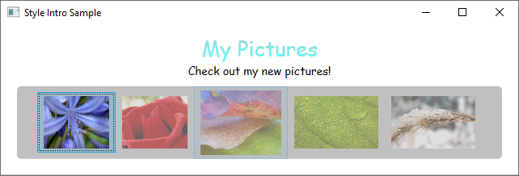

# Styles and Templates

Windows Presentation Foundation (WPF) styling and templating refer to a suite of features that allow developers and designers to create visually compelling effects along with consistent appearance for their product. Although developers and designers can customize the appearance of an application, a strong styling and templating model is necessary to allow maintenance and sharing of the appearance within and among applications. Windows Presentation Foundation (WPF) provides that model.

Another feature of the WPF styling model is the separation of presentation and logic. Meaning, designers can work on the appearance of an application by using only XAML at the same time that developers work on the programming logic by using C# or Visual Basic.

This overview focuses on the styling and templating aspects of the application and does not discuss any data binding concepts. For information about data binding, see [Data Binding Overview](../../framework/wpf/data/data-binding-overview.md).

It's important to understand resources, which are what enable styles and templates to be reused. For more information about resources, see [XAML Resources](xaml-resources-define.md).

[!INCLUDE [desktop guide under construction](../../../includes/desktop-guide-preview-note.md)]

## Sample

The sample code provided in this overview is based on a [simple photo browsing application](https://github.com/Microsoft/WPF-Samples/tree/master/Styles%20&%20Templates/IntroToStylingAndTemplating) shown in the following illustration:



This simple photo sample uses styling and templating to create a visually compelling user experience. The sample has two <xref:System.Windows.Controls.TextBlock> elements and a <xref:System.Windows.Controls.ListBox> control that is bound to a list of images.

For the complete sample, see [Introduction to Styling and Templating Sample](https://github.com/Microsoft/WPF-Samples/tree/master/Styles%20&%20Templates/IntroToStylingAndTemplating).

## Styles

You can think of a <xref:System.Windows.Style> as a convenient way to apply a set of property values to multiple elements. You can use a style on any element that derives from <xref:System.Windows.FrameworkElement> or <xref:System.Windows.FrameworkContentElement> such as a <xref:System.Windows.Window> or a <xref:System.Windows.Controls.Button>.

The most common way to declare a style is as a resource in the `Resources` section in a XAML file. Because styles are resources, they obey the same scoping rules that apply to all resources. Put simply, where you declare a style affects where the style can be applied. For example, if you declare the style in the root element of your application definition XAML file, the style can be used anywhere in your application.

For example, the following XAML code declares two styles for a `TextBlock`, one automatically applied to all `TextBlock` elements, and another that must be explicitly referenced:

[!code-xaml[SnippetDefaultTextBlockStyleBasedOn](~/samples/snippets/desktop-guide/wpf/styles-and-templates-intro/csharp/Window2.xaml#SnippetDefaultTextBlockStyleBasedOn)]

Here is an example of the styles declared above being used:

[!code-xaml[SnippetTextBlocksExplicit](~/samples/snippets/desktop-guide/wpf/styles-and-templates-intro/csharp/Window2.xaml#SnippetTextBlocksExplicit)]



For more information, see [Create a style for a control](styles-templates-create-apply-style.md).

## ControlTemplates

In WPF, the <xref:System.Windows.Controls.ControlTemplate> of a control defines the appearance of the control. You can change the structure and appearance of a control by defining a new <xref:System.Windows.Controls.ControlTemplate> for the control. In many cases, this gives you enough flexibility so that you do not have to write your own custom controls.

For more information, see [Create a template for a control](styles-templates-create-apply-template.md).

## DataTemplates

In this sample application, there is a <xref:System.Windows.Controls.ListBox> control that is bound to a list of photos:

[!code-xaml[ListBox](~/samples/snippets/desktop-guide/wpf/styles-and-templates-intro/csharp/Window3.xaml#SnippetListBox)]

This <xref:System.Windows.Controls.ListBox> currently looks like the following:



Most controls have some type of content, and that content often comes from data that you are binding to. In this sample, the data is the list of photos. In WPF, you use a <xref:System.Windows.DataTemplate> to define the visual representation of data. Basically, what you put into a <xref:System.Windows.DataTemplate> determines what the data looks like in the rendered application.

In our sample application, each custom `Photo` object has a `Source` property of type string that specifies the file path of the image. Currently, the photo objects appear as file paths.

[!code-cs[PhotoClass](~/samples/snippets/desktop-guide/wpf/styles-and-templates-intro/csharp/Photo.cs#PhotoClass)]
[!code-vb[PhotoClass](~/samples/snippets/desktop-guide/wpf/styles-and-templates-intro/vb/Photo.vb#PhotoClass)]

For the photos to appear as images, you create a <xref:System.Windows.DataTemplate> as a resource:

[!code-xaml[DataTemplate](~/samples/snippets/desktop-guide/wpf/styles-and-templates-intro/csharp/Window4.xaml#SnippetDataTemplate)]

Notice that the <xref:System.Windows.DataTemplate.DataType%2A> property is similar to the <xref:System.Windows.Style.TargetType%2A> property of the <xref:System.Windows.Style>. If your <xref:System.Windows.DataTemplate> is in the resources section, when you specify the <xref:System.Windows.DataTemplate.DataType%2A> property to a type and omit an `x:Key`, the <xref:System.Windows.DataTemplate> is applied whenever that type appears. You always have the option to assign the <xref:System.Windows.DataTemplate> with an `x:Key` and then set it as a `StaticResource` for properties that take <xref:System.Windows.DataTemplate> types, such as the <xref:System.Windows.Controls.ItemsControl.ItemTemplate%2A> property or the <xref:System.Windows.Controls.ContentControl.ContentTemplate%2A> property.

Essentially, the <xref:System.Windows.DataTemplate> in the above example defines that whenever there is a `Photo` object, it should appear as an <xref:System.Windows.Controls.Image> within a <xref:System.Windows.Controls.Border>. With this <xref:System.Windows.DataTemplate>, our application now looks like this:



The data templating model provides other features. For example, if you are displaying collection data that contains other collections using a <xref:System.Windows.Controls.HeaderedItemsControl> type such as a <xref:System.Windows.Controls.Menu> or a <xref:System.Windows.Controls.TreeView>, there is the <xref:System.Windows.HierarchicalDataTemplate>. Another data templating feature is the <xref:System.Windows.Controls.DataTemplateSelector>, which allows you to choose a <xref:System.Windows.DataTemplate> to use based on custom logic. For more information, see [Data Templating Overview](../../framework/wpf/data/data-templating-overview.md), which provides a more in-depth discussion of the different data templating features.

## Triggers

A trigger sets properties or starts actions, such as an animation, when a property value changes or when an event is raised. <xref:System.Windows.Style>, <xref:System.Windows.Controls.ControlTemplate>, and <xref:System.Windows.DataTemplate> all have a `Triggers` property that can contain a set of triggers. There are various types of triggers.

### PropertyTriggers

A <xref:System.Windows.Trigger> that sets property values or starts actions based on the value of a property is called a property trigger.

To demonstrate how to use property triggers, you can make each <xref:System.Windows.Controls.ListBoxItem> partially transparent unless it is selected. The following style sets the <xref:System.Windows.UIElement.Opacity%2A> value of a <xref:System.Windows.Controls.ListBoxItem> to `0.5`. When the <xref:System.Windows.Controls.ListBoxItem.IsSelected%2A> property is `true`, however, the <xref:System.Windows.UIElement.Opacity%2A> is set to `1.0`:

[!code-xaml[PropertyTrigger](~/samples/snippets/desktop-guide/wpf/styles-and-templates-intro/csharp/Window5.xaml#SnippetPropertyTrigger)]

This example uses a <xref:System.Windows.Trigger> to set a property value, but note that the <xref:System.Windows.Trigger> class also has the <xref:System.Windows.TriggerBase.EnterActions%2A> and <xref:System.Windows.TriggerBase.ExitActions%2A> properties that enable a trigger to perform actions.

Notice that the <xref:System.Windows.FrameworkElement.MaxHeight%2A> property of the <xref:System.Windows.Controls.ListBoxItem> is set to `75`. In the following illustration, the third item is the selected item:


### EventTriggers and Storyboards

Another type of trigger is the <xref:System.Windows.EventTrigger>, which starts a set of actions based on the occurrence of an event. For example, the following <xref:System.Windows.EventTrigger> objects specify that when the mouse pointer enters the <xref:System.Windows.Controls.ListBoxItem>, the <xref:System.Windows.FrameworkElement.MaxHeight%2A> property animates to a value of `90` over a `0.2` second period. When the mouse moves away from the item, the property returns to the original value over a period of `1` second. Note how it is not necessary to specify a <xref:System.Windows.Media.Animation.DoubleAnimation.To%2A> value for the <xref:System.Windows.ContentElement.MouseLeave> animation. This is because the animation is able to keep track of the original value.

[!code-xaml[StyleEventTriggers](~/samples/snippets/desktop-guide/wpf/styles-and-templates-intro/csharp/Window6.xaml#SnippetStyleEventTriggers)]

For more information, see the [Storyboards Overview](../../framework/wpf/graphics-multimedia/storyboards-overview.md).

In the following illustration, the mouse is pointing to the third item:



### MultiTriggers, DataTriggers, and MultiDataTriggers

In addition to <xref:System.Windows.Trigger> and <xref:System.Windows.EventTrigger>, there are other types of triggers. <xref:System.Windows.MultiTrigger> allows you to set property values based on multiple conditions. You use <xref:System.Windows.DataTrigger> and <xref:System.Windows.MultiDataTrigger> when the property of your condition is data-bound.

## Shared resources and themes

A typical Windows Presentation Foundation (WPF) application might have multiple user interface (UI) resources that are applied throughout the application. Collectively, this set of resources can be considered the theme for the application. WPF provides support for packaging user interface (UI) resources as a theme by using a resource dictionary that is encapsulated as the <xref:System.Windows.ResourceDictionary> class.

WPF themes are defined by using the styling and templating mechanism that WPF exposes for customizing the visuals of any element.

WPF theme resources are stored in embedded resource dictionaries. These resource dictionaries must be embedded within a signed assembly, and can either be embedded in the same assembly as the code itself or in a side-by-side assembly. For PresentationFramework.dll, the assembly that contains WPF controls, theme resources are in a series of side-by-side assemblies.

The theme becomes the last place to look when searching for the style of an element. Typically, the search will begin by walking up the element tree searching for an appropriate resource, then look in the application resource collection and finally query the system. This gives application developers a chance to redefine the style for any object at the tree or application level before reaching the theme.

You can define resource dictionaries as individual files that enable you to reuse a theme across multiple applications. You can also create swappable themes by defining multiple resource dictionaries that provide the same types of resources but with different values. Redefining these styles or other resources at the application level is the recommended approach for skinning an application.

To share a set of resources, including styles and templates, across applications, you can create a XAML file and define a <xref:System.Windows.ResourceDictionary> that includes reference to a `shared.xaml` file:

```xaml
<ResourceDictionary.MergedDictionaries>
  <ResourceDictionary Source="Shared.xaml" />
</ResourceDictionary.MergedDictionaries>
```

It is the sharing of `shared.xaml`, which itself defines a <xref:System.Windows.ResourceDictionary> that contains a set of style and brush resources, that enables the controls in an application to have a consistent look.

For more information, see [Merged Resource Dictionaries](../../framework/wpf/advanced/merged-resource-dictionaries.md).

If you are creating a theme for your custom control, see the External Control Library section of the [Control Authoring Overview](../../framework/wpf/controls/control-authoring-overview.md).

## See also

- [Pack URIs in WPF](../../framework/wpf/app-development/pack-uris-in-wpf.md)
- [How to: Find ControlTemplate-Generated Elements](../../framework/wpf/controls/how-to-find-controltemplate-generated-elements.md)
- [Find DataTemplate-Generated Elements](../../framework/wpf/data/how-to-find-datatemplate-generated-elements.md)
