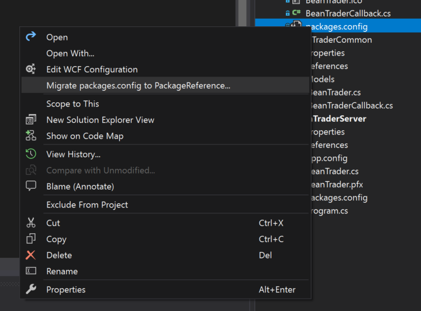
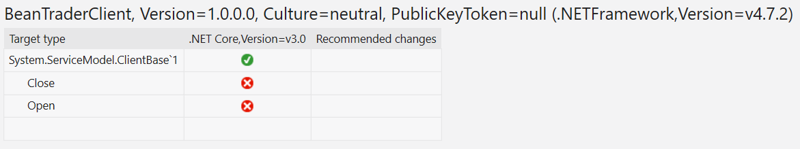
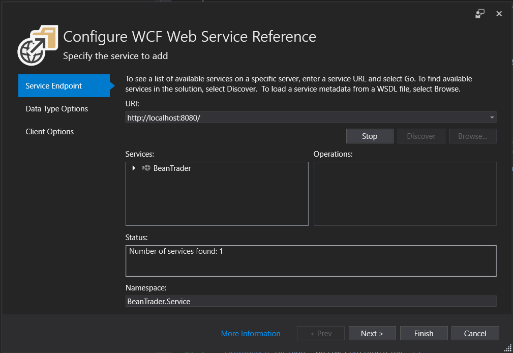

# Migrating WPF Apps to .NET Core 3

In this guide, we will look at the steps necessary to migrate a WPF app to .NET Core 3. If you don't have a WPF app on hand to port, but would like to try the process out, you can use the Bean Trader sample app available on [GitHub][sample-github]. The original app (targeting .NET Framework 4.7.2) is available in the NetFx\BeanTraderClient folder. This guide explains the steps necessary to port apps in general, first, and then walks through the specific changes to apply that step to the Bean Trader sample.

The steps used in this tutorial to migrate to .NET Core are:

1. Prepare by understanding dependencies and updating NuGet dependencies
    1. Upgrade NuGet dependencies to use the `<PackageReference>` format
    1. Review top-level NuGet dependencies for .NET Core or .NET Standard compatibility
    1. Upgrade NuGet packages to newer versions, if needed
    1. Use the [.NET Portability Analyzer][apiport] to understand .NET dependencies
1. Migrate the project file to the new SDK-style format
    1. Choose whether to target both .NET Core and .NET Framework or only .NET Core
    1. Copy relevant project file properties and items to the new project file
1. Fix build issues
    1. Add a reference to the [Microsoft.Windows.Compatibility] package
    1. Find and fix API-level differences
    1. Remove app.config sections other than appSettings or connectionStrings
    1. Regenerate generated code, if needed
1. Runtime testing
    1. Confirm the ported app works as expected
    1. Beware of NotSupportedExceptions

## About the sample

This guide references the [Bean Trader sample app][sample-github] because it uses a variety of dependencies similar to those real-world WPF apps might have. The app isn't particularly large (~2,000 lines of code), but is meant to be a step up from 'Hello World' in terms of complexity so that we can see some issues users may encounter while porting real applications. The app communicates with a WCF service so, in order for it to run properly, so you will also need to run the BeanTraderServer project (available in the same GitHub repository) and make sure the BeanTraderClient's configuration points at the correct endpoint (by default, the sample assumes that the server is 
running on the same machine at http://localhost:8090, which will be true if you just launch BeanTraderServer locally).

Keep in mind that this sample app is meant to demonstrate .NET Core porting challenges and solutions. It's not meant to demonstrate WPF best practices. In fact, it deliberately includes some anti-patterns to make sure we encounter at least a couple interesting challenges while porting.

## Step 1: Getting ready

The primary challenge with migrating a .NET Framework app to .NET Core is always that it's dependencies may work differently (or not work at all!) on .NET Core. Migration is much easier than it used to be - many NuGet packages now target .NET Standard and, starting with .NET Core 2.0, the .NET Framework and .NET Core surface areas have become quite similar. Even so, some differences (both in support from NuGet packages and in available .NET APIs) remain. The first step in migrating is to review the app's dependencies and make sure references are in a format that's easily migrated to .NET Core.

### Upgrade to `<PackageReference>` NuGet references

Older .NET Framework projects typically list their NuGet dependencies in a packages.config file. The new SDK-style project file format references NuGet packages differently, though. It uses [`<PackageReference>`][package-reference] elements in the csproj file itself (rather than in a separate config file) to reference NuGet dependencies.

When migrating, there are two advantages to using `<PackageReference>`-style references:

1. This is the style of NuGet reference that will be required for the new .NET Core project file. If you're already using `<PackageReference>`, those project file elements can be copied and pasted directly into the new project.
1. Unlike a packages.config file, `<PackageReference>` elements only refer to the top-level dependencies that your project depends on directly. All other transitive NuGet packages will be determined at restore time and recorded in the autogenerated obj\project.assets.json file. This makes it much easier to reason about what dependencies your project has, which is useful when determining whether the necessary dependencies will work on .NET Core or not.

So, the first step to migrating a .NET Framework app to .NET Core is to update it to use `<PackageReference>` NuGet references. Visual Studio [makes this simple][package-reference-migration]. Just right-click on the project's packages.config file in Visual Studio's solution explorer and select 'Migrate packages.config to PackageReference'.



A dialog will appear showing calculated top-level NuGet dependencies and asking which other NuGet packages should be promoted to top-level. None of these other packages need to be top-level for the Bean Trader sample, so you can uncheck all of those boxes. Then, click 'Ok' and the packages.config file will be removed and `<PackageReference>` elements will be added to the project file.

`<PackageReference>`-style references don't store NuGet packages locally in a 'packages' folder (they are stored globally, instead, as an optimization) so, after the migration completes, you will need to edit the csproj file and remove any `<Analyzer>` elements referring to the analyzers that previously came from the ..\packages directory. Don't worry - since we still have the NuGet package references, the analyzers will be included in the project. We just need to clean up the old packages.config-style `<Analyzer>` elements.

### Review NuGet packages

Now that it's easy to see the top-level NuGet packages the project depends on, you can review whether those packages will be available on .NET Core or not.

You can know whether a package supports .NET Core by looking at its dependencies on nuget.org. The community-created fuget.org site also shows this information prominently at the top of the package information page.

When targeting .NET Core 3, any packages targeting .NET Core or .NET Standard should work (since .NET Core implements the .NET Standard surface area). In some cases, the specific version of a package that's used won't target .NET Core or .NET Standard but newer versions will. In this case, you should consider upgrading to the latest version of the package.

You can use packages targeting .NET Framework, as well, but that introduces some risk. .NET Core to .NET Framework dependencies are allowed because .NET Core and .NET Framework surface areas are similar enough that such dependencies *often* work. However, if the package tries to use a .NET API that is not present in .NET Core, you will encounter a runtime exception. Because of that, you should only reference .NET Framework packages when no other options are available and understand that doing so imposes a test burden.

If there are packages referenced that don't target .NET Core or .NET Standard, you will have to think about other alternatives:

* Are there other similar packages that can be used instead? Sometimes NuGet authors publish separate '.Core' versions of their libraries specifically targeting .NET Core. Enterprise Library packages are an example of the community publishing ".NetCore" alternatives. In other cases, newer SDKs for a particular service (sometimes with significantly different package names) are available for .NET Standard.
* If no alternatives are available, you can proceed using the .NET Framework-targeted packages, bearing in mind that you will need to test them thoroughly once running on .NET Core.

In the case of the Bean Trader sample, we have the following top-level NuGet dependencies:

* [**Castle.Windsor, version 4.1.1**][castle-windsor]. This package targets .NET Standard 1.6, so it will work on .NET Core.
* [**Microsoft.CodeAnalysis.FxCopAnalyzers, version 2.6.3**][ms-ca-fxcop]. This is a [meta-package][meta-package] so it's not immediately obvious which platforms it supports, but [documentation][fxcop-docs] indicates that its newest version (2.9.2) will work for both .NET Framework and .NET Core.
* [**Nito.AsyncEx, version 4.0.1**][nito-asyncex]. This package does not target .NET Core, but the newer 5.0 version does. This is common when migrating because many NuGet packages have added .NET Standard support recently, but older project versions will only target .NET Framework. If the version difference is only a minor version difference, it's often easy to upgrade to the newer version. Because this is a major version change, we will need to be cautious upgrading since there could be breaking changes in the package. There is a path forward, though, which is good.
* [**MahApps.Metro, version 1.6.5**][mahapps-metro]. This package, also, does not target .NET Core, but has a newer pre-release (2.0-alpha) that does. Again, we will have to look out for breaking changes, but the newer package is encouraging.

The Bean Trader sample's NuGet dependencies all either target .NET Standard/.NET Core or have newer versions that do, so there are unlikely to be any blocking issues here. 

### Upgrade NuGet Packages

If possible, it would be good to upgrade the versions of any packages that only target .NET Core or .NET Standard with more recent versions at this point (with the project still targeting .NET Framework) to discover and address any breaking changes early.

If you would rather not make any material changes to the existing .NET Framework version of the app, this can wait until we have a new project file targeting .NET Core. However, upgrading the NuGet packages to .NET Core-compatible versions ahead of time makes the migration process even easier once it comes time to create the new project file and reduces the number of differences between the .NET Framework and .NET Core versions of the app.

In the case of the Bean Trader sample, all of the necessary upgrades can be made easily (using Visual Studio's NuGet package manager) with one exception: upgrading from MahApps.Metro 1.6.5 to 2.0 reveals breaking changes related to theme and accent management APIs. 

Ideally, the app would be updated to use the newer version of the package (since that is more likely to work on .NET Core). In some cases, though, that may not be feasible. In this case, let's not upgrade MahApps.Metro becase the necessary changes are non-trivial and this tutorial is supposed to focus on migrating to .NET Core 3, not to MahApps.Metro 2. Also, this is a low-risk .NET Framework dependency because the Bean Trader app only exercises a small part of MahApps.Metro. It will, of course, require testing to make sure everything's working once the migration is complete. If this were a real-world scenario, it would be good to file an issue to track the work to move to MahApps.Metro version 2.0 since not doing the migration now leaves behind some technical debt.

Once the NuGet packages are updated to recent versions, the `<PackageReference>` item group in the Bean Trader sample's project file should look like this:

```xml
<ItemGroup>
  <PackageReference Include="Castle.Windsor">
    <Version>4.1.1</Version>
  </PackageReference>
  <PackageReference Include="MahApps.Metro">
    <Version>1.6.5</Version>
  </PackageReference>
  <PackageReference Include="Microsoft.CodeAnalysis.FxCopAnalyzers">
    <Version>2.9.2</Version>
  </PackageReference>
  <PackageReference Include="Nito.AsyncEx">
    <Version>5.0.0</Version>
  </PackageReference>
</ItemGroup>
```

### .NET Framework portability analysis

Once you understand the state of your project's NuGet dependencies, the next thing to consider is .NET Framework API dependencies. The [.NET Portability Analyzer][apiport] tool is useful for understanding which of the .NET APIs your project uses are available on other .NET platforms.

The tool comes as a [Visual Studio plugin][apiport-plugin], a [command line tool][apiport-releases], or wrapped in a [simple GUI][apiport-ui] which simplifies its options. You can read more about using the .NET Portability Analyzer (API Port) via the GUI in [this blog post](porting-blog-post). If you prefer to use the command line, the necessary steps are:

1. Download the [.NET Portability Analyzer][apiport-releases] if you don't already have it.
1. Make sure the .NET Framework app to be ported builds successfully (this is a good idea prior to migration anyhow!).
1. Run API Port with a command line like this:
    1. `ApiPort.exe analyze -f <PathToBeanTraderBinaries> -r html -r excel -t ".NET Core"`
    1. The `-f` argument specifies the path containing the binaries to analyze. The `-r` argument specifies which output file format you want. The `-t` argument specifies which .NET platform to analyze API usage against. In this case, you want .NET Core.

When you open the HTML report, the first section will list all of the binaries that were analyzed and what percentage of the .NET APIs they use are available on the targeted platform. The percentage is not very meaningful by itself. What's more useful is to see the specific APIs that are missing. To do that, either click an assembly name or scroll down to the reports for individual assemblies.

You only need to be concerned about assemblies that you own the source code for. In the Bean Trader ApiPort report, for example, there are a lot of binaries listed, but most of them belong to NuGet packages. Castle.Windsor shows that it depends on some System.Web APIs that are missing in .NET Core. This isn't a concern, though, because we previously verified that Castle.Windsor supports .NET Core. It is common for NuGet packages to have different binaries for use with different .NET platforms, so whether the .NET Framework version of Castle.Windsor uses System.Web APIs or not is irrelevant as long as the package also targets .NET Standard or .NET Core (which it does).

In the case of the Bean Trader sample, the only binary that we need to consider is BeanTraderClient and the report shows that only two .NET APIs are missing - `System.ServiceModel.ClientBase<T>.Close` and `System.ServiceModel.ClientBase<T>.Open`.



These are unlikely to be blocking issues because WCF Client APIs are (mostly) supported on .NET Core, so there must be alternatives available for these central APIs. In fact, looking at `System.ServiceModel`'s .NET Core surface area (using <https://apisof.net>), we see that there are async alternatives in .NET Core instead.

Based on this report and the previous NuGet dependency analysis, it looks like there should be no major issues migrating the Bean Trader sample to .NET Core. We're ready for the next step in which we'll actually start the migration.

## Step 2: Migrating the project file

If your app isn't using the new [SDK-style project file format][sdk-csproj], you will need a new project file to target .NET Core. You can replace the existing csproj file or, if you prefer to keep the existing project untouched in its current state, you can add a new csproj file targeting .NET Core. You can build versions of the app for .NET Framework and .NET Core with a single SDK-style project file with [multi-targeting][multitargeting] (specifying multiple `<TargetFrameworks>` targets).

To create the new project file, you can create a new WPF project in Visual Studio or use the `dotnet new wpf` command in a temporary directory to generate the project file and then copy/rename it to the correct location. There is also a community-created tool [CsprojToVs2017] that can automate some of the project file migration. The tool is helpful but still needs a human to review the results to make sure all the details of the migration are correct. One particular area that the tool doesn't handle optimally is migrating NuGet packages from packages.config files. If the tool runs on a project file that still uses a packages.config file to reference NuGet packages, it will migrate to `<PackageReference>` elements automatically, but will add `<PackageReference>` elements for *all* of the packages instead of just for top-level ones. If you have already migrated to`<PackageReference>` elements with Visual Studio, though (as we have done in this sample), then the tool can help with the rest of the conversion. Like Scott Hanselman recommends in [his blog post on migrating csproj files][csproj-porting-blog], porting by hand is educational and will give better results if you only have a few projects to port. But if you are porting dozens or hundreds of project files, then a tool like [CsprojToVs2017] can be a big help.

To create a new csproj file for the Bean Trader sample, run `dotnet new wpf` in a temporary directory and move the generated csproj file into the BeanTraderClient folder and rename it BeanTraderClient.Core.csproj.

Because the new project file format automatically includes C# files, resx files, and XAML files that it finds in or under its directory, the project file is already almost complete! To finish the migration, open the old and new project files side-by-side and look through the old one to see if any information it contains needs to be migrated. In the Bean Trader sample case, the following items should be copied to the new project:

* The `<RootNamespace>`, `<AssemblyName>`, and `<ApplicationIcon>` properties should all be copied.
* We also need to add a `<GenerateAssemblyInfo>false</GenerateAssemblyInfo>` property to the new project file since the Bean Trader sample includes assembly-level attributes (like `[AssemblyTitle]`) in an AssemblyInfo.cs file. By default, new SDK-style projects will auto-generate these attributes based on properties in the csproj file. Because we don't want that to happen in this case (the auto-generated attributes would conflict with those from AssemblyInfo.cs), we disable the auto-generated attributes with `<GenerateAssemblyInfo>`.
* Although resx files are automatically included as embedded resources, other `<Resource>` items like images are not. So, copy the `<Resource>` elements for embedding image and icon files. We can simplify the png references to a single line by using the new project file format's support for globbing patterns: `<Resource Include="**\*.png" />`.
* Similarly, `<None>` items will be included automatically, but they will not be copied to the output directory, by default. Because the Bean Trader project includes a `<None>` item that *is* copied to the output directory (using `PreserveNewest` behaviors), we need to update the automatically populated `<None>` item for that file, like this:

    ```XML
    <None Update="BeanTrader.pfx">
      <CopyToOutputDirectory>PreserveNewest</CopyToOutputDirectory>
    </None>    
    ```

* The Bean Trader sample includes a XAML file (Default.Accent.xaml) as `Content` (rather than as a `Page`) because themes and accents defined in this file are loaded from the file's XAML at runtime, rather than being embedded in the app itself. The new project system automatically includes this file as a `<Page>`, though, since it's a XAML file. So, we need to both remove the XAML file as a page (`<Page Remove="**\Default.Accent.xaml" />`) and add it as content:

    ```XML
    <Content Include="Resources\Themes\Default.Accent.xaml">
        <CopyToOutputDirectory>PreserveNewest</CopyToOutputDirectory>
    </Content>
    ```

* Finally, add NuGet references by copying the `<ItemGroup>` with all the `<PackageReference>` elements. If we hadn't previously upgraded the NuGet packages to .NET Core-compatible versions, we could do that now that the package references are in a .NET Core-specific project.

At this point, it should be possible to add the new project to the BeanTrader solution and open it in Visual Studio. The project should look correct in the solution explorer and `dotnet restore BeanTraderClient.Core.csproj` should successfully restore packages (with two expected warnings related to the MahApps.Metro version we're using targeting .NET Framework).

Although it is possible to keep both project files side-by-side (and may even be desirable if you want to keep building the old project exactly as it was), it complicates the migration process (the two projects will try to use the same bin and obj folders) and usually isn't necessary. If you want to build for both .NET Core and .NET Framework targets, you can replace the `<TargetFramework>netcoreapp3.0</TargetFramework>` property in the new project file with `<TargetFrameworks>netcoreapp3.0;net472</TargetFrameworks>` instead. For the Bean Trader sample, delete the old project file (BeanTraderClient.csproj) since it's no longer needed. If you prefer to keep both project files for your own projects, that is ok but be sure to have them build to different output and intermediate output paths.

## Step 3: Fix build issues

The third step of the porting process is getting the project to build. For some apps, they will already build successfully once the project file is converted to an SDK-style project. If that's the case for your app, congratulations! You can go on to step 4. Other apps will need some updates to get them building for .NET Core. If you try to run `dotnet build` on the Bean Trader sample project now, for example, (or build it in VS), there will be about 100 errors, but we'll get them fixed up quickly.

### System.ServiceModel references and Microsoft.Windows.Compatibility

A common source of errors is missing references for APIs that are available for .NET Core but not automatically included in the .NET Core App metapackage. To address this, you should reference the [Microsoft.Windows.Compatibility] package. The compatibility package includes a broad set of APIs that are common in Windows desktop apps such as WCF client, directory services, registry, configuration, ACLs APIs, and more.

In the case of the Bean Trader sample, the majority of the build errors are due to missing System.ServiceModel types. These could be addressed by referencing the necessary WCF NuGet packages. WCF client APIs are among those present in the [Microsoft.Windows.Compatibility] package, though, so referencing the compatibility package is an even better solution (since it also addresses any issues related to APIs besides the WCF ones that the compatibility package makes available). The [Microsoft.Windows.Compatibility] package helps in most .NET Core 3 WPF and WinForms porting scenarios. After adding the NuGet reference to Microsoft.Windows.Compatibility, only one build error remains!

### Cleaning up unused files

One type of migration issue that may seem obvious but comes up pretty often in practice is issues related to C# and XAML files that weren't previously included in the build getting picked up by the new SDK-style projects that include *all* source automatically.

The next build error we see in the Bean Trader sample refers to a bad interface implementation in OldUnusedViewModel.cs. The file name is a hint, but on inspecting we find that, in fact, this source file is incorrect. It didn't cause issues previously because it wasn't included in the original .NET Framework project. Source files that were present on disk but not included in the old csproj get included automatically now. 

For one-off issues like this, it's easy to compare to the previous csproj to confirm that the file isn't needed and then either `<Compile Remove="" />` it or, if the source file isn't needed anywhere anymore, delete it. In this case, it's safe to just delete OldUnusedViewModel.cs.

If you have many source files that would need to be excluded this way, you can disable auto-inclusion of C# files by setting the `<EnableDefaultCompileItems>` property to false in the project file. Then, you can copy `<Compile Include>` items from the old project file to the new one in order to only build sources you intended to include. Similarly, `<EnableDefaultPageItems>` can be used to turn off auto-inclusion of XAML pages and `<EnableDefaultItems>` can control both with a single property.

### A brief aside on multi-pass compilers

After removing the offending file from the Bean Trader sample, we can re-build and will get four errors. Didn't we use to have one? Why did the number of errors go up? The C# compiler is a [multi-pass compiler][multi-pass-compiler]. This means that it goes through each source file twice* - first the compiler just looks at metadata and declarations in each source file and identifies any declaration-level problems. Those are the errors we've just fixed. Then, it goes through the code again to build the C# source into IL (those are this second set of errors that we're seeing now). 

*`*` In reality, the C# compiler does more than just two passes (as explained in [Eric Lippert's blog on the topic][multi-pass-compiler]),but the end result is that compiler errors for large code changes like this tend to come in two waves.*

### Third-party dependency fix-ups (Castle.Windsor)

Another class of issue that comes up in some migration scenarios is API differences between .NET Framework and .NET Core versions of dependencies. Even if a NuGet package targets both .NET Framework and .NET Standard or .NET Core, there may be different libraries for use with different .NET targets. This allows the packages to support many different .NET platforms which may require different implementations. It also means that there may be small API differences in the libraries when targeting different .NET platforms.

The next set of errors we see in the Bean Trader sample are related to Castle.Windsor APIs. The .NET Core Bean Trader project is using the same version of Castle.Windsor as the .NET Framework-targeted project (4.1.1), but the implementations for those two platforms are slightly different.

In this case, we see the following issues that need fixed up:

1. `Castle.MicroKernel.Registration.Classes.FromThisAssembly` is not available on .NET Core. There is, however, the very similar API `Classes.FromAssemblyContaining` available, so we can replace both uses of `Classes.FromThisAssembly()` with calls to `Classes.FromAssemblyContaining(t)` where `t` is the type making the call.
1. Similarly, in Bootstrapper.cs, `Castle.Windsor.Installer.FromAssembly.This` is unavailable on .NET Core. Instead, that call can be replaced with `FromAssembly.Containing(typeof(Bootstrapper))`.

### Updating WCF client usage

Having fixed the Castle.Windsor differences, the last remaining build error in the .NET Core Bean Trader project are that `BeanTraderServiceClient` (which derives from `DuplexClientBase`) does not have an `Open` method. This is not surprising since this is an API that was highlighted by the .NET Portability Analzyer at the beginning of this migration process. Looking at `BeanTraderServiceClient` draws our attention to a larger issue, though. This WCF client was auto-generated by the [Svcutil.exe][svcutil] tool. 

**WCF clients generated by Svcutil are meant for use on .NET Framework.** 

Solutions that use svcutil-generated WCF clients will need to regenerate .NET Standard-compatible clients for use with .NET Core. One of the main reasons the old clients won't work is that they depend on app configuration for defining WCF bindings and endpoints. Because .NET Standard WCF APIs can work cross-platform (where System.Configuration APIs aren't available), WCF clients for .NET Core and .NET Standard scenarios must define bindings and endpoints programmatically instead of in configuration. 

In fact, any WCF client usage that depends on the `<system.serviceModel>` app.config section (whether created with Svcutil or manually) will need changed to work on .NET Core. 

There are two ways to automatically generate .NET Standard-compatible WCF clients:

* The [dotnet-svcutil] tool is a .NET Core CLI tool that generates WCF clients similar to how Svcutil worked previously.
* Visual Studio can generate WCF clients using the [WCF Web Service Reference][wcf-connected-service] option of its Connected Services feature.

Either approach works well. Alternatively, of course, you could write the WCF client code yourself. For this sample, I chose to use the Visual Studio Connected Service feature. To do that, right click on the BeanTraderClient.Core project in Visual Studio's solution explorer and select Add -> Connected Service. Next, choose the WCF Web Service Reference Provider.This will bring up a dialog where you can specify the address of the backend Bean Trader web service (localhost:8080 if you are running the server locally) and the namespace that generated types should use (BeanTrader.Service, for example).



After clicking the Finish button, a new 'Connected Services' node is added to the project and a Reference.cs file is added under that node containing the new .NET Standard WCF client for accessing the Bean Trader service. If you look at the `GetEndpointAddress` or `GetBindingForEndpoint` methods in that file, you will see that bindings and endpoints are now generated programmatically (instead of via app config). The 'Add Connected Services' feature may also add references to some System.ServiceModel packages in the project file which aren't needed (since all necessary WCF packages are included via Microsoft.Windows.Compatibility). Check the csproj and if any extra System.ServiceModel `<PackageRefernce>` items have been added, remove them.

Our project has new WCF client classes now (in Reference.cs), but it also still has the old ones (in BeanTrader.cs). There are two options at this point:

1. If you want to be able to build the original .NET Framework project (alongside the new .NET Core-targeted one), you can use a `<Compile Remove="BeanTrader.cs" />` item in the .NET Core project's csproj file so that the .NET Framework and .NET Core versions of the app use different WCF clients. This has the advantage of leaving the existing .NET Framework project unchanged, but has the disadvantage that code using the generated WCF clients may need to be slightly different in the .NET Core case than it was in the .NET Framework project, so you will likely need to use `#if` directives to conditionally compile some WCF client usage (creating clients, for example) to work one way when built for .NET Core and another way when built for .NET Framework.
1. If, on the other hand, some code churn in the existing .NET Framework project is acceptable, you can remove BeanTrader.cs all together. Because the new WCF client is built for .NET Standard, it will work in both .NET Core and .NET Framework scenarios. If you are building for .NET Framework in addition to .NET Core (either by multi-targeting or by having two csproj files), you can use this new Reference.cs file for both targets. This approach has the advantage that the code won't need to bifurcate to support two different WCF clients - the same code will be used everywhere. The drawback, of course, is that it involves changing the (presumably stable) .NET Framework project.

In the case of the Bean Trader sample, we can make small changes to the original project if it makes migration easier, so follow these steps to reconcile WCF client usage:

1. Add the new Reference.cs file to the .NET Framework BeanTraderClient.csproj project using the 'Add existing item' context menufrom the solution explorer. Be sure to add 'as link' so that the same file is used by both projects (as opposed to copying the C# file). If you are building for both .NET Core and .NET Framework with a single csproj (via multi-targeting) then, of course, this step isn't necessary.
1. Delete BeanTrader.cs.
1. The new WCF client is very similar to the old one, but a number of namespaces in the generated code are different. Because of this, it is necessary to update the project so that WCF client types are used from BeanTrader.Service (or whatever namespace name you chose) instead of BeanTrader.Model or without a namespace. Building BeanTraderClient.Core.csproj will help to identify where these changes need to be made. Fixes will be needed both in C# and in XAML source files.
1. Finally, you will discover that there is an error in BeanTraderServiceClientFactory.cs because the available constructors for the `BeanTraderServiceClient` type have changed. It used to be possible to supply an `InstanceContext` argument (which was created using a `CallbackHandler` from the Castle.Windsor IoC container). The new constructors create new `CallbackHandler`s. There are, however, constructors in `BeanTraderServiceClient`'s base type that match what we want. Since the auto-generated WCF client code all exists in partial classes, we can easily extend it. To do this, create a new file called BeanTraderServiceClient.cs and create a partial class with that same name (using the BeanTrader.Service namespace). Then, add one constructor to the partial type as shown here:

    ```CSharp
    public BeanTraderServiceClient(System.ServiceModel.InstanceContext callbackInstance) :
        base(callbackInstance, EndpointConfiguration.NetTcpBinding_BeanTraderService)
            { }
    ```

With those changes made, the Bean Trader sample will now be using a new .NET Standard-compatible WCF client and we can make the final fix of changing the `Open` call in TradingService.cs to use `await OpenAsync`, instead. 

With the WCF issues addressed, the .NET Core version of the Bean Trader sample now builds cleanly!

## Step 4: Runtime testing

It's easy to forget that migration work isn't done as soon as the project builds cleanly against .NET Core. It's important to leave time for testing the ported app, too. Once things build successfully, make sure the app runs and works as expected, especially if you are using any packages targeting .NET Framework.

Let's try launching the newly-ported Bean Trader app and see what happens. The app doesn't get very far before failing with the following exception:

```
System.Configuration.ConfigurationErrorsException: 'Configuration system failed to initialize'

Inner Exception
ConfigurationErrorsException: Unrecognized configuration section system.serviceModel.
```

This makes sense, of course. Remember that WCF no longer uses app configuration, so the old system.serviceModel section of the app.config file needs to be removed. The updated WCF client includes all of the same information in its code, so the config section isn't needed anymore. If you wanted the WCF endpoint to be configurable in app.config, you could add it as an app setting and update the WCF client code to retrieve the WCF service endpoint from configuration.

After removing the system.serviceModel section of app.config, the app launches but fails with another exception when a user signs in:

```
System.PlatformNotSupportedException: 'Operation is not supported on this platform.'
```

The unsupported API is `Func<T>.BeginInvoke`. As explained in [dotnet/corefx#5940][begininvoke-issue], .NET Core doesn't support the `BeginInvoke` and `EndInvoke` methods on delegate types due to underlying remoting dependencies. This issue (and its fix) is explained in more detail in a [blog post][begininvoke-blog], but the gist is that `BeginInvoke` and `EndInvoke` calls should be replaced with `Task.Run` (or async alternatives, if possible). Applying the general solution here, the `BeginInvoke` call can be replaced with an `Invoke` call launched by `Task.Run`:

```CSharp
Task.Run(() =>
{
    return userInfoRetriever.Invoke();
}).ContinueWith(result =>
{
    // BeginInvoke's callback is replaced with ContinueWith
    var task = result.ConfigureAwait(false);
    CurrentTrader = task.GetAwaiter().GetResult();
}, TaskScheduler.Default);
```

After removing the `BeginInvoke` usage, the Bean Trader app runs successfully on .NET Core!


All apps are different, of course, so the specific steps needed to migrate your own apps to .NET Core will vary. But hopefully the Bean Trader sample demonstrates the general workflow and the types of issues that can be expected. And, despite this article's length, the actual changes needed in the Bean Trader sample to make it work on .NET Core were fairly limited. Many apps migrate to .NET Core in this same way - with limited or even no code changes needed.


[sample-github]: https://github.com/dotnet/windows-desktop/tree/master/Samples/BeanTrader
[apiport]: https://github.com/Microsoft/dotnet-apiport
[mahapps]: https://mahapps.com/
[castle-windsor]: http://www.castleproject.org/projects/windsor/
[apiport-ui]: https://github.com/Microsoft/dotnet-apiport-ui
[apiport-releases]: https://github.com/Microsoft/dotnet-apiport/releases
[apiport-plugin]: https://marketplace.visualstudio.com/items?itemName=ConnieYau.NETPortabilityAnalyzer
[package-reference]: https://docs.microsoft.com/en-us/nuget/consume-packages/package-references-in-project-files
[package-reference-migration]: https://docs.microsoft.com/en-us/nuget/reference/migrate-packages-config-to-package-reference
[fxcop-docs]: https://github.com/dotnet/roslyn-analyzers#microsoftcodeanalysisfxcopanalyzers
[sdk-csproj]: https://docs.microsoft.com/en-us/dotnet/core/tools/csproj
[csprojToVs2017]: https://github.com/hvanbakel/CsprojToVs2017
[csproj-porting-blog]: https://www.hanselman.com/blog/UpgradingAnExistingNETProjectFilesToTheLeanNewCSPROJFormatFromNETCore.aspx
[Microsoft.Windows.Compatibility]: https://www.nuget.org/packages/Microsoft.Windows.Compatibility/
[multi-pass-compiler]: https://blogs.msdn.microsoft.com/ericlippert/2010/02/04/how-many-passes/
[svcutil]: https://docs.microsoft.com/en-us/dotnet/framework/wcf/servicemodel-metadata-utility-tool-svcutil-exe
[dotnet-svcutil]: https://docs.microsoft.com/en-us/dotnet/core/additional-tools/dotnet-svcutil-guide
[wcf-connected-service]: https://docs.microsoft.com/en-us/dotnet/core/additional-tools/wcf-web-service-reference-guide
[begininvoke-issue]: https://github.com/dotnet/corefx/issues/5940
[begininvoke-blog]: https://devblogs.microsoft.com/dotnet/migrating-delegate-begininvoke-calls-for-net-core/