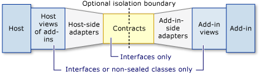

# Add-ins and Extensibility
 Add-ins provide extended features or services for a host application. The [!INCLUDE[dnprdnshort](../../../includes/dnprdnshort-md.md)] provides a programming model that developers can use to develop add-ins and activate them in their host application. The model achieves this by constructing a communication pipeline between the host and the add-in. The model is implemented by using the types in the <xref:System.AddIn>, <xref:System.AddIn.Hosting>, <xref:System.AddIn.Pipeline>, and <xref:System.AddIn.Contract> namespaces.  
  
 This overview contains the following sections:  
  
-   [Add-in Model](#addin_model)  
  
-   [Distinguishing Between Add-ins and Hosts](#distinguishing_between_addins_and_hosts)  
  
-   [Related Topics](#related_topics)  
  
-   [Reference](#reference)  
  
> [!NOTE]
>  You can find additional sample code, and customer technology previews of tools for building add-in pipelines, at the [Managed Extensibility and Add-In Framework site on CodePlex](http://go.microsoft.com/fwlink/?LinkId=121190).  
  
   
## Add-in Model  
 The add-in model consists of a series of segments that make up the add-in pipeline (also known as the communication pipeline), that is responsible for all communication between the add-in and the host. The pipeline is a symmetrical communication model of segments that exchange data between an add-in and its host. Developing these segments between the host and the add-in provides the required layers of abstraction that support versioning and isolation of the add-in.  
  
 The following illustration shows the pipeline.  
  
   
Add-in pipeline  
  
 The assemblies for these segments are not required to be in the same application domain. You can load an add-in into its own new application domain, into an existing application domain, or even into the host's application domain. You can load multiple add-ins into the same application domain, which enables the add-ins to share resources and security contexts.  
  
 The add-in model supports, and recommends, an optional boundary between the host and the add-in, which is called the isolation boundary (also known as a remoting boundary). This boundary can be an application domain or process boundary.  
  
 The contract segment in the middle of the pipeline is loaded into both the host's application domain and the add-in's application domain. The contract defines the virtual methods that the host and the add-in use to exchange types with each other.  
  
 To pass through the isolation boundary, types must be either contracts or serializable types. Types that are not contracts or serializable types must be converted to contracts by the adapter segments in the pipeline.  
  
 The view segments of the pipeline are abstract base classes or interfaces that provide the host and the add-in with a view of the methods that they share, as defined by the contract.  
  
 For more information about developing pipeline segments, see [Pipeline Development](../../../docs/framework/add-ins/pipeline-development.md).  
  
 The sections that follow describe the features of the add-in model.  
  
### Independent Versioning  
 The add-in model allows hosts and add-ins to version independently. As a result, the add-in model enables the following scenarios:  
  
-   Creating an adapter that enables a host to use an add-in built for a previous version of the host.  
  
-   Creating an adapter that enables a host to use an add-in built for a later version of the host.  
  
-   Creating an adapter that enables a host to use add-ins built for a different host.  
  
### Discovery and Activation  
 You can activate an add-in by using a token from a collection that represents the add-ins found from an information store. Add-ins are found by searching for the type that defines the host's view of the add-in. You can also find a specific add-in by the type that defines the add-in. The information store consists of two cache files: the pipeline store and the add-in store.  
  
 For information about updating and rebuilding the information store, see [Add-in Discovery](http://msdn.microsoft.com/library/5d268dde-11df-4c4d-a022-f58d88bbc421). For information about activating add-ins, see [Add-in Activation](http://msdn.microsoft.com/library/bedcbcdf-5964-4215-b5f3-3299798b2b3f) and [How to: Activate Add-ins with Different Isolation and Security](http://msdn.microsoft.com/library/7afe7ec8-5158-4350-9119-5df0ecab8aa5).  
  
### Isolation Levels and External Processes  
 The add-in model supports several levels of isolation between an add-in and its host or between add-ins. Starting from the least isolated, these levels are as follows:  
  
-   The add-in runs in the same application domain as the host. This is not recommended because you lose the isolation and unloading capabilities that you get when you use different application domains.  
  
-   Multiple add-ins are loaded into the same application domain that is different from the application domain used by the host.  
  
-   Each add-in is loaded exclusively into its own application domain. This is the most common level of isolation.  
  
-   Multiple add-ins are loaded into the same application domain in an external process.  
  
-   Each add-in is loaded exclusively into its own application domain in an external process. This is the most isolated scenario.  
  
 For more information about using external processes, see [How to: Activate Add-ins with Different Isolation and Security](http://msdn.microsoft.com/library/7afe7ec8-5158-4350-9119-5df0ecab8aa5).  
  
### Lifetime Management  
 Because the add-in model spans application domain and process boundaries, garbage collection by itself is not sufficient to release and reclaim objects. The add-in model provides a lifetime management mechanism that uses tokens and reference counting, and usually does not require additional programming. For more information, see [Lifetime Management](http://msdn.microsoft.com/library/57a9c87e-394c-4fef-89f2-aa4223a2aeb5).  
  
 [Back to top](#top)  
  
   
## Distinguishing Between Add-ins and Hosts  
 The difference between an add-in and a host is merely that the host is the one that activates the add-in. The host can be the larger of the two, such as a word processing application and its spell checkers; or the host can be the smaller of the two, such as an instant messaging client that embeds a media player. The add-in model supports add-ins in both client and server scenarios. Examples of server add-ins include add-ins that provide mail servers with virus scanning, spam filters, and IP protection. Client add-in examples include reference add-ins for word processors, specialized features for graphics programs and games, and virus scanning for local email clients.  
  
 [Back to top](#top)  
  
   
## Related Topics  
  
|Title|Description|  
|-----------|-----------------|  
|[Pipeline Development](../../../docs/framework/add-ins/pipeline-development.md)|Describes the communication pipeline of segments from the host application to the add-in. Provides code examples in walkthrough topics that describe how to construct the pipeline and how to deploy segments to the pipeline in [!INCLUDE[vsprvs](../../../includes/vsprvs-md.md)].|  
|[Application Domains and Assemblies](http://msdn.microsoft.com/library/433b04ae-4ba8-4849-9dbd-79194f240346)|Describes the relationship between application domains, which provide an isolation boundary for security, reliability, and versioning, and assemblies.|  
  
 [Back to top](#top)  
  
   
## Reference  
 <xref:System.AddIn?displayProperty=nameWithType>  
  
 <xref:System.AddIn.Contract?displayProperty=nameWithType>  
  
 <xref:System.AddIn.Hosting?displayProperty=nameWithType>  
  
 <xref:System.AddIn.Pipeline?displayProperty=nameWithType>  
  
 [Back to top](#top)