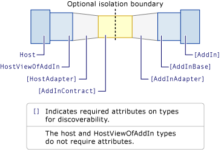
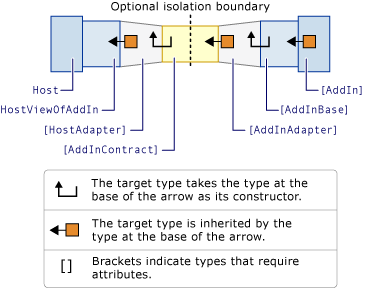

# Pipeline Development
The add-in pipeline is the path of pipeline segments that the host application and its add-in must use to communicate with each other.  
  
 The following illustration shows the communication pipeline and its segments.  
  
   
Add-in pipeline  
  
 The host application is at one end of the pipeline and the add-in is at the other end. Starting from each end and moving toward the middle, both the host application and the add-in have an abstract base class that defines a view of the object model that they both share. These types (classes) make up the add-in view pipeline segment and the host view of the add-in pipeline segment. The add-in view pipeline segment often contains more than one abstract class but the class that the add-in inherits from is known as the add-in base.  
  
 The add-in-side adapter pipeline segment and the host-side adapter pipeline segment convert the flow of types between their view pipeline segments and the contract pipeline segment. The central segment of the pipeline is a contract that is derived from the <xref:System.AddIn.Contract.IContract> interface. This contract defines the methods that the host application and its add-in will both use.  
  
 If you load the host and the add-in into separate application domains, you have an isolation boundary that separates the scope of the host application from the scope of the add-in. The contract is the only assembly that is loaded in both the host and add-in application domains. The host and the add-in each refer only to their view of the contract methods. Therefore, they are separated by a layer of abstraction from the contract.  
  
 To develop pipeline segments, you must create a directory structure that will contain them. For more information about development requirements and scope guidelines, see [Pipeline Development Requirements](http://msdn.microsoft.com/library/ef9fa986-e80b-43e1-868b-247f4c1d9da5).  
  
 The following illustration shows the types that make up the pipeline segments. The names of the types shown in the illustration are arbitrary, but all types except for the host and the host view of the add-in require attributes so they can be discovered by methods that construct an information store.  
  
   
Add-in pipeline with types  
  
 The following table describes the pipeline segments for activating an add-in. For more information about these segments, see [Contracts, Views, and Adapters](http://msdn.microsoft.com/library/a6460173-9507-4b87-8c07-d4ee245d715c).  
  
|Pipeline segment|Description|  
|----------------------|-----------------|  
|Host|The application assembly that creates an instance of an add-in.|  
|Host view of the add-in|Represents the host application's view of the object types and methods used to communicate with the add-in. The host view is an abstract base class or interface.|  
|Host-side adapter|An assembly with one or more classes that adapts methods to and from the contract.   This pipeline segment is identified by using the <xref:System.AddIn.Pipeline.HostAdapterAttribute> attribute.   Multi-module assemblies are not supported.|  
|Contract|An interface that is derived from the <xref:System.AddIn.Contract.IContract> interface and that defines the protocol for communicating types between the host and its add-in.   This pipeline segment is identified by setting the <xref:System.AddIn.Pipeline.AddInContractAttribute> attribute.|  
|Add-in-side adapter|An assembly with one or more classes that adapts methods to and from the contract.   This pipeline segment is identified by using the <xref:System.AddIn.Pipeline.AddInAdapterAttribute> attribute.   Each assembly in the add-in-side adapter directory that contains a type that has an <xref:System.AddIn.Pipeline.AddInAdapterAttribute> attribute is loaded into the add-in's application domain.   Each assembly in the add-in-side directory is loaded in its own application domain.   Multi-module assemblies are not supported|  
|Add-in view|An assembly that represents the add-in's view of the object types and methods that are used to communicate with the host. The add-in view is an abstract base class or interface.   This pipeline segment is identified by using the <xref:System.AddIn.Pipeline.AddInBaseAttribute> attribute.   Each assembly in the AddInViews directory that contains a type that has an <xref:System.AddIn.Pipeline.AddInBaseAttribute> attribute is loaded into the add-in's application domain.|  
|Add-in|An instantiated type that performs a service for the host.|  
  
## Pipeline Activation Path  
 The following illustration shows the activation of types when an add-in is activated. It also shows the passing of objects to the host, such as the results of a calculation or a collection of objects. This is the most typical scenario.  
  
   
Activation path from the add-in to the host  
  
 The activation path of the pipeline occurs as follows:  
  
1.  The host application activates the add-in with the <xref:System.AddIn.Hosting.AddInToken.Activate%2A> method.  
  
2.  The add-in, add-in view, add-in-side adapter, and the contract assemblies are loaded into the add-in's application domain.  
  
3.  An instance of the add-in-side adapter is created using the add-in view (with the class identified by the <xref:System.AddIn.Pipeline.AddInBaseAttribute> attribute) as its constructor. The add-in-side adapter inherits from the contract.  
  
4.  The add-in-side adapter, which is typed as the contract, is passed across the (optional) isolation boundary to the host-side adapter's constructor.  
  
5.  The host view of the add-in, host-side adapter, and the contract assemblies are loaded into the host's application domain.  
  
6.  An instance of the host-side adapter is created using the contract as its constructor. The host-side adapter inherits from the host view of the add-in.  
  
7.  The host has the add-in, which is typed as the host view of the add-in, and can continue calling its methods.  
  
## Walkthroughs  
 There are three walkthrough topics that describe how to create pipelines using Visual Studio:  
  
-   [Walkthrough: Creating an Extensible Application](../../../docs/framework/add-ins/walkthrough-create-extensible-app.md)  
  
     Describes a calculator add-in that performs addition, subtraction, multiplication, and divsion calculations for the host.  
  
-   [Walkthrough: Enabling Backward Compatibility as Your Host Changes](http://msdn.microsoft.com/library/6fa15bb5-8f04-407d-bd7d-675dc043c848)  
  
     Describes a calculator add-in with enhanced calculation capabilities, and how to maintain compatibility with the first calculator add-in.  
  
-   [Walkthrough: Passing Collections Between Hosts and Add-Ins](http://msdn.microsoft.com/library/b532c604-548e-4fab-b11c-377257dd0ee5)  
  
     Describes how to pass data collections over the pipeline using a book store scenario.  
  
## See Also  
 [Add-in Pipeline Scenarios](http://msdn.microsoft.com/library/feb70e0b-8734-494c-aeaf-b567f014043e)  
 [Add-ins and Extensibility](../../../docs/framework/add-ins/index.md)
