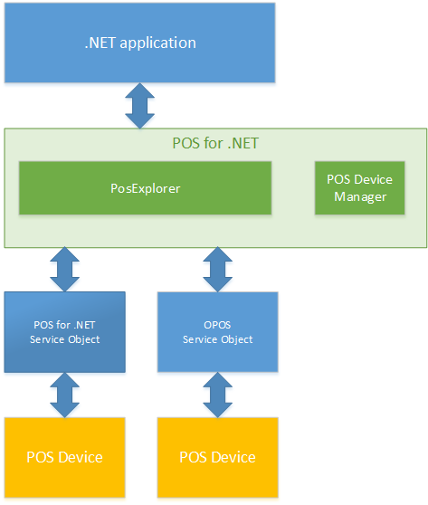

---
title: POS for .NET Architecture (POS for .NET v1.14 SDK Documentation)
description: POS for .NET Architecture (POS for .NET v1.14 SDK Documentation) (POS for .NET v1.14 SDK Documentation)
ms.date: 03/03/2014
ms.topic: how-to
ms.custom: "pos-restored-from-archive,UpdateFrequency5"
---

# POS for .NET Architecture (POS for .NET v1.14 SDK Documentation)

The Microsoft Point of Service for .NET (POS for .NET) architecture supports both developers writing POS applications and peripheral device hardware vendors writing .NET-based Service Objects. The following illustration shows the POS for .NET architecture.

Devices use service objects to communicate with your application by using the POS for .NET interfaces.

You can use the [PosExplorer Class](posexplorer-class.md) to discover and instantiate service objects. Once you have an instance of a service object, you can use that service object to interact with the POS device.

Plug and Play devices automatically notify PosExplorer when those devices are connected or disconnected. For non-Plug and Play devices, you can use the [POS Device Manager](pos-device-manager.md) to manage how PosExplorer discovers those devices.

## Support for POS Applications

The POS for .NET public API provides POS applications with information about connected POS devices. The public API also creates instances of the Service Object (SO) classes for interacting with the devices.

POS for .NET uses Plug and Play for Windows Embedded to detect POS device connection and disconnection. The public API conveys Plug and Play events to the application.

For older applications, the POS for .NET legacy interoperability system exposes legacy OLE for Retail POS (OPOS) controls as .NET Service Objects.

For more information, see [POS for .NET API Support](pos-for-net-api-support.md).

## Support for Service Objects

Hardware vendors write device-specific Service Objects that interact with peripheral hardware. The Service Objects also implement interfaces as specified in the Unified Point of Service (UnifiedPOS) v1.14 standard. With POS for .NET device classes, hardware vendors can concentrate their efforts on implementing the device-specific details.

POS for .NET offers abstract **Basic** device classes for every device type defined in the UnifiedPOS specification. The enhanced **Basic** classes, called **Base** classes, supply functionality common to all POS devices. POS for .NET provides abstract **Base** device classes for nine devices. The **Base** classes further implement core POS functionality specific to the particular device class.

POS for .NET supplies **Base** classes for the following devices:

- Cash Drawer
- Check Scanner
- Keyboard
- Line Display
- Magnetic Stripe Reader
- Pin Pad
- Printer
- Scanner
- RFID Scanner

## See Also

#### Concepts

- [Typical POS Application Architecture](typical-pos-application-architecture.md)
- [POS for .NET Integration with Plug and Play](pos-for-net-integration-with-plug-and-play.md)
- [Supported Device Classes](supported-device-classes.md)

#### Other Resources

- [POS for .NET Service Object Architecture](pos-for-net-service-object-architecture.md)
- [POS for .NET v1.14 Features](pos-for-net-v1141-features.md)
- [POS for .NET API Support](pos-for-net-api-support.md)
