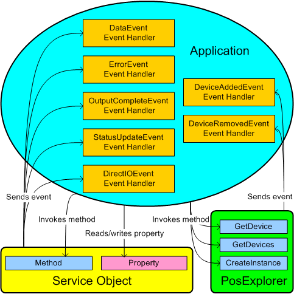

# Typical POS Application Architecture (POS for .NET v1.14 SDK Documentation)

The principal elements of POS application architecture are event handlers and the public interface to Service Objects and the Microsoft Point of Service for .NET (POS for .NET) [PosExplorer Class](posexplorer-class.md), as shown in the following illustration.

.gif)

## Event Handlers

POS for .NET uses five Service Object events to inform POS applications of POS device activities or changes, as specified in the Unified Point Of Service (UnifiedPOS) standard.

The [PosExplorer Class](posexplorer-class.md) translates Plug and Play notifications into events that it sends to applications.

Applications implement event handlers to manage these events.

## Public Interface to Service Objects

Service Objects expose public methods and properties to POS applications, including those defined in the UnifiedPOS standard.

POS applications use those methods and properties to get device status and to transfer data to and from devices.

## Public Interface to PosExplorer

The **PosExplorer** class exposes public methods to POS applications that create Service Objects and provide information about Service Objects and devices.

## See Also

#### Concepts

- [POS for .NET Architecture](pos-for-net-architecture.md)
- [PosExplorer Class](posexplorer-class.md)

#### Other Resources

- [POS for .NET Service Object Architecture](pos-for-net-service-object-architecture.md)
- [Developing a POS Application](developing-a-pos-application.md)
