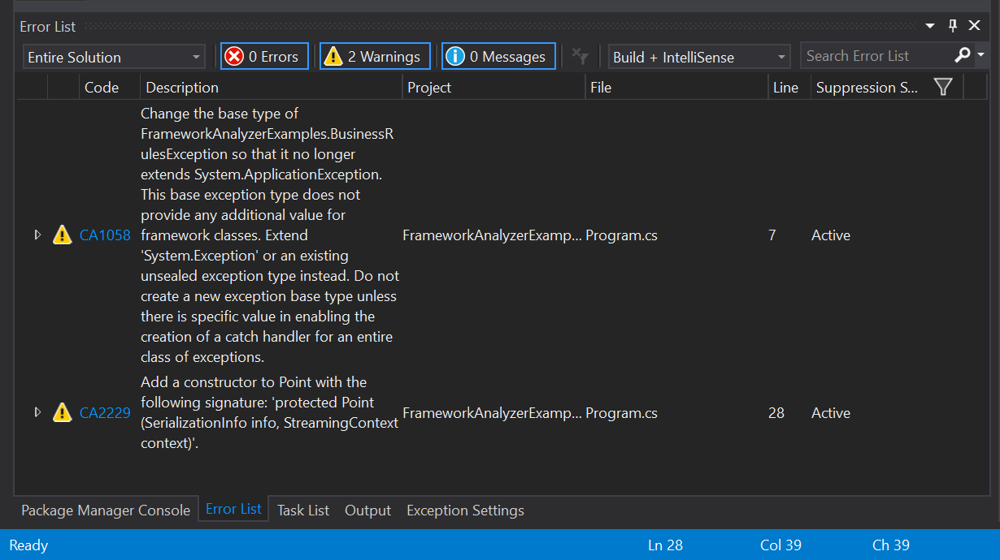
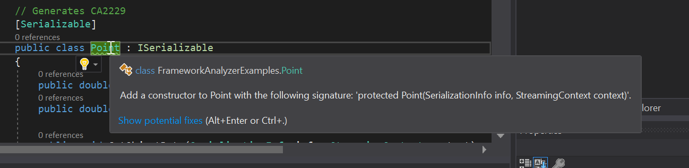

# Code analysis

You can use code analyzers to find potential issues in your .NET Framework application code. The analyzers find potential issues and suggest fixes for them.

Roslyn-based code analyzers run interactively in Visual Studio as you write your code
or as part of a CI build. You should add the analyzers to your project as
early as possible in the development cycle. The sooner you find any potential issues
in your code, the easier they are to fix. The analyzers flag issues in existing code and
warn about new issues as you continue development.

> [!NOTE]
> This article makes use of the now deprecated [Microsoft.NetFramework.Analyzers NuGet
package](https://www.nuget.org/packages/Microsoft.NetFramework.Analyzers/). Starting in .NET 5,
NET analyzers are included with the .NET SDK. If needed, you can use the [Microsoft.CodeAnalysis.NetAnalyzers
NuGet package](https://www.nuget.org/packages/Microsoft.CodeAnalysis.NetAnalyzers)
instead. For more information, see [Code analysis in .NET](../fundamentals/code-analysis/overview.md).

## Install and configure analyzers

The .NET Framework Analyzer is delivered in the [Microsoft.NetFramework.Analyzers](https://www.nuget.org/packages/Microsoft.NetFramework.Analyzers/) NuGet package. This package provides analyzers that are specific to .NET Framework APIs, which includes security analyzers. The package is included with the [Microsoft.CodeAnalysis.FxCopAnalyzers package](https://www.nuget.org/packages/Microsoft.CodeAnalysis.FxCopAnalyzers), so if you install that package, there's no need to install the .NET Framework analyzers separately.

Install the NuGet package on every project where you want the analyzers to run. Only one developer needs to add them
to the project. The analyzer package is a project dependency and will run on every developer's machine once it has the updated solution.

To install the package, right-click on the project, and select "Manage Dependencies". From the NuGet explorer, search for "Microsoft.NetFramework.Analyzers". Install the latest stable version in all projects in your solution.

## Use the analyzers

Once the NuGet package is installed, build your solution. The analyzer will
report any issues it locates in your codebase. The issues are reported as
warnings in the Visual Studio Error List window, as shown in the following image:

As you write code, you see squiggles underneath any potential issue in your code.
Hover over any issue to get more information and see suggestions
for any possible fix, as shown in the following image:

For more information, see [Code analysis in Visual Studio](/visualstudio/code-quality/roslyn-analyzers-overview).

## Types of rules

The analyzers examine the code in your solution and surface warnings with a `CA` prefix. For a list of all possible warnings, see [Code quality rules](../fundamentals/code-analysis/quality-rules/index.md). Only some of these warnings apply to .NET Framework APIS, including:

- [CA1058: Types should not extend certain base types](../fundamentals/code-analysis/quality-rules/ca1058.md)

- [CA2153: Do not catch corrupted state exceptions](../fundamentals/code-analysis/quality-rules/ca2153.md)

- [CA2229: Implement serialization constructors](../fundamentals/code-analysis/quality-rules/ca2229.md)

- [CA2235: Mark all non-serializable fields](../fundamentals/code-analysis/quality-rules/ca2235.md)

- [CA2237: Mark ISerializable types with serializable](../fundamentals/code-analysis/quality-rules/ca2237.md)

- [CA3075: Insecure DTD processing in XML](../fundamentals/code-analysis/quality-rules/ca3075.md)

- [CA5350: Do not use weak cryptographic algorithms](../fundamentals/code-analysis/quality-rules/ca5350.md)

- [CA5351 Do not use broken cryptographic algorithms](../fundamentals/code-analysis/quality-rules/ca5351.md)

## See also

- [Code analysis in Visual Studio](/visualstudio/code-quality/roslyn-analyzers-overview)
- [Code analysis in the .NET SDK](../fundamentals/code-analysis/overview.md)
