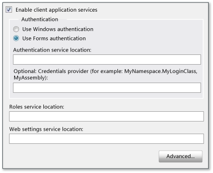
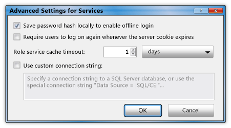

# How to: Configure Client Application Services
This topic describes how to use the [!INCLUDE[vsprvs](../../../includes/vsprvs-md.md)] **Project Designer** to enable and configure client application services. You can use client application services to validate users and retrieve user roles and settings from an existing [!INCLUDE[ajax_current_short](../../../includes/ajax-current-short-md.md)] application service. After configuration, you can access the enabled services in your application code as described in [Client Application Services Overview](../../../docs/framework/common-client-technologies/client-application-services-overview.md). For more information about the [!INCLUDE[ajax_current_short](../../../includes/ajax-current-short-md.md)] application services, see [ASP.NET Application Services Overview](http://msdn.microsoft.com/library/1162e529-0d70-44b2-b3ab-83e60c695013).  
  
 You can enable and configure client application services on the **Services** page of the **Project Designer**. The **Services** page updates values in your project's App.config file. To access the **Project Designer**, use the **Properties** command on the **Project** menu. For more information about the **Services** page, see [Services Page, Project Designer](https://msdn.microsoft.com/library/bb398109).  
  
 The following procedure describes how to perform basic configuration for client application services. Advanced configuration options are described in later sections.  
  
### To configure client application services  
  
1.  In **Solution Explorer**, select a project node and then on the **Project** menu, click **Properties**.  
  
     The **Project Designer** appears.  
  
2.  Click the **Services** tab. The **Services** page appears, as shown in the following illustration.  
  
       
  
3.  On the **Services** page, select **Enable client application services**.  
  
    > [!NOTE]
    >  Client application services require the full version of the .NET Framework, and are not supported in the .NET Framework Client Profile. If the **Enable client application services** check box is disabled, verify that the **Target framework** is set to the .NET Framework 3.5 or later. To view the **Target framework** setting in C#, open the Project Designer and then click the **Application** page. To view the **Target framework** setting in Visual Basic, open the Project Designer, click the **Compile** page, and then click **Advanced Compile Options**.  
  
4.  Select **Use Forms authentication** if you plan to provide your own login controls or dialog box, or select **Use Windows authentication** to use the identity supplied by the operating system. For more information, see [Client Application Services Overview](../../../docs/framework/common-client-technologies/client-application-services-overview.md).  
  
    > [!NOTE]
    >  If you select **Use Windows authentication**, client application services will automatically be configured to use a SQL Server Compact database. This is indicated in the **Advanced Settings for Services** dialog box as described in the next section. If you then select **Use Forms authentication**, the **Use custom connection string** setting will not be cleared automatically. This could result in errors if the [!INCLUDE[ssEW](../../../includes/ssew-md.md)] database has already been generated for use with Windows authentication. To fix these errors, clear the **Use custom connection string** setting in the **Advanced Settings for Services** dialog box.  
  
5.  If you selected **Use Forms authentication**, in the **Authentication service location** box, specify the URL of the service host, not including the file name. The designer will automatically append the standard file name (Authentication_JSON_AppService.axd) when it writes the value to the configuration file.  
  
6.  Optionally, if you selected **Use Forms authentication**, you can specify a value in the **Credentials provider** box. The credentials provider must implement the <xref:System.Web.ClientServices.Providers.IClientFormsAuthenticationCredentialsProvider> interface. By using a credentials provider, you can separate your login user interface from your other application code. This enables you to create a single login dialog box for use in multiple applications. For more information, see [How to: Implement User Login with Client Application Services](../../../docs/framework/common-client-technologies/how-to-implement-user-login-with-client-application-services.md).  
  
     If you specify a credentials provider, you must specify it as an assembly-qualified type name. For more information, see <xref:System.Type.AssemblyQualifiedName%2A?displayProperty=nameWithType> and [Assembly Names](../../../docs/framework/app-domains/assembly-names.md). In its simplest form, an assembly-qualified type name looks similar to the following example:  
  
    ```  
    MyNamespace.MyLoginClass, MyAssembly  
    ```  
  
7.  In the **Roles service location** and **Web settings service location** text boxes, specify the service location for each service, not including the file name. The designer will automatically append the standard file names (Role_JSON_AppService.axd and Profile_JSON_AppService.axd) when it writes the value to the configuration file.  
  
8.  Optionally, click **Advanced** to modify advanced settings, such as the local caching behavior. For more information, see the next procedure.  
  
## Advanced Configuration  
 The following procedures describe how to configure client application services for less common scenarios. For example, you can use these configuration options for applications deployed in public locations, or to use an encrypted SQL Server Compact database as the local data cache.  
  
#### To configure advanced settings for client application services  
  
1.  On the **Services** page of the **Project Designer**, click **Advanced**.  
  
     The **Advanced Settings for Services** dialog box appears, as shown in the following illustration. For more information about this dialog box, see [Advanced Settings for Services Dialog Box](/visualstudio/ide/reference/advanced-settings-for-services-dialog-box).  
  
       
  
2.  Select or clear **Save password hash locally to enable offline login**. When you select this option, an encrypted form of the user's password will be cached locally. This is useful if you implement offline mode for your application. With this option selected, you can validate users even when the <xref:System.Web.ClientServices.ConnectivityStatus.IsOffline%2A> property has been set to `true`.  
  
3.  Select or clear **Require users to log on again whenever the server cookie expires**. The authentication cookie is configured on the remote service, and indicates how long a user's login will remain active. For more information about how to configure the cookie, see the `timeout` attribute in [forms Element for authentication (ASP.NET Settings Schema)](http://msdn.microsoft.com/library/8163b8b5-ea6c-46c8-b5a9-c4c3de31c0b3).  
  
     If you select this option, attempting to access the remote roles or Web settings services after the authentication cookie has expired will throw a <xref:System.Net.WebException>. You can handle this exception and display a login dialog box to revalidate users. For an example of this behavior, see [Walkthrough: Using Client Application Services](../../../docs/framework/common-client-technologies/walkthrough-using-client-application-services.md). This option is useful for applications deployed in public locations to make sure that users who leave the application running after use will not remain authenticated indefinitely.  
  
     If you clear this option and attempt to access the remote services after the authentication cookie has expired, users will be revalidated automatically.  
  
4.  Specify a value for **Role service cache timeout**. Set this time interval to a small value when roles are updated frequently or to a larger value when roles are updated infrequently. If you implement offline mode, set the time interval to a large value to prevent the role information from expiring while the application is offline.  
  
     The role provider accesses the cached role values or the roles service when you call the <xref:System.Web.Security.RolePrincipal.IsInRole%2A> method. To programmatically reset the cache and force this method to access the remote service, call the <xref:System.Web.ClientServices.Providers.ClientRoleProvider.ResetCache%2A> method.  
  
5.  Select or clear **Use custom connection string**. For more information, see the next procedure.  
  
#### To configure client application services to use a database for the local cache  
  
1.  On the **Services** page of the **Project Designer**, click **Advanced**.  
  
     The **Advanced Settings for Services** dialog box appears.  
  
2.  Select **Use custom connection string**.  
  
     The default value of `Data Source = |SQL/CE|` appears in the text box.  
  
3.  To generate and use a SQL Server Compact database, keep the default connection string value. [!INCLUDE[vsprvs](../../../includes/vsprvs-md.md)] will generate a database file and put it in the directory indicated by the <xref:System.Windows.Forms.Application.UserAppDataPath%2A?displayProperty=nameWithType> property.  
  
4.  To generate and use an encrypted [!INCLUDE[ssEW](../../../includes/ssew-md.md)] database, add `password` and `encrypt database` values to the connection string as shown in the following example.  
  
    > [!NOTE]
    >  Be sure to specify a strong password. You cannot change the password after the database is generated.  
  
    ```  
    Data Source = |SQL/CE|;password=<password>;encrypt database=true  
    ```  
  
5.  To use your own [!INCLUDE[ssNoVersion](../../../includes/ssnoversion-md.md)] database, specify your own connection string. For information about valid connection string formats, see the [!INCLUDE[ssNoVersion](../../../includes/ssnoversion-md.md)] documentation. This database is not generated automatically. The connection string must refer to an existing database that you can create using the following SQL statements.  
  
    ```  
    CREATE TABLE ApplicationProperties (PropertyName nvarchar(256),  
        PropertyValue nvarchar(256))  
    CREATE TABLE UserProperties (PropertyName nvarchar(256),  
        PropertyValue nvarchar(256))  
    CREATE TABLE Roles (UserName nvarchar(256),   
        RoleName nvarchar(256))  
    CREATE TABLE Settings (PropertyName nvarchar(256),   
        PropertyStoredAs nvarchar(1), PropertyValue nvarchar(2048))  
    ```  
  
## Using Custom Providers  
 By default, the client application services feature uses the providers in the <xref:System.Web.ClientServices.Providers?displayProperty=nameWithType> namespace. When you configure your application by using the **Services** page of the **Project Designer**, references to these providers are added to your App.config file. These default providers access corresponding providers on the server. Web services are often configured to access user data through providers such as <xref:System.Web.Security.SqlMembershipProvider> and <xref:System.Web.Security.SqlRoleProvider>.  
  
 If you want to use custom service providers, you will typically change the providers on the server side so that they affect all client applications that access the server. However, you do have the option of using non-default providers on the client side. You can specify custom authentication or roles providers in your project's App.config file, as shown in the following procedure. For information about how to create custom authentication and role providers, see [Implementing a Membership Provider](http://msdn.microsoft.com/library/d8658b8e-c962-4f64-95e1-4acce35e4582) and [Implementing a Role Provider](http://msdn.microsoft.com/library/851671ce-bf9b-43f2-aba4-bc9d28b11c7d). You can also use a custom settings provider by modifying your project's `Settings` class (accessed as `Properties.Settings.Default` in C# and `My.Settings` in [!INCLUDE[vbprvb](../../../includes/vbprvb-md.md)]). For more information, see [Application Settings Architecture](../../../docs/framework/winforms/advanced/application-settings-architecture.md).  
  
#### To configure client application services to use non-default providers  
  
1.  To use a non-default authentication or roles service provider, first complete all other configuration settings by using the **Services** page.  
  
2.  Close the **Project Designer**. This is necessary because the **Services** page will automatically update your App.config file even if you do not modify any settings. If you manually modify your App.config file as described in this procedure and then return to the **Services** page, your modifications will be reset.  
  
3.  In **Solution Explorer**, double-click App.config.  
  
     The application configuration file opens in the text editor.  
  
4.  Find the `<providers>` element within the `<membership>` or `<roleManager>` element. These elements are children of the `<system.web>` element. The `<membership>` element is used to specify authentication providers, and the `<roleManager>` element is used to specify role providers.  
  
5.  Add an `<add>` element as a child of the `<providers>` element. You must specify `name` and `type` attributes as shown in the following example. The `type` attribute value must be an assembly-qualified type name. For more information, see <xref:System.Type.AssemblyQualifiedName%2A?displayProperty=nameWithType> and [Assembly Names](../../../docs/framework/app-domains/assembly-names.md).  
  
    ```xml  
    <add name="MyCustomRoleProvider" type="MyNamespace.MyRoleProvider, MyAssembly" />  
    ```  
  
6.  Modify the `defaultProvider` attribute of the `<membership>` or `<roleManager>` element to specify the name value from the `<add>` element that you added in the previous step.  
  
    ```xml  
    <roleManager enabled="true" defaultProvider="MyCustomRoleProvider">  
    ```  
  
## See Also  
 [Client Application Services](../../../docs/framework/common-client-technologies/client-application-services.md)  
 [Client Application Services Overview](../../../docs/framework/common-client-technologies/client-application-services-overview.md)  
 [Services Page, Project Designer](https://msdn.microsoft.com/library/bb398109)  
 [Advanced Settings for Services Dialog Box](/visualstudio/ide/reference/advanced-settings-for-services-dialog-box)  
 [How to: Implement User Login with Client Application Services](../../../docs/framework/common-client-technologies/how-to-implement-user-login-with-client-application-services.md)  
 [Walkthrough: Using Client Application Services](../../../docs/framework/common-client-technologies/walkthrough-using-client-application-services.md)  
 [Implementing a Membership Provider](http://msdn.microsoft.com/library/d8658b8e-c962-4f64-95e1-4acce35e4582)  
 [Implementing a Role Provider](http://msdn.microsoft.com/library/851671ce-bf9b-43f2-aba4-bc9d28b11c7d)  
 [Application Settings Architecture](../../../docs/framework/winforms/advanced/application-settings-architecture.md)  
 [Creating and Configuring the Application Services Database for SQL Server](http://msdn.microsoft.com/library/ab894e83-7e2f-4af8-a116-b1bff8f815b2)
