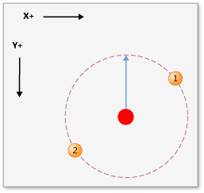
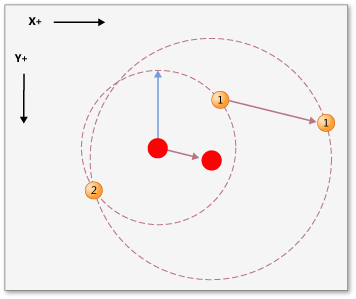
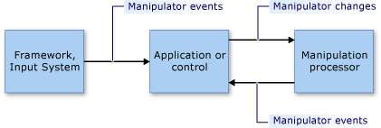

# Manipulations and Inertia Overview
*Manipulations* enable users to move, rotate, and resize user interface (UI) elements by using *manipulators*. A manipulator represents a mouse or (in a touch-enabled scenario) a stylus or a finger.  
  
 *Inertia* emulates real-world behavior for UI elements that are in motion by simulating friction forces on the elements. This enables elements to gradually slow their movement (both linear and angular) before coming to a stop. This article provides an introduction to manipulations and inertia for the .NET Framework.  
  
## Manipulations  
 A manipulation treats a collection of manipulators as a composite object. An application can track the changes to the composite object instead of the individual components.  
  
 Consider the image in the following illustration. A user can use two manipulators to move, rotate, and scale the image. The changes to each manipulator are interpreted together with the other manipulators.  
  
 For example, if you have two manipulators (1 and 2) on the image, and you move manipulator 1 in a +Y direction (down), the change to the image depends on what happens to manipulator 2. If manipulator 2 also moves in the +Y direction (down), the image simply moves in the +Y direction. But if manipulator 2 does not change, or it moves in a -Y direction (up), the image is made smaller or rotated.  
  
   
  
 An image being manipulated by two manipulators  
  
 Manipulation processing provides a framework that monitors a subset of manipulators and interprets them as if they are acting together, instead of independently. You can create several manipulation processor objects simultaneously, one for each UI element to be manipulated in an application. A manipulation processor is informed of which input devices to observe and it reports manipulations through [.NET events](http://msdn.microsoft.com/library/17sde2xt.aspx).  
  
 A manipulation processor does not have information about the particular element that is being manipulated. An application separately applies the changes to an application-specific element. For example, an application applies transformations to an image or redraws it to display it at its new location or with a new size or orientation.  
  
 Manipulations are designed for two-dimensional (2-D) [affine transformations](http://msdn.microsoft.com/library/ms533810\(VS.85\).aspx). These transformations include translate, rotate, and scale.  
  
### Parts of a Manipulation  
 A manipulation is a collection of <xref:System.Windows.Input.Manipulations.Manipulator2D> objects. This aggregate manipulation is represented by an origin point and an ellipse. The origin point is the average position of all manipulators that are manipulating an element. The ellipse has a radius that is the average distance from the origin to each of the <xref:System.Windows.Input.Manipulations.Manipulator2D> objects.  
  
   
  
 Two manipulators (1 and 2), an origin, and an ellipse specify a manipulation  
  
 As manipulators are added, moved, or removed for a UI element, an application updates the <xref:System.Windows.Input.Manipulations.ManipulationProcessor2D> object by calling the <xref:System.Windows.Input.Manipulations.ManipulationProcessor2D.ProcessManipulators%2A> method. When the manipulation first begins, the <xref:System.Windows.Input.Manipulations.ManipulationProcessor2D.Started> event is raised.  
  
> [!NOTE]
>  Manipulation processing is more efficient when used in a frame-based update environment. When using manipulation processing in a Microsoft XNA application, this is not a concern because the XNA framework provides frame-based updates using the [Game.Update](http://msdn.microsoft.com/library/microsoft.xna.framework.game.update.aspx) method. In another environment (such as WinForms), you might need to provide your own frame-based logic to collect manipulations and periodically send them to the <xref:System.Windows.Input.Manipulations.ManipulationProcessor2D.ProcessManipulators%2A> method as a batch.  
  
 As the number of manipulators or their position change, the <xref:System.Windows.Input.Manipulations.ManipulationProcessor2D.Delta> event is raised. Properties of the <xref:System.Windows.Input.Manipulations.Manipulation2DDeltaEventArgs> object that is passed to the <xref:System.Windows.Input.Manipulations.ManipulationProcessor2D.Delta> event handler specify changes in origin, scale, rotation, and translation that have occurred since the last event. The origin of the manipulation changes when manipulators move, and when manipulators are added or removed. Translation values specify how much X or Y movement the manipulation includes.  
  
 Using the new values, an application redraws the UI element.  
  
   
  
 Manipulator 1 moves and causes the origin to change  
  
 When the last manipulator that is associated with the manipulation is removed from the <xref:System.Windows.Input.Manipulations.ManipulationProcessor2D> object, the <xref:System.Windows.Input.Manipulations.ManipulationProcessor2D.Completed> event is raised.  
  
### The Manipulation Processing Model  
 A manipulation processor uses a direct-usage model. With this simple model, an application must pass any input event details to the manipulation processor. An input event might be raised by any input primitive, such as a mouse device, a stylus, or a finger. This process provides a direct filtering mechanism and a simple usage model, so the application can batch input events when it is necessary.  
  
 For an application to include an input primitive in the manipulation process, it creates a <xref:System.Windows.Input.Manipulations.Manipulator2D> structure from the details of the input primitive, and passes the structure to the manipulation processor using the <xref:System.Windows.Input.Manipulations.ManipulationProcessor2D.ProcessManipulators%2A> method. The manipulation processor then raises events, which the application must handle to update the visual component in an appropriate way.  
  
   
  
 The manipulation processing model  
  
## Inertia  
 The inertia processor enables applications to extrapolate location, orientation, and other properties of a UI element by simulating real-world behavior.  
  
 For instance, when a user flicks an element, it can continue moving, decelerate, and then slowly stop. The inertia processor implements this behavior by causing the affine 2-D values (origin, scale, translation, and rotation) to change over a specified time at a specified deceleration rate.  
  
 As with manipulation processing, an inertia processor does not have information about any particular UI element. In response to events that are raised on an <xref:System.Windows.Input.Manipulations.InertiaProcessor2D> object, an application separately applies the changes to an application-specific element.  
  
 Inertia processing and manipulation processing are often used together. Their interfaces are similar, and the events that they raise are (in some cases) identical. Generally, inertia processing begins when the manipulation of the UI element is completed. This is accomplished by listening to the <xref:System.Windows.Input.Manipulations.ManipulationProcessor2D.Completed> event and starting the inertia processing from that event handler.  
  
## See Also  
 <xref:System.Windows.Input.Manipulations>
