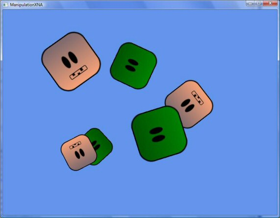

# Using Manipulations and Inertia in an XNA Application
This article describes how you can use manipulations and inertia processing in a Microsoft XNA application to control the movement of game pieces. Before you read this article, you should be familiar with the [Manipulations and Inertia Overview](../../../docs/framework/common-client-technologies/manipulations-and-inertia-overview.md) topic, and be familiar with basic XNA programming concepts.  
  
 To perform the tasks described in this article, your XNA project must reference the <xref:System.Windows.Input.Manipulations> assembly, and you must have [XNA Game Studio](http://msdn.microsoft.com/library/bb200104.aspx) ([download](http://www.microsoft.com/downloads/details.aspx?FamilyId=7D70D6ED-1EDD-4852-9883-9A33C0AD8FEE&displaylang=en)) installed on your computer so that your project can reference the XNA assemblies.  
  
## Overview of Functionality  
 This article shows you how to create a custom class that represents a game piece that uses manipulation and inertia processing. This class enables you to manipulate a game piece across the screen by dragging it with the mouse, and then releasing it. Once released, inertia processing keeps the game piece moving as it gradually slows down. Movement is both linear and angular.  
  
   
  
 In addition, a custom collection is created that manages multiple game pieces. This simplifies the handling that is required from the XNA Game class.  
  
 [Creating the GamePiece Class](../../../docs/framework/common-client-technologies/creating-the-gamepiece-class.md)  
  
 [Creating the GamePieceCollection Class](../../../docs/framework/common-client-technologies/creating-the-gamepiececollection-class.md)  
  
 [Creating the Game1 Class](../../../docs/framework/common-client-technologies/creating-the-game1-class.md)  
  
 [Full Code Listings](../../../docs/framework/common-client-technologies/full-code-listings.md)  
  
## See Also  
 <xref:System.Windows.Input.Manipulations>  
 [Manipulations and Inertia Overview](../../../docs/framework/common-client-technologies/manipulations-and-inertia-overview.md)
