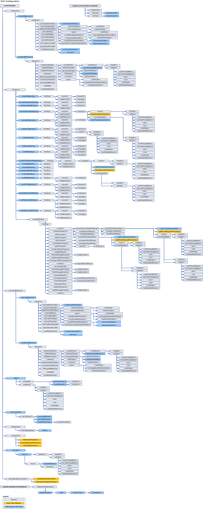

# WCF Configuration Schema
Windows Communication Foundation (WCF) configuration elements enable you to configure WCF service and client applications. You can use the [Configuration Editor Tool (SvcConfigEditor.exe)](../../../wcf/configuration-editor-tool-svcconfigeditor-exe.md) to create and modify configuration files for clients and services. Since the configuration files are formatted as XML, you must be familiar with XML if you want to manually edit them using a text editor. Otherwise, you may run into issues such as an unfound XML element tag or attribute. This is because XML element tags and attributes are case-sensitive.  
  
 The WCF configuration system is based on the <xref:System.Configuration> namespace. Therefore, you can use all the standard features provided by the <xref:System.Configuration> namespace, such as configuration locking, encryption and merging to increase the security of your application and its configuration. For more information on these concepts, see the following topics.  
  
 [Encrypting Configuration Information](https://go.microsoft.com/fwlink/?LinkId=95337)  
  
 [Locking Configuration Settings](https://go.microsoft.com/fwlink/?LinkId=95338)  
  
 This section describes all possible values of each configuration item, and how it interacts with other WCF configuration elements. The following map illustrates the WCF configuration schema:  
  
   
  
> [!CAUTION]
>  You should protect WCF configuration sections in your application configuration files (app.config) with appropriate Access Control Lists (ACL) to prevent any potential security threats.  For example, you should make sure that only the appropriate people can access or modify the security settings on application bindings, or the service model section of the configuration file for a service.  
  
## In This Section  
 [\<system.serviceModel>](system-servicemodel.md)  
 Describes the `ServiceModel` element.  
  
 [\<system.serviceModel.activation>](system-servicemodel-activation.md)  
 Configures the SMSvcHost.exe tool.  
  
 [\<system.runtime.serialization>](system-runtime-serialization.md)  
 The top-level element for setting options when using serializers such as the <xref:System.Runtime.Serialization.DataContractSerializer>.  
  
## Related Sections  
 [Configuring Windows Communication Foundation Applications](../../../wcf/configuring-services.md)  
 Describes how to configure WCF services and clients.
