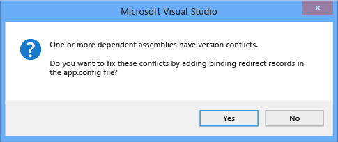

# How to: Enable and Disable Automatic Binding Redirection
Starting with [!INCLUDE[vs_dev12](../../../includes/vs-dev12-md.md)], when you compile apps that target the [!INCLUDE[net_v451](../../../includes/net-v451-md.md)], binding redirects may be automatically added to the app configuration file to override assembly unification. Binding redirects are added if your app or its components reference more than one version of the same assembly, even if you manually specify binding redirects in the configuration file for your app. The automatic binding redirection feature affects traditional desktop apps and web apps that target the [!INCLUDE[net_v451](../../../includes/net-v451-md.md)], although the behavior is slightly different for a web app. You can enable automatic binding redirection if you have existing apps that target previous versions of the .NET Framework, or you can disable this feature if you want to keep manually authored binding redirects.  
  
## Disabling automatic binding redirects in desktop apps  
 Automatic binding redirects are enabled by default for traditional desktop apps that target the [!INCLUDE[net_v451](../../../includes/net-v451-md.md)] and later versions. The binding redirects are added to the output configuration (app.config) file when the app is compiled and overrides the assembly unification that might otherwise take place. The source app.config file is not modified. You can disable this feature by modifying the project file for the app.  
  
#### To disable automatic binding redirects  
  
1.  In Visual Studio, select the project in **Solution Explorer**, and then choose **Open Folder in File Explorer** from the shortcut menu.  
  
2.  In File Explorer, find the project (.csproj or .vbproj) file, and open it in Notepad.  
  
3.  In the project file, find the following property entry:  
  
     `<AutoGenerateBindingRedirects>true</AutoGenerateBindingRedirects>`  
  
4.  Change `true` to `false`:  
  
     `<AutoGenerateBindingRedirects>false</AutoGenerateBindingRedirects>`  
  
## Enabling automatic binding redirects manually  
 You can enable automatic binding redirects in existing apps that target older versions of the .NET Framework, or in cases where you are not automatically prompted to add a redirect. If you are targeting a newer version of the framework but do not get automatically prompted to add a redirect, you will likely get   build output that suggests you remap assemblies.  
  
#### To manually add an automatic binding redirect property  
  
1.  In Visual Studio, select the project in **Solution Explorer**, and then choose **Open Folder in File Explorer** from the shortcut menu.  
  
2.  In File Explorer, find the project (.csproj or .vbproj) file, and open it in Notepad.  
  
3.  Add the following element to the first configuration property group (under the \<PropertyGroup> tag):  
  
     `<AutoGenerateBindingRedirects>true</AutoGenerateBindingRedirects>`  
  
     The following shows an example project file with the element inserted.  
  
    ```xml  
    <?xml version="1.0" encoding="utf-8"?>  
    <Project ToolsVersion="12.0" DefaultTargets="Build" xmlns="http://schemas.microsoft.com/developer/msbuild/2003">  
      <Import Project="$(MSBuildExtensionsPath)\$(MSBuildToolsVersion)\Microsoft.Common.props" Condition="Exists('$(MSBuildExtensionsPath)\$(MSBuildToolsVersion)\Microsoft.Common.props')" />  
      <PropertyGroup>  
        <Configuration Condition=" '$(Configuration)' == ''     ">Debug</Configuration>  
        <Platform Condition=" '$(Platform)' == '' ">AnyCPU</Platform>  
        <ProjectGuid>{123334}</ProjectGuid>  
        ...  
        <AutoGenerateBindingRedirects>true</AutoGenerateBindingRedirects>  
      </PropertyGroup>  
    ...  
    </Project>  
    ```  
  
4.  Compile your app.  
  
## Enabling automatic binding redirects in web apps  
 Automatic binding redirects are implemented differently for web apps. Because the source configuration (web.config) file must be modified for web apps, binding redirects are not automatically added to the configuration file. However, Visual Studio notifies you of binding conflicts, and you can add binding redirects to resolve the conflicts. Because you are always prompted to add binding redirects, you do not need to explicitly disable this feature for a web app.  
  
#### To add binding redirects to a web.config file  
  
1.  In Visual Studio, compile the app, and check for build warnings.  
  
       
  
2.  If there are assembly binding conflicts, a warning appears. Double-click the warning. (Keyboard: Select the warning and press **Enter**.)  
  
     A dialog box that enables you to automatically add the necessary binding redirects to the source web.config file appears.  
  
       
  
## See Also  
 [\<bindingRedirect> Element](../../../docs/framework/configure-apps/file-schema/runtime/bindingredirect-element.md)  
 [Redirecting Assembly Versions](../../../docs/framework/configure-apps/redirect-assembly-versions.md)
