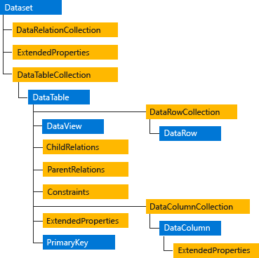

# ADO.NET Architecture
Data processing has traditionally relied primarily on a connection-based, two-tier model. As data processing increasingly uses multi-tier architectures, programmers are switching to a disconnected approach to provide better scalability for their applications.  
  
## ADO.NET Components  
 The two main components of [!INCLUDE[ado_orcas_long](../../../../includes/ado-orcas-long-md.md)] for accessing and manipulating data are the [!INCLUDE[dnprdnshort](../../../../includes/dnprdnshort-md.md)] data providers and the <xref:System.Data.DataSet>.  
  
### .NET Framework Data Providers  
 The .NET Framework Data Providers are components that have been explicitly designed for data manipulation and fast, forward-only, read-only access to data. The `Connection` object provides connectivity to a data source. The `Command` object enables access to database commands to return data, modify data, run stored procedures, and send or retrieve parameter information. The `DataReader` provides a high-performance stream of data from the data source. Finally, the `DataAdapter` provides the bridge between the `DataSet` object and the data source. The `DataAdapter` uses `Command` objects to execute SQL commands at the data source to both load the `DataSet` with data and reconcile changes that were made to the data in the `DataSet` back to the data source. For more information, see [.NET Framework Data Providers](../../../../docs/framework/data/adonet/data-providers.md) and [Retrieving and Modifying Data in ADO.NET](../../../../docs/framework/data/adonet/retrieving-and-modifying-data.md).  
  
### The DataSet  
 The ADO.NET `DataSet` is explicitly designed for data access independent of any data source. As a result, it can be used with multiple and differing data sources, used with XML data, or used to manage data local to the application. The `DataSet` contains a collection of one or more <xref:System.Data.DataTable> objects consisting of rows and columns of data, and also primary key, foreign key, constraint, and relation information about the data in the `DataTable` objects. For more information, see [DataSets, DataTables, and DataViews](../../../../docs/framework/data/adonet/dataset-datatable-dataview/index.md).  
  
 The following diagram illustrates the relationship between a [!INCLUDE[dnprdnshort](../../../../includes/dnprdnshort-md.md)] data provider and a `DataSet`.  
  
   
ADO.NET architecture  
  
### Choosing a DataReader or a DataSet  
 When you decide whether your application should use a `DataReader` (see [Retrieving Data Using a DataReader](../../../../docs/framework/data/adonet/retrieving-data-using-a-datareader.md)) or a `DataSet` (see [DataSets, DataTables, and DataViews](../../../../docs/framework/data/adonet/dataset-datatable-dataview/index.md)), consider the type of functionality that your application requires. Use a `DataSet` to do the following:  
  
-   Cache data locally in your application so that you can manipulate it. If you only need to read the results of a query, the `DataReader` is the better choice.  
  
-   Remote data between tiers or from an XML Web service.  
  
-   Interact with data dynamically such as binding to a Windows Forms control or combining and relating data from multiple sources.  
  
-   Perform extensive processing on data without requiring an open connection to the data source, which frees the connection to be used by other clients.  
  
 If you do not require the functionality provided by the `DataSet`, you can improve the performance of your application by using the `DataReader` to return your data in a forward-only, read-only manner. Although the `DataAdapter` uses the `DataReader` to fill the contents of a `DataSet` (see [Populating a DataSet from a DataAdapter](../../../../docs/framework/data/adonet/populating-a-dataset-from-a-dataadapter.md)), by using the `DataReader`, you can boost performance because you will save memory that would be consumed by the `DataSet`, and avoid the processing that is required to create and fill the contents of the `DataSet`.  
  
## LINQ to DataSet  
 LINQ to DataSet provides query capabilities and compile-time type checking over data cached in a DataSet object. It allows you to write queries in one of the .NET Framework development language, such as C# or Visual Basic. For more information, see [LINQ to DataSet](../../../../docs/framework/data/adonet/linq-to-dataset.md).  
  
## LINQ to SQL  
 LINQ to SQL supports queries against an object model that is mapped to the data structures of a relational database without using an intermediate conceptual model. Each table is represented by a separate class, tightly coupling the object model to the relational database schema. LINQ to SQL translates language-integrated queries in the object model into Transact-SQL and sends them to the database for execution. When the database returns the results, LINQ to SQL translates the results back into objects. For more information, see [LINQ to SQL](../../../../docs/framework/data/adonet/sql/linq/index.md).  
  
## ADO.NET Entity Framework  
 The ADO.NET Entity Framework is designed to enable developers to create data access applications by programming against a conceptual application model instead of programming directly against a relational storage schema. The goal is to decrease the amount of code and maintenance required for data-oriented applications. For more information, see [ADO.NET Entity Framework](../../../../docs/framework/data/adonet/ef/index.md).  
  
## WCF Data Services  
 [!INCLUDE[ssAstoria](../../../../includes/ssastoria-md.md)] is used to deploy data services on the Web or an intranet. The data is structured as entities and relationships according to the specifications of the Entity Data Model. Data deployed on this model is addressable by standard HTTP protocol. For more information, see [WCF Data Services 4.5](../../../../docs/framework/data/wcf/index.md).  
  
## XML and ADO.NET  
 [!INCLUDE[vstecado](../../../../includes/vstecado-md.md)] leverages the power of XML to provide disconnected access to data. [!INCLUDE[vstecado](../../../../includes/vstecado-md.md)] was designed hand-in-hand with the XML classes in the [!INCLUDE[dnprdnshort](../../../../includes/dnprdnshort-md.md)]; both are components of a single architecture.  
  
 [!INCLUDE[vstecado](../../../../includes/vstecado-md.md)] and the XML classes in the [!INCLUDE[dnprdnshort](../../../../includes/dnprdnshort-md.md)] converge in the `DataSet` object. The `DataSet` can be populated with data from an XML source, whether it is a file or an XML stream. The `DataSet` can be written as World-Wide Web Consortium (W3C) compliant XML that includes its schema as XML schema definition language (XSD) schema, regardless of the source of the data in the `DataSet`. Because of the native serialization format of the `DataSet` is XML, it is an excellent medium for moving data between tiers, making the `DataSet` an optimal choice for remoting data and schema context to and from an XML Web service. For more information, see [XML Documents and Data](../../../../docs/standard/data/xml/index.md).  
  
## See Also  
 [ADO.NET Overview](../../../../docs/framework/data/adonet/ado-net-overview.md)  
 [ADO.NET Managed Providers and DataSet Developer Center](http://go.microsoft.com/fwlink/?LinkId=217917)
