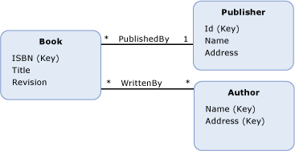
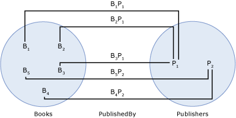

# association set end
An *association set end* identifies the [entity type](entity-type.md) and the [entity set](entity-set.md) at the end of an [association set](association-set.md). Association set ends are defined as part of an association set; an association set must have exactly two association set ends.  
  
 An association set end definition contains the following information:  
  
- One of the entity types involved in the association set. (Required)  
  
- The entity set for the entity type involved in the association set. (Required)  
  
## Example  
 The diagram below shows a conceptual model with two associations: `WrittenBy` and `PublishedBy`.  
  
   
  
 The following diagram shows an association set (`PublishedBy`) and two entity sets (`Books` and `Publishers`) based on the conceptual model shown above. The association set ends are the `Books` and `Publishers` entity sets. Bi in the `Books` entity set represents an instance of the `Book` entity type at run time. Similarly, Pj represents a `Publisher` instance in the `Publishers` entity set. BiPj represents an instance of the `PublishedBy` association in the `PublishedBy` association set.  
  
   
  
 The [ADO.NET Entity Framework](./ef/index.md) uses a DSL called conceptual schema definition language ([CSDL](./ef/language-reference/csdl-specification.md)) to define conceptual models. The following CSDL defines an entity container with one association set for each association in the diagram above. Note that association set ends are defined as part of each association set definition.  
  
 [!code-xml[EDM_Example_Model#EntityContainerExample](../../../../samples/snippets/xml/VS_Snippets_Data/edm_example_model/xml/books.edmx#entitycontainerexample)]  
  
## See also

- [Entity Data Model Key Concepts](entity-data-model-key-concepts.md)
- [Entity Data Model](entity-data-model.md)
