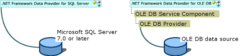

# .NET Framework Data Providers
A [!INCLUDE[dnprdnshort](../../../../includes/dnprdnshort-md.md)] data provider is used for connecting to a database, executing commands, and retrieving results. Those results are either processed directly, placed in a <xref:System.Data.DataSet> in order to be exposed to the user as needed, combined with data from multiple sources, or remoted between tiers. [!INCLUDE[dnprdnshort](../../../../includes/dnprdnshort-md.md)] data providers are lightweight, creating a minimal layer between the data source and code, increasing performance without sacrificing functionality.  
  
 The following table lists the data providers that are included in the [!INCLUDE[dnprdnshort](../../../../includes/dnprdnshort-md.md)].  
  
|[!INCLUDE[dnprdnshort](../../../../includes/dnprdnshort-md.md)] data provider|Description|  
|-------------------------------------------------------------------------------|-----------------|  
|[!INCLUDE[dnprdnshort](../../../../includes/dnprdnshort-md.md)] Data Provider for [!INCLUDE[ssNoVersion](../../../../includes/ssnoversion-md.md)]|Provides data access for Microsoft [!INCLUDE[ssNoVersion](../../../../includes/ssnoversion-md.md)]. Uses the <xref:System.Data.SqlClient> namespace.|  
|[!INCLUDE[dnprdnshort](../../../../includes/dnprdnshort-md.md)] Data Provider for OLE DB|For data sources exposed by using OLE DB. Uses the <xref:System.Data.OleDb> namespace.|  
|[!INCLUDE[dnprdnshort](../../../../includes/dnprdnshort-md.md)] Data Provider for ODBC|For data sources exposed by using ODBC. Uses the <xref:System.Data.Odbc> namespace.|  
|[!INCLUDE[dnprdnshort](../../../../includes/dnprdnshort-md.md)] Data Provider for Oracle|For Oracle data sources. The [!INCLUDE[dnprdnshort](../../../../includes/dnprdnshort-md.md)] Data Provider for Oracle supports Oracle client software version 8.1.7 and later, and uses the <xref:System.Data.OracleClient> namespace.|  
|EntityClient Provider|Provides data access for Entity Data Model (EDM) applications. Uses the <xref:System.Data.EntityClient> namespace.|  
|[!INCLUDE[dnprdnshort](../../../../includes/dnprdnshort-md.md)] Data Provider for [!INCLUDE[ssNoVersion](../../../../includes/ssnoversion-md.md)] Compact 4.0.|Provides data access for Microsoft [!INCLUDE[ssNoVersion](../../../../includes/ssnoversion-md.md)] Compact 4.0. Uses the [System.Data.SqlServerCe](http://msdn.microsoft.com/library/system.data.sqlserverce.aspx) namespace.|  
  
## Core Objects of .NET Framework Data Providers  
 The following table outlines the four core objects that make up a [!INCLUDE[dnprdnshort](../../../../includes/dnprdnshort-md.md)] data provider.  
  
|Object|Description|  
|------------|-----------------|  
|`Connection`|Establishes a connection to a specific data source. The base class for all `Connection` objects is the <xref:System.Data.Common.DbConnection> class.|  
|`Command`|Executes a command against a data source. Exposes `Parameters` and can execute in the scope of a `Transaction` from a `Connection`. The base class for all `Command` objects is the <xref:System.Data.Common.DbCommand> class.|  
|`DataReader`|Reads a forward-only, read-only stream of data from a data source. The base class for all `DataReader` objects is the <xref:System.Data.Common.DbDataReader> class.|  
|`DataAdapter`|Populates a `DataSet` and resolves updates with the data source. The base class for all `DataAdapter` objects is the <xref:System.Data.Common.DbDataAdapter> class.|  
  
 In addition to the core classes listed in the table earlier in this document, a [!INCLUDE[dnprdnshort](../../../../includes/dnprdnshort-md.md)] data provider also contains the classes listed in the following table.  
  
|Object|Description|  
|------------|-----------------|  
|`Transaction`|Enlists commands in transactions at the data source. The base class for all `Transaction` objects is the <xref:System.Data.Common.DbTransaction> class. ADO.NET also provides support for transactions using classes in the <xref:System.Transactions> namespace.|  
|`CommandBuilder`|A helper object that automatically generates command properties of a `DataAdapter` or derives parameter information from a stored procedure and populates the `Parameters` collection of a `Command` object. The base class for all `CommandBuilder` objects is the <xref:System.Data.Common.DbCommandBuilder> class.|  
|`ConnectionStringBuilder`|A helper object that provides a simple way to create and manage the contents of connection strings used by the `Connection` objects. The base class for all `ConnectionStringBuilder` objects is the <xref:System.Data.Common.DbConnectionStringBuilder> class.|  
|`Parameter`|Defines input, output, and return value parameters for commands and stored procedures. The base class for all `Parameter` objects is the <xref:System.Data.Common.DbParameter> class.|  
|`Exception`|Returned when an error is encountered at the data source. For an error encountered at the client, [!INCLUDE[dnprdnshort](../../../../includes/dnprdnshort-md.md)] data providers throw a [!INCLUDE[dnprdnshort](../../../../includes/dnprdnshort-md.md)] exception. The base class for all `Exception` objects is the <xref:System.Data.Common.DbException> class.|  
|`Error`|Exposes the information from a warning or error returned by a data source.|  
|`ClientPermission`|Provided for [!INCLUDE[dnprdnshort](../../../../includes/dnprdnshort-md.md)] data provider code access security attributes. The base class for all `ClientPermission` objects is the <xref:System.Data.Common.DBDataPermission> class.|  
  
## .NET Framework Data Provider for [!INCLUDE[ssNoVersion](../../../../includes/ssnoversion-md.md)] (SqlClient)  
 The [!INCLUDE[dnprdnshort](../../../../includes/dnprdnshort-md.md)] Data Provider for [!INCLUDE[ssNoVersion](../../../../includes/ssnoversion-md.md)] (SqlClient) uses its own protocol to communicate with [!INCLUDE[ssNoVersion](../../../../includes/ssnoversion-md.md)]. It is lightweight and performs well because it is optimized to access a [!INCLUDE[ssNoVersion](../../../../includes/ssnoversion-md.md)] directly without adding an OLE DB or Open Database Connectivity (ODBC) layer. The following illustration contrasts the [!INCLUDE[dnprdnshort](../../../../includes/dnprdnshort-md.md)] Data Provider for [!INCLUDE[ssNoVersion](../../../../includes/ssnoversion-md.md)] with the [!INCLUDE[dnprdnshort](../../../../includes/dnprdnshort-md.md)] Data Provider for OLE DB. The [!INCLUDE[dnprdnshort](../../../../includes/dnprdnshort-md.md)] Data Provider for OLE DB communicates to an OLE DB data source through both the OLE DB Service component, which provides connection pooling and transaction services, and the OLE DB provider for the data source.  
  
> [!NOTE]
>  The [!INCLUDE[dnprdnshort](../../../../includes/dnprdnshort-md.md)] Data Provider for ODBC has a similar architecture to the [!INCLUDE[dnprdnshort](../../../../includes/dnprdnshort-md.md)] Data Provider for OLE DB; for example, it calls into an ODBC Service Component.  
  
   
Comparison of the .NET Framework Data Provider for SQL Server and the .NET Framework Data Provider for OLE DB  
  
 The [!INCLUDE[dnprdnshort](../../../../includes/dnprdnshort-md.md)] Data Provider for [!INCLUDE[ssNoVersion](../../../../includes/ssnoversion-md.md)] classes are located in the <xref:System.Data.SqlClient> namespace.  
  
 The [!INCLUDE[dnprdnshort](../../../../includes/dnprdnshort-md.md)] Data Provider for [!INCLUDE[ssNoVersion](../../../../includes/ssnoversion-md.md)] supports both local and distributed transactions. For distributed transactions, the [!INCLUDE[dnprdnshort](../../../../includes/dnprdnshort-md.md)] Data Provider for [!INCLUDE[ssNoVersion](../../../../includes/ssnoversion-md.md)], by default, automatically enlists in a transaction and obtains transaction details from Windows Component Services or <xref:System.Transactions>. For more information, see [Transactions and Concurrency](../../../../docs/framework/data/adonet/transactions-and-concurrency.md).  
  
 The following code example shows how to include the `System.Data.SqlClient` namespace in your applications.  
  
```vb  
Imports System.Data.SqlClient  
```  
  
```csharp  
using System.Data.SqlClient;  
```  
  
## .NET Framework Data Provider for OLE DB  
 The [!INCLUDE[dnprdnshort](../../../../includes/dnprdnshort-md.md)] Data Provider for OLE DB (OleDb) uses native OLE DB through COM interop to enable data access. The [!INCLUDE[dnprdnshort](../../../../includes/dnprdnshort-md.md)] Data Provider for OLE DB supports both local and distributed transactions. For distributed transactions, the [!INCLUDE[dnprdnshort](../../../../includes/dnprdnshort-md.md)] Data Provider for OLE DB, by default, automatically enlists in a transaction and obtains transaction details from Windows Component Services. For more information, see [Transactions and Concurrency](../../../../docs/framework/data/adonet/transactions-and-concurrency.md).  
  
 The following table shows the providers that have been tested with [!INCLUDE[vstecado](../../../../includes/vstecado-md.md)].  
  
|Driver|Provider|  
|------------|--------------|  
|SQLOLEDB|Microsoft OLE DB provider for [!INCLUDE[ssNoVersion](../../../../includes/ssnoversion-md.md)]|  
|MSDAORA|Microsoft OLE DB provider for Oracle|  
|Microsoft.Jet.OLEDB.4.0|OLE DB provider for Microsoft Jet|  
  
> [!NOTE]
>  Using an Access (Jet) database as a data source for multithreaded applications, such as [!INCLUDE[vstecasp](../../../../includes/vstecasp-md.md)] applications, is not recommended. If you must use Jet as a data source for an [!INCLUDE[vstecasp](../../../../includes/vstecasp-md.md)] application, realize that [!INCLUDE[vstecasp](../../../../includes/vstecasp-md.md)] applications connecting to an Access database can encounter connection problems.  
  
 The [!INCLUDE[dnprdnshort](../../../../includes/dnprdnshort-md.md)] Data Provider for OLE DB does not support OLE DB version 2.5 interfaces. OLE DB Providers that require support for OLE DB 2.5 interfaces will not function correctly with the [!INCLUDE[dnprdnshort](../../../../includes/dnprdnshort-md.md)] Data Provider for OLE DB. This includes the Microsoft OLE DB provider for Exchange and the Microsoft OLE DB provider for Internet Publishing.  
  
 The [!INCLUDE[dnprdnshort](../../../../includes/dnprdnshort-md.md)] Data Provider for OLE DB does not work with the OLE DB provider for ODBC (MSDASQL). To access an ODBC data source using [!INCLUDE[vstecado](../../../../includes/vstecado-md.md)], use the [!INCLUDE[dnprdnshort](../../../../includes/dnprdnshort-md.md)] Data Provider for ODBC.  
  
 [!INCLUDE[dnprdnshort](../../../../includes/dnprdnshort-md.md)] Data Provider for OLE DB classes are located in the <xref:System.Data.OleDb> namespace. The following code example shows how to include the `System.Data.OleDb` namespace in your applications.  
  
```vb  
Imports System.Data.OleDb  
```  
  
```csharp  
using System.Data.OleDb;  
```  
  
## .NET Framework Data Provider for ODBC  
 The [!INCLUDE[dnprdnshort](../../../../includes/dnprdnshort-md.md)] Data Provider for ODBC (Odbc) uses the native ODBC Driver Manager (DM) to enable data access. The ODBC data provider supports both local and distributed transactions. For distributed transactions, the ODBC data provider, by default, automatically enlists in a transaction and obtains transaction details from Windows Component Services. For more information, see [Transactions and Concurrency](../../../../docs/framework/data/adonet/transactions-and-concurrency.md).  
  
 The following table shows the ODBC drivers tested with [!INCLUDE[vstecado](../../../../includes/vstecado-md.md)].  
  
|Driver|  
|------------|  
|[!INCLUDE[ssNoVersion](../../../../includes/ssnoversion-md.md)]|  
|Microsoft ODBC for Oracle|  
|Microsoft Access Driver (*.mdb)|  
  
 [!INCLUDE[dnprdnshort](../../../../includes/dnprdnshort-md.md)] Data Provider for ODBC classes are located in the <xref:System.Data.Odbc> namespace.  
  
 The following code example shows how to include the `System.Data.Odbc` namespace in your applications.  
  
```vb  
Imports System.Data.Odbc  
```  
  
```csharp  
using System.Data.Odbc;  
```  
  
> [!NOTE]
>  The [!INCLUDE[dnprdnshort](../../../../includes/dnprdnshort-md.md)] Data Provider for ODBC requires MDAC 2.6 or a later version, and MDAC 2.8 SP1 is recommended. You can download MDAC 2.8 SP1 from the [Data Access and Storage Developer Center](http://go.microsoft.com/fwlink/?linkid=4173).  
  
## .NET Framework Data Provider for Oracle  
 The [!INCLUDE[dnprdnshort](../../../../includes/dnprdnshort-md.md)] Data Provider for Oracle (OracleClient) enables data access to Oracle data sources through Oracle client connectivity software. The data provider supports Oracle client software version 8.1.7 or a later version. The data provider supports both local and distributed transactions. For more information, see [Transactions and Concurrency](../../../../docs/framework/data/adonet/transactions-and-concurrency.md).  
  
 The [!INCLUDE[dnprdnshort](../../../../includes/dnprdnshort-md.md)] Data Provider for Oracle requires Oracle client software (version 8.1.7 or a later version) on the system before you can connect to an Oracle data source.  
  
 [!INCLUDE[dnprdnshort](../../../../includes/dnprdnshort-md.md)] Data Provider for Oracle classes are located in the <xref:System.Data.OracleClient> namespace and are contained in the `System.Data.OracleClient.dll` assembly. You must reference both the `System.Data.dll` and the `System.Data.OracleClient.dll` when you compile an application that uses the data provider.  
  
 The following code example shows how to include the `System.Data.OracleClient` namespace in your applications.  
  
```vb  
Imports System.Data  
Imports System.Data.OracleClient  
```  
  
```csharp  
using System.Data;  
using System.Data.OracleClient;  
```  
  
## Choosing a .NET Framework Data Provider  
 Depending on the design and data source for your application, your choice of [!INCLUDE[dnprdnshort](../../../../includes/dnprdnshort-md.md)] data provider can improve the performance, capability, and integrity of your application. The following table discusses the advantages and limitations of each [!INCLUDE[dnprdnshort](../../../../includes/dnprdnshort-md.md)] data provider.  
  
|Provider|Notes|  
|--------------|-----------|  
|[!INCLUDE[dnprdnshort](../../../../includes/dnprdnshort-md.md)] Data Provider for [!INCLUDE[ssNoVersion](../../../../includes/ssnoversion-md.md)]|Recommended for middle-tier applications that use Microsoft [!INCLUDE[ssNoVersion](../../../../includes/ssnoversion-md.md)].<br /><br /> Recommended for single-tier applications that use Microsoft Database Engine (MSDE) or [!INCLUDE[ssNoVersion](../../../../includes/ssnoversion-md.md)].<br /><br /> Recommended over use of the OLE DB provider for [!INCLUDE[ssNoVersion](../../../../includes/ssnoversion-md.md)] (SQLOLEDB) with the [!INCLUDE[dnprdnshort](../../../../includes/dnprdnshort-md.md)] Data Provider for OLE DB.|  
|[!INCLUDE[dnprdnshort](../../../../includes/dnprdnshort-md.md)] Data Provider for OLE DB|For [!INCLUDE[ssNoVersion](../../../../includes/ssnoversion-md.md)], the [!INCLUDE[dnprdnshort](../../../../includes/dnprdnshort-md.md)] Data Provider for [!INCLUDE[ssNoVersion](../../../../includes/ssnoversion-md.md)] is recommended instead of this provider.<br /><br /> Recommended for single-tier applications that use Microsoft Access databases. Use of an Access database for a middle-tier application is not recommended.|  
|[!INCLUDE[dnprdnshort](../../../../includes/dnprdnshort-md.md)] ``Data Provider for ODBC|Recommended for middle and single-tier applications that use ODBC data sources.|  
|[!INCLUDE[dnprdnshort](../../../../includes/dnprdnshort-md.md)] ``Data Provider for Oracle|Recommended for middle and single-tier applications that use Oracle data sources.|  
  
## EntityClient Provider  
 The EntityClient provider is used for accessing data based on an Entity Data Model (EDM). Unlike the other .NET Framework data providers, it does not interact directly with a data source. Instead, it uses Entity SQL to communicate with the underlying data provider. For more information, see [EntityClient and Entity SQL](http://msdn.microsoft.com/library/49202ab9-ac98-4b4b-a05c-140e422bf527).  
  
## See Also  
 [ADO.NET Overview](../../../../docs/framework/data/adonet/ado-net-overview.md)  
 [Retrieving and Modifying Data in ADO.NET](../../../../docs/framework/data/adonet/retrieving-and-modifying-data.md)  
 [ADO.NET Managed Providers and DataSet Developer Center](http://go.microsoft.com/fwlink/?LinkId=217917)
