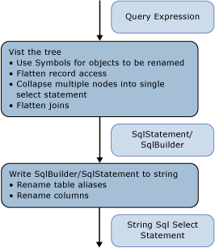

# Architecture and Design
The SQL generation module in the [Sample Provider](http://go.microsoft.com/fwlink/?LinkId=180616) is implemented as a visitor on the expression tree that represents the command tree. The generation is done in a single pass over the expression tree.  
  
 The nodes of the tree are processed from the bottom up. First, an intermediate structure is produced: SqlSelectStatement or SqlBuilder, both implementing ISqlFragment. Next, the string SQL statement is produced from that structure. There are two reasons for the intermediate structure:  
  
-   Logically, a SQL SELECT statement is populated out of order. The nodes that participate in the FROM clause are visited before the nodes that participate in the WHERE, GROUP BY, and the ORDER BY clause.  
  
-   To rename aliases, you must identify all used aliases to avoid collisions during renaming. To defer the renaming choices in SqlBuilder, use Symbol objects to represent the columns that are candidates for renaming.  
  
   
  
 In the first phase, while visiting the expression tree, expressions are grouped into SqlSelectStatements, joins are flattened, and join aliases are flattened. During this pass, Symbol objects represent columns or input aliases that may be renamed.  
  
 In the second phase, while producing the actual string, aliases are renamed.  
  
## Data Structures  
 This section discusses the types used in the [Sample Provider](http://go.microsoft.com/fwlink/?LinkId=180616) that you use to build a SQL statement.  
  
### ISqlFragment  
 This section covers the classes that implement the ISqlFragment interface, which serves two purposes:  
  
-   A common return type for all the visitor methods.  
  
-   Gives a method to write the final SQL string.  
  
```  
internal interface ISqlFragment {  
   void WriteSql(SqlWriter writer, SqlGenerator sqlGenerator);  
}  
```  
  
#### SqlBuilder  
 SqlBuilder is a gathering device for the final SQL string, similar to StringBuilder. It consists of the strings that make up the final SQL, along with ISqlFragments that can be converted into strings.  
  
```  
internal sealed class SqlBuilder : ISqlFragment {  
   public void Append(object s)  
   public void AppendLine()  
   public bool IsEmpty  
}  
```  
  
#### SqlSelectStatement  
 SqlSelectStatement represents a canonical SQL SELECT statement of the shape "SELECT … FROM  .. WHERE … GROUP BY … ORDER BY".  
  
 Each of the SQL clauses is represented by a StringBuilder. In addition, it tracks whether Distinct has been specified and whether the statement is topmost. If the statement is not topmost, the ORDER BY clause is omitted unless the statement also has a TOP clause.  
  
 FromExtents contains the list of inputs for the SELECT statement. There is usually just one element in this. SELECT statements for joins may temporarily have more than one element.  
  
 If the SELECT statement is created by a Join node, SqlSelectStatement maintains a list of all the extents that have been flattened in the join in AllJoinExtents. OuterExtents represents outer references of the SqlSelectStatement and is used for input alias renaming.  
  
```  
internal sealed class SqlSelectStatement : ISqlFragment {  
   internal bool IsDistinct { get, set };  
   internal bool IsTopMost  
  
   internal List<Symbol> AllJoinExtents { get, set };  
   internal List<Symbol> FromExtents { get};  
   internal Dictionary<Symbol, bool> OuterExtents { get};  
  
   internal TopClause Top { get, set };  
  
   internal SqlBuilder Select {get};  
   internal SqlBuilder From  
   internal SqlBuilder Where  
   internal SqlBuilder GroupBy  
   public SqlBuilder OrderBy  
}  
```  
  
#### TopClause  
 TopClause represents the TOP expression in a SqlSelectStatement. The TopCount property indicates how many TOP rows should be selected.  When WithTies is true, the TopClause was built from a DbLimitExpession.  
  
```  
class TopClause : ISqlFragment {  
   internal bool WithTies {get}  
   internal ISqlFragment TopCount {get}  
   internal TopClause(ISqlFragment topCount, bool withTies)  
   internal TopClause(int topCount, bool withTies)  
}  
```  
  
### Symbols  
 The Symbol-related classes and the symbol table perform input alias renaming, join alias flattening, and column alias renaming.  
  
 The Symbol class represents an extent, a nested SELECT statement, or a column. It is used instead of an actual alias to allow for renaming after it has been used and it also carries additional information for the artifact it represents (like the type).  
  
```  
class Symbol : ISqlFragment {  
   internal Dictionary<string, Symbol> Columns {get}  
   internal bool NeedsRenaming {get, set}  
   internal bool IsUnnest {get, set}   //not used  
  
   public string Name{get}  
   public string NewName {get,set}  
   internal TypeUsage Type {get, set}  
  
   public Symbol(string name, TypeUsage type)  
}  
```  
  
 Name stores the original alias for the represented extent, nested SELECT statement, or a column.  
  
 NewName stores the alias that will be used in the SQL SELECT statement. It is originally set to Name, and only renamed if needed when generating the final string query.  
  
 Type is only useful for symbols representing extents and nested SELECT statements.  
  
#### SymbolPair  
 The SymbolPair class addresses record flattening.  
  
 Consider a property expression D(v, "j3.j2.j1.a.x") where v is a VarRef, j1, j2, j3 are joins, a is an extent, and x is a columns.  
  
 This has to be translated eventually into {j'}.{x'}. The source field represents the outermost SqlStatement, representing a join expression (say j2); this is always a Join symbol. The column field moves from one join symbol to the next until it stops at a non-join symbol. This is returned when visiting a DbPropertyExpression but is never added to a SqlBuilder.  
  
```  
class SymbolPair : ISqlFragment {  
   public Symbol Source;  
   public Symbol Column;  
   public SymbolPair(Symbol source, Symbol column)  
}  
```  
  
#### JoinSymbol  
 A Join symbol is a Symbol that represents a nested SELECT statement with a join or a join input.  
  
```  
internal sealed class JoinSymbol : Symbol {  
   internal List<Symbol> ColumnList {get, set}  
   internal List<Symbol> ExtentList {get}  
   internal List<Symbol> FlattenedExtentList {get, set}  
   internal Dictionary<string, Symbol> NameToExtent {get}  
   internal bool IsNestedJoin {get, set}  
  
   public JoinSymbol(string name, TypeUsage type, List<Symbol> extents)  
}  
```  
  
 ColumnList represents the list of columns in the SELECT clause if this symbol represents a SQL SELECT statement. ExtentList is the list of extents in the SELECT clause. If the join has multiple extents flattened at the top level, FlattenedExtentList tracks the extents to ensure that extent aliases are renamed correctly.  
  
 NameToExtent has all the extents in ExtentList as a dictionary. IsNestedJoin is used to determine whether a JoinSymbol is an ordinary join symbol or one that has a corresponding SqlSelectStatement.  
  
 All the lists are set exactly once and then used for lookups or enumeration.  
  
#### SymbolTable  
 SymbolTable is used to resolve variable names to Symbols. SymbolTable is implemented as a stack with a new entry for each scope. Lookups search from the top of the stack to the bottom until an entry is found.  
  
```  
internal sealed class SymbolTable {  
   internal void EnterScope()  
   internal void ExitScope()  
   internal void Add(string name, Symbol value)  
   internal Symbol Lookup(string name)  
}  
```  
  
 There is only one SymbolTable per one instance of the Sql Generation module. Scopes are entered and exited for each relational node. All symbols in earlier scopes are visible to later scopes unless hidden by other symbols with the same name.  
  
### Global State for the Visitor  
 To assist in renaming of aliases and columns, maintain a list of all the column names (AllColumnNames) and extent aliases (AllExtentNames) that have been used in the first pass over the query tree.  The symbol table resolves variable names to Symbols. IsVarRefSingle is only used for verification purposes, it is not strictly necessary.  
  
 The two stacks used via CurrentSelectStatement and IsParentAJoin are used to pass "parameters" from parent to child nodes, since the visitor pattern does not allow us to pass parameters.  
  
```  
internal Dictionary<string, int> AllExtentNames {get}  
internal Dictionary<string, int> AllColumnNames {get}  
SymbolTable symbolTable = new SymbolTable();  
bool isVarRefSingle = false;  
  
Stack<SqlSelectStatement> selectStatementStack;  
private SqlSelectStatement CurrentSelectStatement{get}  
  
Stack<bool> isParentAJoinStack;  
private bool IsParentAJoin{get}  
```  
  
## Common Scenarios  
 This section discusses common provider scenarios.  
  
### Grouping Expression Nodes into SQL Statements  
 A SqlSelectStatement is created when the first relational node is encountered (typically a DbScanExpression extent) when visiting the tree from the bottom up. To produce a SQL SELECT statement with as few nested queries as possible, aggregate as many of its parent nodes as possible in that SqlSelectStatement.  
  
 The decision of whether a given (relational) node can be added to the current SqlSelectStatement (the one returned when visiting the input) or if a new statement needs to be started is computed by the method IsCompatible and depends on what is already in the SqlSelectStatement, which depends on what nodes were below the given node.  
  
 Typically, if SQL statement clauses are evaluated after clauses where the nodes being considered for merging are not empty, the node cannot be added to the current statement. For example, if the next node is a Filter, that node can be incorporated into the current SqlSelectStatement only if the following is true:  
  
-   The SELECT list is empty. If the SELECT list is not empty, the select list was produced by a node preceding the filter and the predicate may refer to columns produced by that SELECT list.  
  
-   The GROUPBY is empty. If the GROUPBY is not empty, adding the filter would mean filtering before grouping, which is not correct.  
  
-   The TOP clause is empty. If the TOP clause is not empty, adding the filter would mean filtering before doing TOP, which is not correct.  
  
 This does not apply to non-relational nodes like DbConstantExpression or arithmetic expressions, because these are always included as part of an existing SqlSelectStatement.  
  
 Also, when encountering the root of join tree (a join node that does not have a join parent), a new SqlSelectStatement is started. All of its left spine join children are aggregated into that SqlSelectStatement.  
  
 Whenever a new SqlSelectStatement is started, and the current one is added to the input, the current SqlSelectStatement may need to be completed by adding projection columns (a SELECT clause) if one does not exist. This is done with the method AddDefaultColumns, which looks at the FromExtents of the SqlSelectStatement and adds all the columns that the list of extents represented by FromExtents brings in scope to the list of projected columns. This is done, because at that point, it is unknown which columns are referenced by the other nodes. This can be optimized to only project the columns that can later be used.  
  
### Join Flattening  
 The IsParentAJoin property helps determine whether a given join can be flattened. In particular, IsParentAJoin returns `true` only for the left child of a join and for each DbScanExpression that is an immediate input to a join, in which case that child node reuses the same SqlSelectStatement that the parent would later use. For more information, see "Join Expressions".  
  
### Input Alias Redirecting  
 Input alias redirecting is accomplished with the symbol table.  
  
 To explain input alias redirecting, refer to the first example in [Generating SQL from Command Trees - Best Practices](../../../../../docs/framework/data/adonet/ef/generating-sql-from-command-trees-best-practices.md).  There "a" needed to be redirected to "b" in the projection.  
  
 When a SqlSelectStatement object is created, the extent that is the input to the node is put in the From property of the SqlSelectStatement. A Symbol (<symbol_b>) is created based on the input binding name ("b") to represent that extent and "AS  " +  <symbol_b> is appended to the From Clause.  The symbol is also added to the FromExtents property.  
  
 The symbol is also added to the symbol table to link the input binding name to it ("b", <symbol_b>).  
  
 If a subsequent node reuses that SqlSelectStatement, it adds an entry to the symbol table to link its input binding name to that symbol. In our example, the DbProjectExpression with the input binding name of "a" would reuse the SqlSelectStatement and add ("a", \< symbol_b>) to the table.  
  
 When expressions reference the input binding name of the node that is reusing the SqlSelectStatement, that reference is resolved using the symbol table to the correct redirected symbol. When "a" from "a.x" is resolved while visiting the DbVariableReferenceExpression representing "a" it will resolve to the Symbol <symbol_b>.  
  
### Join Alias Flattening  
 Join alias flattening is achieved when visiting a DbPropertyExpression as described in the section titled DbPropertyExpression.  
  
### Column Name and Extent Alias Renaming  
 The issue of column name and extent alias renaming is addressed by using symbols that only get substituted with aliases in the second phase of the generation described in the section titled Second Phase of SQL Generation: Generating the String Command.  
  
## First Phase of the SQL Generation: Visiting the Expression Tree  
 This section describes the first phase of SQL generation, when the expression representing the query is visited and an intermediate structure is produced, either a SqlSelectStatement or a SqlBuilder.  
  
 This section describes the principles of visiting different expression node categories, and details of visiting specific expression types.  
  
### Relational (Non-Join) Nodes  
 The following expression types support non-join nodes:  
  
-   DbDistinctExpression  
  
-   DbFilterExpression  
  
-   DbGroupByExpression  
  
-   DbLimitExpession  
  
-   DbProjectExpression  
  
-   DbSkipExpression  
  
-   DbSortExpression  
  
 Visiting these nodes follows the following pattern:  
  
1.  Visit the relational input and get the resulting SqlSelectStatement. The input to a relational node could be one of the following:  
  
    -   A relational node, including an extent (a DbScanExpression, for example). Visiting such a node returns a SqlSelectStatement.  
  
    -   A set operation expression (UNION ALL, for example). The result has to be wrapped in brackets and put in the FROM clause of a new SqlSelectStatement.  
  
2.  Check whether the current node can be added to the SqlSelectStatement produced by the input. The section titled Grouping Expressions into SQL Statements describes this. If not,  
  
    -   Pop the current SqlSelectStatement object.  
  
    -   Create a new SqlSelectStatement object and add the popped SqlSelectStatement as the FROM of the new SqlSelectStatement object.  
  
    -   Put the new object on top of the stack.  
  
3.  Redirect the input expression binding to the correct symbol from the input. This information is maintained in the SqlSelectStatement object.  
  
4.  Add a new SymbolTable scope.  
  
5.  Visit the non-input part of the expression (for example, Projection and Predicate).  
  
6.  Pop all the objects added to the global stacks.  
  
 DbSkipExpression not have a direct equivalent in SQL. Logically, it is translated into:  
  
```  
SELECT Y.x1, Y.x2, ..., Y.xn  
FROM (  
   SELECT X.x1, X.x2, ..., X.xn, row_number() OVER (ORDER BY sk1, sk2, ...) AS [row_number]   
   FROM input as X   
   ) as Y  
WHERE Y.[row_number] > count   
ORDER BY sk1, sk2, ...  
```  
  
### Join Expressions  
 The following are considered join expressions and they are processed in a common way, by the VisitJoinExpression method:  
  
-   DbApplyExpression  
  
-   DbJoinExpression  
  
-   DbCrossJoinExpression  
  
 The following are the visit steps:  
  
 First, before visiting the children, IsParentAJoin is invoked to check whether the join node is a child of a join along a left spine. If it returns false, a new SqlSelectStatement is started. In that sense, joins are visited differently from the rest of the nodes, as the parent (the join node) creates the SqlSelectStatement for the children to possibly use.  
  
 Second, process the inputs one at a time. For each input:  
  
1.  Visit the input.  
  
2.  Post process the result of visiting the input by invoking ProcessJoinInputResult, which is responsible for maintaining the symbol table after visiting a child of a join expression and possibly finishing the SqlSelectStatement produced by the child. The child's result could be one of the following:  
  
    -   A SqlSelectStatement different from the one to which the parent will be added. In such case, it may need to be completed by adding default columns. If the input was a Join, you need to create a new join symbol. Otherwise, create a normal symbol.  
  
    -   An extent (a DbScanExpression, for example), in which case it is simply added to the list of inputs of the parent’s SqlSelectStatement.  
  
    -   Not a SqlSelectStatement, in which case it is wrapped with brackets.  
  
    -   The same SqlSelectStatement to which the parent is added. In such case, the symbols in the FromExtents list need to be replaced with a single new JoinSymbol representing them all.  
  
    -   For the first three cases, AddFromSymbol is called to add the AS clause, and update the symbol table.  
  
 Third, the join condition (if any) is visited.  
  
### Set Operations  
 The set operations DbUnionAllExpression, DbExceptExpression, and DbIntersectExpression are processed by the method VisitSetOpExpression. It creates a SqlBuilder of the shape  
  
```xml  
<leftSqlSelectStatement> <setOp> <rightSqlSelectStatement>  
```  
  
 Where \<leftSqlSelectStatement> and \<rightSqlSelectStatement> are SqlSelectStatements obtained by visiting each of the inputs, and \<setOp> is the corresponding operation (UNION ALL for example).  
  
### DbScanExpression  
 If visited in a join context (as an input to a join that is a left child of another join), DbScanExpression returns a SqlBuilder with the target SQL for the corresponding target, which is either a defining query, table, or a view. Otherwise, a new SqlSelectStatement is created with the FROM field set to correspond to the corresponding target.  
  
### DbVariableReferenceExpression  
 The visit of a DbVariableReferenceExpression returns the Symbol corresponding to that variable reference expression based on a look up in the symbol table.  
  
### DbPropertyExpression  
 Join alias flattening is identified and processed when visiting a DbPropertyExpression.  
  
 The Instance property is first visited and the result is a Symbol, a JoinSymbol, or a SymbolPair. Here is how these three cases are handled:  
  
-   If a JoinSymbol is returned, than its NameToExtent property contains a symbol for the needed property. If the join symbol represents a nested join, a new Symbol pair is returned with the join symbol to track the symbol that would be used as the instance alias, and the symbol representing the actual property for further resolving.  
  
-   If a SymbolPair is returned and the Column part is a join symbol, a join symbol is again returned, but now the column property is updated to point to the property represented by the current property expression. Otherwise a SqlBuilder is returned with the SymbolPair source as the alias, and the symbol for the current property as the column.  
  
-   If a Symbol is returned, the Visit method returns a SqlBuilder method with that instance as the alias, and the property name as column name.  
  
### DbNewInstanceExpression  
 When used as the Projection property of DbProjectExpression, DbNewInstanceExpression produces a comma-separated list of the arguments to represent the projected columns.  
  
 When DbNewInstanceExpression has a collection return type, and defines a new collection of the expressions provided as arguments, the following three cases are handled separately:  
  
-   If DbNewInstanceExpression has DbElementExpression as the only argument, it is translated as follows:  
  
    ```  
    NewInstance(Element(X)) =>  SELECT TOP 1 …FROM X  
    ```  
  
 If DbNewInstanceExpression has no arguments (represents an empty table), DbNewInstanceExpression is translated into:  
  
```  
SELECT CAST(NULL AS <primitiveType>) as X  
FROM (SELECT 1) AS Y WHERE 1=0  
```  
  
 Otherwise DbNewInstanceExpression builds a union-all ladder of the arguments:  
  
```  
SELECT <visit-result-arg1> as X  
UNION ALL SELECT <visit-result-arg2> as X  
UNION ALL …  
UNION ALL SELECT <visit-result-argN> as X  
```  
  
### DbFunctionExpression  
 Canonical and built-in functions are processed the same way: if they need special handling (TRIM(string) to  LTRIM(RTRIM(string), for example), the appropriate handler is invoked. Otherwise they are translated to FunctionName(arg1, arg2, ..., argn).  
  
 Dictionaries are used to keep track of which functions need special handling and their appropriate handlers.  
  
 User-defined functions are tanslated to NamespaceName.FunctionName(arg1, arg2, ..., argn).  
  
### DbElementExpression  
 The method that visits DbElementExpression is only invoked for visiting a DbElementExpression when used to represent a scalar subquery. Therefore, DbElementExpression translates into a complete SqlSelectStatement and adds brackets around it.  
  
### DbQuantifierExpression  
 Depending on the expression type (Any or All), DbQuantifierExpression is translated it as:  
  
```  
Any(input, x) => Exists(Filter(input,x))  
All(input, x) => Not Exists(Filter(input, not(x))  
```  
  
### DbNotExpression  
 In some cases it is possible to collapse the translation of DbNotExpression with its input expression. For example:  
  
```  
Not(IsNull(a)) =>  "a IS NOT NULL"  
Not(All(input, x) => Not (Not Exists(Filter(input, not(x))) => Exists(Filter(input, not(x))  
```  
  
 The reason the second collapse is performed is because inefficiencies were introduced by the provider when translating DbQuantifierExpression of type All. Thus the Entity Framework could not have done the simplification.  
  
### DbIsEmptyExpression  
 DbIsEmptyExpression is translated as:  
  
```  
IsEmpty(inut) = Not Exists(input)  
```  
  
## Second Phase of SQL Generation: Generating the String Command  
 When generating a string SQL command, the SqlSelectStatement produces actual aliases for the symbols, which addresses the issue of column name and extent alias renaming.  
  
 Extent alias renaming occurs while writing the SqlSelectStatement object into a string. First create a list of all the aliases used by the outer extents. Each symbol in the FromExtents (or AllJoinExtents if it is non-null), gets renamed if it collides with any of the outer extents. If renaming is needed, it will not conflict with any of the extents collected in AllExtentNames.  
  
 Column renaming occurs while writing a Symbol object to a string. AddDefaultColumns in the first phase has determined if a certain column symbol has to be renamed. In the second phase only the rename occurs making sure that the name produced does not conflict with any name used in AllColumnNames  
  
 To produce unique names both for extent aliases and for columns, use <existing_name>_n where n is the smallest alias that has not been used yet. The global list of all aliases increases the need for cascading renames.  
  
## See Also  
 [SQL Generation in the Sample Provider](../../../../../docs/framework/data/adonet/ef/sql-generation-in-the-sample-provider.md)
