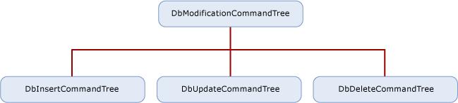

# Modification SQL Generation
This section discusses how to develop a modification SQL generation module for your (SQL:1999-compliant database) provider. This module is responsible for translating a modification command tree into the appropriate SQL INSERT, UPDATE or DELETE statements.  
  
 For information about SQL generation for select statements, see [SQL Generation](../../../../../docs/framework/data/adonet/ef/sql-generation.md).  
  
## Overview of Modification Command Trees  
 The modification SQL generation module generates database-specific modification SQL statements based on a given input DbModificationCommandTree.  
  
 A DbModificationCommandTree is an object model representation of a modification DML operation (an insert, an update, or a delete operation), inheriting from DbCommandTree. There are three implementations of DbModificationCommandTree:  
  
-   DbInsertCommandTree  
  
-   DbUpdateCommandTree  
  
-   DbDeleteCommandTree  
  
 DbModificationCommandTree and its implementations that are produced by the [!INCLUDE[adonet_ef](../../../../../includes/adonet-ef-md.md)] always represent a single row operation. This section describes these types with their constraints in the .NET Framework version 3.5.  
  
   
  
 DbModificationCommandTree has a Target property that represents the target set for the modification operation. The Target’s Expression property, which defines the input set is always DbScanExpression.  A DbScanExpression can either represent a table or a view, or a set of data defined with a query if the metadata property "Defining Query" of its Target is non-null.  
  
 A DbScanExpression that represents a query could only reach a provider as a target of modification if the set was defined by using a defining query in the model but no function was provided for the corresponding modification operation. Providers may not be able to support such a scenario (SqlClient, for example, does not).  
  
 DbInsertCommandTree represents a single row insert operation expressed as a command tree.  
  
```  
public sealed class DbInsertCommandTree : DbModificationCommandTree {  
   public IList<DbModificationClause> SetClauses { get }  
   public DbExpression Returning { get }  
}  
```  
  
 DbUpdateCommandTree represents a single-row update operation expressed as a command tree.  
  
 DbDeleteCommandTree represents a single row delete operation expressed as a command tree.  
  
### Restrictions on Modification Command Tree Properties  
 The following information and restrictions apply to the modification command tree properties.  
  
#### Returning in DbInsertCommandTree and DbUpdateCommandTree  
 When non-null, Returning indicates that the command returns a reader. Otherwise, the command should return a scalar value indicating the number of rows affected (inserted or updated).  
  
 The Returning value specifies a projection of results to be returned based on the inserted or the updated row. It can only be of type DbNewInstanceExpression representing a row, with each of its arguments being a DbPropertyExpression over a DbVariableReferenceExpression representing a reference to the Target of the corresponding DbModificationCommandTree. The properties represented by the DbPropertyExpressions used in the property Returning are always store generated or computed values. In DbInsertCommandTree, Returning is not null when at least one property of the table in which the row is being inserted is specified as store generated or computed (marked as StoreGeneratedPattern.Identity or StoreGeneratedPattern.Computed in the ssdl). In DbUpdateCommandTrees, Returning is not null when at least one property of the table in which the row is being updated is specified as store computed (marked as StoreGeneratedPattern.Computed in the ssdl).  
  
#### SetClauses in DbInsertCommandTree and DbUpdateCommandTree  
 SetClauses specifies the list of insert or update set clauses that define the insert or update operation.  
  
```  
The elements of the list are specified as type DbModificationClause, which specifies a single clause in an insert or update modification operation. DbSetClause inherits from DbModificationClause and specifies the clause in a modification operation that sets the value of a property. Beginning in version 3.5 of the .NET Framework, all elements in SetClauses are of type SetClause.   
```  
  
 Property specifies the property that should be updated. It is always a DbPropertyExpression over a DbVariableReferenceExpression, which represents a reference to the Target of the corresponding DbModificationCommandTree.  
  
 Value specifies the new value with which to update the property. It is either of type DbConstantExpression or DbNullExpression.  
  
#### Predicate in DbUpdateCommandTree and DbDeleteCommandTree  
 Predicate specifies the predicate used to determine which members of the target collection should be updated or deleted. It is an expression tree built of the following subset of DbExpressions:  
  
-   DbComparisonExpression of kind Equals, with the right child being a DbPropertyExression as restricted below and the left child a DbConstantExpression.  
  
-   DbConstantExpression  
  
-   DbIsNullExpression over a DbPropertyExpresison as restricted below  
  
-   DbPropertyExpression over a DbVariableReferenceExpression representing a reference to the Target of the corresponding DbModificationCommandTree.  
  
-   DbAndExpression  
  
-   DbNotExpression  
  
-   DbOrExpression  
  
## Modification SQL Generation in the Sample Provider  
 The [Entity Framework Sample Provider](http://go.microsoft.com/fwlink/?LinkId=180616) demonstrates the components of ADO.NET Data Providers that support the [!INCLUDE[adonet_ef](../../../../../includes/adonet-ef-md.md)]. It targets a SQL Server 2005 database and is implemented as a wrapper on top of System.Data.SqlClient ADO.NET 2.0 Data Provider.  
  
 The modification SQL generation module of the sample provider (located in the file SQL Generation\DmlSqlGenerator.cs) takes an input DbModificationCommandTree and produces a single modification SQL statement possibly followed by a select statement to return a reader if specified by the DbModificationCommandTree. Note that the shape of the commands generated is affected by the target SQL Server database.  
  
### Helper Classes: ExpressionTranslator  
 ExpressionTranslator serves as a common lightweight translator for all modification command tree properties of type DbExpression. It supports translation of only the expression types to which the properties of the modification command tree are constrained and is built with the particular constraints in mind.  
  
 The following information discusses visiting specific expression types (nodes with trivial translations are omitted).  
  
### DbComparisonExpression  
 When the ExpressionTranslator is constructed with preserveMemberValues = true, and when the constant to the right is a DbConstantExpression (instead of DbNullExpression), it associates the left operand (a DbPropertyExpressions) with that DbConstantExpression. That is used if a return Select statement needs to be generated to identify the affected row.  
  
### DbConstantExpression  
 For each visited constant a parameter is created.  
  
### DbPropertyExpression  
 Given that the Instance of the DbPropertyExpression always represents the input table, unless the generation has created an alias (which only happens in update scenarios when a table variable is used), no alias needs to be specified for the input; the translation defaults to the property name.  
  
## Generating an Insert SQL Command  
 For a given DbInsertCommandTree in the sample provider, the generated insert command follows one of the two insert templates below.  
  
 The first template has a command to perform the insert given the values in the list of SetClauses, and a SELECT statement to return the properties specified in the Returning property for the inserted row if the Returning property was not null. The predicate element "@@ROWCOUNT > 0" is true if a row was inserted. The predicate element "keyMemberI =  keyValueI &#124; scope_identity()" takes the shape  "keyMemberI =  scope_identity()" only if keyMemeberI is a store-generated key, because scope_identity() returns the last identity value inserted into an identity (store-generated) column.  
  
```  
-- first insert Template  
INSERT <target>   [ (setClauseProperty0, .. setClausePropertyN)]    
VALUES (setClauseValue0, .. setClauseValueN) |  DEFAULT VALUES   
  
[SELECT <returning>   
 FROM <target>  
 WHERE @@ROWCOUNT > 0 AND keyMember0 = keyValue0 AND .. keyMemberI =  keyValueI | scope_identity()  .. AND  keyMemberN = keyValueN]  
```  
  
 The second template is needed if the insert specifies inserting a row where the primary key is store-generated but is not an integer type and therefore can't be used with scope_identity()). It is also used if there is a compound store-generated key.  
  
```  
-- second insert template  
DECLARE @generated_keys TABLE [(keyMember0, … keyMemberN)  
  
INSERT <target>   [ (setClauseProperty0, .. setClausePropertyN)]    
 OUTPUT inserted.KeyMember0, …, inserted.KeyMemberN INTO @generated_keys  
 VALUES (setClauseValue0, .. setClauseValueN) |  DEFAULT VALUES  
  
[SELECT <returning_over_t>   
 FROM @generated_keys  AS g  
JOIN <target> AS t ON g.KeyMember0 = t.KeyMember0 AND … g.KeyMemberN = t.KeyMemberN  
 WHERE @@ROWCOUNT > 0  
```  
  
 The following is an example that uses the model that is included with the sample provider. It generates an insert command from a DbInsertCommandTree.  
  
 The following code inserts a Category:  
  
```  
using (NorthwindEntities northwindContext = new NorthwindEntities()) {  
   Category c = new Category();  
   c.CategoryName = "Test Category";  
   c.Description = "A new category for testing";  
   northwindContext.AddObject("Categories", c);  
   northwindContext.SaveChanges();  
}  
```  
  
 This code produces the following command tree, which is passed to the provider:  
  
```  
DbInsertCommandTree  
|_Parameters  
|_Target : 'target'  
| |_Scan : dbo.Categories  
|_SetClauses  
| |_DbSetClause  
| | |_Property  
| | | |_Var(target).CategoryName  
| | |_Value  
| |   |_'Test Category'  
| |_DbSetClause  
| | |_Property  
| | | |_Var(target).Description  
| | |_Value  
| |   |_'A new category for testing'  
| |_DbSetClause  
|   |_Property  
|   | |_Var(target).Picture  
|   |_Value  
|     |_null  
|_Returning  
  |_NewInstance : Record['CategoryID'=Edm.Int32]  
    |_Column : 'CategoryID'  
      |_Var(target).CategoryID  
```  
  
 The store command that the sample provider produces is the following SQL statement:  
  
```  
insert [dbo].[Categories]([CategoryName], [Description], [Picture])  
values (@p0, @p1, null)  
select [CategoryID]  
from [dbo].[Categories]  
where @@ROWCOUNT > 0 and [CategoryID] = scope_identity()  
```  
  
## Generating an Update SQL Command  
 For a given DbUpdateCommandTree, the generated update command is based on the following template:  
  
```  
-- UPDATE Template   
UPDATE <target>   
SET setClauseProprerty0 = setClauseValue0,  .. setClauseProprertyN = setClauseValueN  | @i = 0  
WHERE <predicate>  
  
[SELECT <returning>   
 FROM <target>  
 WHERE @@ROWCOUNT > 0 AND keyMember0 = keyValue0 AND .. keyMemberI =  keyValueI | scope_identity()  .. AND  keyMemberN = keyValueN]  
```  
  
 The set clause has the fake set clause ("@i = 0") only if no set clauses are specified. This is to ensure that any store-computed columns are recomputed.  
  
 Only if the Returning property is not null, a select statement is generated to return the properties specified in the Returning property.  
  
 The following example uses the model that is included with the sample provider to generate an update command.  
  
 The following user code updates a Category:  
  
```  
using (NorthwindEntities northwindContext = new NorthwindEntities()) {  
   Category c = northwindContext.Categories.Where(i => i.CategoryName == "Test Category").First();  
   c.CategoryName = "New test name";  
   northwindContext.SaveChanges();  
}  
```  
  
 This user code produces the following command tree, which is passed to the provider:  
  
```  
DbUpdateCommandTree  
|_Parameters  
|_Target : 'target'  
| |_Scan : dbo.Categories  
|_SetClauses  
| |_DbSetClause  
|   |_Property  
|   | |_Var(target).CategoryName  
|   |_Value  
|     |_'New test name'  
|_Predicate  
| |_  
|   |_Var(target).CategoryID  
|   |_=  
|   |_10  
|_Returning   
```  
  
 The sample provider produces the following store command:  
  
```  
update [dbo].[Categories]  
set [CategoryName] = @p0  
where ([CategoryID] = @p1)   
```  
  
### Generating a Delete SQL Command  
 For a given DbDeleteCommandTree, the generated DELETE command is based on the following template:  
  
```  
-- DELETE Template   
DELETE <target>   
WHERE <predicate>  
```  
  
 The following example uses the model that is included with the sample provider to generate a delete command.  
  
 The following user code deletes a Category:  
  
```  
using (NorthwindEntities northwindContext = new NorthwindEntities()) {  
   Category c = northwindContext.Categories.Where(i => i.CategoryName == "New test name").First();  
   northwindContext.DeleteObject(c);  
   northwindContext.SaveChanges();  
}  
```  
  
 This user code produces the following command tree, which is passed to the provider.  
  
```  
DbDeleteCommandTree  
|_Parameters  
|_Target : 'target'  
| |_Scan : dbo.Categories  
|_Predicate  
  |_  
    |_Var(target).CategoryID  
    |_=  
    |_10  
```  
  
 The following store command is produced by the sample provider:  
  
```  
delete [dbo].[Categories]  
where ([CategoryID] = @p0)  
```  
  
## See Also  
 [Writing an Entity Framework Data Provider](../../../../../docs/framework/data/adonet/ef/writing-an-ef-data-provider.md)
