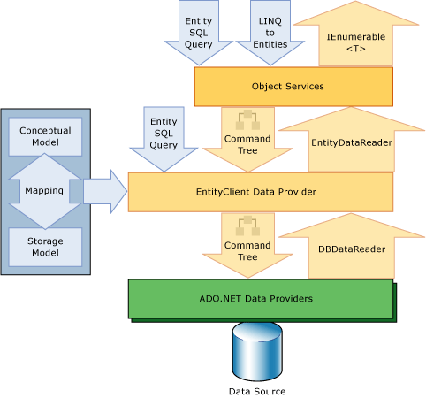

# Entity Framework Overview
The [!INCLUDE[adonet_ef](../../../../../includes/adonet-ef-md.md)] is a set of technologies in ADO.NET that support the development of data-oriented software applications. Architects and developers of data-oriented applications have struggled with the need to achieve two very different objectives. They must model the entities, relationships, and logic of the business problems they are solving, and they must also work with the data engines used to store and retrieve the data. The data may span multiple storage systems, each with its own protocols; even applications that work with a single storage system must balance the requirements of the storage system against the requirements of writing efficient and maintainable application code.  
  
 The [!INCLUDE[adonet_ef](../../../../../includes/adonet-ef-md.md)] enables developers to work with data in the form of domain-specific objects and properties, such as customers and customer addresses, without having to concern themselves with the underlying database tables and columns where this data is stored. With the [!INCLUDE[adonet_ef](../../../../../includes/adonet-ef-md.md)], developers can work at a higher level of abstraction when they deal with data, and can create and maintain data-oriented applications with less code than in traditional applications. Because the [!INCLUDE[adonet_ef](../../../../../includes/adonet-ef-md.md)] is a component of the [!INCLUDE[dnprdnshort](../../../../../includes/dnprdnshort-md.md)], [!INCLUDE[adonet_ef](../../../../../includes/adonet-ef-md.md)] applications can run on any computer on which the [!INCLUDE[dnprdnshort](../../../../../includes/dnprdnshort-md.md)] starting with version 3.5 SP1 is installed.  
  
 The following sections in this topic provide more detail about the [!INCLUDE[adonet_ef](../../../../../includes/adonet-ef-md.md)]:  
  
-   [Giving Life to Models](#LifeToModels)  
  
-   [Mapping Objects to Data](#MappingObjectsToData)  
  
-   [Accessing and Changing Entity Data](#AccessingData)  
  
-   [Data Providers](#DataProviders)  
  
-   [Entity Data Model Tools](#Tools)  
  
-   [Learning More](#LearnMore)  
  
   
## Giving Life to Models  
 A longstanding and common design approach when building an application or service is the division of the application or service into three parts: a domain model, a logical model, and a physical model. The domain model defines the entities and relationships in the system that is being modeled. The logical model for a relational database normalizes the entities and relationships into tables with foreign key constraints. The physical model addresses the capabilities of a particular data engine by specifying storage details such as partitioning and indexing.  
  
 The physical model is refined by database administrators to improve performance, but programmers writing application code primarily confine themselves to working with the logical model by writing SQL queries and calling stored procedures. Domain models are generally used as a tool for capturing and communicating the requirements of an application, frequently as inert diagrams that are viewed and discussed in the early stages of a project and then abandoned. Many development teams skip creating a conceptual model and begin by specifying tables, columns, and keys in a relational database.  
  
 The [!INCLUDE[adonet_ef](../../../../../includes/adonet-ef-md.md)] gives life to models by enabling developers to query entities and relationships in the domain model (called a *conceptual* model in the [!INCLUDE[adonet_ef](../../../../../includes/adonet-ef-md.md)]) while relying on the [!INCLUDE[adonet_ef](../../../../../includes/adonet-ef-md.md)] to translate those operations to data source–specific commands. This frees applications from hard-coded dependencies on a particular data source.  
  
 When working with Code First, the conceptual model is mapped to the storage model in code. The [!INCLUDE[adonet_ef](../../../../../includes/adonet-ef-md.md)] can infer the conceptual model based on the object types and additional configurations that you define. The mapping metadata is generated during run time based on a combination of how you defined your domain types and additional configuration information that you provide in code. [!INCLUDE[adonet_ef](../../../../../includes/adonet-ef-md.md)] generates the database as needed based on the metadata. For more information, see [Creating and Mapping a Conceptual Model](http://go.microsoft.com/fwlink/?LinkID=235382).  
  
 When working with the Entity Data Model Tools, the conceptual model, the storage model, and the mappings between the two are expressed in XML-based schemas and defined in files that have corresponding name extensions:  
  
-   Conceptual schema definition language (CSDL) defines the conceptual model. CSDL is the [!INCLUDE[adonet_ef](../../../../../includes/adonet-ef-md.md)]'s implementation of the [Entity Data Model](../../../../../docs/framework/data/adonet/entity-data-model.md). The file extension is .csdl.  
  
-   Store schema definition language (SSDL) defines the storage model, which is also called the logical model. The file extension is .ssdl.  
  
-   Mapping specification language (MSL) defines the mappings between the storage and conceptual models. The file extension is .msl.  
  
 The storage model and mappings can change as needed without requiring changes to the conceptual model, data classes, or application code. Because storage models are provider-specific, you can work with a consistent conceptual model across various data sources.  
  
 The [!INCLUDE[adonet_ef](../../../../../includes/adonet-ef-md.md)] uses these model and mapping files to create, read, update, and delete operations against entities and relationships in the conceptual model to equivalent operations in the data source. The [!INCLUDE[adonet_ef](../../../../../includes/adonet-ef-md.md)] even supports mapping entities in the conceptual model to stored procedures in the data source. For more information, see [CSDL, SSDL, and MSL Specifications](../../../../../docs/framework/data/adonet/ef/language-reference/csdl-ssdl-and-msl-specifications.md).  
  
   
## Mapping Objects to Data  
 Object-oriented programming poses a challenge for interacting with data storage systems. Although the organization of classes frequently mirrors the organization of relational database tables, the fit is not perfect. Multiple normalized tables frequently correspond to a single class, and relationships between classes are often represented differently than relationships between tables are represented. For example, to represent the customer for a sales order, an `Order` class might use a property that contains a reference to an instance of a `Customer` class, while an `Order` table row in a database contains a foreign key column (or set of columns) with a value that corresponds to a primary key value in the `Customer` table. A `Customer` class might have a property named `Orders` that contains a collection of instances of the `Order` class, while the `Customer` table in a database has no comparable column. The [!INCLUDE[adonet_ef](../../../../../includes/adonet-ef-md.md)] provides developers with the flexibility to represent relationships in this way, or to more closely model relationships as they are represented in the database.  
  
 Existing solutions have tried to bridge this gap, which is frequently called an "impedance mismatch", by only mapping object-oriented classes and properties to relational tables and columns. Instead of taking this traditional approach, the [!INCLUDE[adonet_ef](../../../../../includes/adonet-ef-md.md)] maps relational tables, columns, and foreign key constraints in logical models to entities and relationships in conceptual models. This enables greater flexibility both in defining objects and optimizing the logical model. The [!INCLUDE[adonet_edm](../../../../../includes/adonet-edm-md.md)] tools generate extensible data classes based on the conceptual model. These classes are partial classes that can be extended with additional members that the developer adds. By default, the classes that are generated for a particular conceptual model derive from base classes that provide services for materializing entities as objects and for tracking and saving changes. Developers can use these classes to work with the entities and relationships as objects related by associations. Developers can also customize the classes that are generated for a conceptual model. For more information, see [Working with Objects](../../../../../docs/framework/data/adonet/ef/working-with-objects.md).  
  
   
## Accessing and Changing Entity Data  
 More than just another object-relational mapping solution, the [!INCLUDE[adonet_ef](../../../../../includes/adonet-ef-md.md)] is fundamentally about enabling applications to access and change data that is represented as entities and relationships in the conceptual model. The [!INCLUDE[adonet_ef](../../../../../includes/adonet-ef-md.md)] uses information in the model and mapping files to translate object queries against entity types represented in the conceptual model into data source-specific queries. Query results are materialized into objects that the [!INCLUDE[adonet_ef](../../../../../includes/adonet-ef-md.md)] manages. The [!INCLUDE[adonet_ef](../../../../../includes/adonet-ef-md.md)] provides the following ways to query a conceptual model and return objects:  
  
-   [!INCLUDE[linq_entities](../../../../../includes/linq-entities-md.md)]. Provides Language-Integrated Query (LINQ) support for querying entity types that are defined in a conceptual model. For more information, see [LINQ to Entities](../../../../../docs/framework/data/adonet/ef/language-reference/linq-to-entities.md).  
  
-   [!INCLUDE[esql](../../../../../includes/esql-md.md)]. A storage-independent dialect of SQL that works directly with entities in the conceptual model and that supports [!INCLUDE[adonet_edm](../../../../../includes/adonet-edm-md.md)] concepts. [!INCLUDE[esql](../../../../../includes/esql-md.md)] is used both with object queries and queries that are executed by using the EntityClient provider. For more information, see [Entity SQL Overview](../../../../../docs/framework/data/adonet/ef/language-reference/entity-sql-overview.md).  
  
 The [!INCLUDE[adonet_ef](../../../../../includes/adonet-ef-md.md)] includes the EntityClient data provider. This provider manages connections, translates entity queries into data source-specific queries, and returns a data reader that the [!INCLUDE[adonet_ef](../../../../../includes/adonet-ef-md.md)] uses to materialize entity data into objects. When object materialization is not required, the EntityClient provider can also be used like a standard [!INCLUDE[vstecado](../../../../../includes/vstecado-md.md)] data provider by enabling applications to execute [!INCLUDE[esql](../../../../../includes/esql-md.md)] queries and consume the returned read-only data reader. For more information, see [EntityClient Provider for the Entity Framework](../../../../../docs/framework/data/adonet/ef/entityclient-provider-for-the-entity-framework.md).  
  
 The following diagram illustrates the [!INCLUDE[adonet_ef](../../../../../includes/adonet-ef-md.md)] architecture for accessing data:  
  
   
  
 The [!INCLUDE[adonet_edm](../../../../../includes/adonet-edm-md.md)] Tools can generate a class derived from `System.Data.Objects.ObjectContext` or `System.Data.Entity.DbContext` that represents the entity container in the conceptual model. This object context provides the facilities for tracking changes and managing identities, concurrency, and relationships. This class also exposes a `SaveChanges` method that writes inserts, updates, and deletes to the data source. Like queries, these changes are either made by commands automatically generated by the system or by stored procedures that are specified by the developer.  
  
   
## Data Providers  
 The `EntityClient` provider extends the [!INCLUDE[vstecado](../../../../../includes/vstecado-md.md)] provider model by accessing data in terms of conceptual entities and relationships. It executes queries that use [!INCLUDE[esql](../../../../../includes/esql-md.md)]. [!INCLUDE[esql](../../../../../includes/esql-md.md)] provides the underlying query language that enables `EntityClient` to communicate with the database. For more information, see [EntityClient Provider for the Entity Framework](../../../../../docs/framework/data/adonet/ef/entityclient-provider-for-the-entity-framework.md).  
  
 The [!INCLUDE[adonet_ef](../../../../../includes/adonet-ef-md.md)] includes an updated SqlClient Data Provider that supports canonical command trees. For more information, see [SqlClient for the Entity Framework](../../../../../docs/framework/data/adonet/ef/sqlclient-for-the-entity-framework.md).  
  
   
## Entity Data Model Tools  
 Together with the [!INCLUDE[adonet_ef](../../../../../includes/adonet-ef-md.md)] runtime, the [!INCLUDE[vs_current_long](../../../../../includes/vs-current-long-md.md)] includes the mapping and modeling tools. For more information, see [Modeling and Mapping](../../../../../docs/framework/data/adonet/ef/modeling-and-mapping.md).  
  
   
## Learning More  
 The following topics enable you to learn more about the [!INCLUDE[adonet_ef](../../../../../includes/adonet-ef-md.md)]:  
  
 [Getting Started](../../../../../docs/framework/data/adonet/ef/getting-started.md)  
 Provide information about how to get up and running quickly using the [Quickstart](http://msdn.microsoft.com/library/0bc534be-789f-4819-b9f6-76e51d961675), which shows how to create a simple [!INCLUDE[adonet_ef](../../../../../includes/adonet-ef-md.md)] application.  
  
 [Entity Framework Terminology](../../../../../docs/framework/data/adonet/ef/terminology.md)  
 Defines many of the terms that are introduced by the Entity Data Model and the [!INCLUDE[adonet_ef](../../../../../includes/adonet-ef-md.md)] and that are used in [!INCLUDE[adonet_ef](../../../../../includes/adonet-ef-md.md)] documentation.  
  
 [Entity Framework Resources](../../../../../docs/framework/data/adonet/ef/resources.md)  
 Provides links to conceptual topics and links to external topics and resources for building [!INCLUDE[adonet_ef](../../../../../includes/adonet-ef-md.md)] applications.  
  
## See Also  
 [ADO.NET Entity Framework](../../../../../docs/framework/data/adonet/ef/index.md)
