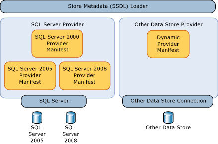
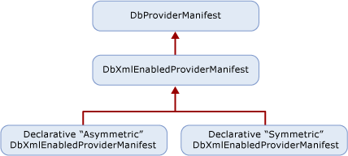

# Provider Manifest Specification
This section discusses how a data store provider can support the types and functions in the data store.  
  
 Entity Services operates independently of a specific data store provider yet still allows a data provider to explicitly define how models, mappings, and queries interact with an underlying data store. Without a layer of abstraction, Entity Services could only be targeted at a specific data store or data provider.  
  
 Types that the provider supports are directly or indirectly supported by the underlying database. These types are not necessarily the exact store types, but the types the provider uses to support the [!INCLUDE[adonet_ef](../../../../../includes/adonet-ef-md.md)]. Provider/store types are described in the Entity Data Model (EDM) terms.  
  
 Parameter and return types for the functions supported by the data store are specified in EDM terms.  
  
## Requirements  
 The [!INCLUDE[adonet_ef](../../../../../includes/adonet-ef-md.md)] and the data store need to be able to pass data back and forth in known types without any data loss or truncation.  
  
 The provider manifest must be loadable by tools at design time without having to open a connection to the data store.  
  
 The [!INCLUDE[adonet_ef](../../../../../includes/adonet-ef-md.md)] is case sensitive, but the underlying data store may not be. When EDM artifacts (identifiers and type names, for example) are defined and used in the manifest, they must use the [!INCLUDE[adonet_ef](../../../../../includes/adonet-ef-md.md)] case sensitivity. If data store elements that may be case sensitive appear in the provider manifest, that casing needs to be maintained in the provider manifest.  
  
 The [!INCLUDE[adonet_ef](../../../../../includes/adonet-ef-md.md)] requires a provider manifest for all data providers. If you try to use a provider that does not have a provider manifest with the [!INCLUDE[adonet_ef](../../../../../includes/adonet-ef-md.md)], you will get an error.  
  
 The following table describes the kinds of exceptions the [!INCLUDE[adonet_ef](../../../../../includes/adonet-ef-md.md)] would throw when exceptions arise through provider interaction:  
  
|Issue|Exception|  
|-----------|---------------|  
|The Provider does not support GetProviderManifest in DbProviderServices.|ProviderIncompatibleException|  
|Missing provider manifest: the provider returns `null` when attempting to retrieve the provider manifest.|ProviderIncompatibleException|  
|Invalid provider manifest: the provider returns invalid XML when attempting to retrieve the provider manifest.|ProviderIncompatibleException|  
  
## Scenarios  
 A provider should support the following scenarios:  
  
### Writing a Provider with Symmetric Type Mapping  
 You can write a provider for the [!INCLUDE[adonet_ef](../../../../../includes/adonet-ef-md.md)] where each store type maps to a single EDM type, regardless of the mapping direction. For a provider type that has very simple mapping that corresponds with an EDM type, you can use a symmetric solution because the type system is simple or matches EDM types.  
  
 You can use the simplicity of their domain and produce a static declarative provider manifest.  
  
 You write an XML file that has two sections:  
  
-   A list of provider types expressed in terms of the "EDM counterpart" of a store type or function. Store types have counterpart EDM types. Store functions have corresponding EDM functions. For example, varchar is a SQL Server type but the corresponding EDM type is string.  
  
-   A list of functions supported by the provider where parameter and return types are expressed in EDM terms.  
  
### Writing a Provider with Asymmetric Type Mapping  
 When writing a data store provider for the [!INCLUDE[adonet_ef](../../../../../includes/adonet-ef-md.md)], the EDM-to-provider type mapping for some types may be different from provider-to-EDM type mapping. For instance, unbounded EDM PrimitiveTypeKind.String may map to nvarchar(4000) on the provider, while nvarchar(4000) maps to the EDM PrimitiveTypeKind.String(MaxLength=4000).  
  
 You write an XML file that has two sections:  
  
-   A list of provider types expressed in EDM terms and define mapping for both direction: EDM-to-provider and provider-to-EDM.  
  
-   A list of functions supported by the provider where parameter and return types are expressed in EDM terms.  
  
## Provider Manifest Discoverability  
 The manifest is used indirectly by several component types in Entity Services (for example Tools or Query) but more directly leveraged by metadata through the use of the data store metadata loader.  
  
   
  
 However, a given provider may support different stores or different versions of the same store. Therefore, a provider must report a different manifest for each supported data store.  
  
### Provider Manifest Token  
 When a data store connection is opened, the provider can query for information to return the right manifest. This may not be possible in offline scenarios where connection information is not available or when it is not possible to connect to the store. Identify the manifest by using the `ProviderManifestToken` attribute of the `Schema` element in the .ssdl file. There is no required format for this attribute; the provider chooses the minimum information needed to identify a manifest without opening a connection to the store.  
  
 For example:  
  
```xml  
<Schema Namespace="Northwind" Provider="System.Data.SqlClient" ProviderManifestToken="2005" xmlns:edm="http://schemas.microsoft.com/ado/2006/04/edm/ssdl" xmlns="http://schemas.microsoft.com/ado/2006/04/edm/ssdl">  
```  
  
## Provider Manifest Programming Model  
 Providers derive from <xref:System.Data.Common.DbXmlEnabledProviderManifest>, which allows them to specify their manifests declaratively. The following illustration shows the class hierarchy of a provider:  
  
   
  
### Discoverability API  
 The provider manifest is loaded by the Store Metadata loader (StoreItemCollection), either by using a data store connection or a provider manifest token.  
  
#### Using a Data Store Connection  
 When the data store connection is available, call DbProvderServices.GetProviderManifestToken to return the token that is passed to the GetProviderManifest method, which returns DbProviderManifest. This method delegates to the provider's implementation of GetDbProviderManifestToken.  
  
```  
public string GetProviderManifestToken(DbConnection connection);  
public DbProviderManifest GetProviderManifest(string manifestToken);  
```  
  
#### Using a Provider Manifest Token  
 For the offline scenario, the token is picked from SSDL representation. The SSDL allows you to specify a ProviderManifestToken (see [Schema Element (SSDL)](http://msdn.microsoft.com/library/fec75ae4-7f16-4421-9265-9dac61509222) for more information). For example, if a connection cannot be opened, the SSDL has a provider manifest token that specifies information about the manifest.  
  
```  
public DbProviderManifest GetProviderManifest(string manifestToken);  
```  
  
### Provider Manifest Schema  
 The schema of information defined for each provider contains the static information to be consumed by metadata:  
  
```xml  
<?xml version="1.0" encoding="utf-8"?>  
<xs:schema elementFormDefault="qualified"  
   xmlns:xs="http://www.w3.org/2001/XMLSchema"  
   targetNamespace="http://schemas.microsoft.com/ado/2006/04/edm/providermanifest"  
   xmlns:pm="http://schemas.microsoft.com/ado/2006/04/edm/providermanifest">  
  
  <xs:element name="ProviderManifest">  
    <xs:complexType>  
      <xs:sequence>  
        <xs:element name="Types" type="pm:TTypes" minOccurs="1" maxOccurs="1" />  
        <xs:element name="Functions" type="pm:TFunctions" minOccurs="0" maxOccurs="1"/>  
      </xs:sequence>  
      <xs:attribute name="Namespace" type="xs:string" use="required"/>  
    </xs:complexType>  
  </xs:element>  
  <xs:complexType name="TVersion">  
    <xs:attribute name="Major" type="xs:int" use="required" />  
    <xs:attribute name="Minor" type="xs:int" use="required" />  
    <xs:attribute name="Build" type="xs:int" use="required" />  
    <xs:attribute name="Revision" type="xs:int" use="required" />  
  </xs:complexType>  
  
  <xs:complexType name="TIntegerFacetDescription">  
    <xs:attribute name="Minimum" type="xs:int" use="optional" />  
    <xs:attribute name="Maximum" type="xs:int" use="optional" />  
    <xs:attribute name="DefaultValue" type="xs:int" use="optional" />  
    <xs:attribute name="Constant" type="xs:boolean" default="false" />  
  </xs:complexType>  
  
  <xs:complexType name="TBooleanFacetDescription">  
    <xs:attribute name="DefaultValue" type="xs:boolean" use="optional" />  
    <xs:attribute name="Constant" type="xs:boolean" default="true" />  
  </xs:complexType>  
  
  <xs:complexType name="TDateTimeFacetDescription">  
    <xs:attribute name="Constant" type="xs:boolean" default="false" />  
  </xs:complexType>  
  
  <xs:complexType name="TFacetDescriptions">  
    <xs:choice maxOccurs="unbounded">  
      <xs:element name="Precision" minOccurs="0" maxOccurs="1" type="pm:TIntegerFacetDescription"/>  
      <xs:element name="Scale" minOccurs="0" maxOccurs="1" type="pm:TIntegerFacetDescription"/>  
      <xs:element name="MaxLength" minOccurs="0" maxOccurs="1" type="pm:TIntegerFacetDescription"/>  
      <xs:element name="Unicode" minOccurs="0" maxOccurs="1" type="pm:TBooleanFacetDescription"/>  
      <xs:element name="FixedLength" minOccurs="0" maxOccurs="1" type="pm:TBooleanFacetDescription"/>  
    </xs:choice>  
  </xs:complexType>  
  
  <xs:complexType name="TType">  
    <xs:sequence>  
      <xs:element name="FacetDescriptions" type="pm:TFacetDescriptions" minOccurs="0" maxOccurs="1"/>  
    </xs:sequence>  
    <xs:attribute name="Name" type="xs:string" use="required"/>  
    <xs:attribute name="PrimitiveTypeKind" type="pm:TPrimitiveTypeKind" use="required" />  
  </xs:complexType>  
  
  <xs:complexType name="TTypes">  
    <xs:sequence>  
      <xs:element name="Type" type="pm:TType" minOccurs="0" maxOccurs="unbounded"/>  
    </xs:sequence>  
  </xs:complexType>  
  
  <xs:attributeGroup name="TFacetAttribute">  
    <xs:attribute name="Precision" type="xs:int" use="optional"/>  
    <xs:attribute name="Scale" type="xs:int" use="optional"/>  
    <xs:attribute name="MaxLength" type="xs:int" use="optional"/>  
    <xs:attribute name="Unicode" type="xs:boolean" use="optional"/>  
    <xs:attribute name="FixedLength" type="xs:boolean" use="optional"/>  
  </xs:attributeGroup>  
  
  <xs:complexType name="TFunctionParameter">  
    <xs:attribute name="Name" type="xs:string" use="required" />  
    <xs:attribute name="Type" type="xs:string" use="required" />  
    <xs:attributeGroup ref="pm:TFacetAttribute" />  
    <xs:attribute name="Mode" type="pm:TParameterDirection" use="required" />  
  </xs:complexType>  
  
  <xs:complexType name="TReturnType">  
    <xs:attribute name="Type" type="xs:string" use="required" />  
    <xs:attributeGroup ref="pm:TFacetAttribute" />  
  </xs:complexType>  
  
  <xs:complexType name="TFunction">  
    <xs:choice minOccurs="0" maxOccurs ="unbounded">  
      <xs:element name ="ReturnType" type="pm:TReturnType" minOccurs="0" maxOccurs="1" />  
      <xs:element name="Parameter" type="pm:TFunctionParameter" minOccurs="0" maxOccurs="unbounded"/>  
    </xs:choice>  
    <xs:attribute name="Name" type="xs:string" use="required" />  
    <xs:attribute name="Aggregate" type="xs:boolean" use="optional" />  
    <xs:attribute name="BuiltIn" type="xs:boolean" use="optional" />  
    <xs:attribute name="StoreFunctionName" type="xs:string" use="optional" />  
    <xs:attribute name="NiladicFunction" type="xs:boolean" use="optional" />  
    <xs:attribute name="ParameterTypeSemantics" type="pm:TParameterTypeSemantics" use="optional" default="AllowImplicitConversion" />  
  </xs:complexType>  
  
  <xs:complexType name="TFunctions">  
    <xs:sequence>  
      <xs:element name="Function" type="pm:TFunction" minOccurs="0" maxOccurs="unbounded"/>  
    </xs:sequence>  
  </xs:complexType>  
  
  <xs:simpleType name="TPrimitiveTypeKind">  
    <xs:restriction base="xs:string">  
      <xs:enumeration value="Binary"/>  
      <xs:enumeration value="Boolean"/>  
      <xs:enumeration value="Byte"/>  
      <xs:enumeration value="Decimal"/>  
      <xs:enumeration value="DateTime"/>  
      <xs:enumeration value="Time"/>  
      <xs:enumeration value="DateTimeOffset"/>          
      <xs:enumeration value="Double"/>  
      <xs:enumeration value="Guid"/>  
      <xs:enumeration value="Single"/>  
      <xs:enumeration value="SByte"/>  
      <xs:enumeration value="Int16"/>  
      <xs:enumeration value="Int32"/>  
      <xs:enumeration value="Int64"/>  
      <xs:enumeration value="String"/>  
    </xs:restriction>  
  </xs:simpleType>  
  
  <xs:simpleType name="TParameterDirection">  
    <xs:restriction base="xs:string">  
      <xs:enumeration value="In"/>  
      <xs:enumeration value="Out"/>  
      <xs:enumeration value="InOut"/>  
    </xs:restriction>  
  </xs:simpleType>  
  
  <xs:simpleType name="TParameterTypeSemantics">  
    <xs:restriction base="xs:string">  
      <xs:enumeration value="ExactMatchOnly" />  
      <xs:enumeration value="AllowImplicitPromotion" />  
      <xs:enumeration value="AllowImplicitConversion" />  
    </xs:restriction>  
  </xs:simpleType>  
</xs:schema>  
```  
  
#### Types Node  
 The Types node in the provider manifest contains information about the Types that are supported natively by the data store or through the provider.  
  
##### Type Node  
 Each Type node defines a provider type in terms of EDM. The Type node describes the name of the provider type, and information related to the model type it maps to and facets to describe that type mapping.  
  
 In order to express this type information in the provider manifest, each TypeInformation declaration must define several facet descriptions for each Type:  
  
|Attribute Name|Data Type|Required|Default Value|Description|  
|--------------------|---------------|--------------|-------------------|-----------------|  
|Name|String|Yes|n/a|Provider-specific data type name|  
|PrimitiveTypeKind|PrimitiveTypeKind|Yes|n/a|EDM type name|  
  
###### Function Node  
 Each Function defines a single function available through the provider.  
  
|Attribute Name|Data Type|Required|Default Value|Description|  
|--------------------|---------------|--------------|-------------------|-----------------|  
|Name|String|Yes|n/a|Identifier/name of the function|  
|ReturnType|String|No|Void|The EDM return type of the function|  
|Aggregate|Boolean|No|False|True if the function is an aggregate function|  
|BuiltIn|Boolean|No|True|True if the function is built into the data store|  
|StoreFunctionName|String|No|\<Name>|Function Name in the data store.  Allows for a level of redirection of function names.|  
|NiladicFunction|Boolean|No|False|True if the function does not require parameters and is called without any parameters|  
|ParameterType<br /><br /> Semantics|ParameterSemantics|No|AllowImplicit<br /><br /> Conversion|Choice of how the query pipeline should deal with parameter type substitution:<br /><br /> -   ExactMatchOnly<br />-   AllowImplicitPromotion<br />-   AllowImplicitConversion|  
  
 **Parameters Node**  
  
 Each function has a collection of one or more Parameter nodes.  
  
|Attribute Name|Data Type|Required|Default Value|Description|  
|--------------------|---------------|--------------|-------------------|-----------------|  
|Name|String|Yes|n/a|Identifier/name of the parameter.|  
|Type|String|Yes|n/a|The EDM type of the parameter.|  
|Mode|Parameter<br /><br /> Direction|Yes|n/a|Direction of parameter:<br /><br /> -   in<br />-   out<br />-   inout|  
  
##### Namespace Attribute  
 Each data store provider must define a namespace or group of namespaces for information defined in the manifest. This namespace can be used in Entity SQL queries to resolve names of functions and types. For instance: SqlServer. That namespace must be different from the canonical namespace, EDM, defined by Entity Services for standard functions to be supported by Entity SQL queries.  
  
## See Also  
 [Writing an Entity Framework Data Provider](../../../../../docs/framework/data/adonet/ef/writing-an-ef-data-provider.md)
